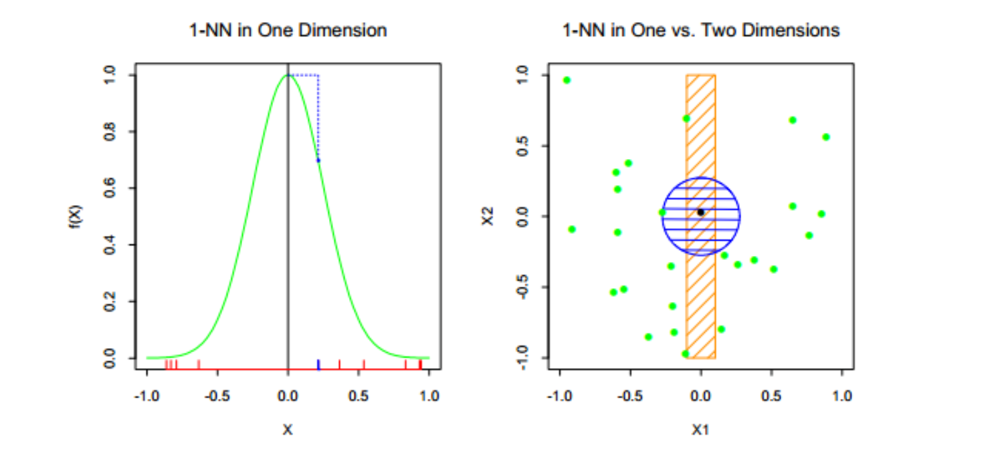
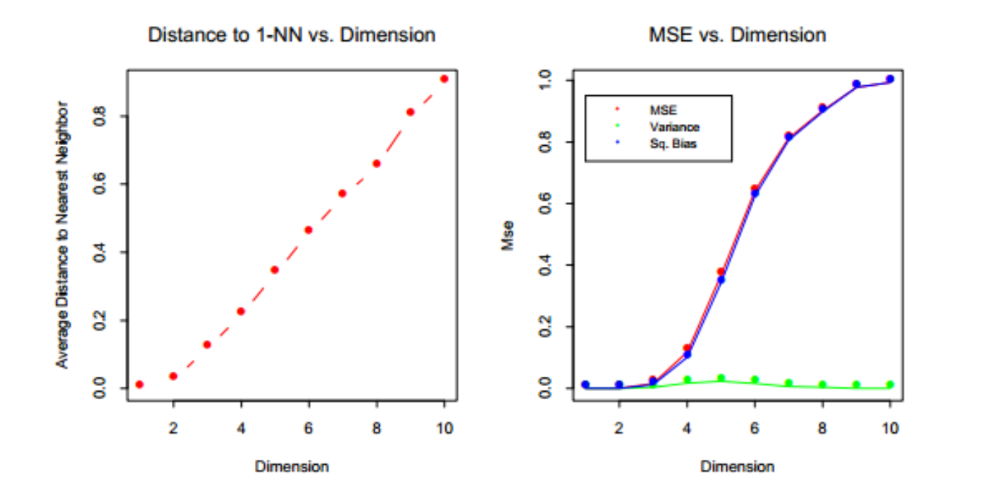
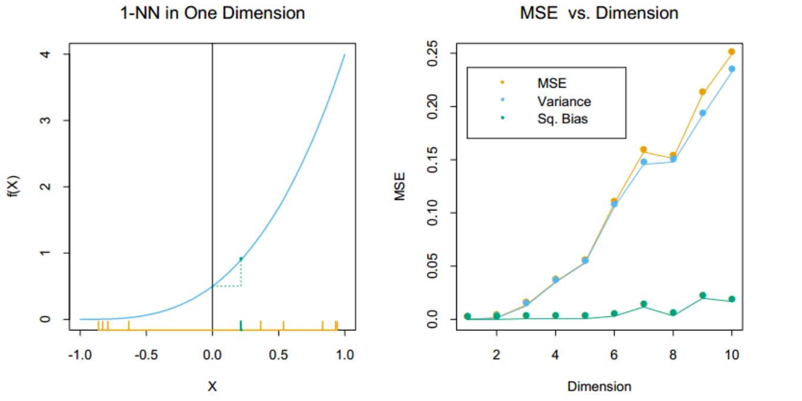
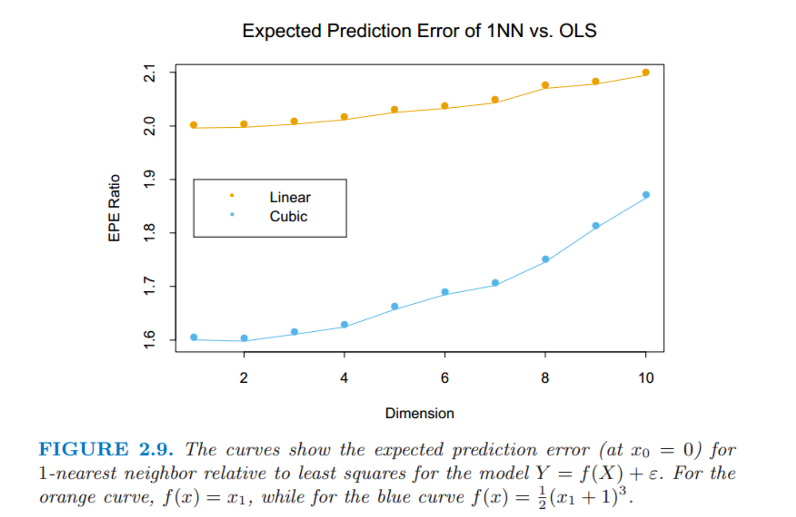

# 2.5 高维问题的局部方法

## 1 高维度的一些问题

### 1.1 对于输入在 p 维单位超立方体均匀分布的最近邻过程

* 假设邻域的体积对应单位体积的比例为r
* 则边长的期望值$e_p(r)=r^{\frac{1}{p}}​$， $e_{10}(0.01)=0.63​$，$e_{10}(0.1)=0.80​$。也就是说，对于每个变量输入为[0,1], 选取1%或者10%的数据去形成局部均值。
* 这意味着必须在每个输入变量上覆盖到 63% 或者 80%．这样的邻域不再是局部的．显著地降低 r 并没有作用，因为我们选取去平均的观测值越少，拟合的方差也会越大．

### 1.2 最近邻距离的中位数

* 问题：考虑在 p 维以原点为中心的单位球中均匀分布的 N 个数据点．假设我们考虑原点处的最近邻估计．距离原点最近的数据点距离的中位数$d(p,N)$：

* 求解：

  * 数据点与原点的距离看成随机变量X，因为数据点均匀分布，则 X 的分布函数正比于$x^p$
    $$
    F(X<x)=x^p
    $$

  * 则次序统计量$X_{(1)}$的分布满足
    $$
    F(X_{(1)} < x) = 1-F(X_{(1)}>=x)
    \\=1-(1-F(X<x))^N
    \\ =1-(1-x^p)^N=\frac{1}{2}
    $$

  * 解得
    $$
    median(X_{(1)})=(1-\frac{1}{2^{1/n}})^{1/p}
    $$

* N=500，p=10的时候，$d(p, N)\approx 0.52$,即大部分的数据点离样本空间的边界比其他任何的数据点更近．

### 1.3 取样密度

* 取样密度是跟 $N^{1/p}$成比例, 也就是说要达到同样取样密度，p维空间样本数目是单维的p次方倍
* 因此在高维空间中所有可行的训练样本在输入空间中很稀少

## 2 方差偏差分析

### 2.1 方差-偏差分解

* 泛化误差可分解为偏差、方差与噪声之和

* 有噪声：对于数据集$D​$求期望

  * 假设：

    * $\bar f(x) = E_D(f(x;D))​$
    * $y$为$x​$的真实标记
    * $y_D​$是$x​$在数据集中的标记
    * $Var_D(x)=E_D(f(x;D)-\bar f(x))$
    * $Bias^2(x)=(\bar f(x)-y)^2$
    * 假定噪声的期望$E_D(y-y_D)​$为0

  * 根据定义
    $$
    E(f;D)=E_D((f(x;D)-y_D)^2)\\
    \\=E_D((f(x;D) - \bar f(x) + \bar f(x) -y_D)^2)
    \\=E_D((f(x;D)-\bar f(x))^2)+E_D((\bar f(x) - y_D)^2)+2E_D((f(x;D) - \bar f(x))(\bar f(x) - y_D))
    $$

  * 假设噪声$y_D-y​$和$f(x;D)​$ 线性无关（TODO: 质疑, $y_D-y​$ 和 $f(x;D)​$ 是否有相关性），其中最后一项为0
    $$
    E_D((f(x;D) - \bar f(x))(\bar f(x) - y_D))\\
    =E_D(f(x;D)(\bar f(x)-y_D))-E(\bar f(x)(\bar f(x)-y_D))\\
    =\bar f(x)^2-E_D(f(x;D)y_D)-\bar f(x)^2+E(\bar f(x)y_D)
    \\=\bar f(x)E_D(y_D)-E_D(f(x;D)(y_D-y))+\bar f(x)y
    \\ = \bar f(x)E_D(y_D)-\bar f(x)(y_D-y))+\bar f(x)y=0 \label{eq1}
    $$

  * 从而继续有
    $$
    E(f;D)=E_D((f(x;D)-\bar f(x))^2)+E_D((\bar f(x) - y_D)^2)
    \\=E_D((f(x;D)-\bar f(x))^2)+E_D((\bar f(x) - y + y - y_D)^2)
    \\=E_D((f(x;D)-\bar f(x))^2)+E_D((\bar f(x) - y)^2)+E((y - y_D)^2)+2E((\bar f(x) - y)(y - y_D))
    $$

  * 其中，最后一项仍为0，PS: $\bar f(x)​$、$y​$均为常数项
    $$
    E((\bar f(x) - y)(y - y_D))=E(\bar f(x) - y))E(y-y_D)=0 \label{eq2}
    $$

  * 则最后有
    $$
    E(f;D)=E_D((f(x;D)-\bar f(x))^2)+(\bar f(x) - y)^2+E((y - y_D)^2)
    \\=Var_D(x)+Bias^2(x)+\epsilon^2
    $$

* 无噪声

  * 根据定义
    $$
    E(f;D)=E_D((f(x;D)-y)^2)\\
    \\=E_D((f(x;D) - \bar f(x) + \bar f(x) -y)^2)
    \\=E_D((f(x;D)-\bar f(x))^2)+E_D((\bar f(x) - y)^2)+2E_D((f(x;D) - \bar f(x))(\bar f(x) - y))
    \\ = E_D((f(x;D)-\bar f(x))^2)+E_D((\bar f(x) - y)^2)+2(\bar f(x)-\bar f(x))(\bar f(x)-y)
    \\=E_D((f(x;D)-\bar f(x))^2)+(\bar f(x) - y)^2
    \\=Var_D(x)+Bias^2(x)
    $$
    

### 2.2 最近邻方差-偏差分析

* 有这么一个数据集：假设从$[-1,1]^p$中均匀产生1000个样本$\{x_i\}$， 假设没有测量错误，对于每个$X$label $Y$，关系为

$$
Y=h(X)=\exp(-8\|X\|^2)
$$

* 采用最近邻估计$x_0=0​$处的值，其中$f(x;D)​$是采用最近邻模型下，数据集为D情况下预测的x的label
  $$
  \hat y_0 =f(x_0;D)
  \\E(f;D)=E_D((f(x_0;D)-y_0)^2)
  \\=E_D((f(x_0;D)-\bar f(x_0))^2)+(\bar f(x_0)-y_0)^2
  \\ = Var_D(f(x_0;D))+Bias^2(f(x_0;D))
  \\ = Var_D(\hat y_0)+Bias^2(\hat y_0)
  $$

* 根据函数图像，其偏差应该会<0, 而不是无偏估计

  

* 低维度情况下，最近邻非常接近 0，于是偏差和方差都会非常小．

* 当维数增大，最近邻有从目标点远离的趋势

  * 
  * 偏差增长到1左右，因为p=10 时，超过 99% 的样本的最近邻距离原点大于 0.5，此时函数值为0
  * 方差则和函数斜率相关，先增长后下降

* 方差占主导地位的情况：

  * 对于最近邻问题，若函数总是仅仅与少量的维度有关，方差便会占主要部分．

  * $$
    Y=h(x)=\frac{1}{2}(X_1+1)^3
    $$

  * 

### 2.3 最小二乘（线性）方差-偏差分析

* 假设$Y$与$X$之间的关系为线性
  $$
  Y=X\beta+\epsilon
  $$
  其中$\mathbf{\epsilon}=(\epsilon_1, \epsilon_2,\dots,\epsilon_{N})^T, \epsilon_i \sim N(0, \sigma^2)$

* 使用最小二乘拟合模型

  * 根据最小二乘公式

  $$
  \hat \beta =(X^TX)^{-1}X^T(X\beta + \mathbf{\epsilon})\\
  y_0=x_0^T\hat \beta
  \\=x_0^T\beta+ x_0^T(X^TX)^{-1}X^T\mathbf{\epsilon} \label{eq3}
  $$

  * 其中
    $$
    \mathbf{\epsilon}=(\epsilon_1, \epsilon_2,\dots,\epsilon_{N})^T
    $$

* EPE方差偏差分析

  * $x_0$分析

    $$
    \hat y_0 =f(x_0;D)
    \\ f(x;D) = x^T\hat\beta
    \\E_DEPE(f;x_0)=E_DE_{y_0|x_0}((f(x_0;D)-y_0)^2)
    \\=E_{y_0|x_0}E_D((f(x_0;D) - \bar f(x_0) + \bar f(x_0) -y_0)^2) 
    \\ =E_D((f(x_0;D)-\bar f(x_0))^2)+E_{y_0|x_0}E_D((\bar f(x_0) - y_0)^2) \quad\because equation\ \ref{eq1}
    \\=E_D((f(x_0;D)-\bar f(x_0)^2)+E_{y_0|x_0}E_D((\bar f(x_0) - x_0^T\beta + x_0^T\beta - y_0)^2)
    \\=E_D((f(x_0;D)-\bar f(x_0))^2)+E_D((\bar f(x_0) -  x_0^T\beta)^2)
    \\+E_{y_0|x_0}E((x_0^T\beta - y_0)^2)+2E_{y_0|x_0}E((\bar f(x_0) -  x_0^T\beta)( x_0^T\beta - y_0))
    \\=E_D((f(x_0;D)-\bar f(x_0))^2)+E_D((\bar f(x_0) -  x_0^T\beta)^2)+E(\epsilon^2)+2E((\bar f(x_0) +  x_0^T\beta)\epsilon)
    \\=E_D((f(x_0;D)-\bar f(x_0))^2)+E_D((\bar f(x_0) -  x_0^T\beta)^2)+E(\epsilon^2) \quad 
    \\=E_D((f(x_0;D)-x_0^T\beta)^2)+0+\sigma^2 \quad \because \bar f(x_0)=x_0^T\beta(最小二乘无偏), E(\epsilon^2)=\sigma^2 
    \\ = E_D((x_0^T(X^TX)^{-1} X^T\epsilon)^2)+\sigma^2 \because equation\ \ref{eq2}
    \\ = E_D(x_0^T(X^TX)^{-1} X^T\epsilon\epsilon^TX(X^TX)^{-1}x_0)+\sigma^2
    \\ = E_XE_{\epsilon|X}(x_0^T(X^TX)^{-1} X^T\epsilon\epsilon^TX(X^TX)^{-1}x_0)+\sigma^2
    \\ = E_X(x_0^T(X^TX)^{-1} X^TE_{\epsilon|X}(\epsilon\epsilon^T)X(X^TX)^{-1}x_0)+\sigma^2 
    \\ = E_X(x_0^T(X^TX)^{-1} X^T\sigma^2 IX(X^TX)^{-1}x_0+\sigma^2)
    
    \\ = E_X(x_0^T(X^TX)^{-1} X^TX(X^TX)^{-1}x_0)\sigma^2+\sigma^2
    \\ = E_X(x_0^T(X^TX)^{-1}x_0) \sigma^2+\sigma^2
    \\ = E_XE_{\epsilon|X}(x_0^T(X^TX)^{-1}x_0) \sigma^2+\sigma^2
    \\ = E_D(x_0^T(X^TX)^{-1}x_0)\sigma^2+\sigma^2
    $$

  * 全局, 并且假设 $E(X)=0$

    $$
    E_DEPE(f)=E_{D}E_{x_0}EPE(f;x_0)
    \\ = E_{x_0}E_{D}EPE(f;x_0)
    \\ = E_{x_0}E_Dx_0^T(X^TX)^{-1}x_0\sigma^2  
    \\ = E_{x_0}x_0^T(Cov(X))^{-1}x_0\sigma^2/n \quad \because E(X)=0
    \\ = E_{x_0}tr(x_0^T(Cov(X))^{-1}x_0)\sigma^2/n
    \\ = E_{x_0}tr((Cov(X))^{-1}x_0x_0^T)\sigma^2/n \quad \because tr(AB) = tr(BA)
    \\ = tr((Cov(X))^{-1}Cov(X))\sigma^2/n
    \\ = p\sigma^2/n
    $$

  * 可以看到$EPE$ 的期望作为 $p$ 的函数线性增长，斜率 $σ^2/n$．如果 $N$ 大或 $σ_2​$ 小，方差的增长可以忽略

### 2.4 最近邻 VS 最小二乘

* 两种情形下比较 1-最近邻和最小二乘法，两种情形下形式均为 $Y=f(X)+\epsilon$，$X$ 和前面一样都是均匀分布的，而且$\epsilon\sim N(0,1)$

* 