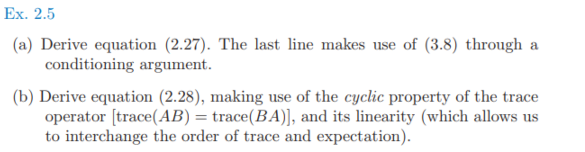
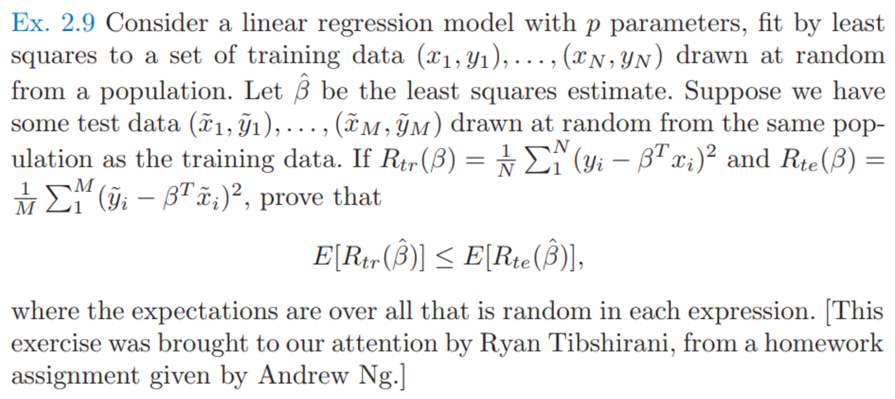

## Ex 2.3

* 题目：

* 求解：

  * 数据点与原点的距离看成随机变量X，因为数据点均匀分布，则 X 的分布函数正比于$x^p$
    $$
    F(X<x)=x^p
    $$

  * 则次序统计量$X_{(1)}$的分布满足
    $$
    F(X_{(1)} < x) = 1-F(X_{(1)}>=x)
    \\=1-(1-F(X<x))^N
    \\ =1-(1-x^p)^N=\frac{1}{2}
    $$

  * 解得
    $$
    median(X_{(1)})=(1-\frac{1}{2^{1/n}})^{1/p}
    $$

## Ex 2.5

* 题目：

  

* 求解：

  * 第一问：需要利用条件期望，使得内部$X​$固定，从而推出$X​$固定情况下最小二乘参数的方差。
    $$
    \hat y_0 =f(x_0;D)
    \\ f(x;D) = x^T\hat\beta
    \\E_DEPE(f;x_0)=E_DE_{y_0|x_0}((f(x_0;D)-y_0)^2)
    \\=E_{y_0|x_0}E_D((f(x_0;D) - \bar f(x_0) + \bar f(x_0) -y_0)^2) 
    \\ =E_D((f(x_0;D)-\bar f(x_0))^2)+E_{y_0|x_0}E_D((\bar f(x_0) - y_0)^2) \quad\because equation\ 
    \\=E_D((f(x_0;D)-\bar f(x_0)^2)+E_{y_0|x_0}E_D((\bar f(x_0) - x_0^T\beta + x_0^T\beta - y_0)^2)
    \\=E_D((f(x_0;D)-\bar f(x_0))^2)+E_D((\bar f(x_0) -  x_0^T\beta)^2)
    \\+E_{y_0|x_0}E((x_0^T\beta - y_0)^2)+2E_{y_0|x_0}E((\bar f(x_0) -  x_0^T\beta)( x_0^T\beta - y_0))
    \\=E_D((f(x_0;D)-\bar f(x_0))^2)+E_D((\bar f(x_0) -  x_0^T\beta)^2)+E(\epsilon^2)+2E((\bar f(x_0) +  x_0^T\beta)\epsilon)
    \\=E_D((f(x_0;D)-\bar f(x_0))^2)+E_D((\bar f(x_0) -  x_0^T\beta)^2)+E(\epsilon^2) \quad 
    \\=E_D((f(x_0;D)-x_0^T\beta)^2)+0+\sigma^2 \quad \because \bar f(x_0)=x_0^T\beta(最小二乘无偏), E(\epsilon^2)=\sigma^2 
    \\ = E_D((x_0^T(XX^T)^{-1} X\epsilon)^2)+\sigma^2 \because equation\
    \\ = E_D(x_0^T(XX^T)^{-1} X\epsilon\epsilon^TX^T(XX^T)^{-1}x_0)+\sigma^2
    \\ = E_XE_{\epsilon|X}(x_0^T(XX^T)^{-1} X\epsilon\epsilon^TX^T(XX^T)^{-1}x_0)+\sigma^2
    \\ = E_X(x_0^T(XX^T)^{-1} XE_{\epsilon|X}(\epsilon\epsilon^T)X^T(XX^T)^{-1}x_0)+\sigma^2 
    \\ = E_X(x_0^T(XX^T)^{-1} X\sigma^2 IX^T(XX^T)^{-1}x_0+\sigma^2)
    
    \\ = E_X(x_0^T(XX^T)^{-1} XX^T(XX^T)^{-1}x_0)\sigma^2+\sigma^2
    \\ = E_X(x_0^T(XX^T)^{-1}x_0) \sigma^2+\sigma^2
    \\ = E_XE_{\epsilon|X}(x_0^T(XX^T)^{-1}x_0) \sigma^2+\sigma^2
    \\ = E_D(x_0^T(XX^T)^{-1}x_0)\sigma^2+\sigma^2
    $$

  * 第二问：
    $$
    E_DEPE(f)=E_{D}E_{x_0}EPE(f;x_0)
    \\ = E_{x_0}E_{D}EPE(f;x_0)
    \\ = E_{x_0}E_Dx_0^T(XX^T)^{-1}x_0\sigma^2  
    \\ = E_{x_0}x_0^T(Cov(X))^{-1}x_0\sigma^2/n \quad \because E(X)=0
    \\ = E_{x_0}tr(x_0^T(Cov(X))^{-1}x_0)\sigma^2/n
    \\ = E_{x_0}tr((Cov(X))^{-1}x_0x_0^T)\sigma^2/n \quad \because tr(AB) = tr(BA)
    \\ = tr((Cov(X))^{-1}Cov(X))\sigma^2/n
    \\ = p\sigma^2/n
    $$
    

## Ex 2.6

- 题目：

- 题目大意：最小二乘法中若存在重复数据，则普通最小二乘可以看成是 **（样本量）减少的加权最小二乘 (reduced weighted least squares)**．

- 知识补充：见[加权最小二乘法](..\A 基础知识\A.2 数值方法\1 加权最小二乘法)

- 解：设$X_u=(X_{u1}, X_{u2},\dots,X_{uN})​$是$X=(X_{1}, X_{2},\dots,X_{M})​$去重之后的矩阵

  - 假设
    $$
    X^T=A_{MN}X_u^T\\
    y_u=W^{-1}A^Ty
    $$
    假设的含义为：其中$A$是每行只要1一个为1，其他全为0的矩阵；$W$是对角阵，且$W_{i,i}$是$X_{ui}$的重复数，$W=A^TA$；$y_u$取重复$y$的均值

  - 对于普通的最小二乘法，其结果和$X_u,y_u$的加权最小二乘一致
    $$
    (XX^T)^{-1}Xy
    \\ = (X_uA^TAX_u^T)^{-1}X_uA^Ty
    \\ = (X_uWX_u^T)X_uWy_u
    $$

  - 即下述两个公式优化目标相同
    $$
    \arg\min_{\beta}\ (y_u-X_u^T\beta)^TW(y_u-X_u^T\beta)
    \\ = \arg\min_{\beta}\ (y-X^T\beta)^T(y-X^T\beta)
    $$

  - 其他的证明方法

    如果对于$x_i$, 有$y_{i1},y_{i2},\dots y_{il}$个解，则最小二乘优化目标为
    $$
    T=\sum_{j=1}^l (x_i^T\beta-y_{ij})^2
    $$
    通过进行展开可以得到
    $$
    T=\sum_{j=1}^l (x_i^T\beta)^2+y_{ij}^2-2x_i^T\beta y_{ij}
    \\ = l((x_i^T\beta)^2-2x_i^T\beta\bar y_i+\bar y_i^2)-y_i^2+\sum_{j=1}^ly_{ij}^2
    \\ = l(x_i^T\beta-\bar y_i^2)-y_i^2+\sum_{j=1}^ly_{ij}^2
    \\ = l(x_i^T\beta-\bar y_i^2)+C
    $$
    可见原始数据最小二乘相当于相当于使用$y_{ij}$均值，进行加权后的优化目标

  

## Ex 2.9

* 题目：

* 题目大意：考虑$p$维的线性回归，对训练集$(x_1,y_1),(x_2,y_2),...,(x_N,y_N)$进行最小二乘。让$\hat \beta$是最小二乘估计，假设有测试数据也是从相同分布随机取的$(\hat x_1, \hat y_1),(\hat x_2, \hat y_2),...,(\hat x_M, \hat y_M)$，证明训练数据的均方误差的期望一定小于等于测试数据的均方误差的期望

* 证明：
  $$
  E(\frac{1}{N}\sum_{i=1}^N(y_i-\hat \beta^Tx_i)^2)
  \\ = E(\frac{1}{M}\sum_{i=1}^M(y_i-\hat \beta^Tx_i)^2)
  \\ \le E(\frac{1}{M}\sum_{i=1}^M(y_i-\hat \beta^T_*x_i)^2)\ (\beta^T_*\ is\ LSE\ of\ test) 
  \\ = E(\frac{1}{M}\sum_{i=1}^M(\hat y_i-\hat \beta^T_*\hat x_i)^2)\ (因为训练测试同分布，所以期望相同)
  \\ \le E(\frac{1}{M}\sum_{i=1}^M(\hat y_i-\hat \beta^T\hat x_i)^2)\
  $$
  