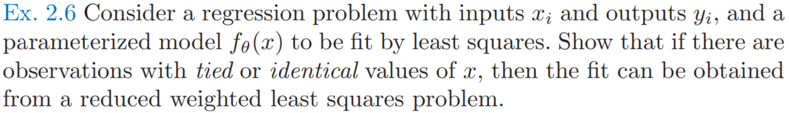

## Ex 2.6

- 题目：

- 题目大意：最小二乘法中若存在重复数据，则普通最小二乘可以看成是 **（样本量）减少的加权最小二乘 (reduced weighted least squares)**．

- 知识补充：见[加权最小二乘法](..\A 基础知识\A.2 数值方法\1 加权最小二乘法)

- 解：设$X_u=(X_{u1}, X_{u2},\dots,X_{uN})​$是$X=(X_{1}, X_{2},\dots,X_{M})​$去重之后的矩阵

  - 假设
    $$
    X^T=A_{MN}X_u^T\\
    y_u=W^{-1}A^Ty
    $$
    假设的含义为：其中$A$是每行只要1一个为1，其他全为0的矩阵；$W$是对角阵，且$W_{i,i}$是$X_{ui}$的重复数，$W=A^TA$；$y_u$取重复$y$的均值

  - 对于普通的最小二乘法，其结果和$X_u,y_u$的加权最小二乘一致
    $$
    (XX^T)^{-1}Xy
    \\ = (X_uA^TAX_u^T)^{-1}X_uA^Ty
    \\ = (X_uWX_u^T)X_uWy_u
    $$

  - 即下述两个公式优化目标相同
    $$
    \arg\min_{\beta}\ (y_u-X_u^T\beta)^TW(y_u-X_u^T\beta)
    \\ = \arg\min_{\beta}\ (y-X^T\beta)^T(y-X^T\beta)
    $$

  - 其他的证明方法

    如果对于$x_i$, 有$y_{i1},y_{i2},\dots y_{il}$个解，则最小二乘优化目标为
    $$
    T=\sum_{j=1}^l (x_i^T\beta-y_{ij})^2
    $$
    通过进行展开可以得到
    $$
    T=\sum_{j=1}^l (x_i^T\beta)^2+y_{ij}^2-2x_i^T\beta y_{ij}
    \\ = l((x_i^T\beta)^2-2x_i^T\beta\bar y_i+\bar y_i^2)-y_i^2+\sum_{j=1}^ly_{ij}^2
    \\ = l(x_i^T\beta-\bar y_i^2)-y_i^2+\sum_{j=1}^ly_{ij}^2
    \\ = l(x_i^T\beta-\bar y_i^2)+C
    $$
    可见原始数据最小二乘相当于相当于使用$y_{ij}$均值，进行加权后的优化目标

  

