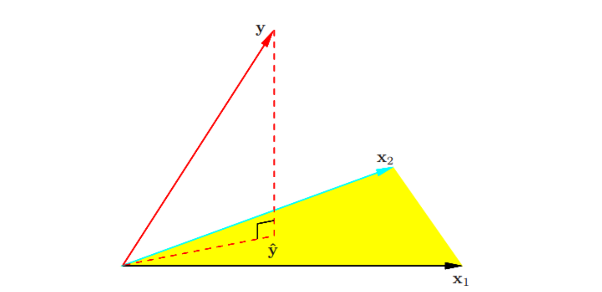
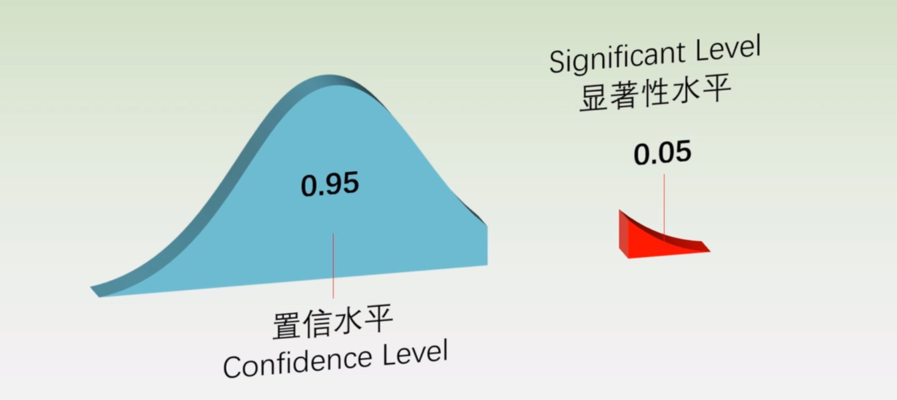
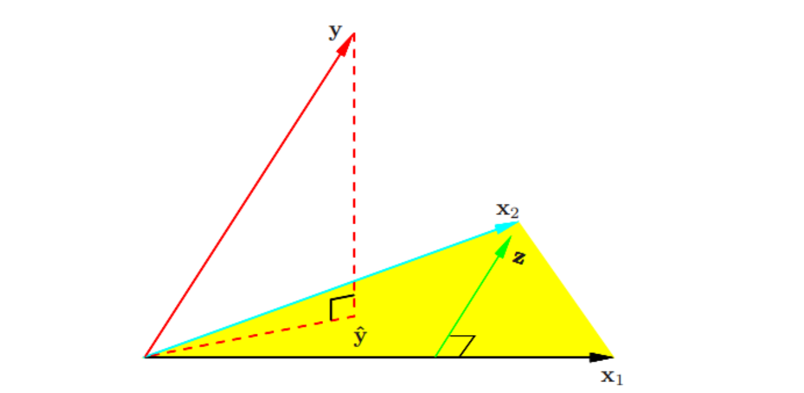
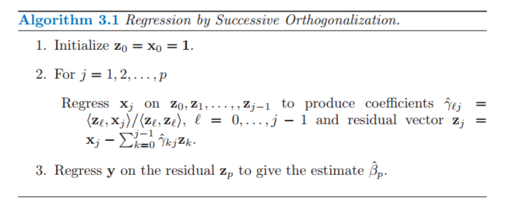

# 线性回归模型和最小二乘法

## 1 线性回归模型

* 形式：
  $$
  f(x)=x^T\beta=\beta_0+\sum_{j=1}^p x_j\beta_j
  $$

* 变量 $x_j​$ 可以有下列不同的来源(无论 $x_j​$ 是哪个来源，模型关于参数都是线性的)

  * 定量的输入变量
  * 定量输入变量的变换，比如对数变换，平方根变换或者平方变换
  * 基函数展开，比如$(x_1,x_2=x_1^2,...x_N=x_1^N)​$
  * 定性输入变量水平 (level) 的数值或“虚拟”编码
    * 比如$G​$有5种水平，若$G=j​$，可以构造$(x_1=0,...,x_j=1,...,x_N=0)​$
  * 变量的交叉影响，比如$(x_1,x_2,x_3=x_1x_2)$

* 什么是线性模型

  * 统计意义：若一个回归等式是线性的，其参数就必须也是线性的。对于参数是线性，即使样本变量的特征(属性)是二次方或者多次方，这个回归模型也是线性的。

  * 线性和非线性的区别是是否可以用直线将样本划分开：线性模型可以是用曲线拟合样本，但是分类的决策边界一定是直线的，例如logistics模型。

    * $$
      y=\frac{1}{1+e^{x^T\beta}}\\
      y_0=\frac{1}{1+e^{x^T\beta}}\ (y_0是决策点)\\
      x^T\beta=\ln(\frac{1}{y_0}-1)\ (可以看出决策边界线性)\\
      $$

  * 如何区分：

    * 若每个参数$\beta_j$都只影响一个$x_j$，则是线性的；否则是非线性
    * 例如
      * 线性：$\frac{1}{1+e^{x^T\beta}}$
      * 非线性：$\frac{1}{1+\beta_1e^{x^T\beta}} $

## 2 最小二乘法

### 2.1 公式推导

* 残差平方和
  $$
  RSS(\beta)=(y-X\beta)^T(y-X\beta)
  $$

* 求解
  $$
  \frac{\partial RSS(\beta)}{\partial \beta} = 2X^T(X\beta - y) = 0\\
  \hat \beta=(X^TX)^{-1}X^Ty\\ \label{eq1}
  \hat y =X\hat\beta=X(X^TX)^{-1}X^Ty
  $$
  

### 2.2 最小二乘估计的几何表示

* 记 $X​$ 的列向量为 $x_0,x_1,…,x_p​$，其中 $x_0≡1​$。这些向量张成了 $R^N​$ 的子空间，也被称作 $X​$ 的列空间$Col(X)​$。

  * 当$X​$列满秩，$X^TX​$可逆(证明见[子空间与投影矩阵](..\A 基础知识\A.1 代数\3 子空间与投影矩阵))，则由公式 $\ref{eq1}​$, 可以看出$(\hat y-y)=(X\hat \beta-y)​$与$X​$的列向量均正交

    * 由于$\hat y=X\beta=\sum_{i=1}^px_i\beta_i \in Col(X)$，所以$\hat y$是$y​$在子空间中的投影
    * 同时也可以得出投影$\hat y ​$是到$y​$欧氏距离最近的点

    

    * 此时，$\hat y = X\hat\beta=(X^TX)^{-1}X^Ty$，则称帽子矩阵$H=(X^TX)^{-1}X^T$，同时他也是$y$到$X$子空间的投影矩阵

  * 当$X$的并不是列满秩时，$X^TX$是奇异的，因此$\hat \beta$不唯一

    * 但是同理，$X\hat\beta ​$仍旧是$y​$在子空间中的投影
    * 只不过，用$X$ 的列向量来表示这种投射的方式不止一种，但这并不代表投影有多个
    * 当一个或多个定性输入用一种冗余的方式编码时经常出现非满秩的情形．通过重编码或去除 $X$ 中冗余的列等方式可以解决非唯一表示的问题

### 2.3 参数$\hat \beta$的显著性检验

* 什么是显著性检验：

  * 显著性，又称统计显著性（Statistical significance）， 是指零假设为真的情况下拒绝零假设所要承担的风险水平，又叫概率水平

  * 显著性水平：在原假设是真实的情况下，犯错的概率是一个固定的值，称为显著性水平$\alpha$, 而$1-\alpha$又叫置信水平

    

  * $p-value$：发生某个时间的概率，一般认为$p-values < \alpha$就是小概率发生事件，就可以拒绝原建设

* 一些假设：

  * 高斯-马尔可夫假设（Gauss-Markov）：为了约束 $\beta$ 的取样特点，我们现在假设观测值$y_i$ 不相关，且有固定的方差 $\sigma^2$，并且 $x_i$ 是固定的（非随机）

  * 假设$E(Y|X)$是线性的，因此$f(x)=x^T\beta$是正确的模型

  * 假设 $Y$ 与其期望的偏差是可加的且是正态的
    $$
    y=E(Y|X)+\epsilon=x^T\beta+\epsilon
    $$
    其中$\epsilon \sim N(0,\sigma^2)$

* $\sigma^2​$的无偏估计和分布

  * 公式：
    $$
    \hat\sigma^2=\frac{1}{N-p-1}\sum_{i=1}^N(y_i-\hat y_i)^2
    $$

  * 无偏性：$N-p-1$使得估计是无偏估计，即$E(\hat\sigma^2)=\sigma^2$

  * 证明：

    * 首先化简 

      $$
      \hat y = X\hat \beta =X(X^TX)^{-1}X^Ty\\
      \sum_{i=1}^N(y_i-\hat y_i)^2 = (\hat y-y)^T(\hat y-y)\\
      = (X(X^TX)^{-1}X^T(X\beta+\epsilon)-(X\beta+\epsilon))^T(X(X^TX)^{-1}X^T(X\beta+\epsilon)-(X\beta+\epsilon))
      \\ = (X\beta+X(X^TX)^{-1}X^T\epsilon-X\beta-\epsilon)^T(X\beta+X(X^TX)^{-1}X^T\epsilon-X\beta-\epsilon)
      \\ = \epsilon^T(X(X^TX)^{-1}X^T-I)^T(X(X^TX)^{-1}X^T-I)\epsilon
      \\ = \epsilon^T(X(X^TX)^{-1}X^T-2X(X^TX)^{-1}X^T+I)\epsilon
      \\ = \epsilon^T(I-X(X^TX)^{-1}X^T)\epsilon
      \\ = \epsilon^T(I-H)\epsilon
      $$

    * 定理：列满秩左乘不改变秩，行满秩右乘不改变秩(设$X$列满秩，$Y$行满秩)
      $$
      若XAx=0,则X^TXAx=0,则Ax=0\\
      若Ax=0，则XAx=0\\
      则XAx=0和Ax=0的解集一样，则Rank(XA)=Rank(A)
      $$

    * 因此
      $$
      \\ Rank(H=X(X^TX)^{-1}X^T)=Rank((X^TX)^{-1})=p+1
      $$

    * 由于
      $$
      R(A)+R(B)\le n+R(AB)\\
      R(A)+R(B)\ge R(A+B)
      $$

    * 定理：若$A^2=A$, 就有$R(I-A)+R(A)=n$
      $$
      R(A)+R(I-A)\le n +R(A(I-A)=A-A=0)\\
      R(A)+R(I-A)\ge R(A+I-A)=n\\
      R(A)+R(I-A)=n\\
      R(I-A)=n-R(A)=N-p-1
      $$

    * 由于$H=X(X^TX)^{-1}X^T, H^2=H$， 所以$R(I-H)=n-R(H)=N-p-1$

    * 定理：若$A^2=A$, 则$A$的特征值一定是0或者1
      $$
      若A!=0\&\&A!=I,则A^2-A=0\ 是最小多项式\\
      由于A的特征多项式和最小多项式根相同（重数可能不一样）\\
      所以A的特征值只能是0或者1
      $$

    * 由于$(I-H)^2=I-2H+H^2=I-H$是，所以$I-H$的特征值只能是0或者1

    * 又因为$I-H$对称，可以进行特征值分解
      $$
      I-H=U^T\Lambda U\ (U是正交矩阵，\Lambda 是特征值从大到小排列对角阵)
      \\ \because Rank(I-H)=Rank(\Lambda)=N-p-1\ (可逆变换不改变秩)
      \\ \Lambda 对角线前(N-p-1)元素是1，其余是0
      $$

    * 因此
      $$
      \epsilon^T(I-H)\epsilon=(U\epsilon)^T\Lambda U\epsilon 
      $$

    

    * 由于正态分布可加性，$U\epsilon​$的每一行都符合正态分布，且和$\epsilon​$的分布都为$N(0,\sigma^2)​$
      $$
      U\epsilon=(p_1,p_2,...,p_N)^T\\
      E(p_i)=0\\
      Var(p_i)=U_{i,:}\epsilon=\sigma^2 \\
      $$

    * 定理：独立同分布的正态变量经过正交变换仍保持独立

      由于正态变量独立和不相关是等价的，所以只需要证明$Cov(U_{i,:}^T\epsilon,U_{j,:}^T\epsilon)=0$
      $$
      Cov(U_{i,:}^T\epsilon,U_{j,:}^T\epsilon)
      =E(U_{i,:}^T\epsilon U_{j,:}^T\epsilon)-E(U_{i,:}^T\epsilon)E(U_{j,:}^T\epsilon)
      
      \\ =E(\sum_{k=1}^{N}\sum_{l=1}^NU_{ik}U_{jl}\epsilon_{k}\epsilon_{j})-\sum_{k=1}^N E(U_{ik}\epsilon_k)\sum_{l=1}^N E(U_{jl}\epsilon_l)
      \\ = \sum_{k=1}^{N}\sum_{l=1}^NE( U_{ik}U_{jl}\epsilon_{k}\epsilon_{j})-\sum_{k=1}^N\sum_{l=1}^N E(U_{ik}\epsilon_k) E(U_{jl}\epsilon_l)
      \\ = \sum_{k=1}^N\sum_{l=1}^{k-1} E(U_{ik}\epsilon_kU_{jl}\epsilon_l)+\sum_{k=1}^N\sum_{l=k+1}^{N} E(U_{ik}\epsilon_kU_{jl}\epsilon_l)+E(\sum_{k=1}^NU_{ik}U_{jk}\epsilon_k^2)
      \\-(\sum_{k=1}^N\sum_{l=1}^{k-1} E(U_{ik}\epsilon_k)E(U_{jl}\epsilon_l)+\sum_{k=1}^N\sum_{l=k+1}^{N} E(U_{ik}\epsilon_k)E(U_{jl}\epsilon_l)+\sum_{k=1}^NU_{ik}U_{jk}E(\epsilon_k)^2) = 0
      \\
      $$

      > 事实上，若$X \sim N(\mu, \sigma^2I_n)$, $Q$是正则矩阵，则有
      > $$
      > QX\sim N(Q\mu, \sigma^2I_n)
      > $$
      > 

      

    * 因此，$p_i$互相独立，且$p_i\sim N(0,\sigma^2)$
      $$
      (U\epsilon)^T\Lambda U\epsilon =\sum_{i=1}^{N-p-1} (U_{i,:}\epsilon_i)^2=\sum_{i=1}^{N-p-1} p_i^2
      $$

    * 因此
      $$
      \hat\sigma^2=\frac{1}{N-p-1}\sum_{i=1}^N(y_i-\hat y_i)^2=\frac{\sum_{i=1}^{N-p-1} p_i^2}{N-p-1}\\
      (N-p-1)\frac{\hat\sigma^2}{\sigma^2} \sim \chi_{N-p-1}\\
      E((N-p-1)\frac{\hat\sigma^2}{\sigma^2})= N-p-1\\
      E(\hat \sigma^2) = \sigma^2
      $$

    

* $\hat \beta$分布、期望与协方差

  * 公式
    $$
    \hat \beta \sim N(\beta, (X^TX)^{-1}\sigma^2) \label{eq2}
    $$

  * 证明（TODO）：

    * 根据最小二乘公式
      $$
      \hat \beta =(X^TX)^{-1}X^T(X\beta + \mathbf{\epsilon})\\
      \epsilon=(\epsilon_1,\epsilon_2,...,\epsilon_N)^T
      $$

    * 定理1：若$y=Ax+b$, 且$A$列满秩，则$p_Y(Y=y) = |(A^TA)^{-1}A^T|p_X(X=(A^TA)^{-1}A^T(y-b))$
      证明，可由公式 $\ref{eq3}$ 得证

    * 定理2(目前不对)：$y$是$x$的仿射变换($y = Ax+b$且$A$列满秩)，那$\hat y​$也服从多元正态分布
      * $x=(A^TA)^{-1}A^T(y-b)​$
      * 证明
        $$
        p_X(x)=\frac{1}{\sqrt{(2\pi)^{k}|\Sigma|}}\exp(-\frac{1}{2}(x-\mu)^T\Sigma^{-1}(x-\mu))\\
        
        p_Y(y)=(A^TA)^{-1}Ap_X((A^TA)^{-1}A^T(y-b))\ (定理1)
        \\ =  |(A^TA)^{-1}A^T|\frac{1}{\sqrt{(2\pi)^{k}}|\Sigma|^{1/2}}\exp(-\frac{1}{2}((A^TA)^{-1}A^T(y-b-A\mu))^T\Sigma^{-1}((A^TA)^{-1}A^T(y-b-A\mu)))\\
        \\ = \frac{1}{\sqrt{(2\pi)^{k}}|A(A^TA)^{-1}\Sigma(A^TA)^{-1}A^T|^{1/2}}\exp(-\frac{1}{2}((A^TA)^{-1}A^T(y-b-A\mu))^TA(A^TA)^{-1}\Sigma^{-1}((A^TA)^{-1}A^T(y-b-A\mu)))\\
        $$

    * $\hat \beta​$的分布

      * 由于$\hat\beta$是$\epsilon$的矩阵变换，所以$\hat\beta$ 也服从多元正态分布

      * 期望
        $$
        E(\hat\beta)=(X^TX)^{-1}X^TX\beta=\beta\\
        $$

      * 协方差
        $$
        Cov(\hat\beta)=E((\hat \beta-E(\hat \beta)(\hat \beta-E(\hat \beta)^T)\\=((X^TX)^{-1}X^T(X\beta + \mathbf{\epsilon})-E((X^TX)^{-1}X^T(X\beta + \mathbf{\epsilon})))^T((X^TX)^{-1}X^T(X\beta + \mathbf{\epsilon})-E((X^TX)^{-1}X^T(X\beta + \mathbf{\epsilon})))
        \\=E((X^TX)^{-1}X^T\mathbf{\epsilon})^TE((X^TX)^{-1}X^T\mathbf{\epsilon})
        \\=(X^TX)^{-1}X^T\sigma^2IX(X^TX)^{-1}
        \\ = (X^TX)^{-1}\sigma^2
        $$
        所以$\hat \beta \sim N(\beta, (X^TX)^{-1}\sigma^2)$

      * 当让本足够大时，即使没有Gauss-Markov条件，$\hat\beta​$ 也服从多元正态分布（中心极限定理）

        

* 显著性检验

  * 单系数显著性检验

    * 变量：

      * $v_j$:$(X^TX)^{-1}$第$j$个对角元
      * $\hat\beta_j$:$\hat\beta $的第$j$个元素

    * 零假设：假设$\beta_j = 0$

    * 正态统计量检验（但是$\sigma$没有）
      $$
      \frac{\hat\beta_j}{\sqrt{v_j}\sigma} \sim N(0,1)\\
      $$

    * t统计量检验（TODO：证明$\hat\beta$和$\hat\sigma$的独立性）
      $$
      \frac{\hat\beta_j}{\sqrt{v_j}\sigma} \sim N(0,1)\\
      (N-p-1)\frac{\hat\sigma^2}{\sigma^2} \sim \chi_{N-p-1}\\
      \frac{\frac{\hat\beta_j}{\sqrt{v_j}\sigma}}{\sqrt{\frac{\hat\sigma^2}{\sigma^2}}}=\frac{\hat\beta_j}{\sqrt{v_j}\hat\sigma} \sim t(N-p-1)
      $$

      * 事实上N足够大的时候，$t$分布和正态

  * 多系数显著性检验

    * 举例：检验有 $k​$ 个水平的分类变量是否要从模型中排除，我们需要检验用来表示水平的虚拟变量的系数是否可以全部设为 0

    * 假设：有$k$个变量均为0

    * F检验统计量
      $$
      F=\frac{(RSS_0-RSS_1)/(p_1-p_0)}{RSS_1/(N-p_1-1)}
      $$
      $RSS_1$ 是有 $p_1+1$ 个参数的大模型的最小二乘法拟合的残差平方和，$RSS_0$ 是有 $p_0+1$ 参数的小模型的最小二乘法拟合的残差平方和，其有 $p_1−p_0$ 个参数约束为 0

    * 解释：

      假设$k$个参数都是0，那么模型是只有$p_0=p_1-k$个参数的线性模型，因此

      * 小模型$RSS_0$服从$\chi^2_{N-p_0-1}$分布（关于$p_0$个参数是线性的）
      * 模型$RSS_1​$服从$\chi^2_{N-p_1-1}​$分布（关于$p_1​$个参数是线性的）

      因此$RSS_0-RSS_1​$服从$\chi_{p_1-p_0}​$，则$F\sim F_{p_1-p_0, N-p_1-1}​$，当$N​$足够大近似于$\chi^2_{p_1-p_0}​$

* 置信区间
  * 单参数置信区间
    * 由于
      $$
      \frac{\hat\beta_j}{\sqrt{v_j}\hat\sigma} \sim t(N-p-1)
      $$
    * 有$\beta_j$的$1-\alpha$置信区间为
      $$
      (\hat \beta_j-z^{1-\alpha/2}\sqrt{v_j}\hat\sigma, \hat \beta_j+z^{1-\alpha/2}\sqrt{v_j}\hat\sigma)
      $$
      其中$z^{1-\alpha/2}$是$t$分布或者正态分布的$1-\alpha /2$分位数
  * 多参数置信集
    * 定理：$Y=f(X)$, $p_X$是$X$的概率密度函数，则
      $$
      p_Y(y)=\left|\frac{\part x}{\part y}\right|p_X(f^{-1}(y)) \label{eq3}
      $$
      证明:
      根据换元公式，有
      $$
      \int_D p_X(X=x)dX=\int_{D'}p_Y(Y=f(x))|\frac{\part y}{\part x}|dY
      $$
      则有
      $$
      p_X(X=x)=|\frac{\part y}{\part x}|p_Y(Y=f(x))
      $$
      同理
      $$
      p_Y(Y=y)=|\frac{\part x}{\part y}|p_X(X=f^{-1}(y))
      $$
    * 定理：$Y=\Sigma^{-1/2}(X-\mu)$服从标准正态分布
      $$
      X=\Sigma^{1/2}Y+\mu\\
      p_X(x)=\frac{1}{\sqrt{(2\pi)^{k}}|\Sigma|^{1/2}}\exp(-\frac{1}{2}(x-\mu)^T\Sigma^{-1}(x-\mu))\\
      p_Y(y)=\left|\frac{\part x}{\part y}\right|p_X(\Sigma^{1/2}y+\mu)
      \\ = |\Sigma|^{1/2}\frac{1}{\sqrt{(2\pi)^{k}}|\Sigma|^{1/2}}\exp(-\frac{1}{2}(x-\mu)^T\Sigma^{-1}(x-\mu))
      \\ = \frac{1}{\sqrt{(2\pi)^{k}}}\exp(-\frac{1}{2}y^Ty)
      $$
    * 定理：$Y^TY=(X-\mu)^T\Sigma^{-1}(X-\mu)$服从自由度为$p$(维度)的卡方分布
    * 因此，置信集$C_{\beta}​$为
      $$
      (\hat\beta-\beta)^TX^TX\sigma^{-1}(\hat\beta-\beta)\sim \chi^2_{p+1}\\
      C_{\beta} = \{\beta|(\hat\beta-\beta)^TX^TX(\hat\beta-\beta)\le\hat\sigma^2 \chi^2_{p+1}\}\because\hat\sigma^2近似\sigma^2
      $$

## 2.4 Guass-Markov 定理

* 定理：若Guass-Markov假设成立，那么参数 $\beta $ 的最小二乘估计$\hat\beta $在所有的线性无偏估计中有最小的方差

  * 说明约束为无偏估计不是明智的选择，这个结论导致我们考虑本章中像岭回归的有偏估计

* 无偏性证明（假设线性模型是正确的）
  $$
  E(x^T\hat\beta)=E(x^T(X^TX)^{-1}X^Ty)
  \\ = x^T(X^TX)^{-1}X^TE(y)
  \\ = x^T(X^TX)^{-1}X^TX\beta
  \\ = x^T\beta
  $$

* 定理形式化：若$x^T\beta$存在其他无偏估计$c^Ty$，即$E(c^Ty)=x^T\beta$，则
  $$
  Var(x^T\hat\beta)\le Var(c^Ty)
  $$

  

* 证明
  * 首先证明$c^TX=x^T$
    $$
  \because\ \forall \beta,E(c^Ty)=c^TE(y)=c^TX\beta=x^T\beta \\
  \therefore c^TX=x^T
    $$
  * $c^Ty$的方差可以表示为
    $$
    Var(c^Ty）=E(c^Tyy^Tc)-E(c^Ty)E(y^Tc)
    \\ = c^TE(yy^T)c-c^TE(y)E(y^T)c
    \\ = c^TE((y-E(y))(y-E(y))^T)c
    \\ =c^TCov(y)c =\sigma^2 c^Tc
    $$

  * $x^T\hat\beta$的方差可以表示为
    $$
    Var(x^T\hat\beta)=Var(x^T(X^TX)^{-1}X^Ty)=\sigma^2x^T(X^TX)^{-1}X^T(x^T(X^TX)^{-1}X^T)^T
    $$

  * 则
    $$
    Var(c^Ty)-Var(x^T\hat\beta)\\
    =\sigma^2(c-X(X^TX)^{-1}x)^T(c+X(X^TX)^{-1}x)\\
    =\sigma^2((I-X(X^TX)^{-1}X^T)c)^T((I+X(X^TX)^{-1}X^T)c\\
    =\sigma^2c^T(I-X(X^TX)^{-1}X^T)^T(I-X(X^TX)^{-1}X^T)c\\
    =\sigma^2c^T(I-X(X^TX)^{-1}X^T)c\\
    =\sigma^2c^T(I-X(X^TX)^{-1}X^T)^T(I-X(X^TX)^{-1}X^T)c\ \because H=I-X(X^TX)^{-1}X^T 半正定，且H^2=H\\
    =\sigma^2((I-X(X^TX)^{-1}X^T)c)^T(I-X(X^TX)^{-1}X^T)c\ge 0
    $$
    

* 其他的形式化定义

  * 前置定义：矩阵$A\le B$当且仅当$B-A$半正定

  * 定义：若$\hat V​$是最小二乘估计$\hat \beta​$的协方差矩阵，$\widetilde V​$是其他线性无偏估计$\overline\beta​$的协方差矩阵，则必有$\hat V \le \widetilde V​$

  * 证明：
    $$
    Var(x^T\hat\beta)\le Var(x^T\widetilde \beta)\\
    x^TCov(\hat\beta)x\le x^TCov(\widetilde \beta)x\\
    x^T(Cov(\hat\beta)x-Cov(\widetilde \beta))x\le 0\\
    Cov(\hat\beta)x\le Cov(\widetilde \beta)
    $$
    

* 方差偏差分析

  * 考虑在输入 $x_0$ 处的新的响应变量
    $$
    y_0=f(x_0)+\epsilon
    $$

  * 考虑$y_0=x^T\beta+\epsilon​$的估计值$\widetilde y_0=x_0^T\widetilde\beta​$的预测误差
    $$
    EPE(\widetilde y)=E(x_0^T\widetilde\beta-(x^T\beta+\epsilon))
    \\ = E(x_0^T\widetilde\beta-x_0^T\beta)+\sigma^2
    \\ = MSE(\widetilde f(x_0))+\sigma^2
    \\ =E_D((\widetilde y_0-E(\widetilde y_0)^2)+(E(\widetilde y_0) - x_0^T\beta)^2+\sigma^2
    $$

  * 可以看到

    * Gauss-Markov 定理表明最小二乘估计在所有无偏线性估计中有最小的均方误差。然而，或许存在有较小均方误差的有偏估计。这样的估计用小的偏差来换取方差大幅度的降低。实际中也会经常使用有偏估计。任何收缩或者将最小二乘的一些参数设为 0 的方法都可能导致有偏估计，例如
      * 岭回归
      * **变量子集选择**
    * 预测误差的估计值和均方误差只有常数值 $\sigma^2$ 的差别，表示了新观测 $y_0$ 的方差．

### 2.5 $X$的正交化（从单变量到多重变量）

* 单变量模型(无截距)
  $$
  y=\beta x+\epsilon
  $$

  * 可以求出
    $$
    x=(x_1,x_2,...,x_N)^T, y=(y_1,y_2,...,y_N)^T\\
    \hat \beta=\frac{<x,y>}{<x,x>}\\
    r=y-\hat \beta x
    $$

  * 可以发现$<x,r>=0$，即$x$和$r$正交，这个过程也成为在$x$上回归$y$，或者说$y$由$x$校正（adjusted），或者关于$x$正交化
    $$
    x^Tr=x^Ty-x^Ty/x^Txx^Tx=0
    $$
    

* 多重线性回归模型

  * 若$X$的列向量$x_1,x_2,...,x_p$相互正交，则容易得到
    $$
    \hat\beta = (X^TX)^{-1}X^Ty\\
    \hat\beta_j=(x_j^Tx)^{-1}x_j^Ty=\frac{<x_j,y>}{<x_j,x_j>}
    $$

  * 当输入变量为正交的，$x_j $对模型中其它的参数估计没有影响（只对$\hat\beta_j$有影响）

  * 几何意义：

    * $y$在正交基子空间下的投影坐标，在每个基的坐标通过当个基就可以确定
    * 这也表明，如果$X$列向量是正交的，可以通过单独对$x_j$上回归$y$ (或者说$y$关于$x_j$正交化)，来确定每个系数

  * 举例：

    * 假设我们有一个截距和单输入 $\mathbf{x}$．则 $\mathbf{x}$ 的最小二乘系数有如下形式
      $$
      \hat\beta_1=\frac{<\mathbf{x}-\sum_{i=1}^Nx_i/N\mathbf{1},\mathbf{y}>}{<\mathbf{x}-\sum_{i=1}^Nx_i/N\mathbf{1},\mathbf{x}-\sum_{i=1}^Nx_i/N\mathbf{1}>}
      $$
      可以这样计算

      * 才开始，$X$的列空间有$(\mathbf{1},\mathbf{x})$

      * 让$\mathbf{x }$关于$\mathbf{1}$正交化，得到
        $$
        \mathbf{z}=\mathbf{x}-\sum_{i=1}^Nx_i/N\mathbf{1}
        $$

      * 此时得到$X​$的正交列空间为$(\mathbf{1},\mathbf{z})​$

      * 让$\mathbf{y}$关于$\mathbf{z} $正交化，得到
        $$
        \hat\beta_1=\frac{<z,y>}{<z,z>}
        $$

* $X$正交化的几何意义

  * 对$X=(\mathbf{1},\mathbf{x_0},\mathbf{x_1},...,\mathbf{x_p})$正交化，并不会改变列空间，而是简单的产生一个正交基表示空间

  * 在上文的例子中，正交输入的最小二乘回归．向量 $x_2$ 在向量 $x_1=\mathbf{1}$ 上回归，得到残差向量 $z$。$y$ 在$z$上的回归给出 $x_2$ 的系数。把 $y$ 在 $x_1=\mathbf{1}$ 和 $z$ 上的投影加起来给出了最小二乘拟合 $\hat y$

    

* 多重回归的 施密特(Gram-Schmidt)正交化

  * 算法流程：

    

  * 算法结果
    $$
    \hat\beta_p=\frac{<z_p,y>}{<z_p,z_p>} \label{eq4}
    $$

  * 算法解释

    * 对于每个$x_j​$，对$(z_0,z_1,...,z_{j-1})​$正交基组成的进行投影

    * 由于是正交基，只需要分别投影，得到对$z_l$投影系数为
      $$
      \hat\gamma_{lj}=\frac{<z_l,x_j>}{<z_l,z_l>}
      $$

    * $x_j$减去这个投影，形成$z_j=x_j-\sum_{k=0}^{j-1}\hat\gamma_{kj}z_k$，与$(z_0,z_1,...,z_{j-1},z_j)​$形成新的正交基

    * 当正交化完毕后，形成正交基$(z_0,z_1,...,z_{p})$，因此可以分别求$y$对$z_l$的正交化
      $$
      \hat\beta_p=\frac{<z_p,y>}{<z_p,z_p>}
      $$

    * 最后，由于$z_p$和$x_p$的系数是1，也就是$x_p$只和$z_p$有1倍的关系，所以 $\ref{eq4}$ 是$z_p$的系数，也同时是$x_p$的系数

    * 通过反推（见[习题3.4](A 习题)），可以求出所有的$\hat\beta_j​$

  * 通过对$x_j$的重新排列，任何一个都可以成为最后一个，然后得到类似的结果。因此一把里说，多重回归的第$j$个系数就是$y$在$x_{j\cdot 012\dots(j-1)(j+1)\dots p}$单变量回归，$x_{j\cdot 012\dots(j-1)(j+1)\dots p}$是$x_j$在$x_0,x_1,...,x_{j-1},x_{j+1},...,x_p$正交化后的残差向量

  * 估计参数方差
    $$
    Var(\hat\beta)=（Z^TZ)^{-1}\sigma^2\\
    \rightarrow Var(\hat\beta_p)=\frac{\sigma^2}{<z_p,z_p>}=\frac{\sigma^2}{\|z_p,z_p\|^2}
    $$
    这是一个计算估计的有用的数值策略

  * 矩阵形式和$QR$分解

    * 对施密特算法的第二部可以写成
      $$
      X=Z\Gamma
      \\=(z_0,z_1,\dots,z_p)\left(
      \begin{matrix}
      1&\hat\gamma_{01}&\hat\gamma_{02}&\dots&\hat\gamma_{0p}\\
      &1&\hat\gamma_{12}&\dots&\hat\gamma_{1p}\\
      &&1&\dots&\hat\gamma_{2p}\\
      &&&\ddots&\vdots\\
      &&&&1
      \end{matrix}
      \right)
      $$

    * 然后引入第$j$个对角元$D_{jj}=\|z_j\|$的对角矩阵
      $$
      X=ZD^{-1}D\Gamma=QR
      \\=(\frac{z_0}{\|z_0\|},\frac{z_1}{\|z_1\|},\dots,\frac{z_p}{\|z_p\|})\left(
      \begin{matrix}
      \|z_0\|&\hat\gamma_{01}\|z_0\|&\hat\gamma_{02}\|z_0\|&\dots&\hat\gamma_{0p}\|z_0\|\\
      &\|z_1\|&\hat\gamma_{12}\|z_1\|&\dots&\hat\gamma_{1p}\|z_1\|\\
      &&\|z_2\|&\dots&\hat\gamma_{2p}\|z_2\|\\
      &&&\ddots&\vdots\\
      &&&&\|z_p\|
      \end{matrix}
      \right)
      $$

    * 其中$Q$是$N\times (p+1)$的正交矩阵，$R$是$(p+1)\times (p+1)$的上三角矩阵

    * 可以通过下式来求解$\hat\beta$和$\hat y$
      $$
      \hat\beta=R^{-1}Q^Ty\\
      \hat y=QQ^Ty
      $$
      由于$R$是上三角矩阵，所以很容易求解，见[习题3.4](A 习题)

### 2.6 多重输出

* 公式：假设有多重输出 $Y_1,Y_2,…,Y_K$，我们希望通过输入变量 $X_0,X_1,X_2,…,X_p$ 去预测。我们假设对于每一个输出变量有线性模型
  $$
  Y_k=\beta_{0k}+\sum_{j=1}^p X_j\beta_{jk}+\epsilon_k\\
  =f_k(X)+\epsilon_k
  $$

* 矩阵形式：

  * $Y$是$N\times K$矩阵，$X$是$N\times (p+1)$矩阵，$B$是 $(p+1)\times K$的系数矩阵，$E$是$N\times K$的误差矩阵
    $$
    RSS(B)=\sum_{k=1}^N\sum_{i=1}^N(y_{ik}-f_k(x_i))^2
    \\ = tr[(Y-XB)^T(Y-XB)]
    \\ = = tr[(Y-XB)(Y-XB)^T]
    $$

  * 最小二乘估计
    $$
    dRSS=d(tr(Y-XB)^T(Y-XB))
    \\=tr(d(Y-XB)^T(Y-XB))
    \\ = tr((XdB)^T(Y-XB)+(Y-XB)^T(-XdB))
    \\=tr((Y-XB)^T-2XdB)
    \\=tr((-2X^T(Y-XB))^TdB)
    \\ \rightarrow \frac{\part RSS}{\part B}=-2X^T(Y-XB)=0
    \\ \rightarrow X^TY=X^TXB
    \\ \rightarrow \hat B=(X^TX)^{-1}X^TY
    $$
    因此第 $k$ 个输出的系数恰恰是 $y_k$ 在 $x_0,x_1,…,x_p$ 上回归的最小二乘估计．多重输出不影响其他的最小二乘估计

* **多重变量加权准则**：若误差 $\epsilon=(\epsilon_1,…,\epsilon_k)​$ 相关,且$Cov(\epsilon)=\Sigma​$，则更恰当的方式是修正
  $$
  RSS(B;Z)=\sum_{i=1}^N(y_i-f(x_i))^T\Sigma^{-1}(y_i-f(x_i))
  \\ = tr[(Y-XB)\Sigma^{-1}(Y-XB)^T]
  $$

  * （TODO: 没懂）由**多变量高斯定理**自然的错
  * 我的解释
    * $(y_i-f(x_i))$可以看作是$(\epsilon_1,…,\epsilon_k) $采样后的结果
    * $\Sigma^{-1/2}(y_i-f(x_i))​$是符合$N(0,\sigma^2I)​$的$\Sigma^{-1/2}\epsilon​$的采样结果，也就是相互独立的
    * 因此，加权后的$RSS$可以看作，做了$Y_{new}=\Sigma^{-1/2}Y_{old}$的新空间中，$\Sigma^{-1/2}\epsilon$共$K$个独立同分布的变量采样后的结果的平方和
    * 在新空间仍然满足误差的独立性，因此可以用不加权的方法去做
  * 解：仍然是原来的形式，具体可见[习题 Ex3.11](A 习题)

