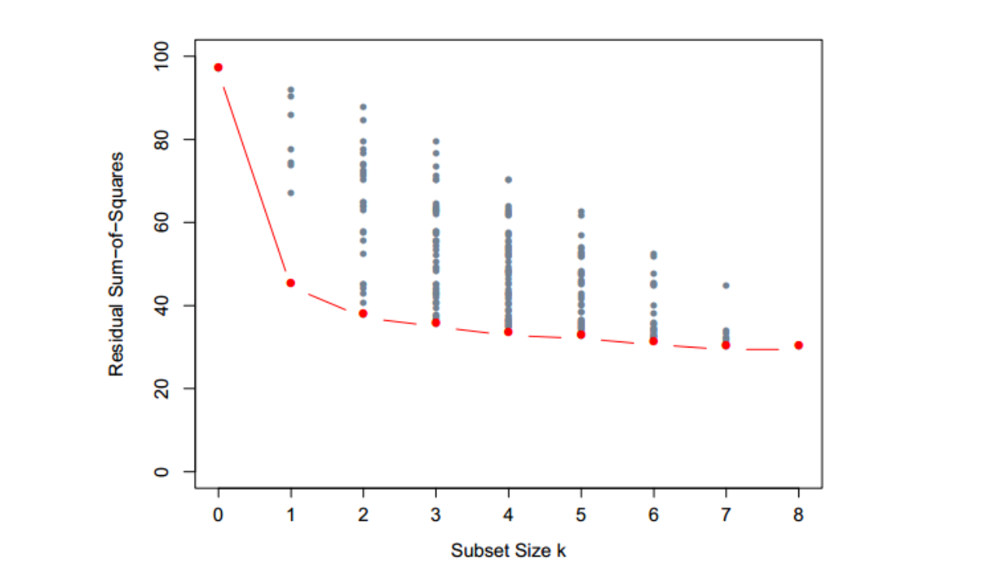
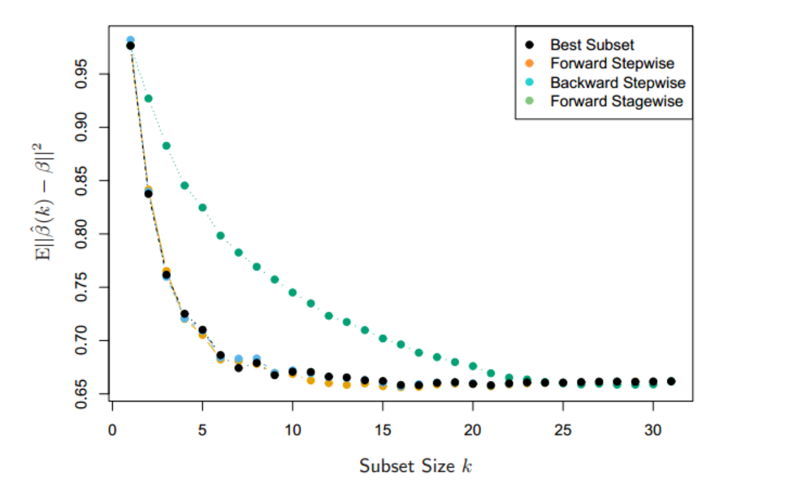

# 子集的选择

## 1  概述

* 不使用最小二乘估计的某些原因
  * 预测的精确性：最小二乘估计经常有小偏差大方差。预测精确性有时可以通过收缩或者令某些系数为 $0$ 来提高
  * 可解释性：当有大量的预测变量时，我们经常去确定一个小的子集来保持最强的影响，可以牺牲一些小的细节

* **模型选择** ：
  * 一些线性回归选择变量子集
  * 于控制方差的收缩和混合的方法，以及其它降维的策略

## 2 选择子集的策略

### 2.1 最优集选择

* 问题描述：对于每个 $k\in\{0,1,2,…,p\}$，最优子集回归要找出规模为 $k$ 的子集中残差平方和 $RSS​$ 最小的子集

* leaps and bounds 过程

  * 子集模型和最优秀子集曲线

    

    * 下边界代表通过最优子集方法选择的符合条件的模型，也就是最有子集曲线
    * 横轴：子集大小
    * 纵轴：残差平方和$RSS$
    * 较大的子集不一定嵌套较小的子集

  * 选择$k$

    * 最优子集曲线必然地下降，所以不能用来选择子集的规模$k$
    * 怎样选择 $k$ 涉及偏差和方差之间的平衡
    * 有许多可能会使用的准则，例如
      * 选择最小的模型使得预测误差期望值的估计最小
      * 采用交叉验证去估计预测误差并选择 $k$

  * 在$p<40$可行，否则复杂度太高

### 2.2 向前和向后逐步选择

* 向前逐步选择(Forward-stepwise selection) : 从截距开始，然后向模型中依次添加最大程度提升拟合效果的预测变量

  * 仍需要确定$k​$
  * 属于贪心算法 (greedy algorithm)，产生一个嵌套的模型序列，较大的子集一定嵌套较小的子集。
  * 与最优子集选择相比似乎是次优的．然而，有许多原因表明向前逐步可能是更好的：
    * 计算：对于大的$p$（$p>>N​$)，复杂度更小
    * 统计（还未理解）：在每个规模下选择最优子集需要在方差上付出代价；向前逐步是一种有更多约束的搜索，而且将会有更低的方差，但是或许有更大的偏差
  * 有大量的备选预测变量时，会需要大量的计算。然而却可以利用$QR$分解从当前拟合快速得到下一步的备选预测变量（具体见[习题Ex 3.9](A 习题))）

* 向后逐步选择 (backward-stepwise selection)：从整个模型开始，并且逐步删掉对拟合影响最低的预测变量

  * 要删掉的候选变量是 $Z$ 分数最低的变量（具体见[习题Ex 3.10](A 习题))

  * 只能用于$N>p​$的情况

    

* 参数方差比较

  * 这是一个小型模拟研究的结果

    

    * 问题描述
      * 一个模拟的线性回归问题 $Y=Xβ+\epsilon$ 中四种子集选择方法的比较。在 $p=31$ 个标准高斯变量有 $N=300$ 个观测，且成对相关系数都等于 0.85
      * 有10个变量的系数是从$N(0,0.4)$选取的，其他都是0
      * 噪声$\epsilon \sim N(0,6.25)$，信噪比是0.64
    * 解释
      * 横轴：子集大小
      * 纵轴：$E(\|\hat\beta(k)-\beta\|^2)$，参数的均方误差
      * 生成方法是，首先生成$\beta$，然后多次随机生成300个观测，生成$\hat\beta(k)$。最后根据多次生成的$\hat\beta(k)$计算均方误差
    * 分析
      * 因为只有10个参数不是10，所以只要10个变量有效，可以看到基本上都是在$k=10​$就降低到一个比较小的值
      * 同时，因为$E(\|\hat\beta(k)-\beta\|^2)$可以看作预测值和真实值的均方误差，因此可以分解为偏差+方差。因此这个曲线并不是严格下降，可逆存在上升的情况（偏差增大但是方差减小）

* 其他

  * 传统的包中的选择基于 $F$ 统计量，加入“显著性”的项，然后删掉“非显著性”的项，但是不再流行，因为没有考虑多重检验（TODO：对多重检验还有疑问）
  * 些软件包实现混合的逐步选择策略，在每一步同时考虑向前和向后的移动，然后选择两者中最好的一个
  * 对于变量经常成群出现（比如用来编码多层次类别型预测变量的虚拟变量），智能逐步过程会合理考虑到它们的自由度会一次添加或删除整个群体

### 2.3 向前逐渐 (Forward-Stagewise) 回归

