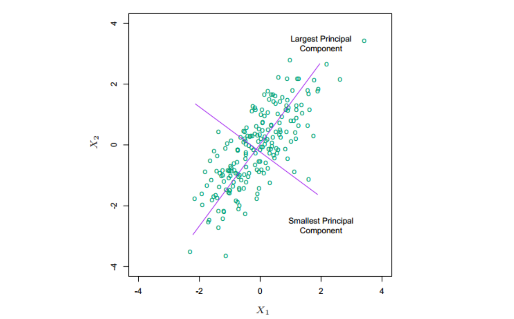
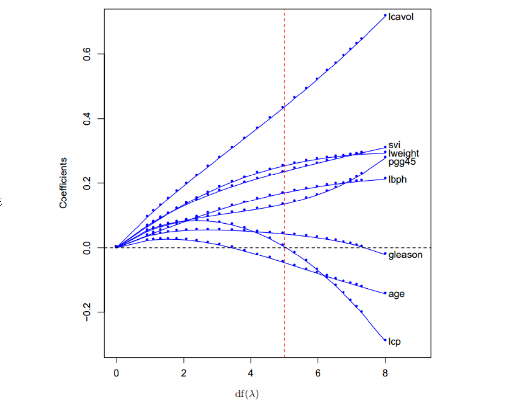
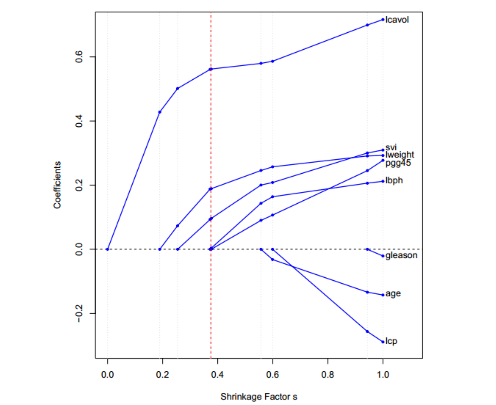
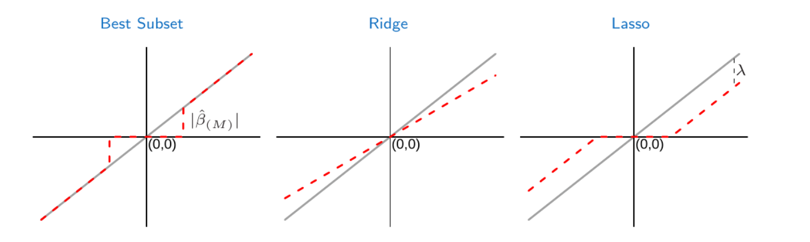
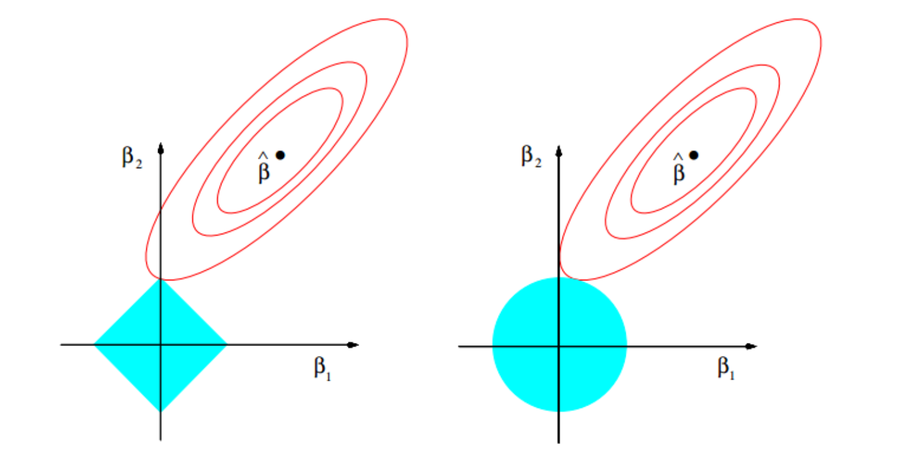
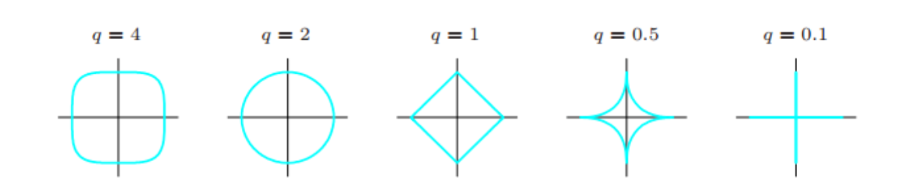
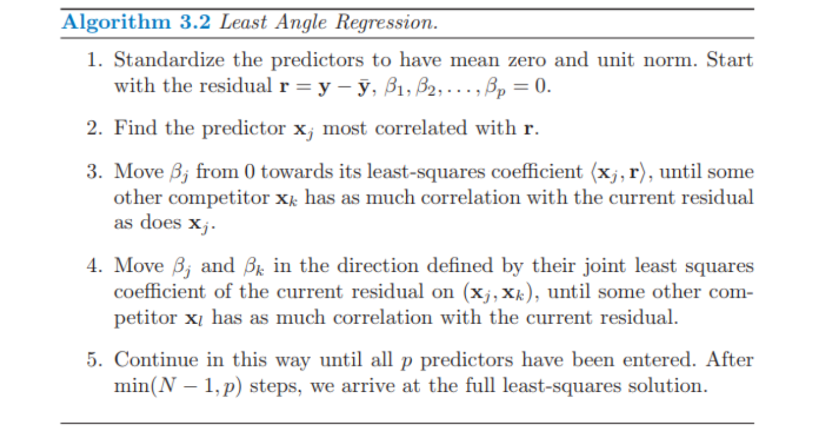
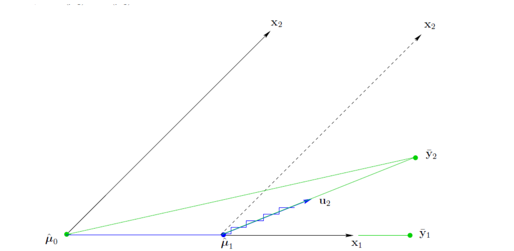

# 4 收缩的方法

## 1 概述

* **子集选择 (subset selection)** 可得到一个可解释的、预测误差可能比全模型低的模型。然而，因为这是一个离散的过程（变量不是保留就是丢弃），所以经常表现为高方差，因此不会降低全模型的预测误差。
* **收缩方法 (shrinkage methods)** 更加连续，因此不会受 **高易变性 (high variability)** 太大的影响．

## 2 岭回归

### 2.1 概念与公式

* 概念：**岭回归 (Ridge regression)** 根据回归系数的大小加上惩罚因子对它们进行收缩。岭回归的系数使得带惩罚的残差平方和最小

* 公式：
  $$
  P_{\lambda}:\hat\beta^{ridge}=\arg\min_{\beta}\left\{\sum_{i=1}^N (y_i-\beta_0-\sum_{j=1}^p x_{ij}\beta_j+\lambda\sum_{j=1}^p \beta_j^2)\right\},\ \lambda \ge 0
  $$
  $\lambda$ 值越大，收缩的程度越大．每个系数都向零收缩。通过参数的平方和来惩罚的想法也用在了神经网络，也被称作**权重衰减 (weight decay)**

* 拉格朗日等价：

  岭回归问题可以等价地写成，而且$\lambda$和$t$有一一对应的关系

  * 公式
    $$
    Q_{t}: \overline \beta^{ridge}=\arg\min_{\beta} \sum_{i=1}^N (y_i-\beta_0-\sum_{j=1}^p \beta_j x_{ij} )^2\\
    subject\ to \sum_{i=1}^p \beta_j^2\le t
    $$

  * 等价的定义

    * 正推：对$\forall \lambda\ge 0​$, 都$\exists t \ge 0​$, 使得$\hat\beta^{ridge}=\overline \beta^{ridge}​$  
    * 反推：对$\forall t \ge 0​$, 都$\exists\lambda \ge 0​$, 使得$\overline \beta^{ridge}=\hat\beta^{ridge}​$ 

  * 证明(为了简化，这里假设不存在$\beta_0$, 即无截距)：

    * 对于$P_{\lambda}​$，有
      $$
      \frac{\part (y-X\beta)^T(y-X\beta)+\lambda \beta^T\beta}{\part \beta} =0
      \\ \leftrightarrow X^T(X\beta - y) + \lambda \beta= 0
      $$

    * 对于$Q_{t}​$

      * 首先可以化为矩阵形式
        $$
        Q_{t}: \overline \beta^{ridge}=\arg\min_{\beta} (y-X\beta)^T(y-X\beta)\\
        subject\ to\ \beta^T\beta-t\le 0
        $$

      * 由拉格朗日函数法
        $$
        L(\beta,\mu)=(y-X\beta)^T(y-X\beta)+\mu(\beta^T\beta-t)
        $$

      * 根据$KTT​$条件
        $$
        \left\{
        \begin{align}
        &\nabla f + \mu \nabla g = 0\\
        &\ g(x) \le 0\\
        &\mu >= 0\\
        &\mu g(x) = 0
        &\end{align}
        \right.
        $$
        有
        $$
        \left\{
        \begin{align}
        &X^T(X\beta - y) + \mu \beta=0\\
        &\ \beta^T\beta-t\le 0\\
        &\mu >= 0\\
        &\mu(\beta^T\beta-t) = 0
        &\end{align}
        \right.
        $$

    * 首先证明正推：

      * 对$\forall \lambda\ge 0$，可得$P_{\lambda}$ 的解为
        $$
        \hat\beta^{ridge}=(X^TX+\lambda I)^{-1}X^Ty
        $$

      * 只需要使得$Q_{t}$中
        $$
        \mu=\lambda\\
        t=((X^TX+\lambda I)^{-1}X^Ty)^T(X^TX+\lambda I)^{-1}X^Ty
        $$

      * 即可使得两者解相同

    * 然后证明反推：

      * 对$\forall t \ge 0 ​$， 取$\mu​$ 是满足$KTT​$ 条件的一个值

        * 若$t\ge ((X^TX)^{-1}X^Ty)^T(X^TX)^{-1}X^Ty, 此时取​$$\mu =0 ​$即可满足$KTT​$条件，则也取$\lambda =0​$ 即可

        * 若$t< ((X^TX)^{-1}X^Ty)^T(X^TX)^{-1}X^Ty​$, 则必有
          $$
          \mu !=0\\
          t=\beta^T\beta
          $$
          取$\mu$取满足下式的一个值即可
          $$
          ((X^TX+\mu I)^{-1}X^Ty)^T(X^TX+\mu I)^{-1}X^Ty=t\\
          \label{eq2}
          $$

          * 因为

            $$
            (1)\lim_{\mu\rightarrow\infin}((X^TX+\mu I)^{-1}X^Ty)^T(X^TX+\mu I)^{-1}X^Ty
            \\=((\mu I)^{-1}X^Ty)^T(\mu I)^{-1}X^Ty=0<t\\
            (2)when_{\mu=0}((X^TX+\mu I)^{-1}X^Ty)^T(X^TX+\mu I)^{-1}X^Ty
            \\=((X^TX)^{-1}X^Ty)^T(X^TX)^{-1}X^Ty>t
            $$
          * 由于函数连续性，所以则必定$\exists \mu$, 满足式子 $\eqref{eq2}$

          此时也取$\lambda=\mu$即可

* 为什么这么做：当在线性回归模型中有许多相关变量，它们的系数可能很难确定且有高方差．某个变量的较大的正系数可以与相关性强的变量的差不多大的负系数相互抵消。通过对系数加入大小限制，问题可以减轻

* 矩阵形式

  * 输入标准化：

    * 由于对输入按比例进行缩放时，岭回归的解不相等，因此求解前我们需要对输入进行标准化。

    * 注意到惩罚项不包含截距 $\beta_0$，因为对截距的惩罚会使得过程依赖于 $y$ 的初始选择（每个 $y_i$ 加上常数 $c$ 不是简单地导致预测值会偏离同样的量 $c​$）

    * 可以证明，当对输入进行中心化后（即$\mathbf{x}_{norm}=\mathbf{x}-\bar{\mathbf{x}}​$)，$Q_t​$的解可以分为两部分

      * 使用$\bar y=\frac{\sum_{i=1}^N y_i}{N}$来估计$\beta_0$
      * 使用无截距的岭回归，利用中心化的$\mathbf{x}$估计剩余部分参数

      

    证明请看[习题Ex 3.5](A 习题)

  * 公式
    $$
    RSS(\lambda)=(y-X\beta)^T(y-X\beta)+\lambda\beta^T\beta
    $$
    因此，岭回归可以写作如上，其中$X$是$p$列，每一行都是经过中心化了的输入变量。而$y$也是传统岭回归的$y_{norm}=y-\beta_0=y-\bar y$中心化的值

    解：
    $$
    \frac{\part (y-X\beta)^T(y-X\beta)+\lambda \beta^T\beta}{\part \beta} =0
    \\ \leftrightarrow X^T(X\beta - y) + \lambda \beta= 0
    \\ \leftrightarrow \hat\beta^{ridge}=(X^TX+\lambda I)^{-1}X^Ty
    $$

  * 由岭回归矩阵形式的解$\hat\beta^{ridge}=(X^TX+\lambda I)^{-1}X^Ty$可以看到，即使$X^TX$不是满秩的，$X^TX+\lambda I$也是满秩矩阵，这样会使得问题非奇异，而且这是第一次将岭回归引入统计学中的主要动力

    * 证明：
      $$
      \forall x >0, x^T(X^TX+\lambda I)x=(Xx)^TXx+\lambda x^Tx > 0
      $$
      因此$X^TX+\lambda I​$正定，正定矩阵必定满秩，证毕

### 2.2 岭回归与后验分布

* 当给定一个合适的先验分布，岭回归也可以从后验分布的均值或众数得到

* 假设

  * $y$的先验分布为 $N(\beta_0+X\beta,\sigma^2I)​$
  * 参数 $\beta$ 的前验分布为 $N(0,\tau^2I)​$
  * 参数$\beta_0​$不包含任何前验信息，即前沿分布是均匀分布

* 则$\beta $ 后验分布密度函数的对数值就是$ridge​$

* 证明

  

  * 由后验概率公式，可得
    $$
    P([\beta_0,\beta]|y) = \frac{P([\beta_0,\beta],y)}{P(y)} = \frac{P(y|[\beta_0,\beta])P([\beta_0,\beta])}{P(y)}  \\\sim P(y|[\beta_0,\beta])P(\beta)P(\beta_0) \sim P(y|[\beta_0,\beta])P(\beta) 
    \\=\frac{1}{\sqrt{(2\pi\sigma^2)^{N}}}\exp(-\frac{(y-\beta_0-X\beta)^T(y-\beta_0-X\beta)}{2\sigma^2})\times \frac{1}{\sqrt{(2\pi\tau)^{N}}}\exp(-\frac{\beta^T\beta}{2\tau^2})\\
    =C\exp(-\frac{1}{2\sigma^2}((y-\beta_0-X\beta)^T(y-\beta_0-X\beta)+\frac{\sigma^2}{\tau^2}\beta^T\beta))
    $$

  * 取负对数
    $$
    -\log P([\beta_0,\beta]|y)=-\log C+\frac{1}{2\sigma^2}((y-\beta_0-X\beta)^T(y-\beta_0-X\beta)+\frac{\sigma^2}{\tau^2}\beta^T\beta)
    $$

  * 因为后验分布仍然是高斯分布，因此是众数也是均值

### 2.3 岭回归与奇异值分解

* 中心化输入矩阵$X_{N\times p}​$进行**奇异值分解 (SVD)** 可以进一步了解了岭回归
  $$
  X_{N\times p}=U_{N\times p}D_{p\times p}V_{p\times p}^T
  $$

  * 这是对标准奇异值分解进行矩阵分块得到的，称为Thin SVD（请参考[奇异值分解](..\A 基础知识\A.1 代数理论\2 协方差矩阵与矩阵分解)), $U$张成$X$的列空间，$V$张成$X$的行空间

  * $D_{p\times p}​$是对角阵，其对角元$d_1\ge d_2\ge \dots \ge d_p \ge 0​$, 若有$d_j=0​$，则称$X​$为奇异的。其实若$X​$列满秩，则$D​$也是非奇异对角阵

    

* 利用奇异值分解，通过简化我们可以把最小二乘拟合向量
  $$
  X\hat\beta^{ls}=X(X^TX)^{-1}X^Ty
  \\=UDV^T(VD^TU^TUDV^T)^{-1}VD^TU^Ty
  \\=UDV^T(VDDV^T)^{-1}VDU^Ty
  \\=U(D^{-1}V^TVDDV^TVD^{-1})^{-1}U^Ty
  \\=UU^Ty
  $$

* 这与满秩分解$QQ^Ty$十分相似，其实$Q$和$U$都是$X$列空间两个不同的正交基（请参考[习题Ex 3.8](A 习题)）

* 得到岭回归的解为
  $$
  X\hat\beta^{ridge}=X(X^TX+\lambda I)^{-1}X^T y
  \\ = UDV^T(VDDV^T+\lambda I)^{-1}VDU^Ty
  \\ =UD(V^TVDDV^TV+\lambda V^TV)^{-1}DU^Ty
  \\ =UD(D^2+\lambda I)^{-1}DU^T y
  \\ = \sum_{j=1}^p \frac{d_j^2}{d_j^2+\lambda}\mathbf{u_j}\mathbf{u_j}^T y
  $$
  其中$\mathbf{u_j}​$是$U​$的列向量，因为$\frac{d_j^2}{d_j^2+\lambda} < 1​$, 所以上式的含义为

  * 首先算出$y$在$U$上的坐标，然后使用$\frac{d_j^2}{d_j^2+\lambda}$进行收缩基向量的坐标
  * $d_j$越小，收缩基向量的坐标的程度越高

### 2.4 岭回归与特征值分解

* 对于中心化后$X$，样本协方差矩阵是
  $$
  S=X^TX/N
  $$

* 而对$X$ 带入奇异值分解可以得到$X^TX$的特征值分解，特征向量$v_j$($V$的列向量)是$X$的主成分方向
  $$
  X^TX=VD^2V^T
  $$

* 对第一主成分方向$v_1$, 有$z_1=Xv_1$在$X$的列线性组合中方差最大（参考[主成分分析](A 基础知识\A.2 数值方法\4 主成分分析)）， 且方差为
  $$
  Var(z_1)=Var(Xv_1)\\
  =\frac{(Xv_1)^T(Xv_1)}{N}=\frac{v_1^TX^TXv_1}{N}\\
  =\frac{\lambda v_1^Tv}{N}=\frac{d_1^2}{N}
  $$

* 事实上，由于奇异值分解（请参考[奇异值分解](..\A 基础知识\A.1 代数理论\2 协方差矩阵与矩阵分解)），有
  $$
  z_1=Xv_1=u_1d_1
  $$
  * 因此 $u_1$是标准化的第一主成分．后面的主成分 $z_j$ 在与前一个保持正交的前提下有最大的方差 $\frac{d_j^2}{N}$, 因此最后一个主成分有最小的方差。

    证明：
    $$
    <z_i,z_j>=z_i^Tz_j=v_i^TX^TXv_j=\lambda_j v_i^Tv_j=0
    $$
    

  

  * 越小的奇异值 $d_j$ 对应 $X$ 列空间中方差越小的方向，并且岭回归在这些方向上收缩得最厉害
    * 
    * 奇异值越小，对应的$z_j=d_ju_j=Xv_j$的方差越小,
    * 其中$u_i$就相当于经过$v_i$正交基旋转后的属性，这个属性之间也是相互正交的
    * 求$\hat y$时只需要求$y$在$U$列空间的投影，也就是$\hat y=UU^Ty$, 但是岭回归的公式是$\hat y= \sum_{j=1}^p \frac{d_j^2}{d_j^2+\lambda}\mathbf{u_j}\mathbf{u_j}^T y$, 也就是说，岭回归在方差较小的属性$u_i$(X在也是$v_i$ 方向的投影)的系数进行了缩放，而且对低方差成分的系数比高方差收缩得更厉害

### 2.5 自由度

* 岭回归的**有效自由度 (effective degrees of freedom)**定义为
  $$
  df(\lambda) =tr[X(X^TX+\lambda I)^{-1}X^T]
  \\ = tr(H_{\lambda})=\sum_{j=1}^p\frac{d_j^2}{d_j^2+\lambda}
  $$

* 其关于$\lambda$ 单调递减，若$\lambda \rightarrow 0, df(\lambda)=p$, 若$\lambda \rightarrow \infin, df(\lambda) =0​$

* 对截距还有一个额外的自由度，但是事先以及通过中心化去掉了

* 这里自由度的定义，其实可以理解为对$U$列向量投影系数的缩放程度，自由度越低，说明缩放程度越大，对各个属性的约束也越大，概念与子集选择方法系非0变量个数类似

* 若输入变量$X$列正交，则

* 当惩罚参数 $\lambda$ 不同时，前列腺癌例子岭回归的变化曲线

  * 曲线

    

  * 可以看到随着自由度减少，大部分系数是呈现趋近于0的趋势

  * 但是有部分系数如$lcp,age,gleason​$等等，先趋近于0，然后变为正，然后再趋近于0也是完全可以解释的

    * $lcp$可能是有$v_i+v_j$(两种属性的线性组合)
    * $u_i$的系数可能是正的，$u_j$是系数负的且绝对值更大，自由度是8是$lcp$的系数是负的
    * 随着自由度减少，由于$u_j$的方差更小，收缩更快，导致$lcp$系数变正
    * 当自由度为0时，$lcp$系数变变为0

* 当输入变量$X$列正交时，岭回归估计仅仅是最小二乘估计的缩小版本，也就是
  $$
  \hat\beta^{ridge}=\frac{\hat\beta}{1+\lambda}
  $$
  

## 3 Lasso

### 3.1 概念与公式

* lasso 像岭回归一样是个收缩方法，有微妙但很重要的区别

* 公式

  * 估计定义
    $$
    Q_{t}: \overline \beta^{lasso}=\arg\min_{\beta} \sum_{i=1}^N (y_i-\beta_0-\sum_{j=1}^p \beta_j x_{ij} )^2\\
    subject\ to \sum_{i=1}^p |\beta_j|\le t
    $$

  * 等价拉格朗日形式
    $$
    P_{\lambda}:\hat\beta^{lasso}=\arg\min_{\beta}\left\{\sum_{i=1}^N (y_i-\beta_0-\sum_{j=1}^p x_{ij}\beta_j+\lambda\sum_{j=1}^p |\beta_j|)\right\},\ \lambda \ge 0
    $$
    

    

* 如在岭回归中一样，我们可以通过标准化预测变量来对常数 $\beta_0$ 再参量化,$\beta_0 $ 的解为 $\bar y$，并且后面拟合相对于无截距的模型（见[习题Ex 3.5](A 习题)）

### 3.2 标准化参数

* 定义标准化参数 $s$
  $$
  s = \frac{t}{\sum_{j=1}^p |\beta_j|}
  $$

  * 若$s\ge 1$, 则$\hat\beta^{lasso}=\hat\beta^{ls}$
  * 若$s<1$, 比如$s=0.5$, 最小二乘系数平均收缩 50%,充分小会造成一些参数恰恰等于 0(类似于子集选择)
  * 应该自适应地选择 $t$ 使预测误差期望值的估计最小化

* 曲线

  * 
  * 上图现实了前列腺癌例子中，$s$取不同时的 lasso 系数
  * 该下降不总是严格单调的，尽管例子中确实是
  * lasso 曲线会达到 0，然而岭回归不会．曲线是分段线性的

## 4 子集的选择，岭回归，Lasso

### 4.1 正交情况显式解

* 在正交输入矩阵的情况下，三种过程都有显式解

* 最优子集

  * 由于输入矩阵正交，最优秀子集的解为
    $$
    \hat\beta^{subset} = {X^{subset}}^Ty
    $$

  * 注意到最小二乘的解是
    $$
    \hat\beta^{ls} = {X^{ls}}^Ty
    $$

  * 又因为$y$是相同的，且$X^{subset}$是$X^{ls}$的某些列，所以最小子集选择的系数和最小二乘系数一定相同

  * 又因为预测值$\hat y^{subset}​$是
    $$
    \hat y^{subset}= X^{subset}\hat\beta^{subset}=X^{subset}{X^{subset}}^Ty\\
    $$

  * 由于$\hat y^{subset}$是可以对应到正交基$X^{subset}$下的坐标${\beta^{subset}=X^{subset}}^Ty$，因此新选择一个$\hat\beta^{ls}_j$作为$\hat\beta^{subset}_j$时，要选择未选择的$\hat\beta^{ls}_j$中最大的，这样才能使得误差最少。

  * 所以$M$大小的最优子集系数为($|\hat \beta_{(M)}|$是第$M$大的系数)
    $$
    \hat\beta^{ls}\cdot I(|\hat \beta^{ls}| \ge |\hat \beta_{(M)}^{ls}|)
    $$

* 岭回归

  * 由岭回归公式
    $$
    \hat\beta^{ridge}=(X^TX+\lambda I)^{-1}X^Ty
    $$

  * 得到
    $$
    \hat\beta^{ridge} =\frac{X^Ty}{1+\lambda}=\frac{\hat\beta^{ls}}{1+\lambda}
    $$

* Lasso

  * Lasso公式为
    $$
    f(\beta)=(y-X\beta)^T(y-X\beta)+\lambda \|\beta\|_{1}
    $$

  * 求导得，这里需要引入次梯度概念，请参考[次梯度](..\A 基础知识\A.2 数值方法\5 次梯度)
    $$
    0\in 2X^T(X\beta - y) + \lambda  \frac{\part \|\beta\|_{1}}{\part \beta}
    $$

  * 另
    $$
    0= 2X^T(X\beta - y) + \lambda \frac{\part \|\beta\|_{1}}{\part \beta}\\
    2X^T(y-X\beta)=\lambda \frac{\part \|\beta\|_{1}}{\part \beta}\\
    \beta=X^Ty-\frac{\lambda}{2}\frac{\part \|\beta\|_{1}}{\part \beta} = \hat \beta^{ls}-\frac{\lambda}{2}\frac{\part \|\beta\|_{1}}{\part \beta}
    $$

  * 由于
    $$
    \frac{\part \|\beta\|_{1}}{\part \beta_i}=
    \left\{
    \begin{matrix}
    1, \beta_i>0\\
    -1, \beta_i<0\\
    [-1,1],\beta_i=0
    \end{matrix}
        
    \right\}
    $$

  * 因此分情况讨论得知

    * 若$\hat \beta^{ls}_j > \frac{\lambda}{2}​$, 有$\beta_j=\hat \beta^{ls}_j-\frac{\lambda}{2}\frac{\part \|\beta\|_{1}}{\part \beta_j}>0​$, 因此有
      $$
      \beta_j=\hat \beta^{ls}_j-\frac{\lambda}{2}
      $$

    * 若$\hat \beta^{ls}_j < - \frac{\lambda}{2}​$, 有$\beta_j=\hat \beta^{ls}_j-\frac{\lambda}{2}\frac{\part \|\beta\|_{1}}{\part \beta_j}<0​$,因此有
      $$
      \beta_j=\hat \beta^{ls}_j+\frac{\lambda}{2}
      $$

    * 若$- \frac{\lambda}{2}\le \hat \beta^{ls}_j \le \frac{\lambda}{2}​$, 使用反证

      * 若$\beta_j > 0​$, 则有$\beta_j=\hat \beta^{ls}_j-\frac{\lambda}{2}\frac{\part \|\beta\|_{1}}{\part \beta_j} = \hat \beta^{ls}_j-\frac{\lambda}{2}\le 0​$
      * 若$\beta_j < 0​$，则有$\beta_j=\hat \beta^{ls}_j-\frac{\lambda}{2}\frac{\part \|\beta\|_{1}}{\part \beta_j} = \hat \beta^{ls}_j+\frac{\lambda}{2}\ge 0​$
      * 因此可以得到，$\beta_j=0$，$\frac{\part \|\beta\|_{1}}{\part \beta_j}=\frac{2\hat\beta_j^{ls}}{\lambda}$

  * 最后，总结情况可知（其中$x_+$指$max(x,0)$）
    $$
    \hat \beta^{lasso} = sign(\hat \beta^{ls})^T(|\hat \beta^{ls}|-\frac{\lambda}{2})_{+}
    $$

* 总结

  * 曲线

    

  * 岭回归做等比例的收缩，lasso 通过常数因子$\lambda$来变换每个系数，在0处截去，称为**软阈限**

  * 最优子集选择删掉所有小于第M大的系数，是**硬阈限**的一种

### 4.2 非正交情况

* 下图：lasso (左)和岭回归（右）的估计图象．图中显示了误差的等高线和约束函数。实心蓝色区域为约束区域$\|\beta\|_1\le t, \|\beta\|_1\le t$，红色椭圆为最小二乘误差函数的等高线

  
  * 两种方式都寻找当椭圆等高线达到约束区域的第一个点
  * 圆盘是和等高线相切的时候的点，具体可以参考[正则化](..\B 常用技巧\B.2 正则化与归一化\1 正则化)
  * 而lasso 的**菱形 (diamond)** 有角；如果解出现在角上，则会出现某个$\beta_j=0$。当$p>2$时均如此，对于参数估计有更多的可能为 0(稀疏性)

* 一般情况

  * 公式：把岭回归和 lasso 一般化，并且可以看成是贝叶斯估计
    $$
    \tilde \beta=\arg\min_{\beta}\left\{(y-X\beta)^T(y-X\beta)+\lambda\| \beta\|_q)\right\},\ \lambda \ge 0
    $$

  * 其中$q\ge 0​$,$\|\beta\|_q\le t​$对应的等高线如下

    

  * 最大后验分布

    * $\| \beta\|_q​$可以看作$\beta​$的先验分布的对数值，因此上面的等高线也可以看作参数$\beta ​$先验分布的等高线

    * $q=0$时，只有顶点上可以有值，因此对应的是变量子集选择

    * $q=1$时，对应的是$lasso​$，此时参数的先验分布是服从相互独立的Laplace分布，即
      $$
      \beta_j\sim \frac{1}{2\tau} \exp(-\frac{|\beta_j|}{\tau})\\
      \beta \sim \frac{1}{2^p\tau^p}\exp(-\frac{\sum_{j=1}^p |\beta_j|}{\tau}) = \frac{1}{2^p\tau^p}\exp(-\frac{\|\beta_j\|_1}{\tau})
      $$
      这是是使得约束区域为凸的最小 $q$ 值，非凸约束区域使得优化问题很困难

    * $q=2$，对应岭回归，先验分布是独立正态分布

    * lasso、岭回归和最优子集选择是有着不同先验分布的贝叶斯估计。它们取自后验分布的众数，即最大化后验分布

    

  * $q$的选择

    * $q∈(1,2)$ 表明在 lasso 和岭回归之间进行权衡

    * 当 $q>1$ 时，尽管 $\| \beta\|_q$ 在 0 处可导，没有lasso（$q=1$）的令系数恰巧为零的性质

    * 弹性惩罚

      * 公式
        $$
        \lambda(\alpha\|\beta\|_2+(1-\alpha)\|\beta\|_1)
        $$
        

      * 这是一种岭回归和 lasso之间的平衡

      * 弹性惩罚像 lasso 一样选择变量，同时像岭回归一样收缩相关变量的系数，其与$q=1.2$图像十分相似，但是可以选择变量(因为0处不可导)

        

## 5 最小角回归

### 5.1 概念

* Lasso和向前逐步回归(forward stagewise selection)都是最小角回归(Least angle regression)的变体
* 主体思想：
  * 第一步确定与响应变量最相关的变量$x_1$。使得该变量的系数向最小二乘值连续变化 ，只要其他变量与残差的相关性与该变量和残差的相关性相等，则该过程暂停。
  * 第$i$个变量加入活跃集后有$\{x_1,x_2,\dots,x_i\}$，然后它们的系数一起以保持相关性相等并降低的方式变化，直到找到新的第$i+1$个变量，其与残差的相关性与前$i$个相等
  * 这个过程一直继续直到所有的变量都在模型中，然后在全最小二乘拟合处停止

### 5.2 算法

* 

  * 对预测变量进行标准化处理得到零均值和单位范数，以残差向量$\mathbf{r}=\mathbf{y}-\bar y$, $\beta_1,\beta_2,\dots,\beta_p=0$
  * 找到与$\mathbf{r}$最相关的变量$\mathbf{x}_j$
  * 向相关系数$<\mathbf{x_j}, \mathbf{r}>$移动$\beta_j$，并计算当前残差$\mathbf{r}=\mathbf{r}-\beta_j\mathbf{x}_j$直到存在新的变量$\mathbf{x}_k$使得其$\mathbf{x}_j$与当前残差的相关性相等
  * 再由当前残差$(\mathbf{x}_j,\mathbf{x}_k)$联合最小二乘系数上移动$\beta_i, \beta_j$, 直到存在$\mathbf{x}_l$，其和$(\mathbf{x}_j,\mathbf{x}_k)​$与当前残差的相关性相等
  * 按这种方式继续直到所有的 $p$ 个预测变量加入到模型中．经过 $\min(N−1,p)​$步达到最小二乘解

* 几何角度去理解

  * 以在二维数据下$\mathbf{x}_1,\mathbf{x}_2$的选择过程为例（其中$x_1,x_2$都经过中心化和归一化，即$\sum_{i} x_{1i}=0,\sum_{i}x_{1i}^2=1,\sum_{i} x_{2i}=0,\sum_{i}x_{2i}^2=1$）

    

  * 由于$y$可以被分解为$x_1,x_2$空间的投影$\bar y_2$以及与该空间正交的$y_{norm}$，因此其与$x_1, x_2$的相关系数可以看作$\bar y_2$和$x_1,x_2$的相关性
    $$
    <x_1,r>=<x_1,y-\hat\mu>
    \\=<x_1,\bar y_2+y_{norm}-\hat\mu>
    \\=<x_1,\bar y_2-\hat\mu>+<x_1,y_{norm}>
    \\=<x_1,\bar y_2-\hat\mu>+0=<x_1,\bar y_2-\hat\mu>
    $$

  * 因此可以计算相关性向量
    $$
    c=c(\hat\mu)=X^T(y-\hat \mu)=X^T(\bar y-\hat \mu)
    $$
    

  * 初始化$\hat \mu_0=0​$, 计算残差$r_0=\bar y_2-\hat\mu_0​$，其与$x_2​$角度更小，即$c_1(\bar \mu_0)>c_2(\bar \mu_0)​$, 因此LAR选择向$x_1​$走一步，即
    $$
    \hat \mu_1=\hat\mu_0+\gamma_1x_1
    $$

    * 如果是stagewise的话，就是选择很小的$\gamma_1​$

    * 如果是forward selection，就是选择一个足够大$\gamma_1$, 使得$\hat\mu_1=\bar y_1$, 即$y$在$x_1$方向的投影

    * 而LAR则是两者的中间结果，选择一个适当的$\gamma_1​$使得$r_1=\bar y_2-\hat \mu_1​$平分$x_1,x_2​$的夹角，即
      $$
      <r_1, x_1>=<r_1,x_2>\\
      c_1(\hat\mu_1)=c_2(\hat\mu_1)
      $$

  * 接下来，因为$r_1=\bar y_2-\hat \mu_1​$坐落在$u_2=\frac{x_1+x_2}{\|x_1+x_2\|}​$方向，所以下一步更新方向是
    $$
    \hat \mu_2=\hat\mu_1+\gamma_2u_2
    \\ = \hat\mu_1+\gamma_2\frac{x_1+x_2}{\|x_1+x_2\|}
    $$
    选择合适的$\gamma_2$使得$\hat μ_2=\bar y_2$，得到线性回归的结果

    * 如果维度更多，其会探索更多方向，例如三维情况，其会选择合适的$\gamma_2$使得$r_2=y-\hat \mu_1$与$x_1,x_2,x_3$的夹角都相等，之后向$u_2=\frac{x_1+x_2+x_3}{\|x_1+x_2+x_3\|}$方向跟新

  * 图中蓝色阶梯线表示stagewise的一个迭代过程，最后也攀爬到$\bar y_2 $。因此，其实LAR和stagewise的区别就在于，LAR可以计算出在一个方向上需要走多远的，而stagewise是选择相关性最高，并且系数增加$\epsilon​$

    

    

    