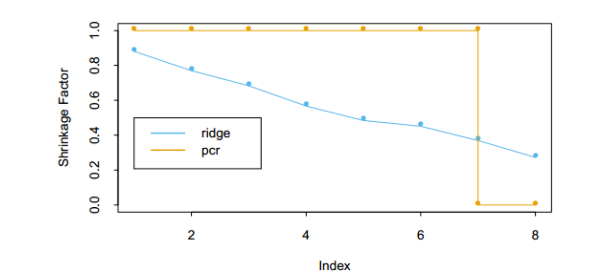

# 运用派生输入方向的方法

## 1 概述

* 在很多情形下我们有很多输入，这些输入的相关性经常是非常强的。这一小节中的方法产生较少的原输入变量$X_j$的线性组合$Z_m,m=1,2,\dots,M$, 然后用$Z_m$代替$X_j$来作为回归的输入。

## 2 主成分回归

* 记$X$的Thin-SVG为
  $$
  X_{N\times P}=U_{N\times p} D_{p\times p}V_{p\times p}^T
  $$

* 使用主成分方向$v_i$构造输入列$z_m = Xv_{m}$, 然后在$z_1,z_2,\dots,z_M,M\le p$上回归$y$。

* 由于$z_m$之间相互正交，所以回归是单变量回归的和
  $$
  \hat y ^{pcr}_{(M)}=\bar y\mathbf{1}+\sum_{m=1}^M \hat \theta_m z_m
  \\ = \bar y\mathbf{1}+\sum_{m=1}^M \frac{<z_m, y>}{<z_m,z_m>} z_m
  $$

* 由于$z_m$是输入变量$x_j$的线性组合，所以有，且当$M=p$时，其就是$\hat \beta^{ls}$(见习题 [Ex 3.13](.\A 习题)),
  $$
  \hat y ^{pcr}_{(M)}=\bar y\mathbf{1}+\sum_{m=1}^M \hat \theta_m z_m
  \\ = \bar y\mathbf{1}+X\sum_{m=1}^M \hat \theta_m v_m
  \\ \rightarrow \hat\beta^{pcr}_{(M)}=\sum_{m=1}^M \hat \theta_m v_m
  $$

* 容易证明

  * 当$M=p$, 就会回到通常的最小二乘估计，这是因为$Z=XV=UDV^TV=UD$张成了$X$的列空间

  * 当$M<p$, 得到一个降维的回归问题，主成分回归与岭回归非常相似：都是通过输入矩阵的主成分来操作的

    * 图中显示了对应的收缩和截断模式作为主成分指标的函数

      

    * 岭回归对主成分系数进行了收缩，收缩更多地依赖对应特征值的大小

    * 主成分回归丢掉$p-M$个最小的特征分量，进行了截断操作

      

      

## 3 偏最小二乘

