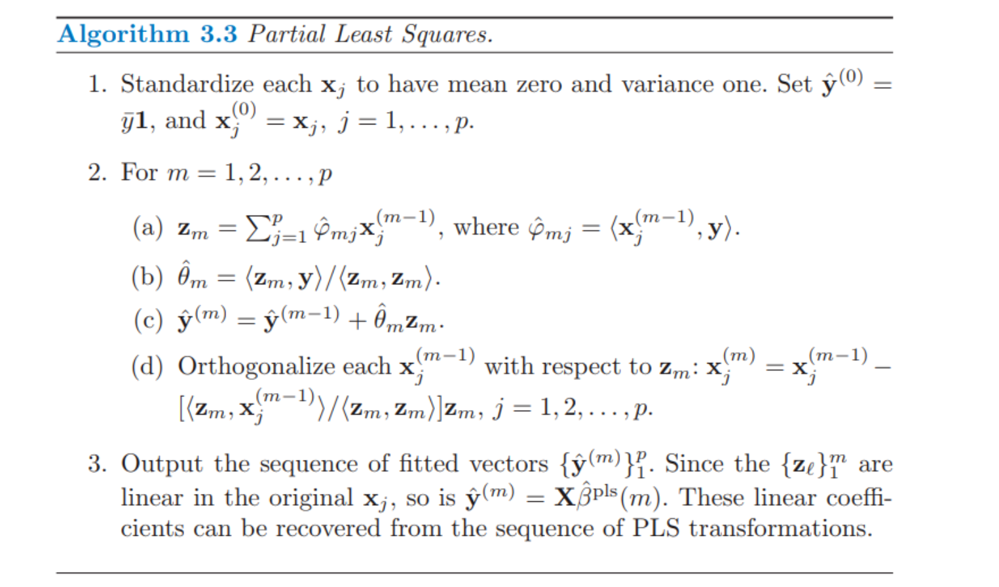

# 运用派生输入方向的方法

## 1 概述

* 在很多情形下我们有很多输入，这些输入的相关性经常是非常强的。这一小节中的方法产生较少的原输入变量$X_j$的线性组合$Z_m,m=1,2,\dots,M$, 然后用$Z_m$代替$X_j$来作为回归的输入。

## 2 主成分回归

* 记$X$的Thin-SVG为
  $$
  X_{N\times P}=U_{N\times p} D_{p\times p}V_{p\times p}^T
  $$

* 使用主成分方向$v_i$构造输入列$z_m = Xv_{m}$, 然后在$z_1,z_2,\dots,z_M,M\le p$上回归$y$。

* 由于$z_m$之间相互正交，所以回归是单变量回归的和
  $$
  \hat y ^{pcr}_{(M)}=\bar y\mathbf{1}+\sum_{m=1}^M \hat \theta_m z_m
  \\ = \bar y\mathbf{1}+\sum_{m=1}^M \frac{<z_m, y>}{<z_m,z_m>} z_m
  $$

* 由于$z_m$是输入变量$x_j$的线性组合，所以有，且当$M=p$时，其就是$\hat \beta^{ls}$(见习题 [Ex 3.13](.\A 习题)),
  $$
  \hat y ^{pcr}_{(M)}=\bar y\mathbf{1}+\sum_{m=1}^M \hat \theta_m z_m
  \\ = \bar y\mathbf{1}+X\sum_{m=1}^M \hat \theta_m v_m
  \\ \rightarrow \hat\beta^{pcr}_{(M)}=\sum_{m=1}^M \hat \theta_m v_m
  $$

* 容易证明

  * 当$M=p$, 就会回到通常的最小二乘估计，这是因为$Z=XV=UDV^TV=UD$张成了$X$的列空间

  * 当$M<p$, 得到一个降维的回归问题，主成分回归与岭回归非常相似：都是通过输入矩阵的主成分来操作的

    * 图中显示了对应的收缩和截断模式作为主成分指标的函数

      

    * 岭回归对主成分系数进行了收缩，收缩更多地依赖对应特征值的大小

    * 主成分回归丢掉$p-M$个最小的特征分量，进行了截断操作

      

* 尺度不变（scale invariant）

  * 主成分回归不是尺度不变的，主成分依赖输入 $\mathbf{x}_j$ 的放缩尺度，所以一般地我们首先对它们进行标准化。
  * 这是因为，若干某个$X$的列（特征）$\mathbf{x}_j$经过放缩后，其主成分方向可能产生改变，从而使得主成分选择不同。

  

## 3 偏最小二乘（PLS）

* 概念：构造了一系列用于回归的输入变量的线性组合，但是与主成分回归不同的是它同时采用$X, \mathbf{y}$来构造

* 尺度不变

  * 也不是尺度不变的，因此假设$\mathbf{x}_j$经过标准化，使得均值是0，方差是1

* 算法流程

  

  * 首先标准化$\mathbf{x}_j$, 使其方差为1，均值为0，并且设置初始拟合变量$x_j^{(0)}=x_j$, 初始预测变量$\hat y^{(0)}=\bar y\mathbf{1}​$

  * 对$m=1,2,\dots M(p),​$, 重复做

    * 计算$z_{m}=\sum_{j=1}^p\hat \phi_{mj}x_j^{(m-1)}=\sum_{j=1}^p<x_{j}^{(m-1)}, \mathbf{y}>x_j^{m-1}​$, 其中$ \phi_{mj}=<x_j,\mathbf{y}>​$衡量了单变量$x_j​$ 对响应变量$y​$影响强度，用来加权

    * 使得$\mathbf{y}$在$z_{m}$上回归，得到系数
      $$
      \hat \theta_{m}=\frac{<z_m, y>}{<z_m,z_m>}
      $$

    * 将$\{x_1^{(m-1)}, x_2^{(m-1)},\dots,x_p^{(m-1)}\}$关于$z_m$进行正交化, 得到$\{x_1^{(m)}, x_2^{(m)},\dots,x_p^{(m)}\}$

      * 在这种方式下，偏最小二乘得到一系列派生的、正交化的输入或者方向$\{z_1,z_2,\dots,z_{M-1},z_M\}$

        证明：

        * 假设$\{z_1,z_2,\dots,z_{m-1} \}$正交，因为$z_m $是$X^{(m-1)}=\{x_1^{(m1)}, x_2^{(m-1)},\dots,x_p^{(m-1)}\}$线性组合，所以$X^{(m-1)}$对$z_m$进行正交化后得到的$\mathbf{x}^{(m)}=\{x_1^{(m)}, x_2^{(m)},\dots,x_p^{(m)}\}$对$\{z_1,z_2,\dots,z_{m} \}$均正交
        * 由数学归纳，最后得到的$\{z_1,z_2,\dots,z_{M-1},z_M\}$均正交的

    * 最后，得到回归预测变量
      $$
      \hat y^{PLS}=\sum_{m=1}^M \hat\theta_m z_m
      $$

    * 因为$z_m$是$X=\{x_1,x_2,\dots,x_p\}$的线性组合

      这是由数学归纳得到的：

      * 第一步：$z_1​$是$X^{(0)}=X​$的线性组合，$X^{(1)}​$是$X^{(0)}​$和$z^{(1)}​$的线性组合，所以也是$X​$的线性组合
      * 假设$z_{m-1}, X^{(m-1)}$是$X$线性组合，则有$z_{m}=\sum_{j=1}^p\hat \phi_{mj}x_j^{(m-1)}$, 所以$z_m$也是$X$线性组合，而$X^{(m)}$是$z_{m-1}$和$X^{(m-1)}$的线性组合，所以$X^{(m)}$也是$X$的线性组合

      所以，$\hat y^{PLS}(m)=X\hat\beta^{PLS}(m)$中的$\beta^{PLS}(m)$可以通过一系列变化从$\hat\theta$中复原

* TODO

