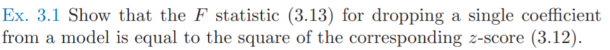
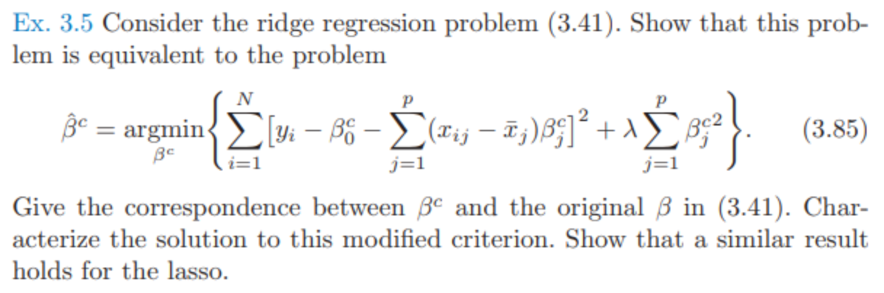
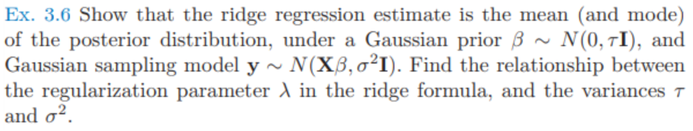
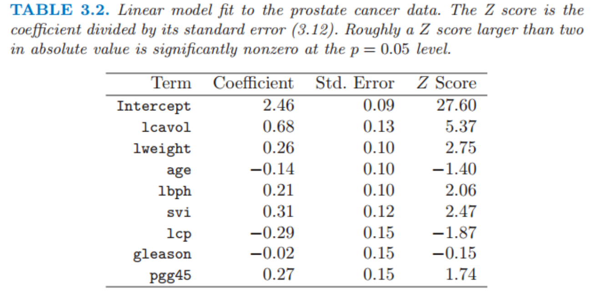

# 习题

## Ex 3.1

* 题目：

* 证明：$F\sim F(p_1-p_0,N-p_1-1)$
  * 首先证明 $\frac{(RSS_0-RSS_1)}{\sigma} \sim \chi_{k}^2​$

    * 假设：设有$k$个变量是约束为0

    * 对模型$\hat\beta_1​$有
      $$
          \hat\beta_1 = (X^TX)^{-1}X^Ty
      $$

    * 设矩阵$W_{kp_1 }$, 有

      $$
          W_{ij}\in \{0, 1\}\\
          W行向量相互正交，即WW^T=I_{k}
      $$

    * 则$RSS​$最小化可以表述为
      $$
          RSS(\beta)=(y-X\beta)^T(y-X\beta)\\
          s.t.\ W\beta=0
      $$

    * 使用拉格朗日乘子法
      $$
          F(\beta,\lambda)=RSS(\beta)+2\lambda^T W\beta\\
          \frac{\part F}{\part \beta}=2X^T(X\beta - y) +2 W^T\lambda=0\\
          \frac{\part F}{\part \lambda}=W\beta=0\\
      $$

    * 求解可得
      $$
          \hat\beta_0^TX^T(X\hat\beta_0 - y)=0\\
          \hat\beta_0^TX^TX\hat\beta_0=\hat\beta_0^TX^Ty\\
          W(X^TX)^{-1}(X^Ty- W^T\lambda)=0\\
          \hat \lambda =(W(X^TX)^{-1}W^T)^{-1} W(X^TX)^{-1}X^Ty
          \\=(W(X^TX)^{-1}W^T)^{-1} W\hat\beta_1\\
          \hat\beta_0=(X^TX)^{-1}(X^Ty- W^T\lambda)
          \\ = \hat\beta_1 -(X^TX)^{-1} W^T\hat\lambda
      $$

    * 对$RSS_0$有
      $$
          RSS_0(\beta)=(y-X\hat\beta_0)^T(y-X\hat\beta_0)\\
          \\=y^Ty-2\hat\beta_0^TX^Ty+\hat\beta_0^TX^TX\hat\beta_0
          \\ =y^Ty-2\hat\beta_0^TX^TX\hat\beta_0+\hat\beta_0^TX^Ty
          \\=y^Ty-\hat\beta_0^TX^Ty
          \\=y^Ty-\hat\beta_1^TX^Ty+\hat\lambda^TW(X^TX)^{-1}X^Ty
          \\=y^Ty-\hat\beta_1^TX^Ty+\hat\lambda^TW\hat\beta_1
      $$

    * 对$RSS_1$有
      $$
          (X^TX)^{-1}X^Ty\\
          RSS_1(\beta)=(y-X\hat\beta_1)^T(y-X\hat\beta_1)\\
          \\=y^Ty-2\hat\beta_1^TX^Ty+\hat\beta_1^TX^TX\hat\beta_1
          \\=y^Ty-2y^TX(X^TX)^{-1}X^Ty+y^TX(X^TX)^{-1}X^TX(X^TX)^{-1}X^Ty
          \\=y^Ty-y^TX(X^TX)^{-1}X^Ty
          \\=y^Ty-\hat\beta_1^TX^Ty
      $$

    * 因此有
      $$
          RSS_0-RSS_1\\
          =y^Ty-\hat\beta_1^TX^Ty+\hat\lambda^TW\hat\beta_1-(y^Ty-\hat\beta_1^TX^Ty)
          \\=\hat\lambda^TW\hat\beta_1=(W\hat\beta_1)^T\hat\lambda
          \\=(W\hat\beta_1)^T(W(X^TX)^{-1}W^T)^{-1} W\hat\beta_1 
          \\=[(W(X^TX)^{-1}W^T)^{-1/2} W\hat\beta_1]^T[(W(X^TX)^{-1}W^T)^{-1/2} W\hat\beta_1]
      $$

    * 则
      $$
      \frac{RSS_0-RSS_1}{\sigma^2}\\=
          [\frac{(W(X^TX)^{-1}W^T)^{-1/2} W\hat\beta_1}{\sigma}]^T[\frac{(W(X^TX)^{-1}W^T)^{-1/2} W\hat\beta_1}{\sigma}]
          \\ \sim \chi_{k}^2 \ \because (W(X^TX)^{-1}\sigma^2W^T)^{-1/2} W\hat\beta_1 \sim N(\mathbf{0},\mathbf{1})
      $$

  * 由于$k=1$,有($w$是列向量，且$w_j=1$, 其他全是0)
    $$
    \frac{RSS_0-RSS_1}{\sigma^2}/1\\= [\frac{(w^T(X^TX)^{-1}w)^{-1/2} w^T\hat\beta_1}{\sigma}]^T[\frac{(w(X^TX)^{-1}w^T)^{-1/2} w\hat\beta_1}{\sigma}]
    \\=[\frac{\hat\beta_{1,j}}{\sqrt{v_j}\sigma}]^2\ \because v_j 是 (X^TX)^{-1}第j个对角元
    \\
    \frac{RSS_1}{\sigma^2}/(N-p_1-1)=\frac{\hat\sigma^2}{\sigma^2}
    $$

  * 因此有
    $$
    F=\frac{\frac{RSS_0-RSS_1}{\sigma^2}/1}{\frac{RSS_1}
    {\sigma^2}/(N-p_1-1)}
    \\=\frac{[\frac{\hat\beta_{1,j}}{\sqrt{v_j}\sigma}]^2}{\frac{\hat\sigma^2}{\sigma^2}}
    \\=(\frac{\beta_{1,j}}{\sqrt{v_j}\sigma})^2=Z^2
    $$
    

## Ex 3.3

* 题目：

* 第一问
  * 首先证明$c^TX=x^T$
    $$
  \because\ \forall \beta,E(c^Ty)=c^TE(y)=c^TX\beta=x^T\beta \\
  \therefore c^TX=x^T
    $$
  * $c^Ty$的方差可以表示为
    $$
    Var(c^Ty）=E(c^Tyy^Tc)-E(c^Ty)E(y^Tc)
    \\ = c^TE(yy^T)c-c^TE(y)E(y^T)c
    \\ = c^TE((y-E(y))(y-E(y))^T)c
    \\ =c^TCov(y)c =\sigma^2 c^Tc
    $$

  * $x^T\hat\beta$的方差可以表示为
    $$
    Var(x^T\hat\beta)=Var(x^T(X^TX)^{-1}X^Ty)=\sigma^2x^T(X^TX)^{-1}X^T(x^T(X^TX)^{-1}X^T)^T
    $$

  * 则
    $$
    Var(c^Ty)-Var(x^T\hat\beta)\\
    =\sigma^2(c-X(X^TX)^{-1}x)^T(c+X(X^TX)^{-1}x)\\
    =\sigma^2((I-X(X^TX)^{-1}X^T)c)^T((I+X(X^TX)^{-1}X^T)c\\
    =\sigma^2c^T(I-X(X^TX)^{-1}X^T)^T(I-X(X^TX)^{-1}X^T)c\\
    =\sigma^2c^T(I-X(X^TX)^{-1}X^T)c\\
    =\sigma^2c^T(I-X(X^TX)^{-1}X^T)^T(I-X(X^TX)^{-1}X^T)c\ \because H=I-X(X^TX)^{-1}X^T 半正定，且H^2=H\\
    =\sigma^2((I-X(X^TX)^{-1}X^T)c)^T(I-X(X^TX)^{-1}X^T)c\ge 0
    $$

* 第二问
  $$
  Var(x^T\hat\beta)\le Var(x^T\overline\beta)\\
  x^TCov(\hat\beta)x\le x^TCov(\overline \beta)x\\
  x^T(Cov(\hat\beta)x-Cov(\overline \beta))x\le 0\\
  Cov(\hat\beta)x\le Cov(\overline \beta)
  $$
  

## Ex 3.4

* 题目：

* 知识：

  * $QR$分解：将矩阵分解为正交矩阵和上三角矩阵的乘积，事实上就是施密特正交化的过程

* 求解：
  * 首先进行$QR$分解
    $$
    (x_0,x_1,\dots,x_p)
    \\=(z_0,z_1,\dots,z_p)\left(
    \begin{matrix}
    1&\hat\gamma_{01}&\hat\gamma_{02}&\dots&\hat\gamma_{0p}\\
    &1&\hat\gamma_{12}&\dots&\hat\gamma_{1p}\\
    &&1&\dots&\hat\gamma_{2p}\\
    &&&\ddots&\vdots\\
    &&&&1
    \end{matrix}
    \right)
    \\=(\frac{z_0}{\|z_0\|},\frac{z_1}{\|z_1\|},\dots,\frac{z_p}{\|z_p\|})\left(
    \begin{matrix}
    \|z_0\|&\hat\gamma_{01}\|z_0\|&\hat\gamma_{02}\|z_0\|&\dots&\hat\gamma_{0p}\|z_0\|\\
    &\|z_1\|&\hat\gamma_{12}\|z_1\|&\dots&\hat\gamma_{1p}\|z_1\|\\
    &&\|z_2\|&\dots&\hat\gamma_{2p}\|z_2\|\\
    &&&\ddots&\vdots\\
    &&&&\|z_p\|
    \end{matrix}
    \right)
    \\=QR
    $$

  * 因此，$X\beta=y$等价于
    $$
    QR\beta=y\\
    R\beta=Q^Ty
    $$

  * 由于$R​$是上三角矩阵，所以很容易求解

    * $\|z_p\|\hat\beta_p=\frac{z_p^T}{\|z_p\|}y​$, 可得$\hat\beta_p =\frac{<z_p,y>}{<z_p,z_p>}​$

    * 若已经求出$\hat\beta_{k+1}​$, 则有
      $$
      \|z_k\|(\hat\beta_{k}+\sum_{j=k+1}^p\gamma_{kj}\hat\beta_j)=\frac{z_k^T}{\|z_k\|}y\\
      \hat\beta_k=\frac{<z_k,y>}{<z_k,z_l>}-\sum_{j=k+1}^p\gamma_{kj}\hat\beta_j)
      $$
      

## Ex 3.5

* 题目：

* 证明

  * 对ridge

    * 对于$X$是中心化的情况

      * 设$X$是$N*p$维，每一行都是中心化后$\mathbf{x}$的矩阵

      * 上式可以写作
        $$
      \hat\beta^c=\arg\min_{\beta^c}\ (y-\beta_0^c-X\beta^c_{1:p})^T(y-\beta_0^c-X\beta^c_{1:p})+\lambda {\beta^c_{1:p}}^T\beta^c_{1:p}
        $$

      * 求导得
        $$
      f(\beta_0^c,\beta^c)=(y-\beta_0^c\mathbf{1}-X\beta^c_{1:p})^T(y-\beta_0^c\mathbf{1}-X\beta^c_{1:p})+\lambda {\beta^c_{1:p}}^T\beta^c_{1:p}\\
      df=(-d\beta_0^c\mathbf{1})^T(y-\beta_0^c\mathbf{1}-X\beta^c_{1:p})+(y-\beta_0^c\mathbf{1}-X\beta^c_{1:p})^T(-d\beta_0^c\mathbf{1})
      \\=-2(y-\beta_0^c\mathbf{1}-X\beta^c_{1:p})^T(d\beta_0^c\mathbf{1})
      \\=-2(\mathbf{1}^T(y-\beta_0^c\mathbf{1}-X\beta^c_{1:p}))^T\mathbf{1}d\beta_0^c\\
      \rightarrow  \frac{\part f}{\part \beta_0^c}=-2\mathbf{1}^T(y-\beta_0^c\mathbf{1}-X\beta^c_{1:p})=0\\
      df=(-Xd\beta^c_{1:p})^T(y-\beta_0^c\mathbf{1}-X\beta^c_{1:p})+(y-\beta_0^c\mathbf{1}-X\beta^c_{1:p})^T(-Xd\beta^c_{1:p})\\+\lambda {d\beta^c_{1:p}}^T\beta^c_{1:p}+\lambda {\beta^c_{1:p}}^Td\beta^c_{1:p}
      \\=-2(y-\beta_0^c\mathbf{1}-X\beta^c_{1:p})^TXd\beta^c_{1:p}+2\lambda {\beta^c_{1:p}}^Td\beta^c_{1:p}
      \\ = -2(X^T(y-\beta_0^c\mathbf{1}-X\beta^c_{1:p})-\lambda {\beta^c_{1:p}})^Td\beta^c_{1:p}\\
      \rightarrow  \frac{\part f}{\part \beta^c_{1:p}}=-2(X^T(y-\beta_0^c\mathbf{1}-X\beta^c_{1:p})-\lambda {\beta^c_{1:p}})=0
        $$

      * 联立可得
        $$
      \left\{
      \begin{align}
      &\frac{\part f}{\part \beta_0^c}=-2\mathbf{1}^T(y-\beta_0^c\mathbf{1}-X\beta^c_{1:p})=0\label{eq1}\\
      &\frac{\part f}{\part \beta^c_{1:p}}=-2(X^T(y-\beta_0^c\mathbf{1}-X\beta^c_{1:p})-\lambda {\beta^c_{1:p}})=0\label{eq2}\\
      \end{align}
      \right.
        $$

      * 由式 $\eqref{eq1}​$， 可得
        $$
      \mathbf{1}^Ty-N\beta_0^c-\mathbf{1}^TX\beta_{1:p}^c
      \\ = \sum_{i=1}^N y_i - N\beta_0^c - \mathbf{0}^T\beta_{1:p}^c=0
      \\ \rightarrow \beta_0^c = \frac{\sum_{i=1}^N y_i}{N}
        $$

      * 由式$\eqref{eq1}$  $\eqref{eq2}​$， 可得
        $$
      X^T(y-\beta_0^c\mathbf{1}-X\beta^c_{1:p})-\lambda {\beta^c_{1:p}}
      \\ = X^T(y-\bar y-X\beta^c_{1:p})-\lambda {\beta^c_{1:p}}=0
      \\ \rightarrow \beta^c_{1:p}=(X^TX+\lambda I)^{-1}X^T(y-\bar y)
        $$

    * 而对于$X$是未中心化的情况(即书中3.41情况)

      * 由式 $\eqref{eq1}$， 可得
        $$
        \mathbf{1}^Ty-N\beta_0-\mathbf{1}^TX\beta_{1:p}
        \\ = \sum_{i=1}^N y_i - N\beta_0^c - \mathbf{1}^TX\beta_{1:p}=0
        \\ \rightarrow \beta_0 = \frac{\sum_{i=1}^N y_i-N\bar x\beta^c_{1:p}}{N}=\bar y-\frac{\mathbf{1}^TX\beta_{1:p}}{N}
        $$

      * 由式$\eqref{eq1}$  $\eqref{eq2}$， 可得
        $$
        X^T(y-\beta_0\mathbf{1}-X\beta_{1:p})-\lambda {\beta_{1:p}}
        \\ = X^T(y-\bar y+\mathbf{1}\frac{\mathbf{1}^TX\beta_{1:p}}{N}-X\beta_{1:p})-\lambda {\beta_{1:p}}
        \\ = X^T(y-\bar y-(X\beta_{1:p}-\mathbf{1}\frac{\mathbf{1}^TX\beta_{1:p}}{N}))-\lambda {\beta_{1:p}}
        \\ = X^T(y-\bar y-(X-\mathbf{1}\bar {\mathbf{x}}^T)\beta_{1:p})-\lambda {\beta_{1:p}}
        \\ = (X-\mathbf{1}\bar {\mathbf{x}}^T)^T(y-\bar y-(X-\mathbf{1}\bar {\mathbf{x}}^T)\beta_{1:p})-\lambda {\beta_{1:p}}\\+\bar {\mathbf{x}}\mathbf{1}^T(y-\bar y)-{\mathbf{x}}\mathbf{1}^T(X-\mathbf{1}\bar {\mathbf{x}}^T)\beta_{1:p}
        \\ = (X-\mathbf{1}\bar {\mathbf{x}}^T)^T(y-\bar y-(X-\mathbf{1}\bar {\mathbf{x}}^T)\beta_{1:p})-\lambda {\beta_{1:p}}\\+\bar {\mathbf{x}}(N\bar y-N\bar y)-{\mathbf{x}}(N\bar {\mathbf{x}}^T-N\bar {\mathbf{x}}^T)\beta_{1:p}
        \\=(X-\mathbf{1}\bar {\mathbf{x}}^T)^T(y-\bar y-(X-\mathbf{1}\bar {\mathbf{x}}^T)\beta_{1:p})-\lambda {\beta_{1:p}}
        \\ \rightarrow \beta_{1:p}=((X-\mathbf{1}\bar {\mathbf{x}}^T)^T(X-\mathbf{1}\bar {\mathbf{x}}^T)+\lambda I)^{-1}(X-\mathbf{1}\bar {\mathbf{x}}^T)^T(y-\bar y)
        $$

    * 由此可见
      $$
      \beta_0=\beta_0^c-\bar {\mathbf{x}}^T\beta^c_{1:p}\\
      \beta_{1:p}=\beta^c_{1:p}
      $$

      

## Ex 3.6

* 题目：

* 解：

  * 由后验概率公式，可得
    $$
    P(\beta|y) = \frac{P(\beta,y)}{P(y)} = \frac{P(y|\beta)P(\beta)}{P(y)}  \sim P(y|\beta)P(\beta) \\=\frac{1}{\sqrt{(2\pi\sigma^2)^{N}}}\exp(-\frac{(y-X\beta)^T(y-X\beta)}{2\sigma^2})\times \frac{1}{\sqrt{(2\pi\tau)^{N}}}\exp(-\frac{\beta^T\beta}{2\tau})\\
    =C\exp(-\frac{1}{2\sigma^2}((y-X\beta)^T(y-X\beta)+\frac{\sigma^2}{\tau}\beta^T\beta))
    $$

  * 取对数可得
    $$
    log(P(\beta|y))=\log(C)-\frac{1}{2\sigma^2}((y-X\beta)^T(y-X\beta)+\frac{\sigma^2}{\tau}\beta^T\beta)
    $$

  * 可以看到
    $$
    \lambda=\frac{\sigma^2}{\tau}\\
    $$

  * 且岭回归估计是后验分布的众数、或者均值

    这是因为高斯分布共轭分布仍然是高斯分布，众数和中位数均相等

## Ex 3.9

* 题目：

  

* 解：

  * 定义
    * 记$X_1$的第$j$列为$X_j$
    * 记${X_2}$的第$j$列为$X_{q+j}$
    * 记$Q$为$(u_1,u_2,...,u_q)$

  * 求解：

    * 因为$X_1$可以进行$QR$分解
      $$
      X_1=QR
      $$

    * 当新加入变量$X_{q+j}$
      $$
      X_*=[X,x_{q+j}]\\
      z_{q+j}=x_{q+j}-\sum_{i=1}^q Proj_{u_i}(x_{q+j})\\
      =x_{q+j}-\sum_{i=1}^qu_i<u_i, x_{q+j}>\\
      =x_{q+j}-\sum_{i=1}^qu_iu_i^Tx_{q+j}\\
      =(I-QQ^T)x_{q+j}\\
      
      Q_*=(Q,u_{q+j}=\frac{z_{q+j}}{\|z_{q+j}\|})
      $$

    * 因此
      $$
      \hat y=QQ^Ty\\
      \hat y_*=Q_*Q_*^Ty\\
      =(Q,u_{q+j})(Q,u_{q+j})^Ty\\
      =(QQ^T+u_{q+j}u_{q+j}^T)y\\
      \\ = \hat y + u_{q+j}u_{q+j}^Ty
      $$

    * 计算残差可以得到
      $$
      r_*=\hat y+u_{q+j}u_{q+j}^Ty-y\\
      = r+u_{q+j}u_{q+j}^Ty\\
      r_*^Tr_*=(r+u_{q+j}u_{q+j}^Ty)^T(r+u_{q+j}u_{q+j}^Ty)\\
      =r^Tr+y^Tu_{q+j}u_{q+j}^Tr+ru_{q+j}u_{q+j}^Ty+y^Tu_{q+j}u_{q+j}^Tu_{q+j}u_{q+j}^Ty\\
      =r^Tr+y^Tu_{q+j}u_{q+j}^Tr+r^Tu_{q+j}u_{q+j}^Ty+y^Tu_{q+j}u_{q+j}^Ty
      \\ = r^Tr+2r^Tu_{q+j}u_{q+j}^Ty+y^Tu_{q+j}u_{q+j}^Ty
      \\ = r^Tr+(2r+y)^Tu_{q+j}u_{q+j}^Ty
      $$

    * 因此只需要最小化
      $$
      S=(2r+y)^Tu_{q+j}u_{q+j}^Ty
      \\ =\frac{（2r+y)^T(I-QQ^T)x_{q+j}x_{q+j}^T(I-QQ^T)y}{\|(I-QQ^T)x_{q+j}\|}
      \\ = \frac{y^T(3I-QQ^T)(I-QQ^T)x_{q+j}x_{q+j}^T(I-QQ^T)y}{\|(I-QQ^T)x_{q+j}\|}
      \\ =  \frac{y^T(3I-QQ^T-3QQ^T+QQ^T)x_{q+j}x_{q+j}^T(I-QQ^T)y}{\|(I-QQ^T)x_{q+j}\|}
      \\ = 3\frac{y^T(I-QQ^T)x_{q+j}x_{q+j}^T(I-QQ^T)y}{x_{q+j}^T(I-QQ^T)(I-QQ^T)x_{q+j}}
      \\ = 3\frac{\|r^Tx_{q+j}\|}{x_{q+j}^T(I-QQ^T)x_{q+j}}
      $$

    * 可得
      $$
      j_*=\arg\min_{j} \frac{\|r^Tx_{q+j}\|}{x_{q+j}^T(I-QQ^T)x_{q+j}}
      $$
      

## Ex 3.10

* 题目：

  

* 解：

  * 先去掉gleason，因为他的显著性水平最低
  * 然后重新计算Z score，不断循环

## Ex 3.11

* 题目：

* 

* 第一问：
  * 解法1:
    * $RSS$ 的公式可以转化为非加权的情况
      $$
    RSS(B;Z)=\sum_{i=1}^N(y_i-f(x_i))^T\Sigma^{-1}(y_i-f(x_i))
    \\=tr[(Y-XB)\Sigma^{-1}(Y-XB)^T]\because 矩阵分块
    \\=tr[(Y-XB){\Sigma^{-1/2}}^T\Sigma^{-1/2}(Y-XB)^T]\because 协方差矩阵特征值分解
    \\=tr[(Y{\Sigma^{-1/2}}^T-XB{\Sigma^{-1/2}}^T)(Y{\Sigma^{-1/2}}^T-XB{\Sigma^{-1/2}}^T)^T]
      $$
    * 然后根据原来非加权求解公式
      $$
      \hat B=(X^TX)^{-1}X^TY
      $$
    * 可得
      $$
    \hat B{\Sigma^{-1/2}}^T=(X^TX)^{-1}X^TY{\Sigma^{-1/2}}^T\\
    \hat B=(X^TX)^{-1}X^TY
      $$

  * 解法2:

    * $RSS$公式可以看作
      $$
      RSS(B;Z)=\sum_{i=1}^N(y_i-f(x_i))^T\Sigma^{-1}(y_i-f(x_i))
      \\ =tr[(Y-XB)\Sigma^{-1}(Y-XB)^T]\because 矩阵分块
      $$

    * 求微分
      $$
      dRSS=tr((-XdB)\Sigma^{-1}(Y-XB)^T+(Y-XB)\Sigma^{-1}(-XdB)^T)
      \\ =tr(\Sigma^{-1}(Y-XB)^T(-XdB)+(-XdB)^T(Y-XB)\Sigma^{-1})
      \\ =tr(\Sigma^{-1}(Y-XB)^T(-XdB)+\Sigma^{-1}(Y-XB)^T(-XdB))
      \\ =tr(-2(X^T(Y-XB)\Sigma^{-1})^TdB)
      $$

    * 可以得出导数为
      $$
      \frac{\part RSS}{\part B}=-2(X^T(Y-XB)\Sigma^{-1}) =0
      \\ \rightarrow X^T(Y-XB)\Sigma^{-1}=0
      \\ \rightarrow X^T(Y-XB)=0\ \because \Sigma^{-1} 可逆
      \\ \rightarrow B=(X^TX)^{-1}X^TY
      $$
      

* 第二问(TODO)：

  * 定义：

    * 矩阵向量化$Vec$运算符
      $$
      Vec(X) = [X_{11},...,X_{m1}, X_{12},...,X_{m2}, ...., X_1n,...,X_{mn}]^T
      $$

    * $K_{mn}​$ 是交换矩阵,将按列优先的向量化变为按行优先的向量化，例如
      $$
      Vec(A^T)=K_{mn}Vec(A)\\
      
      \\K_{23} =
      \left[
      \begin{matrix}
      1 & 0 & 0 & 0 & 0 & 0\\
      0 & 0 & 1 & 0 & 0 & 0\\
      0 & 0 & 0 & 0 & 1 & 0\\
      0 & 1 & 0 & 0 & 0 & 0\\
      0 & 0 & 0 & 1 & 0 & 0\\
      0 & 0 & 0 & 0 & 0 & 1
      \end{matrix}
      
      \right]
      ,
      Vec(A^T) = 
      \left[
      \begin{matrix}
      A_{11} \\ A_{12} \\ A_{13} \\
      A_{21} \\ A_{22} \\ A_{23}
      \end{matrix}
      \right]
      ,
      Vec(A) = 
      \left[
      \begin{matrix}
      A_{11} \\ A_{21} \\ A_{12} \\
      A_{22} \\ A_{13} \\ A_{23}
      \end{matrix}
      \right]
      $$
      且有$K_{mn} = K_{nm}^T, K_{mn}K_{nm} = I$

    * $\otimes$是$kronecker$积

  * 对公式进行变换得到
    $$
    RSS(B;Z)=\sum_{i=1}^N(y_i-f(x_i))^T\Sigma_i^{-1}(y_i-f(x_i))
    \\=Vec((Y-XB)^T)^T\left(
    \begin{matrix}
    \Sigma_1^{-1} & 0 & 0 & \dots & 0\\
    0 & \Sigma_2^{-1} & 0 & \dots & 0\\
    0 & 0 & \Sigma_3^{-1} & \dots & 0\\
    0 & 0 & 0 & \ddots & \vdots\\
    0 & 0 & 0 & 0 & \Sigma_N^{-1}\\
    \end{matrix}
    \right) Vec((Y-XB)^T)
    \\=[K_{Nk}Vec(Y)-K_{Nk}(I_k\otimes X)Vec(B)]^T
    \\ diag({\Sigma_1}^{-1},{\Sigma_2}^{-1},\dots,{\Sigma_N}^{-1})
    \\ [K_{Nk}Vec(Y)-K_{Nk}(I_k\otimes X)Vec(B)]
    $$

  * 求微分
    $$
    dRSS=d([K_{Nk}Vec(Y)-K_{Nk}(I_k\otimes X)Vec(B)]^Tdiag({\Sigma_1}^{-1},{\Sigma_2}^{-1},\dots,{\Sigma_N}^{-1}) \\ [K_{Nk}Vec(Y)-K_{Nk}(I_k\otimes X)Vec(B)])
    
    \\=[-K_{Nk}(I_k\otimes X)dVec(B)]^Tdiag({\Sigma_1}^{-1},{\Sigma_2}^{-1},\dots,{\Sigma_N}^{-1}) \\ [K_{Nk}Vec(Y)-K_{Nk}(I_k\otimes X)Vec(B)]
    \\+[K_{Nk}Vec(Y)-K_{Nk}(I_k\otimes X)Vec(B)]^T diag({\Sigma_1}^{-1},{\Sigma_2}^{-1},\dots,{\Sigma_N}^{-1})\\ [-K_{Nk}(I_k\otimes X)dVec(B)]
    \\=-2[K_{Nk}Vec(Y)-K_{Nk}(I_k\otimes X)Vec(B)]^Tdiag({\Sigma_1}^{-1},{\Sigma_2}^{-1},\dots,{\Sigma_N}^{-1})\\K_{Nk}(I_k\otimes X)dVec(B)
    \\=[-2(I_k\otimes X^T)K_{kN}diag({\Sigma_1}^{-1},{\Sigma_2}^{-1},\dots,{\Sigma_N}^{-1})[K_{Nk}Vec(Y)-K_{Nk}(I_k\otimes X)Vec(B)]]^T\\dVec(B)
    $$

  * 可得
    $$
    \frac{\part RSS}{\part Vec(B)}
    \\=-2(I_k\otimes X^T)K_{kN}diag({\Sigma_1}^{-1},{\Sigma_2}^{-1},\dots,{\Sigma_N}^{-1})[K_{Nk}Vec(Y)-K_{Nk}(I_k\otimes X)Vec(B)]=0
    \\ \rightarrow -2(I_k\otimes X^T)K_{kN}diag({\Sigma_1}^{-1},{\Sigma_2}^{-1},\dots,{\Sigma_N}^{-1})K_{Nk}[Vec(Y)-(I_k\otimes X)Vec(B)]=0
    $$

  * 由于$(I_k\otimes X^T)$是行满秩，而列不满秩，且列秩和行秩均为为$kp$，因此$-2(I_k\otimes X^T)K_{kN}diag({\Sigma_1}^{-1},{\Sigma_2}^{-1},\dots,{\Sigma_N}^{-1})K_{Nk}$的秩也为$kp $

  * 因此，$Vec(Y)-(I_k\otimes X)Vec(B)$有$kN-kp$个线性无关的非0解，则解空间$S$可以表示为($c_i​$是解空间基向量)
    $$
    S=
    \{x|x=\sum_{i=1}^{kN-kp}k_ic_i\}
    $$

  * 因此有
    $$
    Vec(Y)-(I_k\otimes X)Vec(B)=\sum_{i=1}^{kN-kp}k_ic_i\\
    (I_k\otimes X)Vec(B)=Vec(Y)-\sum_{i=1}^{kN-kp}k_ic_i\\
    Vec(B) = ((I_k\otimes X)^T(I_k\otimes X))^{-1}(I_k\otimes X)^T(Vec(Y)-\sum_{i=1}^{kN-kp}k_ic_i)\ \because (I_k\otimes X)列满秩
    $$

  * 因此可以得出结论，$B​$的最优解有多个

    

  

  