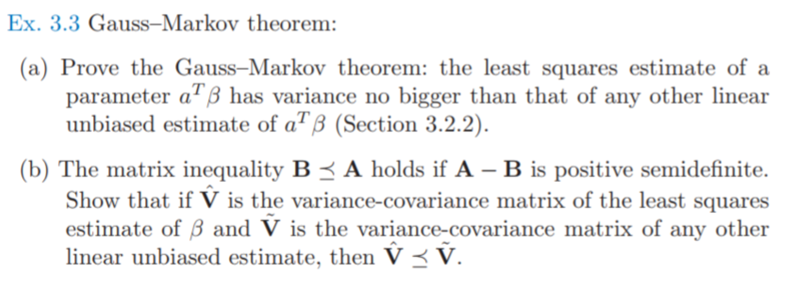
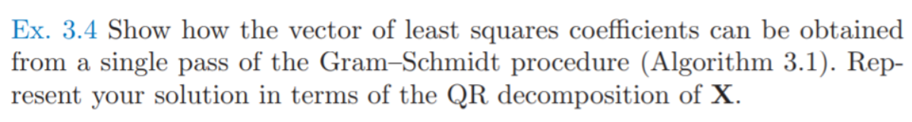
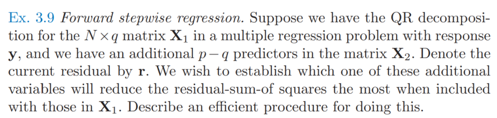
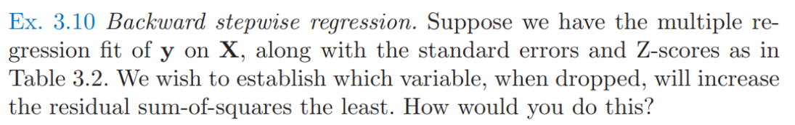
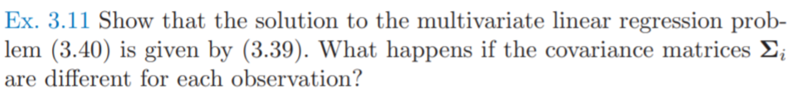

# 习题

## Ex 3.3

* 题目：

* 第一问
  * 首先证明$c^TX=x^T$
    $$
  \because\ \forall \beta,E(c^Ty)=c^TE(y)=c^TX\beta=x^T\beta \\
  \therefore c^TX=x^T
    $$
  * $c^Ty$的方差可以表示为
    $$
    Var(c^Ty）=E(c^Tyy^Tc)-E(c^Ty)E(y^Tc)
    \\ = c^TE(yy^T)c-c^TE(y)E(y^T)c
    \\ = c^TE((y-E(y))(y-E(y))^T)c
    \\ =c^TCov(y)c =\sigma^2 c^Tc
    $$

  * $x^T\hat\beta$的方差可以表示为
    $$
    Var(x^T\hat\beta)=Var(x^T(X^TX)^{-1}X^Ty)=\sigma^2x^T(X^TX)^{-1}X^T(x^T(X^TX)^{-1}X^T)^T
    $$

  * 则
    $$
    Var(c^Ty)-Var(x^T\hat\beta)\\
    =\sigma^2(c-X(X^TX)^{-1}x)^T(c+X(X^TX)^{-1}x)\\
    =\sigma^2((I-X(X^TX)^{-1}X^T)c)^T((I+X(X^TX)^{-1}X^T)c\\
    =\sigma^2c^T(I-X(X^TX)^{-1}X^T)^T(I-X(X^TX)^{-1}X^T)c\\
    =\sigma^2c^T(I-X(X^TX)^{-1}X^T)c\\
    =\sigma^2c^T(I-X(X^TX)^{-1}X^T)^T(I-X(X^TX)^{-1}X^T)c\ \because H=I-X(X^TX)^{-1}X^T 半正定，且H^2=H\\
    =\sigma^2((I-X(X^TX)^{-1}X^T)c)^T(I-X(X^TX)^{-1}X^T)c\ge 0
    $$

* 第二问
  $$
  Var(x^T\hat\beta)\le Var(x^T\overline\beta)\\
  x^TCov(\hat\beta)x\le x^TCov(\overline \beta)x\\
  x^T(Cov(\hat\beta)x-Cov(\overline \beta))x\le 0\\
  Cov(\hat\beta)x\le Cov(\overline \beta)
  $$
  

## Ex 3.4

* 题目：

* 知识：

  * $QR$分解：将矩阵分解为正交矩阵和上三角矩阵的乘积，事实上就是施密特正交化的过程

* 求解：
  * 首先进行$QR$分解
    $$
    (x_0,x_1,\dots,x_p)
    \\=(z_0,z_1,\dots,z_p)\left(
    \begin{matrix}
    1&\hat\gamma_{01}&\hat\gamma_{02}&\dots&\hat\gamma_{0p}\\
    &1&\hat\gamma_{12}&\dots&\hat\gamma_{1p}\\
    &&1&\dots&\hat\gamma_{2p}\\
    &&&\ddots&\vdots\\
    &&&&1
    \end{matrix}
    \right)
    \\=(\frac{z_0}{\|z_0\|},\frac{z_1}{\|z_1\|},\dots,\frac{z_p}{\|z_p\|})\left(
    \begin{matrix}
    \|z_0\|&\hat\gamma_{01}\|z_0\|&\hat\gamma_{02}\|z_0\|&\dots&\hat\gamma_{0p}\|z_0\|\\
    &\|z_1\|&\hat\gamma_{12}\|z_1\|&\dots&\hat\gamma_{1p}\|z_1\|\\
    &&\|z_2\|&\dots&\hat\gamma_{2p}\|z_2\|\\
    &&&\ddots&\vdots\\
    &&&&\|z_p\|
    \end{matrix}
    \right)
    \\=QR
    $$

  * 因此，$X\beta=y$等价于
    $$
    QR\beta=y\\
    R\beta=Q^Ty
    $$

  * 由于$R​$是上三角矩阵，所以很容易求解

    * $\|z_p\|\hat\beta_p=\frac{z_p^T}{\|z_p\|}y​$, 可得$\hat\beta_p =\frac{<z_p,y>}{<z_p,z_p>}​$

    * 若已经求出$\hat\beta_{k+1}​$, 则有
      $$
      \|z_k\|(\hat\beta_{k}+\sum_{j=k+1}^p\gamma_{kj}\hat\beta_j)=\frac{z_k^T}{\|z_k\|}y\\
      \hat\beta_k=\frac{<z_k,y>}{<z_k,z_l>}-\sum_{j=k+1}^p\gamma_{kj}\hat\beta_j)
      $$
      

## Ex 3.9

* 题目：

  

* 解(TODO)：

  

## Ex 3.10

* 题目：

* 解(TODO)：

## Ex 3.11

* 题目：

* 第一问：
  * 解法1:
    * $RSS$ 的公式可以转化为非加权的情况
      $$
    RSS(B;Z)=\sum_{i=1}^N(y_i-f(x_i))^T\Sigma^{-1}(y_i-f(x_i))
    \\=tr[(Y-XB)\Sigma^{-1}(Y-XB)^T]\because 矩阵分块
    \\=tr[(Y-XB){\Sigma^{-1/2}}^T\Sigma^{-1/2}(Y-XB)^T]\because 协方差矩阵特征值分解
    \\=tr[(Y{\Sigma^{-1/2}}^T-XB{\Sigma^{-1/2}}^T)(Y{\Sigma^{-1/2}}^T-XB{\Sigma^{-1/2}}^T)^T]
      $$
    * 然后根据原来非加权求解公式
      $$
      \hat B=(X^TX)^{-1}X^TY
      $$
    * 可得
      $$
    \hat B{\Sigma^{-1/2}}^T=(X^TX)^{-1}X^TY{\Sigma^{-1/2}}^T\\
    \hat B=(X^TX)^{-1}X^TY
      $$

  * 解法2:

    * $RSS$公式可以看作
      $$
      RSS(B;Z)=\sum_{i=1}^N(y_i-f(x_i))^T\Sigma^{-1}(y_i-f(x_i))
      \\ =tr[(Y-XB)\Sigma^{-1}(Y-XB)^T]\because 矩阵分块
      $$

    * 求微分
      $$
      dRSS=tr((-XdB)\Sigma^{-1}(Y-XB)^T+(Y-XB)\Sigma^{-1}(-XdB)^T)
      \\ =tr(\Sigma^{-1}(Y-XB)^T(-XdB)+(-XdB)^T(Y-XB)\Sigma^{-1})
      \\ =tr(\Sigma^{-1}(Y-XB)^T(-XdB)+\Sigma^{-1}(Y-XB)^T(-XdB))
      \\ =tr(-2(X^T(Y-XB)\Sigma^{-1})^TdB)
      $$

    * 可以得出导数为
      $$
      \frac{\part RSS}{\part B}=-2(X^T(Y-XB)\Sigma^{-1}) =0
      \\ \rightarrow X^T(Y-XB)\Sigma^{-1}=0
      \\ \rightarrow X^T(Y-XB)=0\ \because \Sigma^{-1} 可逆
      \\ \rightarrow B=(X^TX)^{-1}X^TY
      $$
      

* 第二问(TODO)：

  * 定义：

    * 矩阵向量化$Vec$运算符
      $$
      Vec(X) = [X_{11},...,X_{m1}, X_{12},...,X_{m2}, ...., X_1n,...,X_{mn}]^T
      $$

    * $K_{mn}​$ 是交换矩阵,将按列优先的向量化变为按行优先的向量化，例如
      $$
      Vec(A^T)=K_{mn}Vec(A)\\
      
      \\K_{23} =
      \left[
      \begin{matrix}
      1 & 0 & 0 & 0 & 0 & 0\\
      0 & 0 & 1 & 0 & 0 & 0\\
      0 & 0 & 0 & 0 & 1 & 0\\
      0 & 1 & 0 & 0 & 0 & 0\\
      0 & 0 & 0 & 1 & 0 & 0\\
      0 & 0 & 0 & 0 & 0 & 1
      \end{matrix}
      
      \right]
      ,
      Vec(A^T) = 
      \left[
      \begin{matrix}
      A_{11} \\ A_{12} \\ A_{13} \\
      A_{21} \\ A_{22} \\ A_{23}
      \end{matrix}
      \right]
      ,
      Vec(A) = 
      \left[
      \begin{matrix}
      A_{11} \\ A_{21} \\ A_{12} \\
      A_{22} \\ A_{13} \\ A_{23}
      \end{matrix}
      \right]
      $$
      且有$K_{mn} = K_{nm}^T, K_{mn}K_{nm} = I$

    * $\otimes$是$kronecker$积

  * 对公式进行变换得到
    $$
    RSS(B;Z)=\sum_{i=1}^N(y_i-f(x_i))^T\Sigma_i^{-1}(y_i-f(x_i))
    \\=Vec((Y-XB)^T)^T\left(
    \begin{matrix}
    \Sigma_1^{-1} & 0 & 0 & \dots & 0\\
    0 & \Sigma_2^{-1} & 0 & \dots & 0\\
    0 & 0 & \Sigma_3^{-1} & \dots & 0\\
    0 & 0 & 0 & \ddots & \vdots\\
    0 & 0 & 0 & 0 & \Sigma_N^{-1}\\
    \end{matrix}
    \right) Vec((Y-XB)^T)
    \\=[K_{Nk}Vec(Y)-K_{Nk}(I_k\otimes X)Vec(B)]^T
    \\ diag({\Sigma_1}^{-1},{\Sigma_2}^{-1},\dots,{\Sigma_N}^{-1})
    \\ [K_{Nk}Vec(Y)-K_{Nk}(I_k\otimes X)Vec(B)]
    $$

  * 求微分
    $$
    dRSS=d([K_{Nk}Vec(Y)-K_{Nk}(I_k\otimes X)Vec(B)]^Tdiag({\Sigma_1}^{-1},{\Sigma_2}^{-1},\dots,{\Sigma_N}^{-1}) \\ [K_{Nk}Vec(Y)-K_{Nk}(I_k\otimes X)Vec(B)])
    
    \\=[-K_{Nk}(I_k\otimes X)dVec(B)]^Tdiag({\Sigma_1}^{-1},{\Sigma_2}^{-1},\dots,{\Sigma_N}^{-1}) \\ [K_{Nk}Vec(Y)-K_{Nk}(I_k\otimes X)Vec(B)]
    \\+[K_{Nk}Vec(Y)-K_{Nk}(I_k\otimes X)Vec(B)]^T diag({\Sigma_1}^{-1},{\Sigma_2}^{-1},\dots,{\Sigma_N}^{-1})\\ [-K_{Nk}(I_k\otimes X)dVec(B)]
    \\=-2[K_{Nk}Vec(Y)-K_{Nk}(I_k\otimes X)Vec(B)]^Tdiag({\Sigma_1}^{-1},{\Sigma_2}^{-1},\dots,{\Sigma_N}^{-1})\\K_{Nk}(I_k\otimes X)dVec(B)
    \\=[-2(I_k\otimes X^T)K_{kN}diag({\Sigma_1}^{-1},{\Sigma_2}^{-1},\dots,{\Sigma_N}^{-1})[K_{Nk}Vec(Y)-K_{Nk}(I_k\otimes X)Vec(B)]]^T\\dVec(B)
    $$

  * 可得
    $$
    \frac{\part RSS}{\part Vec(B)}
    \\=-2(I_k\otimes X^T)K_{kN}diag({\Sigma_1}^{-1},{\Sigma_2}^{-1},\dots,{\Sigma_N}^{-1})[K_{Nk}Vec(Y)-K_{Nk}(I_k\otimes X)Vec(B)]=0
    \\ \rightarrow -2(I_k\otimes X^T)K_{kN}diag({\Sigma_1}^{-1},{\Sigma_2}^{-1},\dots,{\Sigma_N}^{-1})K_{Nk}[Vec(Y)-(I_k\otimes X)Vec(B)]=0
    $$

  * 由于$(I_k\otimes X^T)$是行满秩，而列不满秩，且列秩和行秩均为为$kp$，因此$-2(I_k\otimes X^T)K_{kN}diag({\Sigma_1}^{-1},{\Sigma_2}^{-1},\dots,{\Sigma_N}^{-1})K_{Nk}$的秩也为$kp $

  * 因此，$Vec(Y)-(I_k\otimes X)Vec(B)$有$kN-kp$个线性无关的非0解，则解空间$S$可以表示为($c_i​$是解空间基向量)
    $$
    S=
    \{x|x=\sum_{i=1}^{kN-kp}k_ic_i\}
    $$

  * 因此有
    $$
    Vec(Y)-(I_k\otimes X)Vec(B)=\sum_{i=1}^{kN-kp}k_ic_i\\
    (I_k\otimes X)Vec(B)=Vec(Y)-\sum_{i=1}^{kN-kp}k_ic_i\\
    Vec(B) = ((I_k\otimes X)^T(I_k\otimes X))^{-1}(I_k\otimes X)^T(Vec(Y)-\sum_{i=1}^{kN-kp}k_ic_i)\ \because (I_k\otimes X)列满秩
    $$

  * 因此可以得出结论，$B​$的最优解有多个

    

  

  