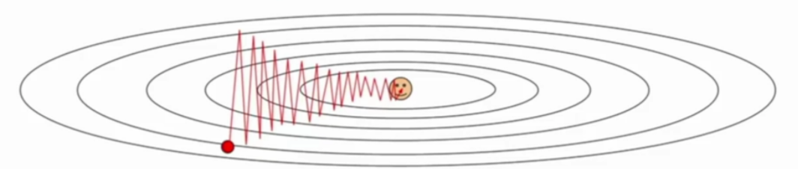
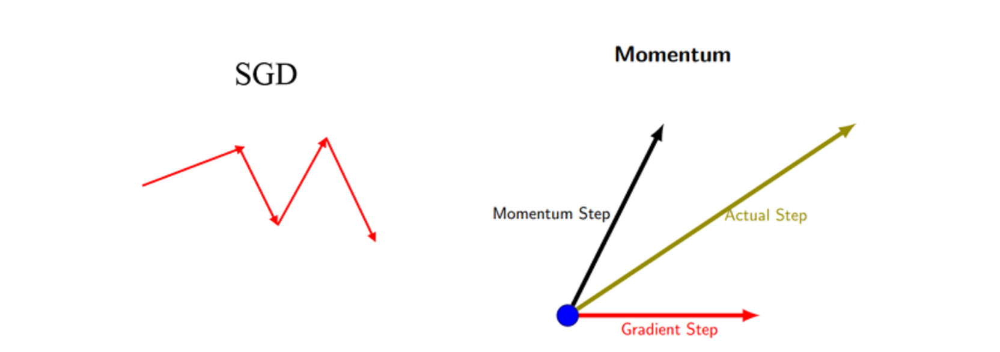
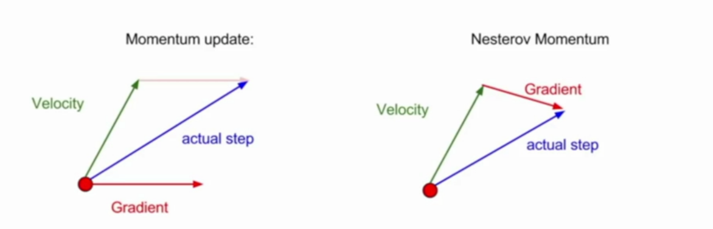

# 常用优化算法

## 1 SGD

* 随机梯度下降 （Stochastic Gradient Descent）

  * 公式
    $$
    g_t =  \nabla_{\theta}L(f(x^i;\theta_{t-1}), y^i)\\
    \theta_t = \theta_{t-1} - \mu g_t
    $$

  * 缺点：容易收敛到局部最优，并且容易被困在鞍点

* 小批量梯度下降 （Mini-batch Gradient Descent）

  * 公式
    $$
    g_t = \frac{1}{m} \nabla_\theta \sum_i L(f(x^i;\theta_{t-1}), y^i)\\
    \theta_t = \theta_{t-1}-\mu g_t
    $$

  * 自适应学习率：

    * 模拟退火算法：预先定义一个迭代次数m，每执行完m次训练便减小学习率，或者当cost function的值低于一个阈值时减小学习率
    * 线性衰减学习率，直到$\tau$次迭代，在 $\tau$ 之后，学习率一般保持常数$\mu_{\tau}$

      $$
      \mu_t = (1-\frac{t}{\tau})\mu_0
      $$

## 2 Momentum

* 解决问题

  * 使用SGD训练参数时，有时候会下降的非常慢，并且可能会陷入到局部最小值中（鞍点）

  * 动量的引入就是为了加快学习过程，特别是对于高曲率、小但一致的梯度，或者噪声比较大的梯度能够很好的加快学习过程

  * 为了解决Hessian矩阵病态条件问题（直观上讲就是梯度高度敏感于参数空间的某些方向）。呈“之”字型，迂回前进，损失函数值在一些维度的改变得快（更新速度快），在一些维度改变得慢（速度慢）- 在高维空间更加普遍

    

    

* 公式
  $$
  g_t = \frac{1}{m} \nabla_\theta \sum_i L(f(x^i;\theta_{t-1}), y^i)\\
  v_t = \alpha v_{t-1} - \mu g_t \\
  \theta_t = \theta_{t-1} + v_t
  $$

* 直观解释：

  * 动量的主要思想是积累了之前梯度指数级衰减的移动平均（前面的指数加权平均）

    

  * 最直观的理解就是，若当前的梯度方向与累积的历史梯度方向一致，则当前的梯度会被加强，从而这一步下降的幅度更大。若当前的梯度方向与累积的梯度方向不一致，则会减弱当前下降的梯度幅度。

* 最大下降速度：若每个时刻的梯度$g$总是类似，那最大的下降速度为
  $$
  \mu g\sum_{i=0}^{\infin}\alpha^i=\frac{\mu g}{1-\alpha}
  $$
  

## 3 Nesterov Momentum

* 在Nesterov Momentum中，先沿着之前积累的梯度走一步，然后再计算这一步的终点的梯度，利用该梯度进行校正，得到最终的更新方向。

* 与Momentum的区别
  * 在Momentum中，t时刻的下降方向，不仅由当前点的梯度方向决定，还由此前的累积的梯度来决定；
  * 在Nesterov Momentum中，t时刻的下降方向，取决于之前积累的梯度和根据之前积累梯度走到的位置的梯度
  * 

* 公式
  $$
  g_t = \frac{1}{m} \nabla_\theta \sum_i L(f(x^i;\theta_{t-1}+\alpha v_{t-1}), y^i)\\
  v_t = \alpha v_{t-1} - \mu g_t \\
  \theta_t = \theta_{t-1} + v_t
  $$
  

## 4 AdaGrad

* 自适应梯度下降（Adaptive Gradient）

* 设置全局学习率之后，每次通过全局学习率逐参数的除以历史梯度平方和的平方根，使得每个参数的学习率不同。在参数空间更为平缓的方向，会取得更大的进步（因为平缓，所以历史梯度平方和较小，对应学习下降的幅度较小）

* 公式($\mu$:学习率， $\delta$:小常数，为了稳定数值大约为$10^{-7}$)：
  $$
  g_{t} = \frac{1}{m} \nabla_\theta \sum_i L(f(x^i;\theta_{t-1}), y^i)\\
  r_{t} = r_{t-1} + g_t\odot g_t\\
  \theta_{t} = \theta_{t-1} - \frac{\mu}{\delta + \sqrt{r_t}}\odot g_t
  $$

* 优点：对于梯度较大的参数，$r_t​$比较大，则$\frac{\mu}{\delta + \sqrt{r_t}}​$较小，则学习率会比较小。对于梯度较小的参数，则效果相反。可以使得参数在平缓的地方下降稍微快些，不至于徘徊不前

* 缺点：由于是累计梯度平方，$\frac{\mu}{\delta + \sqrt{r_t}}$后面可能会趋近于0，使得梯度消失

## 5 RMSProp

* 均方根传播（Root Mean Square Prop):RMSProp在非凸条件下结果更好，改变梯度累积为指数衰减的移动平均以丢弃遥远的过去历史。

* 相比于AdaGrad的历史梯度，RMSProp增加了一个衰减系数来控制历史信息的获取多少:
  $$
  r_{t} = \rho r_{t-1} + (1-\rho)g_t\odot g_t\\
  $$

* 原始：RMSProp

  相比于AdaGrad的历史梯度，RMSProp增加了一个衰减系数来控制历史信息的获取多少:
  $$
  r_{t} = \rho r_{t-1} + (1-\rho)g_t\odot g_t\\
  $$

* 结合Nesterov动量的RMSProp

  * RMSProp改变了学习率，Nesterov引入动量改变了梯度

  * 公式
    $$
    g_{t} = \frac{1}{m} \nabla_\theta \sum_i L(f(x^i;\theta_{t-1}+\alpha v_{t-1}), y^i)\\
    r_{t} = \rho r_{t-1} + (1-\rho)g_t\odot g_t\\
    v_t = \alpha v_{t-1} - \frac{\mu}{\delta + \sqrt{r_t}}\odot g_t\\
    \theta_{t} = \theta_{t-1} + v_t
    $$
    

## 6 Adam

* 自适应矩估计（Adaptive Moment Estimation）：将Momentum和RMSprop结合在一起，引入一阶动量和二阶动量，利用梯度的一阶矩估计和二阶矩估计动态调整每个参数的学习率

* 公式($\rho_1:0.9, \rho_2:0.99 $)
  $$
  g_{t} = \frac{1}{m} \nabla_\theta \sum_i L(f(x^i;\theta_{t-1}), y^i)\\
  s_t = \rho_1 s_{t-1}+(1-\rho_1)g_t\\
  r_{t} = \rho_2 r_{t-1} + (1-\rho_2)g_t\odot g_t\\
  \hat s_t = \frac{s_t}{1-\rho_1^t}\\
  \hat r_t = \frac{r_t}{1-\rho_2^t}\\
  \theta_t = \theta_{t-1} - \frac{\mu}{\delta + \sqrt{\hat r_t}}\odot \hat s_t
  $$

* 偏差修正(以$s_t$为例)
  $$
  s_t = (1-\rho_1)\sum_{i=1}^t\rho_1^{t-i}g_i\\
  E(s_t) = E((1-\rho_1)\sum_{i=1}^t\rho_1^{t-i}g_i)
  \\ = (1-\rho_1)E(\sum_{i=1}^t\rho_1^{t-i}g_t)+\zeta
  \\ = (1-\rho_1)\frac{1-\rho_1^t}{1-\rho_1}g_t + \zeta
  \\ = (1-\rho_1^t)g_t+\zeta
  $$
  

  由于$\rho_1$较小，所以$g_i$举例$g_t$较远时影响很小，所以$\zeta$的值也很小。因此可以除以$1-\rho_1^t$来修正