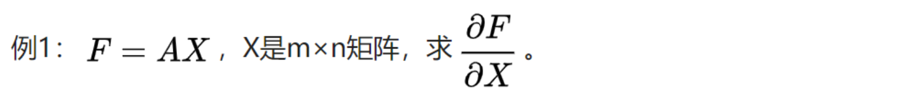
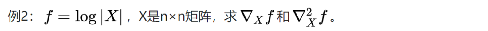
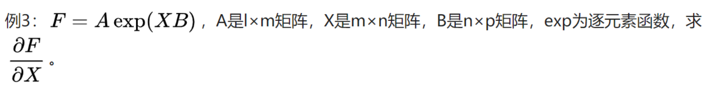
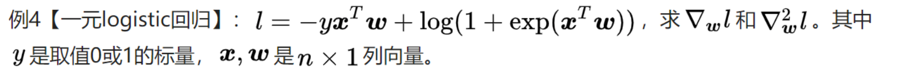
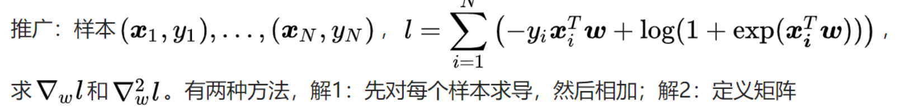
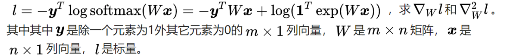

# 矩阵函数矩阵求导方法

## 1 向量对向量的导数

1. 定义(即为jacobi矩阵)

$$
\frac{\part f_{p\times1}}{\part x_{\times_{m\times1}}} = \left[
\begin{matrix}
\frac{f_1}{x_1} & \frac{f_2}{x_1} & ... & \frac{f_p}{x_1} \\ 
\frac{f_1}{x_2} & \frac{f_2}{x_2} & ... & \frac{f_p}{x_2} \\ 
... & ... & ... & ... \\ 
\frac{f_1}{x_m} & \frac{f_2}{x_m} & ... & \frac{f_p}{x_m} \\ 
\end{matrix}
\right]_{m\times p} 
\\
df = \frac{\part f}{\part x}^Tdx
$$

* 注意，这里是根据标量对向量的求导发展而来的。

## 2 矩阵对矩阵的导数

### 2.1 矩阵的向量化

1. 定义

$$
Vec(X) = [X_{11},...,X_{m1}, X_{12},...,X_{m2}, ...., X_1n,...,X_{mn}]^T
$$

​	为矩阵的向量化

### 2.2 矩阵的导数

1. 定义
   $$
   \frac{\part F}{\part X} = \frac{\part Vec(F)}{\part Vec(X)}_{mn\times pq}
   $$

2. 导数与微分的联系
   $$
   Vec(dF) = \frac{\part F}{\part X}^T Vec(dX)
   $$

3. 说明

* 此定义和标量对矩阵求导定义不兼容，此处为$mn\times1$的向量，记前文矩阵为$\nabla_Xf$，其大小为$m\times n$, 有$\frac{\part F}{\part X} = Vec(\nabla_Xf)$。
* 标量对矩阵的二阶导数，即$Hessian​$矩阵，定义为​$\nabla_X^2f = \frac{\part^2 f}{\part X^2}_{mn\times mn}​$,这是个对称矩阵。对于向量​$\frac{\part f}{\part X}​$或者举着​$\nabla_Xf​$求导都可以，但是从​$\nabla _Xf​$求更方便。
* $\frac{\part F}{\part X}=\frac{\part Vec(F)}{\part X} =  \frac{\part F}{\part Vec(X)} = \frac{\part Vec(F)}{\part Vec(X)}$, 求导时矩阵被向量化，弊端是这在一定程度破坏了矩阵的结构，会导致结果变得形式复杂；好处是多元微积分中关于梯度、Hessian矩阵的结论可以沿用过来，只需将矩阵向量化。比如在牛顿法更新$\nabla X$，满足$Vec(\Delta X) = - (\nabla_X^2f)^{-1}Vec(\nabla_Xf)​$。
* 在资料中，矩阵对矩阵的导数还有其它定义，比如$\frac{\part F}{\part X} = \left[ \frac{\part F_{kl}}{\part X} \right]_{mp\times nq}$, $\frac{\part F}{\part X} = \left[ \frac{\part F }{\part X_{ij}} \right]_{mp\times nq}$, 它能兼容上篇中的标量对矩阵导数的定义，但微分与导数的联系不够简明，不便于计算和应用。

### 2.3 运算法则

#### 2.3.1 向量化技巧

1. 线性：$Vec(A+B) = Vec(A) + Vec(B)​$

2. 矩阵乘法:
   $$
   Vec(AXB)=(B^T\otimes A)Vec(X)
   $$

* 证明：
  $$
  对于向量:Vec(ab^T) = b\otimes a\\
  令B=[b_1, b_2,...,b_q], 并且e_1, e_2,...,e_q是p\times 1的基本向量\\
  B = \sum_{i = 1}^q b_i e_i^T\\
  Vec(ABC) = Vec(\sum_{i =1}^q Ab_ie_i^TC)
  \\= \sum_{i=1}^q Vec((Ab_i)(C^Te_i)^T)
  \\= \sum_{i = 1}^q (C^Te_i)\otimes (Ab_i)) 
  \\ = (C^T\otimes A)\sum_{i=1}^q(e_i\otimes b_i)
  \\ = (C^T\otimes A)Vec(B)
  $$

* 特例：
  $$
  Vec(A_{mn}B_{np}) =(I_p\otimes A)Vec(B)=(B^T\otimes A)Vec(I_n)=(B^T\otimes I_m)Vec(A)
  $$
  

3. 转置

* $$
  Vec(A^T)=K_{mn}Vec(A)\\
  K_{mn}(mn\times mn)是交换矩阵,将按列优先的向量化变为按行优先的向量化。
  \\K_{23} =
  \left[
  \begin{matrix}
  1 & 0 & 0 & 0 & 0 & 0\\
  0 & 0 & 1 & 0 & 0 & 0\\
  0 & 0 & 0 & 0 & 1 & 0\\
  0 & 1 & 0 & 0 & 0 & 0\\
  0 & 0 & 0 & 1 & 0 & 0\\
  0 & 0 & 0 & 0 & 0 & 1
  \end{matrix}
  
  \right]
  ,
  Vec(A^T) = 
  \left[
  \begin{matrix}
  A_{11} \\ A_{12} \\ A_{13} \\
  A_{21} \\ A_{22} \\ A_{23}
  \end{matrix}
  \right]
  ,
  Vec(A) = 
  \left[
  \begin{matrix}
  A_{11} \\ A_{21} \\ A_{12} \\
  A_{22} \\ A_{13} \\ A_{23}
  \end{matrix}
  \right]
  $$

4. 逐元素乘法

* $Vec(A\odot B)=diag_{mn\times mn}(A)Vec(B)$, 其中$diag(A)$是$A$按列优先限排成的对角阵

5. 注意：若矩阵函数F是矩阵X经加减乘法、逆、行列式、逐元素函数等运算构成，则使用相应的运算法则对F求微分，再做向量化并使用技巧将其它项交换至$vec(dX)$左侧，对照导数与微分的联系$Vec(dF) = \frac{\part F}{\part X}^T Vec(dX)$。特别地，若矩阵退化为向量，对照导数与微分的联系$df = \frac{\part f}{\part x}^Tdx$,即能得到导数。

#### 2.3.2 链式法则

* 已知$\frac{\part F}{\part Y}​$, 且$Y​$是X的函数，如何求$\frac{\part F}{\part X}​$呢？
  $$
  Vec(dF)=\frac{\part F}{\part Y}^TVec(dY)
  \\ = \frac{\part F}{\part Y}^T \frac{\part Y}{\part X}^TVec(dX)
  \\ = (\frac{\part Y}{\part X}\frac{\part F}{\part Y})^TVec(dX)
  \\ \longrightarrow \frac{\part F}{\part X} = \frac{\part Y}{\part X}\frac{\part F}{\part Y}
  $$
  

#### 2.3.3 Kronecker积和交换矩阵恒等式

1. $(A\otimes B)^T = A^T\otimes B^T​$

   证明：
   $$
   \left[
   \begin{matrix}
   a_{11}B & a_{12}B \\ 
   a_{21}B & a_{22}B
   \end{matrix}
   \right]^T
   =\left[
   \begin{matrix}
   a_{11}B^T & a_{21}B^T \\ 
   a_{12}B^T & a_{22}B^T
   \end{matrix}
   \right]
   =A^T\otimes B^T
   $$

2. $Vec(ab^T) = b \otimes a$

3. $(A\otimes B)(C \otimes D) = (AC)\otimes(BD)$

   证明：
   $$
   设：F=D^TB^TXAC\\
   Vec(dF) = Vec(d(D^TB^TXAC))
   \\=Vec(D^TB^TdXAC)
   \\=((AC)^T\otimes (BD)^{T})Vec(dX)
   \\ = ((AC)^T\otimes (BD)^{T})Vec(dX)
   \\ = ((AC) \otimes (BD))^{T}Vec(dX)
   \\ \longrightarrow \frac{\part F}{\part X} = (AC) \otimes (BD)
   \\设置 Y = B^TXA, 则\frac{\part F}{\part Y} = C \otimes D, \frac{\part Y}{\part X} = A \otimes B
   \\根据链式法则:(AC)\otimes(DB) = (A\otimes B)(C\otimes D)
   $$

4. $K_{mn} = K_{nm}^T, K_{mn}K_{nm} = I​$

   证明：
   $$
   Vec(A^T)=K_{mn}Vec(A) \\
   Vex(A) = K_{mn}^{-1}Vec(A^T)\\
   \longrightarrow K_{nm} = K_{mn}^{-1}
   \\因为K_{nm}每一行有且只有一个1，所以是正交矩阵，K_{mn}=K_{nm}^T且K_{nm}K_{nm}^T=I
   $$

5. $K_{pm}(A\otimes B)K_{nq} = B \otimes A， A是m\times n矩阵，B是p\times q矩阵$

   证明：
   $$
   Vec(AXB^T)=(B\otimes A)Vec(X) 
   \\= K_{pm}Vec(BX^TA^T)
   \\=K_{pm}(A\otimes B)Vec(X^T)
   \\=K_{pm}(A\otimes B)K_{pq}Vec(X)
   $$
   

### 2.4 例题

1. 
   $$
   Vec(dF) = Vec(d(AX)) = Vec(AdX)=(I\otimes A)Vec(dX)
   \\ \longrightarrow \frac{\part F}{\part X} = I \otimes A
   $$
   

* 如果退化向量
  $$
  dF = (A^T)^TX\longrightarrow \frac{\part F}{\part X} = A^T
  $$
  

2. 
   $$
   df = \frac{1}{|X|}|X|tr(X^{-1}dX) = tr(((X^{-1})^T)^TdX)
   \\ p = \frac{\part f}{\part X} = (X^{-1})^T
   \\ Vec(dp) = Vec(d(X^{-1})^T)
   \\ = Vec((-X^{-1}dXX^{-1})^T)
   \\ = -K_{nn}Vec(X^{-1}dXX^{-1})
   \\ = -K_{nn}((X^{-1})^T\otimes X^{-1})Vec(dX)
   \\ = -((X^{-1}\otimes (X^{-1})^TK_{nn})^TVec(dX)
   $$
   

3. 

* $$
  Vec(dF) = Vec(A(exp(XB)\odot (dXB))) 
  \\= (I_p\otimes A)diag(exp(XB))Vec(dXB)
  \\= (I_p\otimes A)diag(exp(XB))(B^T\otimes I_m)Vec(dX)
  \\ = ((B\otimes I_m)diag(exp(XB))(I_p\otimes A^T))^TVec(dX)
  \\ \longrightarrow \frac{\part F}{\part A} = (B\otimes I_m)diag(exp(XB))(I_p\otimes A^T)
  $$

4. 

* $$
  dl = -yx^Tdw+\frac{exp(x^Tw)x^Tdw}{1+exp(x^Tw)}
  \\ = x^T(\sigma(x^Tw) - y)dw
  \\ p = \frac{\part l}{\part w} = x(\sigma(x^Tw) - y)
  \\ dp = x\sigma'(x^Tw)x^Tdw = (xx^T\sigma'(x^Tw))Tdw
  \\ \longrightarrow \frac{\part^2 l}{\part w^2} = (B\otimes I_m)diag(exp(XB))(I_p\otimes A^T)
  $$

* 
  $$
  X = 
  \left[
  \begin{matrix}
  x_1^T \\
  x_2^T \\
  ... \\\
  x_n^T
  \end{matrix}
      
  \right]
  ,
  y = 
  \left[
  \begin{matrix}
  y_1 \\
  y_2 \\
  ... \\\
  y_n
  \end{matrix}
  \right]
  \\
  l = -y^TXw + 1^Tlog(1+exp(Xw))\\
  dl = tr(-y^TXdw)+tr(1^T(\frac{exp(Xw)}{1+exp(Xw)}\odot (Xdw)))
  \\ = tr(X^T(\sigma(Xw)-y)^Tdw)
  \\ \longrightarrow p = \frac{\part l}{\part w} = X^T(\sigma(Xw)-y)
  \\ dp = X^T(\sigma'(Xw)\odot (Xdw))=X^Tdiag(\sigma'(Xw))Xdw
  \\ = (X^Tdiag(\sigma'(Xw))X)dw
  \\ \longrightarrow \frac{\part^2 l}{\part w^2} = X^Tdiag(\sigma'(Xw))X
  $$
  

5. 
   $$
   g=\frac{\part l}{\part W} = (softmax(Wx)-y)x^T\\
   a = Wx\\
   dg = d((softmax(a)-y)x^T)
   \\ = dsoftmax(a)x^T
   \\ = \frac{(e^a\odot da)1^Te^a-e^a1^T(e^a\odot da)}{(1^Te^{a})^2}x^T
   \\ = \left(\frac{(e^a\odot da)}{1^Te^{a}}-\frac{e^a1^T(e^a\odot da)}{(1^Te^{a})^2}\right)x^T
   \\ = \left(\frac{diag(e^a)}{1^Te^{a}}-\frac{e^a1^Tdiag(e^a)}{(1^Te^{a})^2}\right)dax^T
   \\ = (diag(softmax(a) - softmax(a)softmax(a)^T))dax^T
   \\ = (diag(softmax(a) - softmax(a)softmax(a)^T))dWxx^T
   \\ Vec(dg) 
   \\= Vec((diag(softmax(a) - softmax(a)softmax(a)^T))dWxx^T)
   \\ =(xx^T)\otimes (diag(softmax(Wx) - softmax(Wx)softmax(Wx)^T) Vec(dw)
   \\ =((xx^T)\otimes (diag(softmax(Wx) - softmax(Wx)softmax(Wx)^T))^T Vec(dw)
   \\ \longrightarrow \frac{\part^2 l}{\part W^2}=(xx^T)\otimes (diag(softmax(Wx) - softmax(Wx)softmax(Wx)^T)
   $$

* 注意，$softmax(Wx)=\frac{e^{Wx}}{1^Te^{Wx}}​$中，分母是一个常数，表示每个分子都要除以这个常数。可以证明按照$\sigma(Wx)​$的求导法则即可。
  $$
  d\frac{e^{Wx}}{1^Te^{Wx}}=d\frac{1}{1^Te^{Wx}}e^{Wx}+\frac{1}{1^Te^{Wx}}de^{Wx}
  \\=\frac{de^{Wx}1^Te^{Wx}-e^{Wx}d(1^Te^{Wx})}{(1^Te^{Wx})^2}
  $$
  

