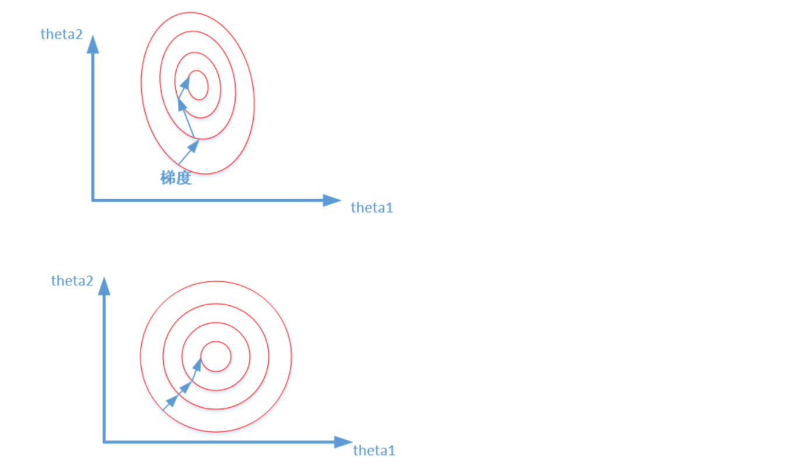

# 归一化

## 1 标准化/归一化的好处

### 1.1 提升模型精度

1. 在机器学习算法的目标函数(例如SVM的RBF内核或线性模型的l1和l2正则化)，许多学习算法中目标函数的基础都是假设所有的特征都是零均值并且具有同一阶数上的方差。如果某个特征的方差比其他特征大几个数量级，那么它就会在学习算法中占据主导位置，导致学习器并不能像我们说期望的那样，从其他特征中学习。
2. 举一个简单的例子，在KNN中，我们需要计算待分类点与所有实例点的距离。假设每个实例点（instance）由n个features构成。如果我们选用的距离度量为欧式距离，如果数据预先没有经过归一化，那么那些绝对值大的features在欧式距离计算的时候起了决定性作用

### 1.2 提升收敛速度

1. 对于线性模型，数据归一化后，最优解的寻优过程明显会变得平缓，更容易正确的收敛到最优解。

   

   前者是没有经过归一化的，在梯度下降的过程中，走的路径更加的曲折，而第二个图明显路径更加平缓，收敛速度更快。

## 2 标准化/归一化方法

### 2.1 StandardScaler

* 标准化数据通过减去均值然后除以方差(或标准差)，这种数据标准化方法经过处理后数据符合标准正态分布，即均值为0，标准差为1，转化函数为:
  $$
  x_{new}=\frac{x_{old}-\mu}{\sigma}
  $$

* 数据的分布本身就服从正态分布，就可以用这个方法。

* 这种方法基本可用于有outlier的情况，但是，在计算方差和均值的时候outliers仍然会影响计算。所以，在出现outliers的情况下可能会出现转换后的数的不同feature分布完全不同的情况。

### 2.2 MinMaxScaler

* 将特征缩放至特定区间,将特征缩放到给定的最小值和最大值之间，或者也可以将每个特征的最大绝对值转换至单位大小。这种方法是对原始数据的线性变换，将数据归一到[0,1]中间。
  $$
  x_{new} = \frac{x_{old} - min}{max - min}
  $$

* 这种方法有个缺陷就是当有新数据加入时，可能导致max和min的变化，需要重新定义。
* 这种方法对于outlier非常敏感，因为outlier影响了max或min值。所以这种方法只适用于数据在一个范围内分布的情况

### 2.3  RobustScaler

* 适用于数据包含许多异常值(outline)
* This Scaler removes the median（中位数） and scales the data according to the quantile range(四分位距离，也就是说排除了outliers)

### 2.4 [0, 1] 还是 [-1, 1] 

1. 在分类、聚类算法中，需要使用距离来度量相似性的时候、或者使用PCA技术进行降维的时候，StandardScaler表现更好。

   在StandardScaler中，新的数据由于对方差进行了归一化，这时候每个维度的量纲其实已经等价了，每个维度都服从均值为0、方差1的正态分布，在计算距离的时候，每个维度都是去量纲化的，避免了不同量纲的选取对距离计算产生的巨大影响。

2. 在不涉及距离度量、协方差计算、数据不符合正态分布的时候，可以使用MinMaxScaler。比如图像处理中，将RGB图像转换为灰度图像后将其值限定在[0 255]的范围。

   MinMaxScaler，其协方差产生了倍数值的缩放，因此这种方式无法消除量纲对方差、协方差的影响，对PCA分析影响巨大；同时，由于量纲的存在，使用不同的量纲、距离的计算结果会不同。

