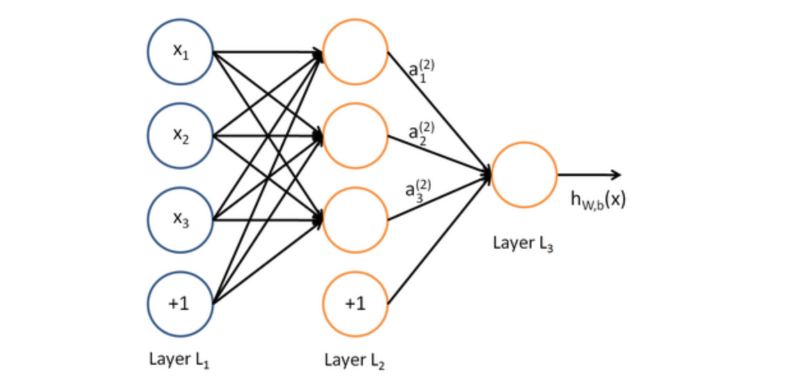
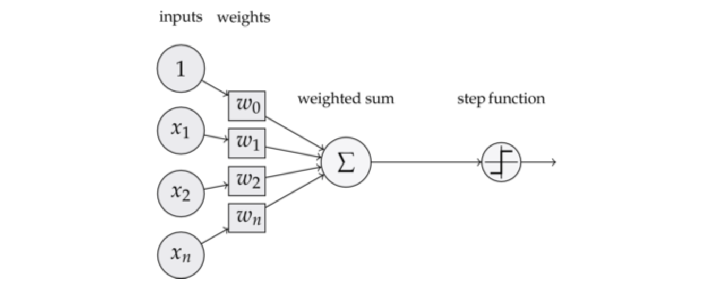

# 感知器

## 1 深度学习概念

1. 神经网络:机器学习这个方法里，有一类算法叫神经网络。

   

   每个圆圈都是一个神经元，每条线表示神经元之间的连接。我们可以看到，上面的神经元被分成了多层，层与层之间的神经元有连接，而层内之间的神经元没有连接。最左边的层叫做**输入层**，这层负责接收输入数据；最右边的层叫**输出层**，我们可以从这层获取神经网络输出数据。输入层和输出层之间的层叫做**隐藏层**。

2. 深度学习：当隐藏层比较多（大于2）的神经网络叫做深度神经网络。而深度学习，就是使用深层架构（比如，深度神经网络）的机器学习方法。

3. 深度神经网络的优点：

   深层网络能够表达力更强。事实上，一个仅有一个隐藏层的神经网络就能拟合任何一个函数，但是它需要很多很多的神经元。而深层网络用少得多的神经元就能拟合同样的函数。

4. 深度神经网络劣势：

   深层网络也有劣势，就是它不太容易训练。简单的说，你需要大量的数据，很多的技巧才能训练好一个深层网络。

## 2 感知器

### 2.1 感知器的定义

1. 神经网络的组成单元——**神经元**。神经元也叫做**感知器**。

   

2. 感知器组成

* 输入权值：一个感知器可以接收多个输入$(x_1, x_2,...,x_n\mid x_i\in\Re)$, 每个输入上有一个**权值**$w_i\in\Re$，此外还有一个**偏置项**$b \in \Re$

* 激活函数：可以选用阶跃函数$f$
  $$
  f(z)=
  \left\{
  \begin{matrix}
  1 & z > 0\\
  0 & otherwise
  \end{matrix}
  \right.
  $$

* 输出：
  $$
  y=f(w^Tx+b)
  $$

## 2.2 感知器还能做什么

1. 感知器不仅仅能实现简单的布尔运算。它可以拟合任何的线性函数，任何**线性分类**或**线性回归**问题都可以用感知器来解决。
2. 然而，感知器却不能实现异或运算，如下图所示，异或运算不是线性的，你无法用一条直线把分类0和分类1分开。

## 2.3 感知器的训练

1. 修改$w$和$b$的方法、
   $$
   w_i\gets w_i+\Delta w_i \\
   b\gets b+\Delta b
   \\其中
   \\
   \Delta w_i =\eta (t-y)x_i \\
   \Delta b = \eta (t-y)
   $$
   

   每处理一个样本就调整一次权重。经过多轮迭代后（即全部的训练数据被反复处理多轮），就可以训练出感知器的权重，使之实现目标函数。其中$\eta$称为学习速率