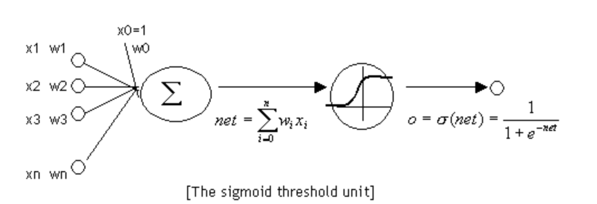
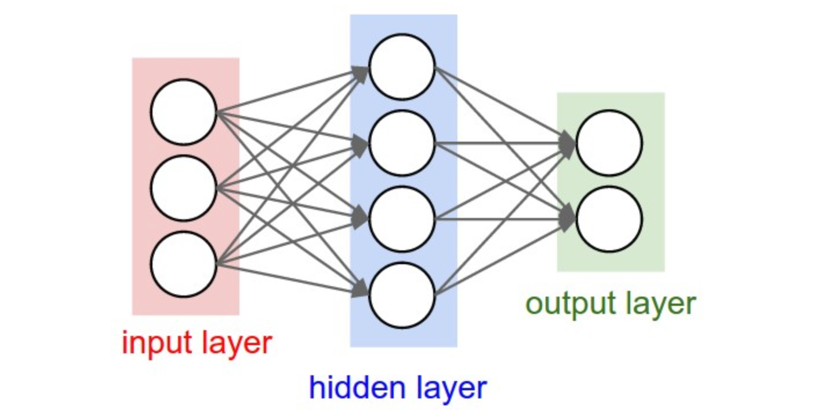
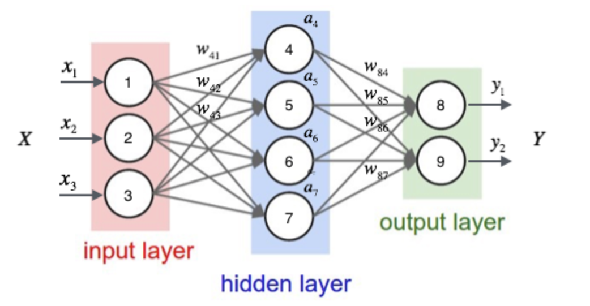
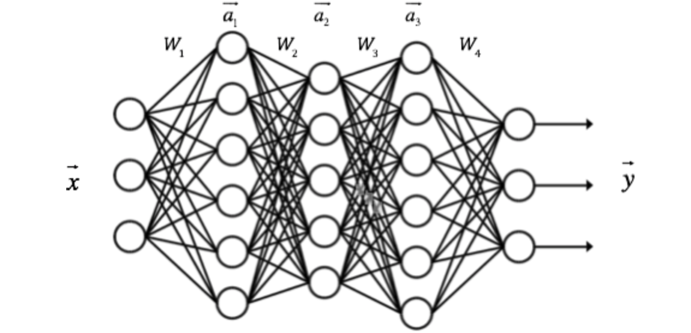
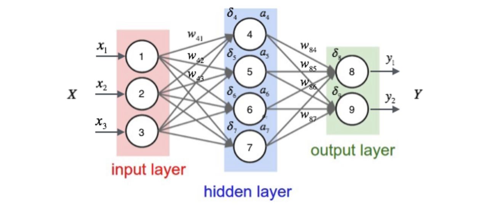
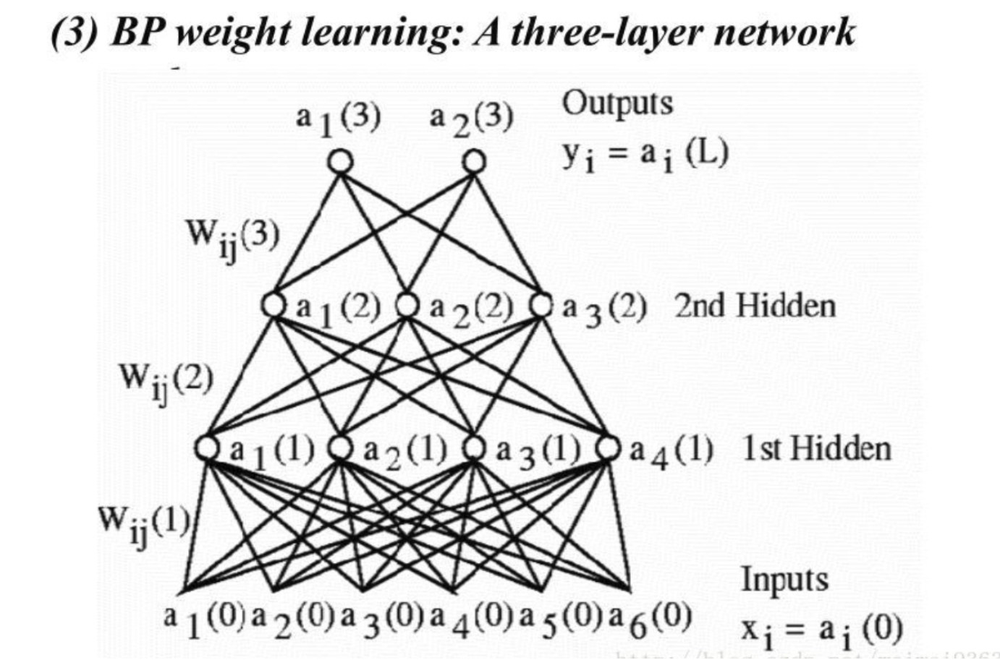

# 3 神经网络和反向传播算法

## 1 神经元

1. 神经元和感知器本质上是一样的，只不过我们说感知器的时候，它的激活函数是**阶跃函数**；而当我们说神经元时，激活函数往往选择为sigmoid函数或tanh函数。如下图所示：

  
$$
输出：y = sigmoid(\beta^Tx) = \frac{1}{1+e^{-\beta^Tx}}
$$

2. $sigmoid$函数性质
   $$
   y = sigmoid(x)\\
   y^{'}=y(1-y)
   $$
   

## 2 神经网络

1. 概念：神经网络其实就是按照**一定规则**连接起来的多个**神经元**。下图展示了一个**全连接(full connected, FC)**神经网络

   

2. 全连接神经网络

* 神经元按照**层**来布局。最左边的层叫做**输入层**，负责接收输入数据；最右边的层叫**输出层**，我们可以从这层获取神经网络输出数据。输入层和输出层之间的层叫做**隐藏层**，因为它们对于外部来说是不可见的。
* 同一层的神经元之间没有连接。
* 第N层的每个神经元和第N-1层的**所有**神经元相连(这就是full connected的含义)，第N-1层神经元的输出就是第N层神经元的输入。
* 每个连接都有一个**权值**。

## 3 神经网络的输出

1. 一般形式

  
$$
a_1 = x_1\\
a_2 = x_2\\
a_3 = x_3\\
a_4 = sigmoid(\beta_4^Tx)=sigmoid(w_{41}x_1+w_{42}x_2+w_{43}x_3+b_4)
\\a_5 = sigmoid(\beta_5^Tx)=sigmoid(w_{51}x_1+w_{52}x_2+w_{53}x_3+b_5)
\\a_6 = sigmoid(\beta_6^Tx)=sigmoid(w_{61}x_1+w_{62}x_2+w_{63}x_3+b_6)
\\a_6 = sigmoid(\beta_7^Tx)=sigmoid(w_{71}x_1+w_{72}x_2+w_{73}x_3+b_7)
\\a_8 = sigmoid(\beta_8^Tx)=sigmoid(w_{81}a_4+w_{82}a_5+w_{83}a_6+w_{84}a_7+b_8)
\\a_9 = sigmoid(\beta_9^Tx)=sigmoid(w_{91}a_4+w_{92}a_5+w_{93}a_6+w_{94}a_7+b_9)
$$

2. 向量形式

* 

  $$
  a=
  \begin{bmatrix}
  a_4 \\
  a_5 \\
  a_6 \\
  a_7 \\
  \end{bmatrix}
  \\ \qquad W=
  \begin{bmatrix}
  \beta^T_4 \\
  \beta^T_5 \\
  \beta^T_6 \\
  \beta^T_7 \\
  \end{bmatrix}=
  \begin{bmatrix}
  w_{41},w_{42},w_{43},b_{4} \\
  w_{51},w_{52},w_{53},b_{5} \\
  w_{61},w_{62},w_{63},b_{6} \\
  w_{71},w_{72},w_{73},b_{7} \\
  \end{bmatrix}
  \\ a = f(Wx) = sigmoid(Wx)
  $$

* 
  
  $$
  a=f(W_1\centerdot\vec{x})\\
  a=f(W_2\centerdot\vec{a}_1)\\
  a=f(W_3\centerdot\vec{a}_2)\\
  y=(W_4\centerdot\vec{a}_3)\\
  $$

## 4 神经网络的训练

### 4.1 反向传播算法

1. 网络结构

   

2. 假设每个训练样本为$(x,t)$, $x$是样本的特征，$t$是样本的目标值。每个节点的误差项为$\delta_i$

3. 误差计算方法

* 对于输出层节点
  $$
  \delta_i = y_i(1-y_i)(t_i-y_i)
  $$

* 对于隐藏层节点
  $$
  \delta_i=a_i(1-a_i)\sum_{k\in output}w_{ki}\delta_k
  $$
  

4. 更新权值

* 通式

  $$
  w_{ji}  =w_{ji}+\eta\delta_jx_{ji}
  $$

* 偏置项
  $$
  b_i=b_i+\eta\delta_i
  $$
  

### 4.2 推导过程

1. 反向传播算法其实就是链式求导法则的应用

2. 目标函数
   $$
   E_d=\frac{1}{2}\sum_{i\in output}(t_i-y_i)^2
   $$

3. 随机梯度下降法优化函数

* 节点$j$的加权输入$net_j​$
  $$
  net_j=\beta_j^Tx_j=\sum_{i}w_{ji}x_{ji}
  $$

* 根据链式法则
  $$
  \frac{\part E_d}{\part w_{ji}} = \frac{\part E_d}{\part net_j}\frac{\part net_j}{\part w_{ji}}
  \\ = \frac{\part E_d}{\part net_j}x_{ji}
  $$

  * 对于输出层
    $$
    \frac{\part E_d}{\part net_j} = \frac{\part E_d}{\part y_j}\frac{\part y_i}{\part net_j}
    \\ = \frac{\part E_d}{\part y_j}\frac{\part sigmoid(net_j)}{\part net_j}
    \\ = -(t_j-y_j)y_j(1-y_j)
    \\ \delta_j=-\frac{\part E_d}{\part net_j} = (t_j-y_j)y_j(1-y_j)
    \\w_{ji} \gets w_{ji}-\eta \frac{\part E_d}{\part w_{ji}}
    \\ = w_{ji}+\eta \delta_j x_{ji}
    $$

  * 对于隐藏层

    定义直接下游节点$Downstram(j)$, 可以看到$net_j$只能通过影响$Downstram(j)$再影响$E_d$。
    $$
    \frac{\part E_d}{\part net_j} = \sum_{k \in Downstram(j)}\frac{\part E_d}{\part net_k}\frac{\part net_k}{\part net_j}
    \\ = \sum_{k \in Downstram(j)}-\delta_k \frac{\part net_k}{\part a_j}\frac{\part a_j}{\part net_j}
    \\ = \sum_{k \in Downstram(j)}-\delta_k \frac{\part net_k}{\part a_j}\frac{\part sigmoid(net_j)}{\part net_j}
    \\ = \sum_{k \in Downstram(j)}-\delta_kw_{kj}a_j(1-a_j)
    \\ = -a_j(1-a_j)\sum_{k \in Downstram(j)}\delta_kw_{kj}
    \\ \delta_j=-\frac{\part E_d}{\part net_j} = a_j(1-a_j)\sum_{k \in Downstram(j)}\delta_kw_{kj}
    \\\\w_{ji} \gets w_{ji}-\eta \frac{\part E_d}{\part w_{ji}}
    \\ = w_{ji}+\eta \delta_j x_{ji}
    $$
    

### 4.3 梯度检查

1. 为了检查自己的神经网络是否正确，最重要的是检测偏导值。

2. 步骤

* 首先使用一个样本对神经网络进行训练，这样就能获得每个权重的梯度。
* 将加上一个很小的值($10^{-4}$)，重新计算神经网络在这个样本下的。
* 将减上一个很小的值(10^{-4})，重新计算神经网络在这个样本下的。
* 根据式$\frac{\part E_d}{\part w_{ji}} \approx \frac{E_d(w_{ji}+\epsilon) -E_d(w_{ji}-\epsilon)  }{2\epsilon}$, 它们应该几乎想等(至少4位有效数字相同)。

### 4.4 向量化

现在有一个四层的BP神经网络

* 对于第3层

$$
\begin{align}
&(1)计算\frac{\part E_d}{\part y^{(3)}}:\\
&E = \frac{1}{2}(t-y)(t-y)^T\\
&dE = tr(\frac{1}{2}(-tdy^T-dyt^T+dyy^T+ydy^T))\\
& = tr(\frac{1}{2}(-t^T-t^T+y^T+y^T))\\
&= tr((y-t)^Tdy)\\
&\frac{\part E_d}{\part y^{(3)}} = y-t=-\delta\\
&(2)计算\frac{\part E_d}{\part net^{(3)}}:\\
&dE = tr(\frac{\part E_d}{\part y^{(3)}}^Tdy)\\
&= tr(\frac{\part E_d}{\part y^{(3)}}^T(f'(net^{(3)})\odot dnet^{(3)}))\\
&= tr((\frac{\part E_d}{\part y^{(3)}}\odot f'(net^{(3)}))^Tdnet^{(3)}))\\
&\frac{\part E_d}{\part net^{(3)}} = -\delta\odot f^{'}(net^{(3)})\\
& S^{(3)} = -\frac{\part E_d}{\part net^{(3)}} = \delta\odot f^{'}(net^{(3)})\\
&(3)计算\frac{\part E_d}{\part W^{(3)}}:\\
&dE=tr(\frac{\part E_d}{\part net^{(3)}}^Tdnet^{(3)})\\
&=tr(\frac{\part E_d}{\part net^{(3)}}^TdW^{(3)}Y^{(2)})\\
&=tr((\frac{\part E_d}{\part net^{(3)}}{Y^{(2)}}^T)^TdW^{(3)})\\
&\frac{\part E_d}{\part W^{(3)}} = -(\delta\odot f^{'}(net^{(3)})){Y^{(2)}}^T=-S^{(3)}{Y^{(2)}}^T
\end{align}
$$

* 对于第2层 
  $$
  \begin{align}
  &(1)计算\frac{\part E_d}{\part y^{(2)}}:\\
  &dE = tr(\frac{\part E_d}{\part net^{(3)}}^Tdnet^{(3)})\\
  & = tr(\frac{\part E_d}{\part net^{(3)}}^TW^{(3)}dy^{(2)})\\
  &= tr(({W^{(3)}}^T\frac{\part E_d}{\part net^{(3)}})^Tdy^{(2)})\\
  &\frac{\part E_d}{\part y^{(2)}} = -{W^{(3)}}^TS^{(3)}\\
  &(2)计算\frac{\part E_d}{\part net^{(2)}}:\\
  &dE = tr(\frac{\part E_d}{\part y^{(2)}}^Tdy)\\
  &= tr(\frac{\part E_d}{\part y^{(2)}}^T(f'(net^{(2)})\odot dnet^{(2)}))\\
  &= tr((\frac{\part E_d}{\part y^{(2)}}\odot f'(net^{(2)}))^Tdnet^{(2)}))\\
  &\frac{\part E_d}{\part net^{(2)}} = -({W^{(3)}}^TS^{(3)})\odot f^{'}(net^{(2)})\\
  & S^{(2)} = -\frac{\part E_d}{\part net^{(2)}} = ({W^{(3)}}^TS^{(3)})\odot f^{'}(net^{(2)})\\
  &(3)计算\frac{\part E_d}{\part W^{(2)}}:\\
  &dE=tr(\frac{\part E_d}{\part net^{(2)}}^Tdnet^{(2)})\\
  &=tr(\frac{\part E_d}{\part net^{(2)}}^TdW^{(2)}Y^{(1)})\\
  &=tr((\frac{\part E_d}{\part net^{(2)}}{Y^{(1)}}^T)^TdW^{(2)})\\
  &\frac{\part E_d}{\part W^{(2)}} = -({W^{(3)}}^TS^{(3)})\odot f^{'}(net^{(2)}){Y^{(2)}}^T=-S^{(2)}{Y^{(1)}}^T
  \end{align}
  $$

* 对于第一层

  和第二层一致，都是隐藏层

## 5 编程实战

### 5.1 超参数的确定

1. 隐藏层节点数量是不好确定的，从1到100万都可以。下面有几个经验公式：
   $$
   \begin{align}
   &m=\sqrt{n+l}+\alpha\\
   &m=log_2n\\
   &m=\sqrt{nl}\\
   &m:隐藏层节点数\\
   &n:输入层节点数\\
   &l:输出层节点数\\
   &\alpha:1到10之间的常数
   \end{align}
   $$
   