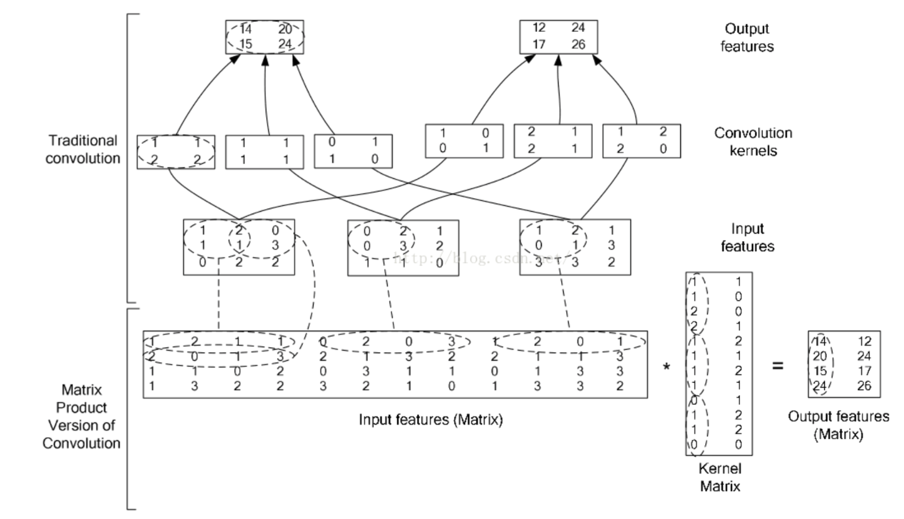
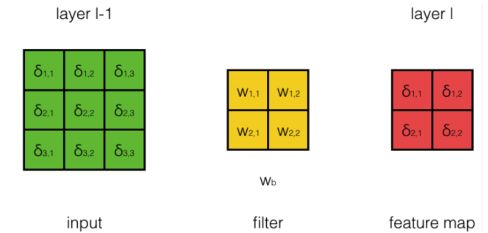

# 4 卷积神经网络

## 1 新的激活函数Relu

1. 定义:
   $$
   f(x)=max(0,x)
   $$

2. 优势：

* 速度快: 和sigmoid函数需要计算指数和倒数相比，relu函数其实就是一个max(0,x)，计算代价小很多。

* 减轻梯度消失

  由于每传递一层，就乘以一个$f^{'}$, 因为$Sigmoid$导数最大值为$\frac{1}{4}$, 所以层数过多会引起梯度消失。$relu$梯度为导数$1$， 所以不会导致梯度变小，可以训练更深的网络。

* 稀疏性：有论文声称人工神经网络在15%-30%的激活率时是比较理想的。因为relu函数在输入小于0时是完全不激活的，因此可以获得一个更低的激活率。

3. 全连接网络在图像识别的问题

* 参数数量太多

* 没有利用像素之间的位置信

  有大量的权重，它们的值都是很小的(也就是这些连接其实无关紧要)。努力学习大量并不重要的权重，这样的学习必将是非常低效的。

* 网络层数限制

  梯度很难传递超过3层

4. 卷积神经网络的思路

* 局部连接

  个是最容易想到的，每个神经元不再和上一层的所有神经元相连，而只和一小部分神经元相连。这样就减少了很多参数。

* 权值共享

  一组连接可以共享同一个权重，而不是每个连接有一个不同的权重，这样又减少了很多参数。

* 下采样

  ​	可以使用Pooling来减少每层的样本数，进一步减少参数数量，同时还可以提升模型的鲁棒性。

## 2 卷积神经网络

### 2.1 网络构架

1. 常用构架
   $$
   INPUT -> [[CONV]*N -> POOL?]*M -> [FC]*K
   $$
   $N$个卷积层叠加，然后(可选)叠加一个$Pooling$层，重复这个结构$M$次，最后叠加$K​$个全连接层。

   

### 2.2 三维层结构

1. Filter和Feature Map

   把Feature Map可以看做是通过卷积变换提取到的图像特征，三个Filter就对原始图像提取出三组不同的特征，也就是得到了三个Feature Map，也称做三个通道(channel)。

## 3 卷积神经网络输出值的计算

### 3.1 卷积层输出值的计算

1. 计算公式
   $$
   a_{i,j}=f(\sum_{d=0}^{D-1}\sum_{m=0}^{F-1}\sum_{n=0}^{F-1} w_{m,n}x_{i+m,j+n} + w_b)
   $$
   其中$w_b$为偏置项

2. 前后尺寸关系
   $$
   W_2 = (W_1-F+2P)/S+1\\
   H_2=(H_1-F+2P)/S+1
   $$
   

   其中，$W_2，H_2​$是卷积后的Feature Map的宽度;$F​$是filter的宽度；$P​$是Zero Padding的数目，Zero Padding是指在原始图像周围补几圈0，$S​$是步幅

3. 二维卷积公式
   $$
   C_{s,t} = \sum_{i=0}^{m_a-1}\sum_{j=0}^{n_a-1}A_{i,j}B_{s - i,t - j}\\
   0 \le s \le m_a+m_b-2,0\le t \le n_a+n_b-2\\
   严格：m_a - 1 \le s \le m_b - 1,n_a - 1\le t \le n_b - 1\\
   C = A*B
   $$
   

   在CNN中，是一种类似于点乘的互相关操作，只需要上下左右翻转，即可转化为卷积操作。如果我们不去考虑两者这么一点点的区别，那么对于步长为1的可以表示为：
   $$
   A = f(\sum_{d=0}^{D-1}X_d*W_d+w_b)
   $$
   

* 快速傅里叶变换求二维卷积
  * 复杂度$O(nm(log(n)+log(m)))$

  * ```c++
    #include <cstdio>
    #include <iostream>
    #include <cstring>
    #include <cmath>
    
    using namespace std;
    
    const int MAXN  = 1024 + 5;
    const double Pi = acos(-1);
    struct Complex{
        double real, image;
        Complex(double _real = 0, double _image = 0):real(_real),image(_image){}
        Complex operator + (const Complex &b)
        {
            return Complex(real + b.real, image + b.image);
        }
        Complex operator - (const Complex &b)
        {
            return Complex(real - b.real, image - b.image);
        }
        Complex operator * (const Complex &b)
        {
            return Complex(real*b.real - image*b.image, real*b.image + image*b.real);
        }
        double Norm()
        {
            return sqrt(real*real + image*image);
        }
    };
    struct CVector
    {
        int len;
        Complex val[MAXN];
        CVector(){
            len = 1;
            memset(val, 0, sizeof(val));
        }
        CVector operator * (const Complex &rhs){
            CVector mul;
            mul.len = len;
            for(int i = 0; i < mul.len; ++i){
                mul.val[i] = val[i]*rhs;
            }
            return mul;
        }
        CVector operator + (const CVector &rhs){
            CVector add;
            add.len = max(len, rhs.len);
            for(int i = 0; i < add.len; ++i){
                add.val[i] = val[i] + rhs.val[i];
            }
            return add;
        }
        CVector operator - (const CVector &rhs){
            CVector sub;
            sub.len = max(len, rhs.len);
            for(int i = 0; i < sub.len; ++i){
                sub.val[i] = val[i] - rhs.val[i];
            }
            return sub;
        }
        void operator = (const CVector &rhs){
            len = rhs.len;
            for(int i = 0; i < len; ++i){
                val[i] = rhs.val[i];
            }
            return;
        }
    };
    inline void ComplexFFT(Complex *F, int *RevPos, int lim, int flag = 1)
    {
        for (int i = 0; i < lim; ++i){
            if(i < RevPos[i]){
                swap(F[i], F[RevPos[i]]);
            }
        }
        for (int i = 1; i < lim; i <<= 1){
            Complex Wn(cos(Pi/i), flag * sin(Pi/i));
            for(int j = 0; j < lim; j += (i << 1)){
                Complex Wnk(1, 0);
                for(int k = 0; k < i; ++k, Wnk = Wnk*Wn){
                    Complex temp = Wnk*F[i + j + k];
                    F[i + j + k] = F[j + k] - temp;
                    F[j + k] =  F[j + k] + temp;
                }
            }
        }
        return;
    }
    inline void CVectorFFT(CVector *F, int *RevPos, int lim, int flag = 1)
    {
        for (int i = 0; i < lim; ++i){
            if(i < RevPos[i]){
                int maxLen = max(F[i].len, F[RevPos[i]].len);
                for(int j = 0; j < maxLen; ++j){
                    swap(F[i].val[j], F[RevPos[i]].val[j]);
                }
                swap(F[i].len, F[RevPos[i]].len);
            }
        }
        for (int i = 1; i < lim; i <<= 1){
            Complex Wn(cos(Pi/i), flag * sin(Pi/i));
            for(int j = 0; j < lim; j += (i << 1)){
                Complex Wnk(1, 0);
                for(int k = 0; k < i; ++k, Wnk = Wnk*Wn){
                    CVector temp = F[i + j + k]*Wnk;
                    F[i + j + k] = F[j + k] - temp;
                    F[j + k] =  F[j + k] + temp;
                }
            }
        }
    }
    int N[2], M[2], Limit[2], L[2], R[2][MAXN];//Limit is the Length, x^0 x^1 x^2 x^3...x^(Limit - 1)
    CVector f[MAXN], g[MAXN], h[MAXN];
    
    int main()
    {
        int w;
        scanf("%d%d", &N[0], &M[0]);
        scanf("%d%d", &N[1], &M[1]);
        Limit[0] = Limit[1] = 1;
        L[0] = L[1] = 0;
        while(Limit[0]  < N[0]  + N[1] - 1){
            Limit[0] <<= 1;
            ++L[0];
        }
        while(Limit[1]  < M[0] + M[1] - 1){
            Limit[1] <<= 1;
            ++L[1];
        }
        for(int i = 0; i < Limit[0]; ++i){
             R[0][i] = (R[0][i >> 1] >> 1)|((i & 1) << (L[0] - 1));
        }
        for(int i = 0; i < Limit[1]; ++i){
             R[1][i] = (R[1][i >> 1] >> 1)|((i & 1) << (L[1] - 1));
        }
    
        for(int i = 0; i < Limit[0]; ++i){
            if(i < N[0]){
                for(int j = 0; j < M[0]; ++j){
                    scanf("%d", &w);
                    f[i].val[j].real = w;
                    f[i].val[j].image = 0;
                }
            }
            f[i].len = M[0];
        }
        
        for(int i = 0; i < Limit[1]; ++i){
            if(i < N[1]){
                for(int j = 0; j < M[1]; ++j){
                    scanf("%d", &w);
                    g[i].val[j].real = w;
                    g[i].val[j].image = 0;
                }
            }
            g[i].len = M[1];
        }
    
    
        CVectorFFT(f, R[0], Limit[0], 1);
        CVectorFFT(g, R[0], Limit[0], 1);
        for(int i = 0; i < Limit[0]; ++i){
            ComplexFFT(f[i].val, R[1], Limit[1], 1);
            ComplexFFT(g[i].val, R[1], Limit[1], 1);
            
            for(int j = 0; j < Limit[1]; ++j){
                h[i].val[j] = f[i].val[j]*g[i].val[j];
            }
            ComplexFFT(h[i].val, R[1], Limit[1], -1);
            for(int j = 0; j < Limit[1]; ++j){
                h[i].val[j].real /= Limit[1];
                h[i].val[j].image /= Limit[1];
            }
            h[i].len = M[0] + M[1] - 1;
        }
        CVectorFFT(h, R[0], Limit[0], -1);
        for(int i = 0; i < N[0] + N[1] - 1; ++i){
            for(int j = 0; j < M[0] + M[1] - 1; ++j){
                printf("%d", int(h[i].val[j].Norm()/Limit[0] + 0.1));
                if(j == M[0] + M[1] - 2){
                    printf("\n");
                }
                else{
                    printf(" ");
                }
            }
        }
        return 0;
    }
    
    ```

* 高效卷积方法

  

### 3.2 Pooling层输出值的计算

1. MaxPooling:取最大值
2. Mean Pooling：取平均值

### 3.3 全连接层

同BP

## 4 卷积神经网络的训练

### 4.1 卷积层的训练

1. 误差项传递

* 步长为1、输入的深度为1、filter个数为1

  

  用$\delta_{i,j}^{l-1 }$表示第$l-1$层第$i$行第$j$列的误差项；用$w_{m,n}$表示filter第m行第n列权重，用$w_b$表示filter的偏置项；用$a_{i,j}^{l-1}$表示第$l-1$层第$i$行第$j$列神经元的输出；用$net_{i,j}^{l-1}$表示第$l-1$行神经元的加权输入；用$\sigma_{i,j}^l$表示第$l$层第$i$行第$j$列的误差项；用$f^{l-1}$表示第$l-1$层的激活函数。
  $$
  net^l= conv(W^l * A^{l-1}) + w_b\\
  a_{i,j}^{l-1} = f^{l-1}(net_{i,j}^{l-1})\\
  即：A^{l-1} = f^{l-1}(net^{l-1})
  $$
  * 公式推导

$$
(1) 计算\frac{\part E}{\part A^{l}}\\
\frac{\part E}{\part a_{xy}^l} = \sum_{i=max(x-n_b+1,1)}^{min(x, n_a -n_w+1)}\sum_{j=max(y-m_b+1,1)}^{min(y, m_a -m_w+1)} \frac{\part net_{ij}}{\part a_{xy}}\frac{\part E}{\part net_{ij}}
\\ = \sum_{i=max(x-n_b+1,1)}^{min(x, n_a -n_w+1)}\sum_{j=max(y-m_b+1,1)}^{min(y, m_a -m_w+1)} w_{x-i+1,y-i+1} S_{i,j}\\
\frac{\part E}{\part A^l} = S^{l+1}*W^{l+1}\\
这相当于S^{l+1}周围补一圈0，然后和W作卷积
\\
(2）计算\frac{\part E}{\part net^{l}}\\
dE = tr(\frac{\part E}{\part A^l}^TdA^l)\\
= tr(\frac{\part E}{\part A^l}^T(f'(net^l)\odot dnet^l))\\
= tr(((S^{l+1}*W^{l+1})\odot f'(net^l))^Tdnet^l)\\
S^l = (S^{l+1}*W^{l+1})\odot f'(net^l)\\
$$

* 卷积步长为S

  步长为2，得到的feature map跳过了步长为1时相应的部分。因此，当我们反向计算误差项时，我们可以对步长为S的sensitivity map相应的位置进行补0，将其『还原』成步长为1时的sensitivity map，再用求解。

* 输入层深度为D时的误差传递

  当输入深度为D时，filter的深度也必须为D，$l-1$层的$d_i  $通道只与filter的$d_i$通道的权重进行计算。因此，反向计算误差项时，用filter的第$d_i$通道权重对第$l$层sensitivity map进行卷积，得到第$l-1 $层$d_i $通道的sensitivity map。
  $$
  dE = tr(\frac{\part E}{\part A^l}^TdA^l)\\
  = tr(\frac{\part E}{\part A^l}^T(f'(net_d^l)\odot dnet_d^l))\\
  = tr(((S^{l+1}*W^{l+1})\odot f'(net^l))^Tdnet^l)\\
  S^l = (S^{l+1}*W^{l+1})\odot f'(net^l)\\
  $$

* filter数量为N时的误差传递
  $$
  dE = tr(\sum_{i=1}^N\frac{\part E}{\part A_i^l}dA_i^l)\\
  = tr(\sum_{i=1}^N\frac{\part E}{\part A_i^l}^T(f'(net^l)\odot dnet^l))\\
  = tr((\sum_{i=1}^N(S_i^{l+1}*W_i^{l+1})\odot f'(net^l))^Tdnet^l)\\
  S^l = \sum_{i=1}^N(S_i^{l+1}*W_i^{l+1})\odot f'(net^l)\\
  $$
  

2. 卷积层filter权重梯度的计算, 由于卷积层是权重共享的，因此梯度的计算稍有不同。

$$
\frac{\part E}{\part W_{xy}^l} = \sum_{i=1}^{n_a - n_w+1}\sum_{i=1}^{m_a - m_w+1} \frac{\part net^{l+1}_{ij}}{\part W^l_{xy}}\frac{\part E}{\part net^{l+1}_{ij}}\\
= \sum_{i=1}^{n_a - n_w+1}\sum_{j=1}^{m_a - m_w+1} A^{l}_{i+x-1,j+y-1}S_{ij}^{l+1} = conv(A^l, S^{l+1})\\
\frac{\part E}{\part W_{b}^l}=\sum_{i=1}^{n_a - n_w+1}\sum_{i=1}^{m_a - m_w+1} \frac{\part E}{\part net^{l+1}_{ij}} = \sum_{i=1}^{n_a-n_w+1}\sum_{j=1}^{m_a-m_w+1}S_{i,j}^{l+1}
$$


### 4.2 Pooling的训练

1. Pooling层需要做的仅仅是将误差项传递到上一层，而没有梯度的计算。

   

* 公式：

  * max pooling：
    $$
    net^{l+1}_{i,j} = \max(net^l_{2i-1,2j-1}, net^l_{2i-1,2j}, net^l_{2i,2j - 1}, net^l_{2i,2j})\\
    设net^l_{2i-1,2j-1}最大\\
    \frac{\part net_{ij}^{l+1}}{\part net^l_{2i-1,2j-1}} = 1\\
    \frac{\part net_{ij}^{l+1}}{\part net^l_{2i-1,2j}} = 0\\
    \frac{\part net_{ij}^{l+1}}{\part net^l_{2i,2j-1}} = 0\\
    \frac{\part net_{ij}^{l+1}}{\part net^l_{2i,2j}} = 0\\
    S_{2i-1,2j-1}^{l} = \frac{\part E}{\part net_{2i-1,2j-1}^l}=\frac{\part net_{i,j}^{l+1}}{\part net_{2i-1,2j-1}^l}\frac{\part E}{\part net_{i,j}^{l+1}} = S_{i,j}^{l+1}\\
    S_{2i-1,2j}^{l} = \frac{\part E}{\part net_{2i-1,2j}^l}=\frac{\part net_{i,j}^{l+1}}{\part net_{2i-1,2j}^l}\frac{\part E}{\part net_{i,j}^{l+1}} = 0\\
    S_{2i,2j-1}^{l} = \frac{\part E}{\part net_{2i,2j-1}^l}=\frac{\part net_{i,j}^{l+1}}{\part net_{2i,2j-1}^l}\frac{\part E}{\part net_{i,j}^{l+1}} = 0\\
    S_{2i,2j}^{l} = \frac{\part E}{\part net_{2i,2j}^l}=\frac{\part net_{i,j}^{l+1}}{\part net_{2i,2j}^l}\frac{\part E}{\part net_{i,j}^{l+1}} = S_{2i,2j}^{l+1} = 0\\
    $$
    对于max pooling，下一层的误差项的值会原封不动的传递到上一层对应区块中的最大值所对应的神经元，而其他神经元的误差项的值都是0

  * mean pooling
    $$
    net^{l+1}_{i,j} = \frac{1}{4}(net^l_{2i-1,2j-1} + net^l_{2i-1,2j} + net^l_{2i,2j - 1} + net^l_{2i,2j})\\
    \frac{\part net_{ij}^{l+1}}{\part net^l_{2i-1,2j-1}} = \frac{1}{4}\\
    \frac{\part net_{ij}^{l+1}}{\part net^l_{2i-1,2j}} = \frac{1}{4}\\
    \frac{\part net_{ij}^{l+1}}{\part net^l_{2i,2j-1}} = \frac{1}{4}\\
    \frac{\part net_{ij}^{l+1}}{\part net^l_{2i,2j}} = \frac{1}{4}\\
    S_{2i-1,2j-1}^{l} = \frac{\part E}{\part net_{2i-1,2j-1}^l}=\frac{\part net_{i,j}^{l+1}}{\part net_{2i-1,2j-1}^l}\frac{\part E}{\part net_{i,j}^{l+1}} = \frac{1}{4}S_{i,j}^{l+1}\\
    S_{2i-1,2j}^{l} = \frac{\part E}{\part net_{2i-1,2j}^l}=\frac{\part net_{i,j}^{l+1}}{\part net_{2i-1,2j}^l}\frac{\part E}{\part net_{i,j}^{l+1}} = \frac{1}{4}S_{i,j}^{l+1}\\
    S_{2i,2j-1}^{l} = \frac{\part E}{\part net_{2i,2j-1}^l}=\frac{\part net_{i,j}^{l+1}}{\part net_{2i,2j-1}^l}\frac{\part E}{\part net_{i,j}^{l+1}} = \frac{1}{4}S_{i,j}^{l+1}\\
    S_{2i,2j}^{l} = \frac{\part E}{\part net_{2i,2j}^l}=\frac{\part net_{i,j}^{l+1}}{\part net_{2i,2j}^l}\frac{\part E}{\part net_{i,j}^{l+1}} = S_{2i,2j}^{l+1} = \frac{1}{4}S_{i,j}^{l+1}\\
    S^{l-1}=S^l\otimes (\frac{1}{n^2})_{n\times n}
    $$
    