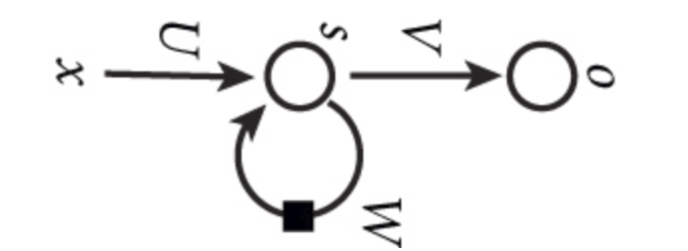
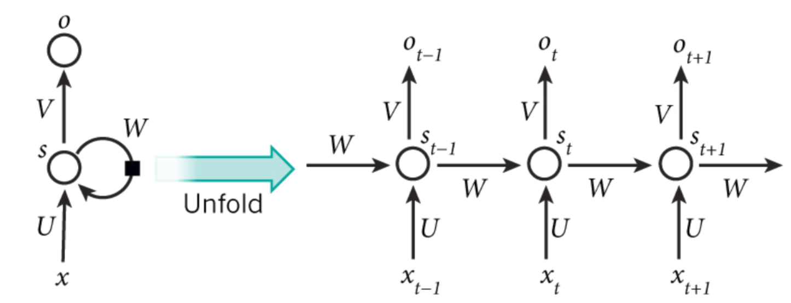
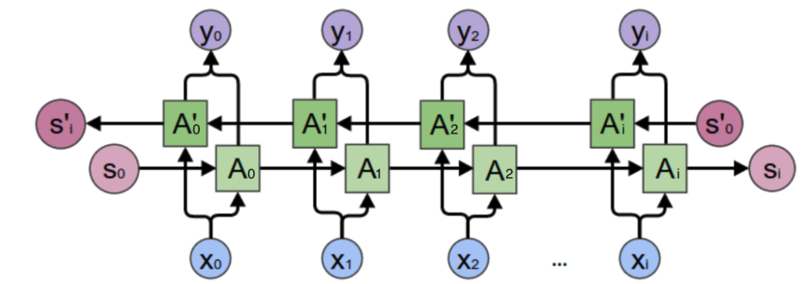
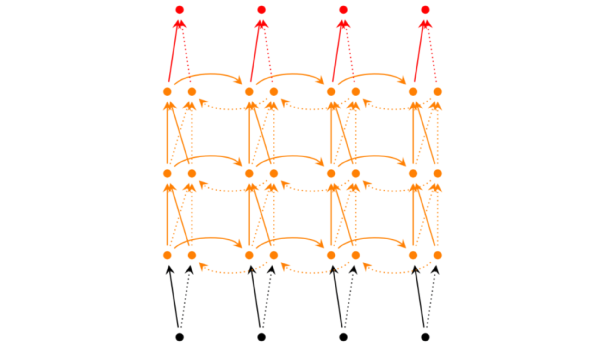
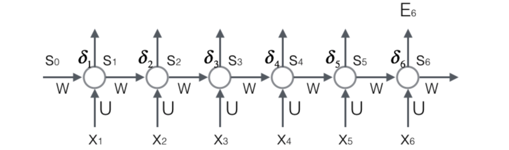
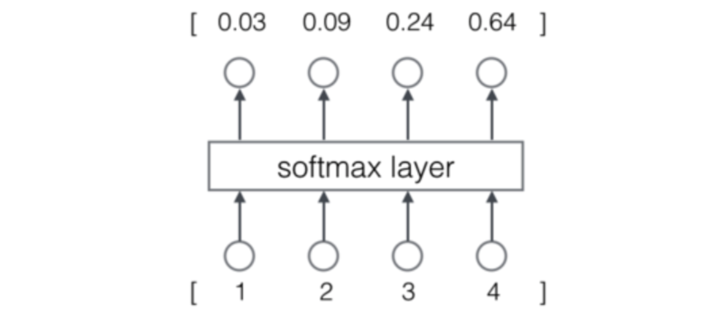

# 循环神经网络

## 1 语言模型

1. 概念：**语言模型**就是这样的东西：给定一个一句话前面的部分，预测接下来最有可能的一个词是什么。**语言模型**是对一种语言的特征进行建模，它有很多很多用处。比如在语音转文本(STT)的应用中，声学模型输出的结果，往往是若干个可能的候选词，这时候就需要**语言模型**来从这些候选词中选择一个最可能的。当然，它同样也可以用在图像到文本的识别中(OCR)。
2. N-Gram：使用RNN之前，语言模型主要是采用N-Gram。N可以是一个自然数，比如2或者3。它的含义是，假设一个词出现的概率只与前面N个词相关。模型的大小和N的关系是指数级的。RNN理论上可以往前看(往后看)任意多个词。

## 2 循环神经网络

1. 组成：由一个输出层，一个隐藏层，一个输入层组成

   

   **循环神经网络**的**隐藏层**的值s不仅仅取决于当前这次的输入x，还取决于上一次**隐藏层**的值s。**权重矩阵** W就是**隐藏层**上一次的值作为这一次的输入的权重。

2. 展开：

   

3. 公式：

* 基本公式

  $$
o_t = g(Vs_t)\\
s_t=f(Ux_t+Ws_{t-1})
  $$

  输出层是一个**全连接层**，也就是它的每个节点都和隐藏层的每个节点相连。V是输出层的**权重矩阵**，g是**激活函数**。式2是隐藏层的计算公式，它是**循环层**。U是输入x的权重矩阵，W是上一次的值作为这一次的输入的**权重矩阵**，f是**激活函数**。

* 代入
  $$
  \begin{align}
  \mathrm{o}_t&=g(V\mathrm{s}_t)\\
  &=g(Vf(U\mathrm{x}_t+W\mathrm{s}_{t-1}))\\
  &=g (Vf(U\mathrm{x}_t+Wf(U\mathrm{x}_{t-1}+W\mathrm{s}_{t-2})))\\
  &=g (Vf(U\mathrm{x}_t+Wf(U\mathrm{x}_{t-1}+Wf(U\mathrm{x}_{t-2}+W\mathrm{s}_{t-3}))))\\
  &=g (Vf(U\mathrm{x}_t+Wf(U\mathrm{x}_{t-1}+Wf(U\mathrm{x}_{t-2}+Wf(U\mathrm{x}_{t-3}+...)))))
  \end{align}
  $$
  可以看到，循环神经网络的输出值$o_t$，是受前面历次输入值$x_t,x_{t-1},x_{t-2}...$影响的，这就是为什么**循环神经网络**可以往前看任意多个**输入值**的原因。

## 3 双向循环神经网络

1. 结构：

   

2. 公式
   $$
   o_t = g(Vs_t+V^{'}s_t^{'})\\
   s_t=f(Ws_{t-1}+U_{x_{t}})\\
   s_t^{'}=f(W^{'}s_{t+1}^{'}+U^{'}x_t)\\
   $$

## 4 深度循环神经网络

1. **循环神经网络**只有一个隐藏层，我们当然也可以堆叠两个以上的隐藏层，这样就得到了**深度循环神经网络**。

   
   $$
   o^t = g(V^{(i)}s_t^{(i)} + V^{'(t)}s_t^{'(i)})\\
   s_t^{(i)}=f(U^{(i)}s_{t}^{(i-1)}+W^{(i)}s_{t-1})\\
   s_t^{'(i)} = f(U^{'(1)}s_t^{'(i-1)}+W^{'(1)}s^{'}_{t+1})\\
   ...\\
   s_t^{(1)}=f(U^{(1)}x_t+W^{(1)}s_{t-1})\\
   s_t^{'(1)} = f(U^{'(1)}x_t+W^{'(1)}s^{'}_{t+1})\\
   $$

## 5 循环神经网络的训练

### 5.1 循环神经网络的训练算法：BPTT

1. 步骤：

* 前向计算每个神经元的输出值；
* 反向计算每个神经元的误差项$\delta_j$值，它是误差函数$E$对神经元$j$的加权输入的偏导数；
* 计算每个权重的梯度。
* 最后再用**随机梯度下降**算法更新权重。

2. 推导

* 前向计算

  

  $$
\begin{align}
&\mathrm{s}_t=f(U\mathrm{x}_t+W\mathrm{s}_{t-1})\\
&\begin{bmatrix}
s_1^t\\
s_2^t\\
.\\.\\
s_n^t\\
\end{bmatrix}=f(
\begin{bmatrix}
u_{11} u_{12} ... u_{1m}\\
u_{21} u_{22} ... u_{2m}\\
.\\.\\
u_{n1} u_{n2} ... u_{nm}\\
\end{bmatrix}
\begin{bmatrix}
x_1\\
x_2\\
.\\.\\
x_m\\
\end{bmatrix}+
\begin{bmatrix}
w_{11} w_{12} ... w_{1n}\\
w_{21} w_{22} ... w_{2n}\\
.\\.\\
w_{n1} w_{n2} ... w_{nn}\\
\end{bmatrix}
\begin{bmatrix}
s_1^{t-1}\\
s_2^{t-1}\\
.\\.\\
s_n^{t-1}\\
\end{bmatrix})
\end{align}
  $$

* 误差项计算
  $$
  net_t = Ux_t+Ws_{t-1}\\
  s_{t-1}=f(net_{t-1})\\
  ds_{t-1}= f^{'}(net_{t-1})\odot dnet_{t-1}=diag(f^{'}(net_{t-1}))dnet_{t-1}\\
  \frac{\part net_t}{\part net_{t-1}} = \frac{\part s_{t-1}}{\part net_{t-1}}\frac{\part net_t}{\part s_{t-1}}=diag(f^{'}(net_{t-1}))W^T
  \\(1)误差项沿时间反向传播公式：
  \\ \delta_k^ =\frac{\part E}{\part net_k}
  \\ =\frac{\part net_t}{\part net_{k}}\frac{\part E}{\part net_t}
  \\ = \frac{\part net_{k+1}}{\part net_{k}}...\frac{\part net_{t-1}}{\part net_{t-2}}\frac{\part net_t}{\part net_{t-1}}\frac{\part E}{\part net_t}
  \\ = diag(f^{'}(net_{k}))W^T...diag(f^{'}(net_{t-2}))W^Tdiag(f^{'}(net_{t-1}))W^T\delta_t
  \\ (2)误差传递到上一层公式：
  \\net_t^l = Ua_t^{l-1} + Ws_{t-1}
  \\ \frac{\part net_t^l}{\part net_t^{l-1}}=\frac{\part a_t^{l-1}}{\part net_t^{l-1}}\frac{\part net_t^l}{\part a_t^{l-1}}=diag(f^{'(l-1)}(net))U^T\\
  \delta_t^{l-1}=\frac{\part E}{\part net_t^{l-1}}
  \\ = \frac{\part net_t^{l}}{\part net_t^{l-1}}\frac{\part E}{\part net_t^{l}}
  \\ = diag(f^{'(l-1)}(net))U^T\delta_t^{l}
  $$

* 每个时刻的权重梯度计算
  $$
  dE=tr(\frac{\part E}{\part net_t}^TdWs_{t-1})
  =tr((\delta_ts_{t-1}^T)^TdW)
  \\ \nabla_{W_t}E = \delta_ts_{t-1}^T
  \\dE = Vec(\frac{\part E}{\part net_t}^TdWs_{t-1})
  \\ = (s_{t-1} \otimes \delta_t)^TVec(dW)
  \\\frac{\part E}{\part W_t} = s_{t-1} \otimes \delta_t
  \\ 结论：\nabla_{W}E = \sum_{i=1}^t \nabla_{W_i}E
  $$

* $W$的偏导数数学推导

  注意，其实所有的$W$都是一个，$W_t​$只是帮忙分析
  $$
  net_t=Ux_t+Wf(net_{t-1})
  \\dnet_t = Vec(dWf(net_{t-1})+W(f^{'}(net_{t-1})\odot dnet_{t-1}))
  \\dE = Vec(\frac{\part E}{\part net_t}^Tdnet_t)
  \\ = Vec(\frac{\part E}{\part net_t}^TdWf(net_{t-1}))+Vec(\frac{\part E}{\part net_t}^TW(f^{'}(net_{t-1})\odot dnet_{t-1}))
  \\ = (f(net_{t-1})\otimes \delta_t)^T Vec(dW)+Vec(\frac{\part E}{\part net_t}^T W (f^{'}(net_{t-1})\odot dnet_{t-1}))
  \\ = (s_{t-1}\otimes \delta_t)^T Vec(dW)+(I_1 \otimes (\frac{\part E}{\part net_t}^T W))diag(f^{'}(net_{t-1}))Vec(dnet_{t-1})
  \\ = (s_{t-1}\otimes \delta_t)^T Vec(dW)+ (\frac{\part E}{\part net_t}^T W)diag(f^{'}(net_{t-1}))Vec(dnet_{t-1})
  \\ = (s_{t-1}\otimes \delta_t)^T Vec(dW)+ (diag(f^{'}(net_{t-1}))W^T\frac{\part E}{\part net_t} )^TVec(dnet_{t-1})
  \\ = \frac{\part E}{\part W_t}^T Vec(dW)+ (\frac{\part net_t}{\part net_{t-1}}\frac{\part E}{\part net_t} )^TVec(dnet_{t-1})
  \\ = \frac{\part E}{\part W_t}^T Vec(dW)+ \delta_{t-1}^TVec(dnet_{t-1})
  \\ = \frac{\part E}{\part W_t}^T Vec(dW)+ Vec(\delta_{t-1}^Tdnet_{t-1})
  \\ = \frac{\part E}{\part W_t}^T Vec(dW)+ \frac{\part E}{\part W_{t-1}}^T Vec(dW)\\+...+\frac{\part E}{\part W_{2}}^T Vec(dW) + Vec(\delta_{1}^T dnet_1)
  \\ = (\frac{\part E}{\part W_t}+\frac{\part E}{\part W_{t-1}}+...+\frac{\part E}{\part W_{t-1}})^TVec(dW)
  \\ \longrightarrow \frac{\part E}{\part W} = \sum_{i=1}^t \frac{\part E}{\part W_{i}}
  \\ \longrightarrow Vec^{-1}(\frac{\part E}{\part W}) = Vec^{-1}(\sum_{i=1}^t \frac{\part E}{\part W_{i}})
  \\ \longrightarrow \nabla_{W}E = \sum_{i=1}^t \nabla_{W_i}E
  $$

* $U$的推导同理$W$
  $$
  \nabla_{U_t} = \delta_tx_{t-1}^T\\
  \nabla_{U}E = \sum_{i=1}^t \nabla_{U_i}E
  $$
  

### 5.2 梯度消失和梯度爆炸

1. RNN在训练中很容易发生**梯度爆炸**和**梯度消失**，这导致训练时梯度不能在较长序列中一直传递下去，从而使RNN无法捕捉到长距离的影响

2. 原因：
   $$
   \begin{align}
   \delta_k=&\prod_{i=k}^{t-1}diag[f'(\mathrm{net}_{i})]W^T\delta_t\\
   \|\delta_k\|\leqslant&\|\delta_t\|\prod_{i=k}^{t-1}\|W^T\|\|diag[f'(\mathrm{net}_{i})]\|\\
   \leqslant&\|\delta_t\|(\beta_W\beta_f)^{t-k}
   \end{align}
   $$
   

* 上式的$\beta$定义为矩阵的模的上界。因为上式是一个指数函数，如果$t-k$很大的话（也就是向前看很远的时候），会导致对应的误差项的值增长或缩小的非常快，这样就会导致相应的梯度爆炸和梯度消失问题(取决于$\beta $大于还是小于1)

3. 处理：

* **梯度爆炸**更容易处理一些。因为梯度爆炸的时候，我们的程序会收到NaN错误。我们也可以设置一个梯度阈值，当梯度超过这个阈值的时候可以直接截取。
* **梯度消失**更难检测，而且也更难处理一些。总的来说，我们有三种方法应对梯度消失问题：
  * 合理的初始化权重值。初始化权重，使每个神经元尽可能不要取极大或极小值，以躲开梯度消失的区域。
  * 使用relu代替sigmoid和tanh作为激活函数。
  * 使用其他结构的RNNs，比如长短时记忆网络（LTSM）和Gated Recurrent Unit（GRU），这是最流行的做法。

## 6 RNN的应用举例(基于RNN的语言模型)

1. 向量化：神经网络的输入是**词**，我们可以用下面的步骤对输入进行向量化

* 建立一个包含所有词的词典，每个词在词典里面有一个唯一的编号。

* 任意一个词都可以用一个N维的one-hot向量来表示。其中，N是词典中包含的词的个数。假设一个词在词典中的编号是i，v是表示这个词的向量，$v_j$是向量的第j个元素，则：
  $$
  v_j=\begin{equation}\begin{cases}1\qquad j=i\\0\qquad j\ne i\end{cases}\end{equation}
  $$

* 语言模型要求的输出是下一个最可能的词，我们可以让循环神经网络计算计算词典中每个词是下一个词的概率，这样，概率最大的词就是下一个最可能的词。因此，神经网络的输出向量也是一个N维向量，向量中的每个元素对应着词典中相应的词是下一个词的概率。

2. Softmax层
   $$
   softmax(z)=\frac{e^z}{1^Te^z}
   $$
   

* 可以看作概率，放在输出层

  

3. 交叉熵误差

   当神经网络的输出层是$softmax$层时，对应的误差函数$E$通常选择交叉熵误差函数。
   $$
   L(y,o) = -\frac{1}{N}\sum_{n\in N}y_n\log(o_n)
   $$
   当然可以选择其他函数作为我们的误差函数，比如最小平方误差函数(MSE)。但是选择交叉熵函数更加有意义。

