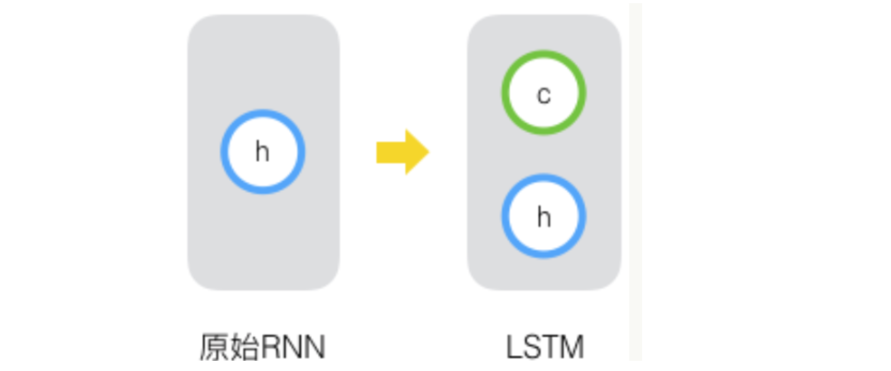
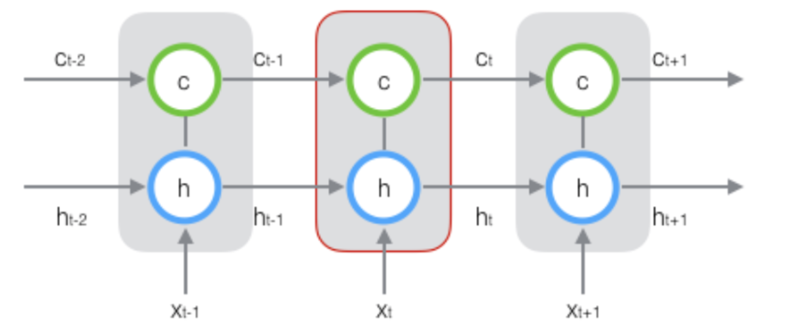
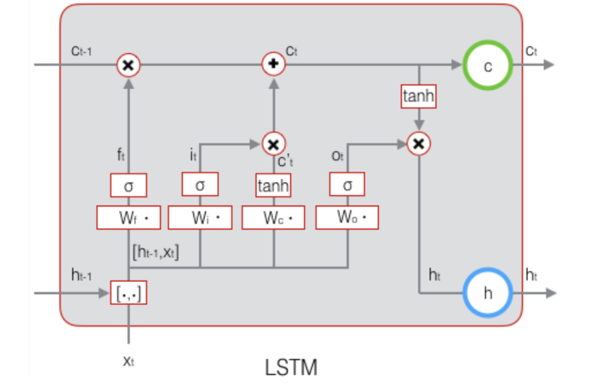
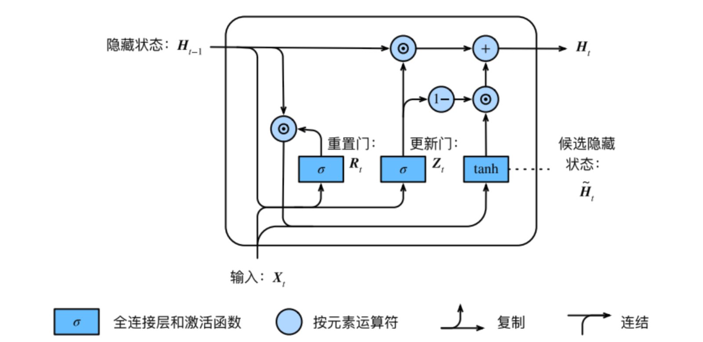

# 长短时记忆网络

## 1 RNN的缺点

$$
\delta_k=\prod_{i=k}^{t-1} diag(f^{'}(net_{i}))W^T\delta_t\\
\|\delta_k\|\le \prod_{i=k}^{t-1}\|diag(f^{'}(net_{i}))\|\|W^T\|\|\delta_t\|\le (\beta_f\beta_{W^T})^{t-k}\|\delta_t\|
$$

* 因此可能发生梯度消失或者梯度爆炸。

## 2 长短时记忆网络概念

1. 由于梯度消失，原始RNN无法处理长距离依赖。

2. 原始RNN的隐藏层只有一个状态，即$h$，它对于短期的输入非常敏感。那么，假如我们再增加一个状态，即$c​$，让它来保存长期的状态。新增加的状态c，称为单元状态(cell state)。

   

* 展开后

  

3. LSTM的关键，就是怎样控制长期状态c。在这里，LSTM的思路是使用三个控制开关。第一个开关，负责控制继续保存长期状态c，第二个开关，负责控制把即时状态输入到长期状态c，第三个开关，负责控制是否把长期状态c作为当前的LSTM的输出。

## 3 LSTM前向计算

1. 门（gate）的概念：门实际上就是一层全连接层，它的输入是一个向量，输出是一个0到1之间的实数向量。假设$W$是门的权重向量，$b$是偏置项
   $$
   g(x) = \sigma(Wx+b)
   $$
   门的输出是0到1之间的实数向量，那么，当门输出为0时，任何向量与之相乘都会得到0向量，这就相当于啥都不能通过；输出为1时，任何向量与之相乘都不会有任何改变，这就相当于啥都可以通过。因为$\sigma$的值域为$(0,1)$, 所以门的状态都是半开半闭的。

* LSTM用两个门来控制单元状态c的内容:
  * 遗忘门：它决定了上一时刻的单元状态$c_{t-1}$有多少保留到当前时刻$c_t$
  * 输入门：他决定当前时刻网络输入$x_t$有多少保存到单元状态$c_t$
* LSTM用输出门(output gate)来控制单元状态有多少输出到LSTM的当前输出值$h_t$。

2. 公式

   

* 遗忘门：
  $$
  f_t=\sigma(W_f[h_{t-1};x_t]+b_f)=\sigma(W_{fh}h_{t-1}+W_{fx}x_t + b_f)
  $$

  $W_f$是遗忘门的权重矩阵，$[h_{t-1}, x_t]$是向量拼接，$b_f$是遗忘门的偏置项，$\sigma$是$sigmoid$函数。若输入维度是$d_x$, 隐藏层维度是$d_h$, 单元状态的维度是$d_c$, 则$W_f$可以分别为$[W_{fh}, W_{fx}]$
$$
  W_f
  \left[
  \begin{matrix}
  h_{t-1}\\
  x_t
  \end{matrix}
  \right]=[W_{fh}, W_{fx}]\left[
  \begin{matrix}
  h_{t-1}\\
  x_t
  \end{matrix}
  \right]=W_{fh}h_{t-1}+W_{fx}x_t
$$

* 输入门：
  $$
  i_t = \sigma(W_i[h_{t-1}; x_t]+b_i)=\sigma(W_{ih}h_{t-1}+W_{ix}x_t+b_i)
  $$
  
  
  * 计算用于描述当前输入的候选单元状态$\overline c_t $

  $$
  \overline c_t = \tanh(W_c[h_{t-1};x_t]+b_c)=\tanh(W_{ch}h_{t-1}+W_{cx}x_t+b_c)
  $$

  * 单元状态
    $$
    c_t = f_t\odot c_{t-1}+i_t\odot \overline c_t
    $$
    我们就把LSTM关于当前的记忆$\overline c_t$和长期的记忆$c_{t-1}$组合在一起，形成了新的单元状态。

* 输出门
  $$
  o_t = \sigma(W_o[h_{t-1};x_t]+b_o) = \sigma(W_{oh}h_{t-1}+W_{ox}x_t + b_o)
  $$

  * 最终输出
    $$
    h_t = o_t\odot \tanh(c_t)
    $$
    

## 4 GRU分析

1. 门控循环神经⽹络：GRU它引⼊了重置门（reset gate）和更新门（update gate）的概念，从而修改了循环神经⽹络中隐藏状态的计算⽅式。 

2. 结构图

   

* 重置门：
  $$
  r_t = \sigma(W_{rh}h_{t-1}+W_{rx}x_t+b_r)\\
  $$

* 更新门：
  $$
  z_t = \sigma(W_{zh}h_{t-1}+W_{zx}x_t+b_z)
  $$
  
* 候选隐藏状态
  $$
  \overline h_t = \tanh(W_{hh}(r_t\odot h_{t-1})+W_{hx}x_t + b_h)
  $$

* 隐藏状态
  $$
  h_t = h_{t-1}\odot z_t + (1-z_t)\odot \overline h_t
  $$
  

3. 分析

* 使用一个门控$z$就同时进行了遗忘和选择记忆
  * $z\odot h_{t-1}$， $z$相当于遗忘门
  * $(1-z)\odot \overline h_{t}$，这里包含了对$\overline h_t$的选择性记忆
  * 可以看到，这里的遗忘$z$和选择$1-z$是联动的。也就是说，对于传递进来的维度信息，我们会进行选择性遗忘，则遗忘了多少权重 $z$，我们就会使用包含当前输入的$\overline h_t$中所对应的权重进行弥补$1-z$  。

* 如果在一段时间内$z_t$近似于1，则输入信息$x_t$几乎没有流入，$h_t $则保留较早时刻的状态。
  * 更新⻔有助于捕捉时间序列⾥⻓期的依赖关系
  * 重置⻔有助于捕捉时间序列⾥短期的依赖关系

## 5 LSTM的训练

### 5.1 训练框架

1. 前向计算每个神经元的输出值
2. 反向计算每个神经元的误差项$\delta$

3. 根据误差项，计算权重的梯度

### 5.2 公式符号说明

1. $$
   \sigma(z) = y=\frac{1}{1+e^{-z}}\\
   \sigma'(z)=y(1-y)\\
   \tanh(z) = y = \frac{e^z-e^{-z}}{e^z+e^{-z}}\\
   \tanh'(z) = 1-y^2
   $$

2. $$
   diag(b) a= a\odot b\\
   $$

3. 设在$t$时刻，LSTM的输出值为$h_t$, 则我们定义$t$时刻的误差项为$\delta_t$
   $$
   \delta_t =\frac{\part E}{\part h_t}
   $$
   我们这里假设误差项是损失函数对输出值的导数，而不是对加权输入$net_t^l$的导数。这是因为LSTM有四个加权输入，我们希望往上一层传递一个误差项而不是四个。对加权输入的误差项定义如下：
   $$
   net_{f,t} = W_{fh}h_{t-1}+W_{fx}x_t+b_f\\
   net_{i,t} = W_{ih}h_{t-1}+W_{ix}x_t+b_i\\
   net_{\overline c,t} = W_{\overline ch}h_{t-1}+W_{\overline cx}x_t+b_\overline c\\
   net_{o,t} = W_{oh}h_{t-1}+W_{ox}x_t+b_o\\
   \delta_{f,t} = \frac{\part E}{\part net_{f,t}}\\
   \delta_{i,t} = \frac{\part E}{\part net_{i,t}}\\
   \delta_{\overline c,t} = \frac{\part E}{\part net_{\overline c,t}}\\
   \delta_{o,t} = \frac{\part E}{\part net_{o,t}}\\
   $$
   

### 5.3 误差项沿时间的反向传递

1. 沿时间反向传递误差项，就是要计算出t-1时刻的误差项$\delta_{t-1}$。

$$
\delta_{t-1} = \frac{\part E}{\part h_{t-1}}
\\ = \frac{\part h_t}{\part h_{t-1}}\frac{\part E}{\part h_{t}}
\\ = \frac{\part h_t}{\part h_{t-1}}\delta_t\\
h_t = o_t\odot \tanh(c_t)\\
c_t = f_t\odot c_{t-1}+i_t\odot \overline c_t\\
\delta_{t-1} = \frac{\part h_t}{\part h_{t-1}}\delta_t\\
=\frac{\part net_{o,t}}{\part h_{t-1}}\frac{\part o_t}{net_{o,t}}\frac{\part h_t}{\part o_t}\delta_t+\frac{\part net_{f,t}}{\part h_{t-1}}\frac{\part f_t}{net_{f,t}}\frac{\part c_t}{\part f_t}\frac{\part h_t}{\part c_t}\delta_t\\
+\frac{\part net_{i,t}}{\part h_{t-1}}\frac{\part i_t}{net_{i,t}}\frac{\part c_t}{\part i_t}\frac{\part h_t}{\part c_t}\delta_t+\frac{\part net_{\overline c_t,t}}{\part h_{t-1}}\frac{\part \overline c_t}{net_{\overline c_t,t}}\frac{\part c_t}{\part \overline c_t}\frac{\part h_t}{\part c_t}\delta_t\\
=\frac{\part net_{o,t}}{\part h_{t-1}}\delta_{o,t}+\frac{\part net_{f,t}}{\part h_{t-1}}\delta_{f,t}+\frac{\part net_{i,t}}{\part h_{t-1}}\delta_{i,t}+\frac{\part net_{\overline c_t,t}}{\part h_{t-1}}\delta_{\overline c_t,t}\\
\frac{\part net_{o,t}}{\part h_{t-1}} = W_{oh}^T, \frac{\part net_{f,t}}{\part h_{t-1}} = W_{fh}^T,\frac{\part net_{i,t}}{\part h_{t-1}} = W_{ih}^T,\frac{\part net_{\overline c_t,t}}{\part h_{t-1}} = W_{ch}^T\\
\delta_{t-1}=W_{oh}^T\delta_{o,t}+W_{fh}^T\delta_{f,t}+W_{ih}^T\delta_{i,t}+W_{ch}^T\delta_{\overline c,t}\\
$$

2. 求$\delta_{o,t}, \delta_{f,t},\delta_{i,t},\delta_{\overline c,t}$
   $$
   o_t = \sigma(net_{o,t})\\
   do_t= \sigma'(net_{o,t})\odot dnet_{o,t} = diag(\sigma(net_{o,t})(1-\sigma(net_{o,t})))^Tdnet_{o,t}\\
   \frac{\part o_t}{\part net_{o,t}} = diag[(\sigma(net_{o,t})\odot(1-\sigma(net_{o,t}))]\\=diag[o_t\odot(1-o_t)]\\
   \frac{\part f_t}{\part net_{f,t}}=diag[f_t\odot(1-f_t)]\\
   \frac{\part i_t}{\part net_{i,t}}=diag[i_t\odot(1-i_t)]\\
   d\overline c_t = \tanh'(net_{\overline c_t})\odot dnet_{\overline c_t,t} = diag[1-\tanh(net_{\overline c_t})^2]^Tdnet_{\overline c_t,t}\\
   \frac{\part \overline c_t}{\part net_{i,t}}=diag[1-\overline c_t^2]\\
   dh_t = do_t \odot \tanh(c_t)+o_t \odot \tanh'(c_t)\odot dc_t
   \\ = diag[\tanh(c_t)]^T do_t + diag[o_t\odot (1-\tanh(c_t)^2)]^Tdc_t
   \\
   dc_t = df_t\odot c_{t-1} + di_t\odot \overline c_t + i_t\odot d\overline c_t \\
   = diag[c_{t-1}]^Tdf_t+diag[\overline c_t]^Tdi_t+diag[i_t]^Td\overline c_t\\
   \delta_{o,t} = \frac{\part o_t}{net_{o,t}}\frac{\part h_t}{\part o_t}\delta_t = diag[o_t\odot(1-o_t)] diag[\tanh(c_t)]\delta_t\\
   \delta_{f,t} = \frac{\part f_t}{net_{f,t}}\frac{\part c_t}{\part f_t}\frac{\part h_t}{\part c_t}\delta_t = diag[f_t\odot(1-f_t)] diag[c_{t-1}]diag[o_t\odot (1-\tanh(c_t)^2)]\delta_t\\
   
   \delta_{i,t} = \frac{\part i_t}{net_{i,t}}\frac{\part c_t}{\part i_t}\frac{\part h_t}{\part c_t}\delta_t = diag[i_t\odot(1-i_t)] diag[\overline c_{t}]diag[o_t\odot (1-\tanh(c_t)^2)]\delta_t\\
   \delta_{\overline c,t} = \frac{\part \overline c_t}{net_{\overline c,t}}\frac{\part c_t}{\part \overline c_t}\frac{\part h_t}{\part c_t}\delta_t = diag[1-\overline c_t^2]diag[i_t]diag[o_t\odot (1-\tanh(c_t)^2)]\delta_t
   $$

3. $\delta_k$与$\delta_t​$ 的关系
   $$
   令:\ M_t =W_{oh}^Tdiag[o_t\odot(1-o_t)] diag[\tanh(c_t)]\\+W_{fh}^Tdiag[f_t\odot(1-f_t)] diag[c_{t-1}]diag[o_t\odot (1-\tanh(c_t)^2)]\\+W_{ih}^Tdiag[i_t\odot(1-i_t)] diag[\overline c_{t}]diag[o_t\odot (1-\tanh(c_t)^2)]\\+W_{ch}^Tdiag[1-\overline c_t^2]diag[i_t]diag[o_t\odot (1-\tanh(c_t)^2)]\\
   \delta_{t-1} = M_t\delta_t\\
   \delta_k = \prod_{i=k+1}^t M_{i}\delta_t
   $$

### 5.4 将误差项传递到上一层

1. 假设当前为第l层，定义l-1层的误差项是误差函数对l-1层加权输入的导数
   $$
   \delta_t^{l-1} = \frac{\part E}{\part net_{t}^{l-1}}\\
   其中:net_{t}^{l-1}=[net_{o,t}^{l-1};net_{f,t}^{l-1};net_{i,t}^{l-1};net_{\overline c,t}^{l-1}]\\
   x_t^l=f^{l-1}(net_t^{l-1})， f^{l-1}为l-1层的激活函数\\
   \frac{\part E}{\part net_{t}^{l-1}} = \frac{\part x_t^l}{\part net_{t}^{l-1}}\frac{\part net_{o,t}^l}{\part x_t^l}\frac{\part E}{\part net_{o,t}^{l}}+\frac{\part x_t^l}{\part net_{t}^{l-1}}\frac{\part net_{f,t}^l}{\part x_t^l}\frac{\part E}{\part net_{f,t}^{l}}\\
   +\frac{\part x_t^l}{\part net_{t}^{l-1}}\frac{\part net_{i,t}^l}{\part x_t^l}\frac{\part E}{\part net_{i,t}^{l}}+\frac{\part x_t^l}{\part net_{t}^{l-1}}\frac{\part net_{\overline c,t}^l}{\part x_t^l}\frac{\part E}{\part net_{\overline c,t}^{l}}\\
   =diag[f'(net_t^{l-1})]W_{ox}^T\delta_{o,t}+diag[f'(net_t^{l-1})]W_{fx}^T\delta_{f,t}\\
   +diag[f'(net_t^{l-1})]W_{ix}^T\delta_{i,t}+diag[f'(net_t^{l-1})]W_{\overline cx}^T\delta_{\overline c,t}
   $$

2. 问题：$f$函数应该怎么得到？

### 5.5 权重梯度的计算

1. 对于$W_{oh}, W_{fh},W_{ih}, W_{ch}​$的权重梯度，我们知道它的梯度是各个时刻梯度之和。我们首先求出它们在t时刻的梯度，然后再求出他们最终的梯度。
   $$
   \frac{\part E}{\part W_{oh,t}}=\frac{\part net_{o,t}}{\part W_{oh,t}}\frac{\part E}{\part net_{o,t}} =h_{t-1}\delta_{o,t}, \frac{\part E}{\part W_{oh}} = \sum_{i=1}^t h_{i-1}\delta_{o,i}\\
   \frac{\part E}{\part W_{fh,t}}=\frac{\part net_{f,t}}{\part W_{fh,t}}\frac{\part E}{\part net_{f,t}} =h_{t-1}\delta_{f,t}, \frac{\part E}{\part W_{fh}} = \sum_{i=1}^t h_{i-1}\delta_{f,i}\\
   \frac{\part E}{\part W_{ih,t}}=\frac{\part net_{i,t}}{\part W_{ih,t}}\frac{\part E}{\part net_{i,t}} =h_{t-1}\delta_{i,t}, \frac{\part E}{\part W_{ih}} = \sum_{i=1}^t h_{i-1}\delta_{i,i}\\
   \frac{\part E}{\part W_{\overline ch,t}}=\frac{\part net_{\overline c,t}}{\part W_{\overline ch,t}}\frac{\part E}{\part net_{\overline c,t}} =h_{t-1}\delta_{\overline c,t}, \frac{\part E}{\part W_{\overline ch}} = \sum_{i=1}^t h_{i-1}\delta_{\overline c,i}\\
   $$

2. 对于$b_{o}, b_{f},b_{i}, b_{c}$的权重梯度，它的梯度也是各个时刻梯度之和。
   $$
   \frac{\part E}{\part b_{h}}=\frac{\part net_{o,t}}{\part b_{o}}\frac{\part E}{\part net_{o,t}} =h_{t-1}\delta_{o,t}, \frac{\part E}{\part b_{o}} = \sum_{i=1}^t \delta_{o,i}\\
   \frac{\part E}{\part b_{f}}=\frac{\part net_{f,t}}{\part b_{f}}\frac{\part E}{\part net_{f,t}} =h_{t-1}\delta_{f,t}, \frac{\part E}{\part b_{f}} = \sum_{i=1}^t \delta_{f,i}\\
   \frac{\part E}{\part b_{i}}=\frac{\part net_{i,t}}{\part b_{i}}\frac{\part E}{\part net_{i,t}} =h_{t-1}\delta_{i,t}, \frac{\part E}{\part b_{i}} = \sum_{i=1}^t\delta_{i,i}\\
   \frac{\part E}{\part b_{\overline c}}=\frac{\part net_{\overline c,t}}{\part b_{\overline c}}\frac{\part E}{\part net_{\overline c,t}} =h_{t-1}\delta_{\overline c,t}, \frac{\part E}{\part W_{\overline c}} = \sum_{i=1}^t \delta_{\overline c,i}\\
   $$

3. 对于$W_{ox}, W_{fx},W_{ix}, W_{cx}​$, 只需要直接计算
   $$
   \frac{\part E}{\part W_{ox}}=\frac{\part net_{o,t}}{\part W_{ox}}\frac{\part E}{\part net_{o,t}} =x_{t}\delta_{o,t}\\
   \frac{\part E}{\part W_{fx}}=\frac{\part net_{f,t}}{\part W_{fx}}\frac{\part E}{\part net_{f,t}} =x_{t}\delta_{f,t}\\
   \frac{\part E}{\part W_{ix}}=\frac{\part net_{i,t}}{\part W_{ix}}\frac{\part E}{\part net_{i,t}} =x_{t}\delta_{i,t}\\
   \frac{\part E}{\part W_{\overline cx}}=\frac{\part net_{\overline c,t}}{\part W_{\overline cx}}\frac{\part E}{\part net_{\overline c,t}} =x_{t}\delta_{\overline c,t}
   $$
   