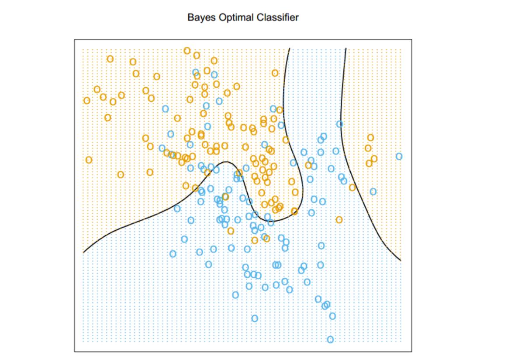

# 统计判别理论

## 1 预测值为连续值

### 1.1 平方误差损失

* 公式
  $$
  L(Y,f(X))=(Y-f(X))^2
  $$

* 预测平方误差的期望
  * 公式
    $$
    EPE(f) = E(Y-F(X))^2
    \\=\int [y-f(x)]^2Pr(x,y)dxdy
    \\=E_XE_{Y|X}([Y-f(X)]^2)
    $$

  * 则只需要EPE逐点最小
    $$
    f(x) = \mathop{\arg\min}_{c}E([Y-c]^2|X=x) \\
    f(x) = E(Y|X=x)
    $$

* k-近邻

  * 联合概率分布 $Pr(X,Y)$ 温和正则条件下，可以证明当 $N,k\rightarrow \infty$使得$k/N\rightarrow 0$ 时，$\hat f (x) \rightarrow E(Y|X=x)$
  * 当维数 p 变大，k-最近邻的度量大小也随之变大．所以最近邻代替条件会让我们非常失望

* 线性模型

  * 设X，Y服从某个分布$Pr(X,Y) $, 推到得出$\beta​$ 如下

    * $E([Y-X^T\beta]^2)=E_XE_Y([Y-X\beta]^2|X=x)$

    * $$
      \hat\beta=\mathop{\arg\min}_{\beta}(E([Y-X\beta]^2))
      \\=\mathop{\arg\min}_{\beta}\int\int[Y-X\beta]^2Pr(X,Y)dXdY
      \\F = [Y-X\beta]^2
      \\dF = d[Y-X\beta]^2
      \\=tr(-Xd\beta (Y-X\beta)-(Y-X\beta)Xd\beta)
      \\=tr(-2(Y-X\beta)Xd\beta)
      $$

      

    * $$
      \frac{\partial F}{\partial \beta} = -2X^T(Y-X\beta)=0\\
      \frac{\partial E(F)}{\partial \beta}= \int \int \frac{\partial F}{\partial \beta} Pr(X,Y)dXdY
      \\=\int \int -2X^T(Y-X\beta) Pr(X,Y) dXdY=0\\
      \beta = E(X^TX)^{-1}E(XY)
      $$

  * 最小二乘法相当于把期望换成了样本的均值，也就是假设了分布和样本相同

    * $$
      \beta = (X^TX)^{-1}X^T\mathbf{y} \\
      X = (\mathbf{x_1},\mathbf{x_2},...,\mathbf{x_n})^T
      $$

    * $$
      (X^TX)^{-1}
      \\=\left[(\mathbf{x_1},\mathbf{x_2},...,\mathbf{x_n})
      \left(\begin{matrix}
      \mathbf{x_1}^T\\
      \mathbf{x_2}^T\\
      \vdots\\
      \mathbf{x_n}^T
      \end{matrix}
      \right)
      \right]^{-1}
      \\=\left[n\times\frac{\sum_{i=1}^n\mathbf{x_i}\mathbf{x_i}^T}{n}\right]^{-1}
      \\ \approx \frac{1}{n}[E(\mathbf{X^T}\mathbf{X})]^{-1}
      $$

    * $$
      X^T\mathbf{y} = (\mathbf{x_1},\mathbf{x_2},...,\mathbf{x_n})
      \left(\begin{matrix}
      y_1\\
      y_2\\
      \vdots\\
      y_n
      \end{matrix}
      \right)
      \\=n\sum_{i=1}^n\frac{\mathbf{x_i}y_i}{n}
      \\ \approx nE(\mathbf{X^T}y)
      $$

  

### 1.2 绝对值误差损失

* 公式
  $$
  EPE(f) = E|Y-F(X)|
  \\ =\int \int |Y-F(X)|Pr(X,Y) dYdX
  \\ f(x) = \mathop{\arg\min}_{c}E(|Y-c||X=x) =\int_{a}^{b}|Y-c|P(Y|X=x)dY\\
  $$

* 一定有
  $$
  c =Y_{1/2}\\
  \int_{-\infty}^{c}P(Y|X=x)dY=\frac{1}{2}
  $$

* TODO: 证明:假设下届为a，否则为无穷积分不好证明。
  $$
  \int_{a}^{c}|Y-c|P(Y|X=x)dY\\
  = \lim_{n\rightarrow \infty} \sum_{i=0}^{n+1}(y_{i}-y_{i-1})P(y_{i                                                          }|X=x)|y_i-c|
  $$

* 它的估计比条件均值更加鲁棒

## 2 贝叶斯分类

### 2.1 损失函数

* 公式
  $$
  EPE=E[L(G,\hat G(X))]
  \\ = E_X\sum_{k=1}^K L(G_k,\hat G(X))Pr(G_x|X)
  $$

* 求解

  * 只需要逐点最小

  $$
  \hat G(x) = \mathop{\arg\min}_{g\in G}\sum_{k=1}^KL(G_k,g)Pr(G_k|X=x)
  $$

  * 如果$L$为 0-1 损失函数，则为贝叶斯分类 (Bayes classifier)

    * **贝叶斯阶 (Bayes rate)**：贝叶斯分类的误差阶

    * 
        $$
        \hat G(x)=\mathop{\arg\min}_{g\in G} \sum_{k=1}^KL(G_k,g)Pr(G_k|X=x)
        \\ =\mathop{\arg\min}_{g\in G} \sum_{G_k\not= g}L(G_k,g)Pr(G_k|X=x)
        \\=\mathop{\arg\min}_{g\in G}(1- Pr(g|X))
        \\ = \mathop{\arg\max}_{g\in G} Pr(g|X)
        $$

  *  k-最近邻分类直接近似这个解决方法——在最近邻内占绝大多数恰好意味着这个

    * 某一点的条件概率松弛为该点的邻域内的条件概率
    * 概率是通过训练样本的比例来估计的．

### 2.2 贝叶斯分类求解

* 问题：我们从双变量高斯分布 $N((1,0)T,I)$ 中产生 10 个均值 $m_k$，标记此类为蓝色．类似地，从双变量高斯分布 $N((0,1)T,I)$ 中产生 10 个均值并标记此类为橘黄色．然后对每一类按照下面方式产生 100 个观测：对于每个观测，我们以 $1/10$ 的概率随机选择一个 $m_k$，然后产生 $N(m_k,I/5)$，因此对于每一类引出了一个高斯分布簇的混合．

* 求解(这个有错误)：

  * 根据条件概念
    $$
    P(X=x|G=blue)=\sum_{i=1}^{10}P(X=x|choose=b_i)P(choose=b_i)
            \\=\sum_{i=1}^{10}\frac{P(X=x|choose=b_i)}{10}
            \\=\frac{1}{10}\sum_{i=1}^{10} \int P(X=x,M_{b_i}=m_{b_i}) dm_i{}\\
            \\ = \frac{1}{10}\sum_{i=1}^{10} \int P(X=x|M_i=m_i)P(M_i=m_i)dm_i\\
    $$

  * 其中
    $$
    P(X=x|M_{b_i}=m_{b_i}) = N(m_{b_i},I/5)
    $$

  * 则有
    $$
    P(X=x|M_{b_i}=m_i)=\frac{\sqrt{5}}{2\pi}\exp(-\frac{1}{10}(x-m_{b_i})^T(x-m_{b_i}))\\
    P(X=x|G=blue)=\int_{D} \frac{\sqrt{5}}{2\pi}\exp(-\frac{1}{10}(x-m_{b_i})^T(x-m_{b_i}))P(M_i=m_{b_i}) dm_{b_i}
    $$

  * 其中
    $$
    M_i\sim N((1,0)^T,I)
    $$

  * 由此可以求得$P(X=x|G=blue)$的数值解，最终可以比较$P(X=x|G=blue)$和$P(X=x|G=yellow)$ ,从而可以确定区域

    * 因为
      $$
      P(G=blue|X=x)
      \\=\frac{P(X=x|G=blue)P(G=blue)}{P(X=x|G=blue)P(G=blue)+P(X=x|G=yellow)P(G=yellow)}
      $$

    * 此时可以比较$log-ratio$来计算边界(TODO: 这里积分好积吗？好积分就可以直接做商了)
      $$
      \log{\frac{P(G=blue|X=x)}{P(G=yellow|X=x)}}
      \\ = \log{\frac{P(X=x|G=blue)}{P(X=x|G=yellow)}}+\log{\frac{P(G=blue)}{P(G=yellow)}}
      \\ = \log{\frac{P(X=x|G=blue)}{P(X=x|G=yellow)}}+\log{\frac{\frac{100}{200}}{\frac{100}{200}}} 
      \\ = \log{\frac{P(X=x|G=blue)}{P(X=x|G=yellow)}}
      $$
      

      

    

* 求解（修正）

  * 上面求解，其实是对每个观测，都按照$N((1,0)^T,I)$生成一个$m_i$, 其实看题意，这100个观测对应的都是相同的$m_i$, 也就是$m_i$其实是固定的已知的。

  * 因此需要把上面的公式改成即可，变得简单许多
    $$
    P(X=x|G=blue)=\sum_{i=1}^{10}P(X=x|choose=b_i)P(choose=b_i)
    \\=\sum_{i=1}^{10}\frac{P(X=x|choose=b_i)}{10}
    \\=\sum_{i=1}^{10}\frac{\frac{\sqrt{5}}{2\pi}\exp(-\frac{1}{10}(x-m_{b_i})^T(x-m_{b_i}))}{10}
    $$
    

