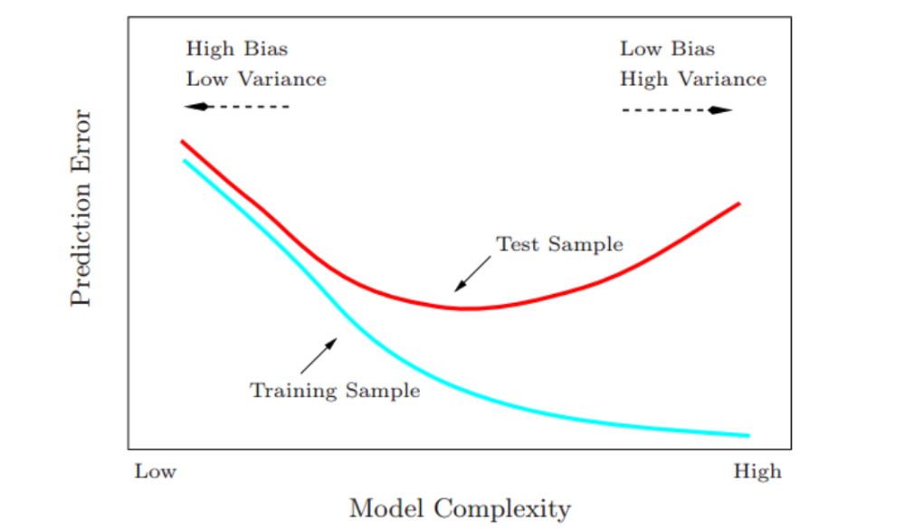

# 模型选择和偏差-方差的权衡

## 1 泛化

模型都有一个 **光滑 (smoothing)** 或 **复杂性 (complexity)** 参数需要确定

* 例如：在光滑样条的情形下，多项式模型从 **窗宽 (window size)** 无限大时阶为 mm 的全局多项式到 **窗宽 (window size)** 至零时的插值拟合模型。这意味着我们不能用训练数据的残差平方和来确定这些参数，因为我们总是选择插值拟合，因为能达到零残差。然而插值拟合的一个模型不可能用来预测未来的数据，它并不不具有泛化能力。

* 例如：$k​$近邻回归的拟合值$f_k(x_0)​$

  * 假设数据来自$Y=f_D(X)=f(X)+\epsilon, E(\epsilon)=0,Var(\epsilon)=\sigma^2​$，并且假设样本里面$x_i​$都是提前确定的（为了简化）。则在$x_0​$的误差可以进行偏差-方差分解
    $$
    EPE_k(x_0)=E_D[(f_D(x_0)-f_k(x_0;D)^2)]
    \\=E_D((f_k(x_0;D)-\bar f_k(x_0))^2)+(\bar f_k(x_0) - f(x_0))^2+E((f(x_0) - f_D(x_0))^2)
    \\=Var_D(f_k(x_0;D))+Bias^2(f_k(x_0;D))+\sigma^2
    \\ =Var_D(\frac{\sum_{i=1}^kf_D(x_{(k)})}{k})+Bias^2(f_k(x;D))+\sigma^2
    \\ = \frac{\sigma^2}{k}+[f(x_0)-\frac{\sum_{i=1}^kf(x_{(k)})}{k}]^2+\sigma^2
    $$

  * $\sigma^2$是**不可约减的 (irreducible)** 误差

  * 第二项和第三项在我们的控制范围内，并且构成了估计 $f(x_0)$ 时 $f_k(x_0)$ 的 **均方误差 (mean squared error)**，他被分解为偏差和方差部分

    * 偏差项的期望平均了训练数据中的随机量，如果真实的函数相当地光滑，这一项很可能随着 $k$ 的增加而增加。因为$k$越大，邻域越远，偏差就可能越大。
    * 方差项则随着$k$变大，越来越小
    * 因此当$k$变换时，有了**偏差-误差的权衡 (bias-variance tradeoff)**

* 更一般的，随着我们过程的 **模型复杂度 (model complexity)** 增加，方差趋于上升，偏差趋于下降，反之以然。对于$k$近邻，模型复杂度由$k$控制。

* 一般，我们选择模型复杂度使偏差与方差达到均衡从而使测试误差最小。测试误差的一个明显的估计是 **训练误差 (training error)**，但是训练误差不是测试误差的良好估计。

  * 过拟合现象

    

    无论何时增加模型复杂度，训练误差都趋于下降．然而过度的拟合，模型会自适应使得更加接近训练数据，但不能很好地进行泛化。

  * 欠拟合现象：如果模型不是特别的复杂，会 **欠拟合 (underfit)** 且有较大的偏差，也导致不能很好地泛化