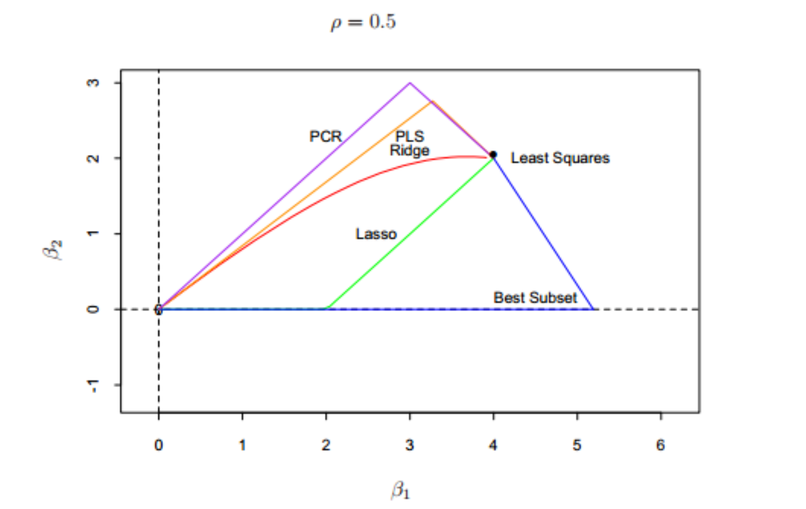
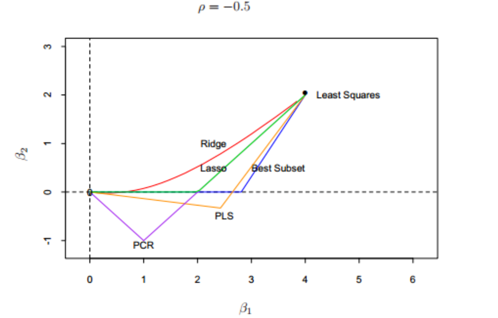

# 选择和收缩方法的比较

## 1 假设

* 为了更好地理解不同方法之间的关系，假设相关系数为$\rho$的两个相关输入变量$X_1, X_2$, 并且假设实际线性回归系数为$\beta_1=4,\beta_2=2$

## 2 实验

* 相关系数为0.5

  

* 相关系数为-0.5

  

* 可以看出

  * 岭回归，lasso在一个连续区域变化；而PCR、PLS、最优子集只要两个离散的步骤就达到了最小二乘解
  * PLS和PCR虽然离散，但是其和岭回归表现趋于一致，岭回归可能会更好，因为它收缩得很光滑，不像离散步骤中一样
  * Lasso 介于岭回归和最优子集回归中间，并且有两者的部分性质

  