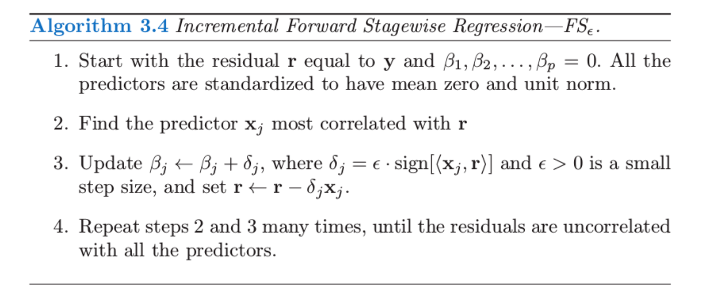
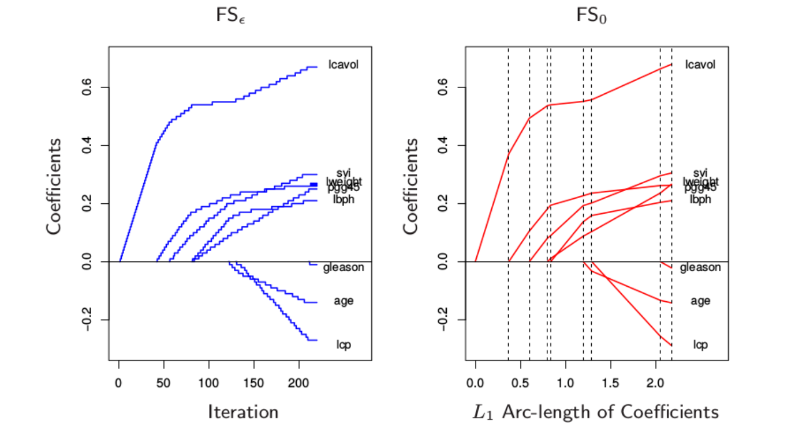
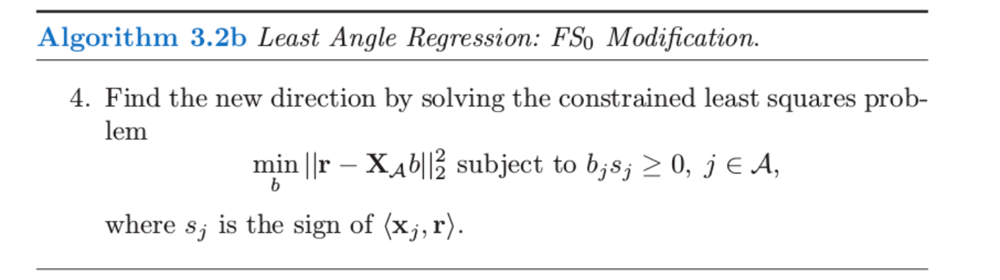
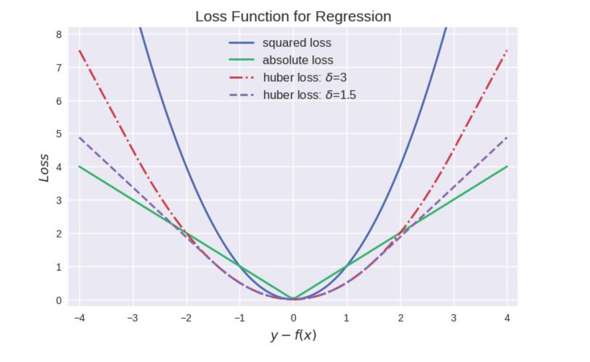
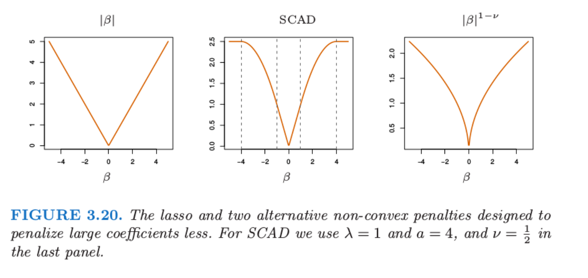

# Lasso 和相关路径算法的补充

## 1 概述

*  LAR 算法提出，许多研究都在发展对于不同问题的正则化拟合算法，这部分是一些相关的想法和以 LAR 算法为先驱的其它路径算法

## 2 增长的向前逐渐回归

* 概念：这是 **向前逐渐回归 (forward-stagewise regression)** (参考[向前逐渐回归](./3  子集的选择]))的增长版本，称为 **增长的向前逐渐回归 (Incremental Forward Stagewise Regression)**, 这是一种类似 LAR 的算法，又称$FS_{\epsilon}$

* 过程：

  * 假设$X,y$都经过标准化，均值为0

  * 定义$c(\hat\mu )$为当前的相关系数
    $$
    c(\hat \mu=X\hat\beta)=X^Tr=X^T(y-X\hat\beta)
    $$

  * 选择相关系数绝对值最大的变量，并且向概变量移动一个小变量$\epsilon$
    $$
    \hat j=\arg\max_{j}(|c_j|)\\
    \beta_j = \beta_j+ \delta_j =\beta_j+\epsilon sign(c_{\hat j})\\
    r = r-\epsilon\times sign(c_{\hat j})\mathbf{x}_j
    $$

  * 若$\delta_j=\frac{<r,x_j>}{<x_j,x_J>}$， 其就是向前逐渐回归了

* 系数路径

  * 图像

    * 以前列腺癌为例
    * 左侧$\epsilon = 0.01$, 右侧$\epsilon \rightarrow 0$。

  * 在$\epsilon \rightarrow 0$这种情形下与 lasso 路径相同。这个极限过程为 **无穷小的向前逐渐回归 (infinitesimal forward stagewise regression)** ，或者$FS_0$

    * 其与 LAR 算法均允许每个连结变量 (tied predictor) 以一种平衡的方式更新他们的系数，并且在相关性方面保持连结
    * 但是 LAR 在这些连结预测变量中的最小二乘拟合可以导致系数向相反的方向移动到它们的相关系数，因此需要对 LAR​ 算法进行修正

  * LAR 关于 $FS_0$的修正

    * 在 LAR 算法的第 4 步(见[LAR 算法](./3 子集的选择))中，系数朝着联合最小二乘方向移动，注意此时方向与最小二乘方向可能一致或者相反。这是因为LAR这里相关性相同指的是相关系数绝对值相同，所以系数增长方向能是相反的

    * 然而 $FS_0$ 中的移动方向始终与最小二乘方向保持一致

    * 因此对 LAR 算法的第 4 步修正如下

      

    * 这个修正相当于一个非负的最小二乘拟合, 保持系数的符号与相关系数的符号一致
    * 这样$FS_0$的路径也可以通过$LAR$计算出来

  * 对于 LAR 算法来说

    * 若各个系数均是单调不减或者单调不增， 则LAR, lasso, $FS_0$的路径是一致的
    * 若各个系数均不过$0$, 则LAR 的 lasso是一致的

  * $FS_0$和lasso对比

    * $FS_0$比lasso 约束更强，可以看成lasso 的单调版本，其系数曲线更光滑，所以有更小的方差（TODO: 不理解光滑和小方差）

    * $FS_0​$比lasso 更加复杂

      * lasso 是$\beta​$ 以$L_1​$范数为方向，进行单位增正后，最优化达到的残差平方和

      * $FS_0$ 是$\beta$ 在沿着系数路径$L_1$弧长为方向，进行单位增长后，最优化达到的残差平方和。这是因为$FS_0$的系数不会轻易改变方向，所以$L_1$范数就是$L_1$弧长

        > $L_1$弧长（$L_1$ arc length）：对可到曲线$\beta(s), s\in[0,S]$的$L_1$弧长为$TV(\beta,S)=\int_{0}^S \|\frac{\partial \beta}{\partial s}\|_1ds$, 对于分段函数（LAR函数曲线来说，其系数$L_1$弧长就是各个段系数$L_1$范数变换的和。

## 3 分段线性路径算法

* 对于问题
  $$
  \hat\beta(\lambda)=\arg\min_{\beta}(R(\beta)+J(\beta))\\
  \\ = \arg\min_{\beta}(\sum_{i=1}^{N}L(x_{i}^T\beta, y_i)+J(\beta))\\
  $$
  其中损失函数$L$和惩罚函数$J$都是凸函数

* 该问题解的路径 $\beta^{(λ)}​$为分段线性的充分条件为（这也意味着解的路径可以有效地计算出来）
  * $R​$关于$\beta​$ 的函数是二次或者分段二次
  * $J$关于$\beta$ 分段线性

* 例子:

  * 损失函数平方损失$L(t=y_i-x_i^T\beta)=t^2​$，和绝对误差损失$L(t=y_i-x_i^T\beta)=|t|​$

  * 损失函数为Huber loss(支持向量机的例子)
    $$
    L(t)=\rho(t,\lambda) = 
    \begin{cases}
    \lambda |t| - \lambda^2/2 & |t| > \lambda\\
    t^2 & |t|\le \lambda
    \end{cases}
    $$

    * 图像（这里的$\delta$就是$\lambda$）

      

    * 在习题 [SLS Ex 2.11](./B SLS 习题) 讨论了Huber loss和$L_1$ 正则化的等价性， 其优点是能增强平方误差损失函数(MSE, mean square error)对离群点的鲁棒性，对离群点的惩罚减小。

  * 损失函数为Hinge loss(支持向量机的例子, 具体在后面详细讨论)

    * 是用于分类器的损失函数，定义为

    * 定义
      $$
      L(y,f)=[1-yf]_{+}=\min(1-yf,0), f\in \{-1,+1\}
      $$

## 4 Dantzig 选择器

* **Dantzig selector (DS)**定义：下面准则的解称为 DS， 其中$\|\cdot\|_{\infty}$ 是无穷范数，表示向量中绝对值最大的组分
  $$
  \min_{\beta}\|\beta \|_1 \ s.t. \ {\|X^T(y-X\beta)\|}_{\infty} \le s
  \\ \Leftrightarrow \min_{\beta}{\|X^T(y-X\beta)\|}_{\infty} \ s.t. \  \|\beta \|_1 \le t
  $$

* lasso 和 DS

  * 对于活跃集中的所有变量，lasso 保持着与当前残差相同的内积（以及相关系数），并且将它们的系数向残差平方和的最优下降方向变化．在这个过程中，相同的相关系数单调下降（[习题 Ex 3.23](A 习题)），并且在任何时刻这个相关性大于非活跃集中的变量
  * Dantzig 选择器试图最小化当前残差与所有变量之间的最大内积。因此它可以达到比 lasso 更小的最大值，但是在这一过程中会发生奇怪的现象，它可以在模型中包含这样一个变量，其与当前残差的相关性小于不在活跃集中的变量与残差的相关性。（TODO：之后看论文，这里不是特别理解）

## 5 The Grouped Lasso

* 背景：当时预测变量属于预定义的群体中， 希望对群体中每个成员一起进行收缩或选择（全要某个群体，或者全不要某个群体）

* 假设$P$个预测变量被分到$L$个群体中，第$l$个群有$p_l$个成员，第$l$群的预测变量表示为$X_l$, 则有下列公式
  $$
  \min_{\beta \in R^p}(\|y - \beta_0-\sum_{l=1}^ L X_l \beta_l\|_2^2 + \lambda \sum_{i=1}^L \sqrt{p_l}\|\beta_l\|_2)
  $$

* 存在某个$\lambda$, 可以使得预测变量的整个群体都排除在模型外。这是因为$\sum_{i=1}^L \sqrt{p_l}\|\beta_l\|_2$ 这一项使得某个群体中的变量系数趋于相同（要不一起收缩，要不一起不变，欧式范数为 0 当且仅当其各组分都为 0）

## 6 lasso 的更多性质

* 这领域的结果对模型矩阵假设了如下条件
  $$
  \max_{j\in S^c} \|x_j^T X_{S} (X_{S}^TX_{S})^{-1} \|_1 \le 1-\epsilon , \epsilon \in (0, 1]
  $$

  * 其中$S$是标记真实的潜在模型中非零系数特征的子集， $X_S$是其对应的特征列。$S^c$是$S$的补集，也就是系数为0的子集， $X_{S^c}$是其对应的特征列。
  * 这个假设的含义为，$ X_{S^c}$的列在 $X_S$ 上的最小二乘系数不会太大, 即两种变量并不是高度相关的

* 可以修改 lasso 惩罚函数使得更大的系数收缩得不要太剧烈

  * **平稳削减绝对偏差法 (smoothly clipped absolute deviation, SCAD)** 用$J_{\alpha}(\beta, \lambda)$ 替换了$\lambda |\beta|$, 有公式
    $$
    \frac{dJ_{\alpha}(\beta, \lambda)}{d\beta } = \lambda sign(\beta)[I(|\beta| \le  \lambda)+\frac{（\alpha \lambda - |\beta|)_{+}}{\alpha - 1}I(|\beta| >  \lambda)]
    $$
    其中第二项降低了对较大$\beta$的收缩程度，当$\alpha \rightarrow 0$, 此时不收缩（TODO 没懂）

    

    上图展示了SCAD，lasso和$\beta^{1-v}$对降低大系数收缩程度作用，但是其使得计算变得困难（因为不是凸的

  * adaptive lasso (Zou, 2006) 采用了$\sum_{j=1}^p w_j|\beta_j| =\frac{|\beta_j|}{|\hat \beta_j^{ls}|^v}$, 这是对$|\beta|^{1-v}$(上图)的近似，但是其是凸的，就容易计算。

## 7 Pathwise Coordinate Optimization

* **简单坐标下降 (simple coordinate descent)**， 可以替代使用LAR计算 lasso 路径的算法 。想法是固定 Lagrangian 形式中的惩罚参数 λ，在控制其它参数固定不变时，相继地优化每一个参数

* 假设$\hat \beta_k(\lambda )$表示参数为$\lambda$ 的$\beta_k$的当前估计，然后要优化的参数为$\beta_j$, 公式如下假设预测变量都经过标准化得到 0 均值和单位范数）
  $$
  R(\hat\beta(\lambda), \beta_j) = \frac{1}{2}\sum_{i=1}^N (y_i-\sum_{k\not = j}x_{ik}^T\hat\beta_j(\lambda ) - x_{ij}\beta_j)^2+\lambda \sum_{k\not =j}|\hat \beta_j(\lambda)| + \lambda |\beta_j|
  $$

  * 上式可以看作响应变量为**部分残差**$y_i - \hat y_i ^{(j)} = y_i -\sum_{k\not = j}x_{ik}^T\hat\beta_j(\lambda )​$, 预测变量为$x_{ij}​$，系数为$\beta_j​$

  * 其中，除了$\beta_j$, 其他都是固定的，并且对$\beta_j$ 进行更新
    $$
    \hat\beta_j(\lambda) \leftarrow S((y-\hat y^{(j)})^Tx_j=\sum_{i=1}^N (y_i - \hat y_i ^{(j)})x_{ij},\lambda)\\
    S(t,\lambda)= sign(t)(|t|-\lambda)_{+} 是lasso中的软阈值算子
    $$

  * 这里的$(y-\hat y^{(j)})^Tx_j$是在标准化变量中，部分残差对单变量$x_{j} $的最小二乘系数

* 重复迭代,轮流考虑每个变量直到收敛，直到得到lasso估计$\hat \beta(\lambda )​$

* 该方法可以计算每个网格节点上的 lasso 解，该算法流程如下

  * 从$\lambda_0 = \lambda_{max}​$开始，$\lambda_{max} ​$是使得$\hat \beta^{lasoo}(\lambda_{max}) = 0​$的最小的$\lambda​$
  * 对$\lambda_{max}$进行缩小到新的节点, 得到$\lambda_1 = \lambda_0-\epsilon$，迭代每个变量直到收敛。
  * 再次进行缩小，$\lambda_2 =\lambda_1 - \epsilon​$, 并且采用前一个解作为 $λ​$ 新值的“warm start"。
  * 不断重复该过程，该算法可能比LARS快，因为其采用 warm start， 并且只计算网格节点的解，并没有计算整个lasso路径

   