# 习题

## Ex 3.1

* 题目：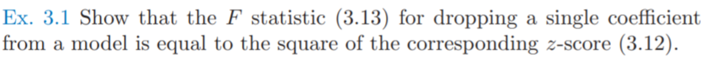

* 证明：$F\sim F(p_1-p_0,N-p_1-1)$
  * 首先证明 $\frac{(RSS_0-RSS_1)}{\sigma} \sim \chi_{k}^2​$

    * 假设：设有$k$个变量是约束为0

    * 对模型$\hat\beta_1​$有
      $$
          \hat\beta_1 = (X^TX)^{-1}X^Ty
      $$

    * 设矩阵$W_{kp_1 }$, 有

      $$
          W_{ij}\in \{0, 1\}\\
          W行向量相互正交，即WW^T=I_{k}
      $$

    * 则$RSS​$最小化可以表述为
      $$
          RSS(\beta)=(y-X\beta)^T(y-X\beta)\\
          s.t.\ W\beta=0
      $$

    * 使用拉格朗日乘子法
      $$
          F(\beta,\lambda)=RSS(\beta)+2\lambda^T W\beta\\
          \frac{\partial F}{\partial \beta}=2X^T(X\beta - y) +2 W^T\lambda=0\\
          \frac{\partial F}{\partial \lambda}=W\beta=0\\
      $$

    * 求解可得
      $$
          \hat\beta_0^TX^T(X\hat\beta_0 - y)=0\\
          \hat\beta_0^TX^TX\hat\beta_0=\hat\beta_0^TX^Ty\\
          W(X^TX)^{-1}(X^Ty- W^T\lambda)=0\\
          \hat \lambda =(W(X^TX)^{-1}W^T)^{-1} W(X^TX)^{-1}X^Ty
          \\=(W(X^TX)^{-1}W^T)^{-1} W\hat\beta_1\\
          \hat\beta_0=(X^TX)^{-1}(X^Ty- W^T\lambda)
          \\ = \hat\beta_1 -(X^TX)^{-1} W^T\hat\lambda
      $$

    * 对$RSS_0$有
      $$
          RSS_0(\beta)=(y-X\hat\beta_0)^T(y-X\hat\beta_0)\\
          \\=y^Ty-2\hat\beta_0^TX^Ty+\hat\beta_0^TX^TX\hat\beta_0
          \\ =y^Ty-2\hat\beta_0^TX^TX\hat\beta_0+\hat\beta_0^TX^Ty
          \\=y^Ty-\hat\beta_0^TX^Ty
          \\=y^Ty-\hat\beta_1^TX^Ty+\hat\lambda^TW(X^TX)^{-1}X^Ty
          \\=y^Ty-\hat\beta_1^TX^Ty+\hat\lambda^TW\hat\beta_1
      $$

    * 对$RSS_1$有
      $$
          (X^TX)^{-1}X^Ty\\
          RSS_1(\beta)=(y-X\hat\beta_1)^T(y-X\hat\beta_1)\\
          \\=y^Ty-2\hat\beta_1^TX^Ty+\hat\beta_1^TX^TX\hat\beta_1
          \\=y^Ty-2y^TX(X^TX)^{-1}X^Ty+y^TX(X^TX)^{-1}X^TX(X^TX)^{-1}X^Ty
          \\=y^Ty-y^TX(X^TX)^{-1}X^Ty
          \\=y^Ty-\hat\beta_1^TX^Ty
      $$

    * 因此有
      $$
          RSS_0-RSS_1\\
          =y^Ty-\hat\beta_1^TX^Ty+\hat\lambda^TW\hat\beta_1-(y^Ty-\hat\beta_1^TX^Ty)
          \\=\hat\lambda^TW\hat\beta_1=(W\hat\beta_1)^T\hat\lambda
          \\=(W\hat\beta_1)^T(W(X^TX)^{-1}W^T)^{-1} W\hat\beta_1 
          \\=[(W(X^TX)^{-1}W^T)^{-1/2} W\hat\beta_1]^T[(W(X^TX)^{-1}W^T)^{-1/2} W\hat\beta_1]
      $$

    * 则
      $$
      \frac{RSS_0-RSS_1}{\sigma^2}\\=
          [\frac{(W(X^TX)^{-1}W^T)^{-1/2} W\hat\beta_1}{\sigma}]^T[\frac{(W(X^TX)^{-1}W^T)^{-1/2} W\hat\beta_1}{\sigma}]
          \\ \sim \chi_{k}^2 \ \because (W(X^TX)^{-1}\sigma^2W^T)^{-1/2} W\hat\beta_1 \sim N(\mathbf{0},\mathbf{1})
      $$

  * 由于$k=1$,有($w$是列向量，且$w_j=1$, 其他全是0)
    $$
    \frac{RSS_0-RSS_1}{\sigma^2}/1\\= [\frac{(w^T(X^TX)^{-1}w)^{-1/2} w^T\hat\beta_1}{\sigma}]^T[\frac{(w(X^TX)^{-1}w^T)^{-1/2} w\hat\beta_1}{\sigma}]
    \\=[\frac{\hat\beta_{1,j}}{\sqrt{v_j}\sigma}]^2\ \because v_j 是 (X^TX)^{-1}第j个对角元
    \\
    \frac{RSS_1}{\sigma^2}/(N-p_1-1)=\frac{\hat\sigma^2}{\sigma^2}
    $$

  * 因此有
    $$
    F=\frac{\frac{RSS_0-RSS_1}{\sigma^2}/1}{\frac{RSS_1}
    {\sigma^2}/(N-p_1-1)}
    \\=\frac{[\frac{\hat\beta_{1,j}}{\sqrt{v_j}\sigma}]^2}{\frac{\hat\sigma^2}{\sigma^2}}
    \\=(\frac{\beta_{1,j}}{\sqrt{v_j}\sigma})^2=Z^2
    $$
    

## Ex 3.3

* 题目：

* 第一问
  * 首先证明$c^TX=x^T$
    $$
  \because\ \forall \beta,E(c^Ty)=c^TE(y)=c^TX\beta=x^T\beta \\
  \therefore c^TX=x^T
    $$
  * $c^Ty$的方差可以表示为
    $$
    Var(c^Ty）=E(c^Tyy^Tc)-E(c^Ty)E(y^Tc)
    \\ = c^TE(yy^T)c-c^TE(y)E(y^T)c
    \\ = c^TE((y-E(y))(y-E(y))^T)c
    \\ =c^TCov(y)c =\sigma^2 c^Tc
    $$

  * $x^T\hat\beta$的方差可以表示为
    $$
    Var(x^T\hat\beta)=Var(x^T(X^TX)^{-1}X^Ty)=\sigma^2x^T(X^TX)^{-1}X^T(x^T(X^TX)^{-1}X^T)^T
    $$

  * 则
    $$
    Var(c^Ty)-Var(x^T\hat\beta)\\
    =\sigma^2(c-X(X^TX)^{-1}x)^T(c+X(X^TX)^{-1}x)\\
    =\sigma^2((I-X(X^TX)^{-1}X^T)c)^T((I+X(X^TX)^{-1}X^T)c\\
    =\sigma^2c^T(I-X(X^TX)^{-1}X^T)^T(I-X(X^TX)^{-1}X^T)c\\
    =\sigma^2c^T(I-X(X^TX)^{-1}X^T)c\\
    =\sigma^2c^T(I-X(X^TX)^{-1}X^T)^T(I-X(X^TX)^{-1}X^T)c\ \because H=I-X(X^TX)^{-1}X^T 半正定，且H^2=H\\
    =\sigma^2((I-X(X^TX)^{-1}X^T)c)^T(I-X(X^TX)^{-1}X^T)c\ge 0
    $$

* 第二问
  $$
  Var(x^T\hat\beta)\le Var(x^T\overline\beta)\\
  x^TCov(\hat\beta)x\le x^TCov(\overline \beta)x\\
  x^T(Cov(\hat\beta)x-Cov(\overline \beta))x\le 0\\
  Cov(\hat\beta)x\le Cov(\overline \beta)
  $$
  

## Ex 3.4

* 题目：

* 知识：

  * $QR$分解：将矩阵分解为正交矩阵和上三角矩阵的乘积，事实上就是施密特正交化的过程

* 求解：
  * 首先进行$QR$分解
    $$
    (x_0,x_1,\dots,x_p)
    \\=(z_0,z_1,\dots,z_p)\left(
    \begin{matrix}
    1&\hat\gamma_{01}&\hat\gamma_{02}&\dots&\hat\gamma_{0p}\\
    &1&\hat\gamma_{12}&\dots&\hat\gamma_{1p}\\
    &&1&\dots&\hat\gamma_{2p}\\
    &&&\ddots&\vdots\\
    &&&&1
    \end{matrix}
    \right)
    \\=(\frac{z_0}{\|z_0\|},\frac{z_1}{\|z_1\|},\dots,\frac{z_p}{\|z_p\|})\left(
    \begin{matrix}
    \|z_0\|&\hat\gamma_{01}\|z_0\|&\hat\gamma_{02}\|z_0\|&\dots&\hat\gamma_{0p}\|z_0\|\\
    &\|z_1\|&\hat\gamma_{12}\|z_1\|&\dots&\hat\gamma_{1p}\|z_1\|\\
    &&\|z_2\|&\dots&\hat\gamma_{2p}\|z_2\|\\
    &&&\ddots&\vdots\\
    &&&&\|z_p\|
    \end{matrix}
    \right)
    \\=QR
    $$

  * 因此，$X\beta=y$等价于
    $$
    QR\beta=y\\
    R\beta=Q^Ty
    $$

  * 由于$R​$是上三角矩阵，所以很容易求解

    * $\|z_p\|\hat\beta_p=\frac{z_p^T}{\|z_p\|}y​$, 可得$\hat\beta_p =\frac{<z_p,y>}{<z_p,z_p>}​$

    * 若已经求出$\hat\beta_{k+1}​$, 则有
      $$
      \|z_k\|(\hat\beta_{k}+\sum_{j=k+1}^p\gamma_{kj}\hat\beta_j)=\frac{z_k^T}{\|z_k\|}y\\
      \hat\beta_k=\frac{<z_k,y>}{<z_k,z_l>}-\sum_{j=k+1}^p\gamma_{kj}\hat\beta_j)
      $$
      

## Ex 3.5

* 题目：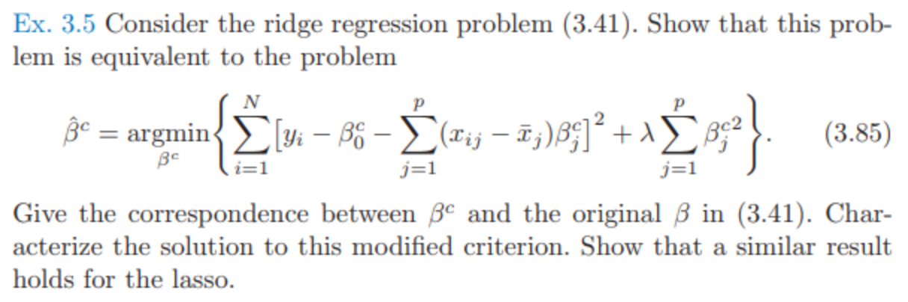

* 证明

  * 对ridge

    * 对于$X$是中心化的情况

      * 设$X$是$N*p$维，每一行都是中心化后$\mathbf{x}​$的矩阵

      * 上式可以写作
        $$
      \hat\beta^c=\arg\min_{\beta^c}\ (y-\beta_0^c-X\beta^c_{1:p})^T(y-\beta_0^c-X\beta^c_{1:p})+\lambda {\beta^c_{1:p}}^T\beta^c_{1:p}
        $$

      * 求导得
        $$
      f(\beta_0^c,\beta^c)=(y-\beta_0^c\mathbf{1}-X\beta^c_{1:p})^T(y-\beta_0^c\mathbf{1}-X\beta^c_{1:p})+\lambda {\beta^c_{1:p}}^T\beta^c_{1:p}\\
      df=(-d\beta_0^c\mathbf{1})^T(y-\beta_0^c\mathbf{1}-X\beta^c_{1:p})+(y-\beta_0^c\mathbf{1}-X\beta^c_{1:p})^T(-d\beta_0^c\mathbf{1})
      \\=-2(y-\beta_0^c\mathbf{1}-X\beta^c_{1:p})^T(d\beta_0^c\mathbf{1})
      \\=-2(\mathbf{1}^T(y-\beta_0^c\mathbf{1}-X\beta^c_{1:p}))^T\mathbf{1}d\beta_0^c\\
      \rightarrow  \frac{\partial f}{\partial \beta_0^c}=-2\mathbf{1}^T(y-\beta_0^c\mathbf{1}-X\beta^c_{1:p})=0\\
      df=(-Xd\beta^c_{1:p})^T(y-\beta_0^c\mathbf{1}-X\beta^c_{1:p})+(y-\beta_0^c\mathbf{1}-X\beta^c_{1:p})^T(-Xd\beta^c_{1:p})\\+\lambda {d\beta^c_{1:p}}^T\beta^c_{1:p}+\lambda {\beta^c_{1:p}}^Td\beta^c_{1:p}
      \\=-2(y-\beta_0^c\mathbf{1}-X\beta^c_{1:p})^TXd\beta^c_{1:p}+2\lambda {\beta^c_{1:p}}^Td\beta^c_{1:p}
      \\ = -2(X^T(y-\beta_0^c\mathbf{1}-X\beta^c_{1:p})-\lambda {\beta^c_{1:p}})^Td\beta^c_{1:p}\\
      \rightarrow  \frac{\partial f}{\partial \beta^c_{1:p}}=-2(X^T(y-\beta_0^c\mathbf{1}-X\beta^c_{1:p})-\lambda {\beta^c_{1:p}})=0
        $$

      * 联立可得
        $$
      \left\{
      \begin{align}
      &\frac{\partial f}{\partial \beta_0^c}=-2\mathbf{1}^T(y-\beta_0^c\mathbf{1}-X\beta^c_{1:p})=0\label{eq1}\\
      &\frac{\partial f}{\partial \beta^c_{1:p}}=-2(X^T(y-\beta_0^c\mathbf{1}-X\beta^c_{1:p})-\lambda {\beta^c_{1:p}})=0\label{eq2}\\
      \end{align}
      \right.
        $$

      * 由式 $\eqref{eq1}​$， 可得
        $$
      \mathbf{1}^Ty-N\beta_0^c-\mathbf{1}^TX\beta_{1:p}^c
      \\ = \sum_{i=1}^N y_i - N\beta_0^c - \mathbf{0}^T\beta_{1:p}^c=0
      \\ \rightarrow \beta_0^c = \frac{\sum_{i=1}^N y_i}{N}
        $$

      * 由式$\eqref{eq1}​$  $\eqref{eq2}​$， 可得
        $$
      X^T(y-\beta_0^c\mathbf{1}-X\beta^c_{1:p})-\lambda {\beta^c_{1:p}}
      \\ = X^T(y-\bar y-X\beta^c_{1:p})-\lambda {\beta^c_{1:p}}=0
      \\ \rightarrow \beta^c_{1:p}=(X^TX+\lambda I)^{-1}X^T(y-\bar y)
        $$

    * 而对于$X​$是未中心化的情况(即书中3.41情况)

      * 由式 $\eqref{eq1}$， 可得
        $$
        \mathbf{1}^Ty-N\beta_0-\mathbf{1}^TX\beta_{1:p}
        \\ = \sum_{i=1}^N y_i - N\beta_0^c - \mathbf{1}^TX\beta_{1:p}=0
        \\ \rightarrow \beta_0 = \frac{\sum_{i=1}^N y_i-N\bar x\beta^c_{1:p}}{N}=\bar y-\frac{\mathbf{1}^TX\beta_{1:p}}{N}
        $$

      * 由式$\eqref{eq1}$  $\eqref{eq2}$， 可得
        $$
        X^T(y-\beta_0\mathbf{1}-X\beta_{1:p})-\lambda {\beta_{1:p}}
        \\ = X^T(y-\bar y+\mathbf{1}\frac{\mathbf{1}^TX\beta_{1:p}}{N}-X\beta_{1:p})-\lambda {\beta_{1:p}}
        \\ = X^T(y-\bar y-(X\beta_{1:p}-\mathbf{1}\frac{\mathbf{1}^TX\beta_{1:p}}{N}))-\lambda {\beta_{1:p}}
        \\ = X^T(y-\bar y-(X-\mathbf{1}\bar {\mathbf{x}}^T)\beta_{1:p})-\lambda {\beta_{1:p}}
        \\ = (X-\mathbf{1}\bar {\mathbf{x}}^T)^T(y-\bar y-(X-\mathbf{1}\bar {\mathbf{x}}^T)\beta_{1:p})-\lambda {\beta_{1:p}}\\+\bar {\mathbf{x}}\mathbf{1}^T(y-\bar y)-{\mathbf{x}}\mathbf{1}^T(X-\mathbf{1}\bar {\mathbf{x}}^T)\beta_{1:p}
        \\ = (X-\mathbf{1}\bar {\mathbf{x}}^T)^T(y-\bar y-(X-\mathbf{1}\bar {\mathbf{x}}^T)\beta_{1:p})-\lambda {\beta_{1:p}}\\+\bar {\mathbf{x}}(N\bar y-N\bar y)-{\mathbf{x}}(N\bar {\mathbf{x}}^T-N\bar {\mathbf{x}}^T)\beta_{1:p}
        \\=(X-\mathbf{1}\bar {\mathbf{x}}^T)^T(y-\bar y-(X-\mathbf{1}\bar {\mathbf{x}}^T)\beta_{1:p})-\lambda {\beta_{1:p}}
        \\ \rightarrow \beta_{1:p}=((X-\mathbf{1}\bar {\mathbf{x}}^T)^T(X-\mathbf{1}\bar {\mathbf{x}}^T)+\lambda I)^{-1}(X-\mathbf{1}\bar {\mathbf{x}}^T)^T(y-\bar y)
        $$

    * 由此可见
      $$
      \beta_0=\beta_0^c-\bar {\mathbf{x}}^T\beta^c_{1:p}\\
      \beta_{1:p}=\beta^c_{1:p}
      $$

  * 对lasso

    * 可以写作
      $$
      \hat\beta^c=\arg\min_{\beta^c}\ (y-\beta_0^c-X\beta^c_{1:p})^T(y-\beta_0^c-X\beta^c_{1:p})+\lambda sign({\beta^c_{1:p}})^T\beta^c_{1:p}
      $$

    * 求导得
      $$
      f(\beta_0^c,\beta^c)=(y-\beta_0^c\mathbf{1}-X\beta^c_{1:p})^T(y-\beta_0^c\mathbf{1}-X\beta^c_{1:p})+\lambda sign({\beta^c_{1:p}})^T\beta^c_{1:p}\\
      df=(-d\beta_0^c\mathbf{1})^T(y-\beta_0^c\mathbf{1}-X\beta^c_{1:p})+(y-\beta_0^c\mathbf{1}-X\beta^c_{1:p})^T(-d\beta_0^c\mathbf{1})
      \\=-2(y-\beta_0^c\mathbf{1}-X\beta^c_{1:p})^T(d\beta_0^c\mathbf{1})
      \\=-2(\mathbf{1}^T(y-\beta_0^c\mathbf{1}-X\beta^c_{1:p}))^T\mathbf{1}d\beta_0^c\\
      \rightarrow  \frac{\partial f}{\partial \beta_0^c}=-2\mathbf{1}^T(y-\beta_0^c\mathbf{1}-X\beta^c_{1:p})=0\\
      df=(-Xd\beta^c_{1:p})^T(y-\beta_0^c\mathbf{1}-X\beta^c_{1:p})+(y-\beta_0^c\mathbf{1}-X\beta^c_{1:p})^T(-Xd\beta^c_{1:p})+\lambda sign({\beta^c_{1:p}})^Td\beta^c_{1:p}
      \\=-2(y-\beta_0^c\mathbf{1}-X\beta^c_{1:p})^TXd\beta^c_{1:p}+\lambda sign({\beta^c_{1:p}})^Td\beta^c_{1:p}
      \\ = -2(X^T(y-\beta_0^c\mathbf{1}-X\beta^c_{1:p})-\frac{\lambda sign({\beta^c_{1:p}})}{2})^Td\beta^c_{1:p}\\
      \rightarrow  \frac{\partial f}{\partial \beta^c_{1:p}}=-2(X^T(y-\beta_0^c\mathbf{1}-X\beta^c_{1:p})-\frac{\lambda sign({\beta^c_{1:p}})}{2})=0
      $$

    * 联立二式
      $$
      \left\{
      \begin{align}
      &\frac{\partial f}{\partial \beta_0^c}=-2\mathbf{1}^T(y-\beta_0^c\mathbf{1}-X\beta^c_{1:p})=0\label{eq3}\\
      &\frac{\partial f}{\partial \beta^c_{1:p}}=-2(X^T(y-\beta_0^c\mathbf{1}-X\beta^c_{1:p})-\frac{\lambda sign({\beta^c_{1:p}})}{2})=0\label{eq4}\\
      \end{align}
      \right.
      $$

    * 由式 $\eqref{eq3}​$， 可得
      $$
      \mathbf{1}^Ty-N\beta_0^c-\mathbf{1}^TX\beta_{1:p}^c
      \\ = \sum_{i=1}^N y_i - N\beta_0^c - \mathbf{0}^T\beta_{1:p}^c=0
      \\ \rightarrow \beta_0^c = \frac{\sum_{i=1}^N y_i}{N}
      $$

    * 由式$\eqref{eq3}$  $\eqref{eq4}​$， 可得
      $$
      X^T(y-\beta_0^c\mathbf{1}-X\beta^c_{1:p})-\frac{\lambda sign({\beta^c_{1:p}})}{2}
      \\ = X^T(y-\bar y-X\beta^c_{1:p})-\frac{\lambda sign({\beta^c_{1:p}})}{2}=0 \label{eq5}
      $$

    * 而对于$X$是未中心化的情况

      * 由式 $\eqref{eq3}$， 可得
        $$
        \mathbf{1}^Ty-N\beta_0-\mathbf{1}^TX\beta_{1:p}
        \\ = \sum_{i=1}^N y_i - N\beta_0^c - \mathbf{1}^TX\beta_{1:p}=0
        \\ \rightarrow \beta_0 = \frac{\sum_{i=1}^N y_i-N\bar x\beta^c_{1:p}}{N}=\bar y-\frac{\mathbf{1}^TX\beta_{1:p}}{N} \label{eq7}
        $$

      * 由式$\eqref{eq3}$  $\eqref{eq4}$， 可得
        $$
        X^T(y-\beta_0\mathbf{1}-X\beta_{1:p})-\frac{\lambda sign({\beta_{1:p}})}{2}
        \\ = X^T(y-\bar y-(X\beta_{1:p}-\mathbf{1}\frac{\mathbf{1}^TX\beta_{1:p}}{N}))-\frac{\lambda sign({\beta_{1:p}})}{2}
        \\ = X^T(y-\bar y-(X-\mathbf{1}\bar {\mathbf{x}}^T)\beta_{1:p})-\frac{\lambda sign({\beta_{1:p}})}{2}
        \\ = (X-\mathbf{1}\bar {\mathbf{x}}^T)^T(y-\bar y-(X-\mathbf{1}\bar {\mathbf{x}}^T)\beta_{1:p})-\frac{\lambda sign({\beta^c_{1:p}})}{2}\\+\bar {\mathbf{x}}\mathbf{1}^T(y-\bar y)-{\mathbf{x}}\mathbf{1}^T(X-\mathbf{1}\bar {\mathbf{x}}^T)\beta_{1:p}
        \\ = (X-\mathbf{1}\bar {\mathbf{x}}^T)^T(y-\bar y-(X-\mathbf{1}\bar {\mathbf{x}}^T)\beta_{1:p})-\frac{\lambda sign({\beta_{1:p}})}{2}\\+\bar {\mathbf{x}}(N\bar y-N\bar y)-{\mathbf{x}}(N\bar {\mathbf{x}}^T-N\bar {\mathbf{x}}^T)\beta_{1:p}
        \\=(X-\mathbf{1}\bar {\mathbf{x}}^T)^T(y-\bar y-(X-\mathbf{1}\bar {\mathbf{x}}^T)\beta_{1:p})-\frac{\lambda sign({\beta_{1:p}})}{2}=0 \label{eq6}
        $$

      * 由此$\eqref{eq7}$, 并发现$\eqref{eq5},\eqref{eq6}$形式一致，可得
        $$
        \beta_0=\beta_0^c-\bar {\mathbf{x}}^T\beta^c_{1:p}\\
        \beta_{1:p}=\beta^c_{1:p}
        $$
        

## Ex 3.6

* 题目：

* 解：

  * 假设这里的$X$都经过中心化，$\mathbf{y}$也是经过了使用$\beta_0=\bar{\mathbf{y}} $后，进行中心化的$\mathbf{y}=\mathbf{y}-\beta_0$

  * 由后验概率公式，可得
    $$
    P(\beta|y) = \frac{P(\beta,y)}{P(y)} = \frac{P(y|\beta)P(\beta)}{P(y)}  \sim P(y|\beta)P(\beta) \\=\frac{1}{\sqrt{(2\pi\sigma^2)^{N}}}\exp(-\frac{(y-X\beta)^T(y-X\beta)}{2\sigma^2})\times \frac{1}{\sqrt{(2\pi\tau)^{N}}}\exp(-\frac{\beta^T\beta}{2\tau})\\
    =C\exp(-\frac{1}{2\sigma^2}((y-X\beta)^T(y-X\beta)+\frac{\sigma^2}{\tau}\beta^T\beta))
    $$

  * 取对数可得
    $$
    log(P(\beta|y))=\log(C)-\frac{1}{2\sigma^2}((y-X\beta)^T(y-X\beta)+\frac{\sigma^2}{\tau}\beta^T\beta)
    $$

  * 可以看到
    $$
    \lambda=\frac{\sigma^2}{\tau}\\
    $$

  * 且岭回归估计是后验分布的众数、或者均值

    这是因为高斯分布共轭分布仍然是高斯分布，众数和中位数均相等

## Ex 3.8

* 题目：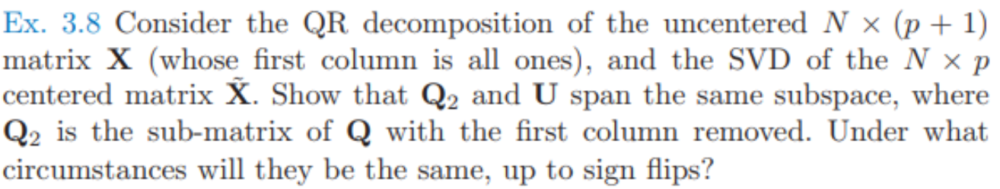

* 求解：
  * 第一问：均张成$\tilde X​$列空间

    * 根据Thin-SVD可得，$U​$是$\tilde X​$列空间的正交基

    * 由QR分解得
      $$
    X=QR\\
    =(\frac{\mathbf{1}}{\sqrt{N}}, Q_2)
    \left(
    \begin{matrix}
    R_{1,1:p}\\
    [0, R_{2:p,2:p}]
    \end{matrix}
    \right)
    \\ = \frac{\mathbf{1}R_{1,1:p}}{\sqrt{N}}+Q_2[0, R_{2:p,2:p}]
      $$

    * 由于
      $$
    R_{1,1:p}=(\sqrt{N}, \frac{<x_{1},\frac{\mathbf{1}}{\sqrt{N}}>}{<\frac{\mathbf{1}}{\sqrt{N}},\frac{\mathbf{1}}{\sqrt{N}}>}, \frac{<x_{2},\frac{\mathbf{1}}{\sqrt{N}}>}{<\frac{\mathbf{1}}{\sqrt{N}},\frac{\mathbf{1}}{\sqrt{N}}>},\dotsm,\frac{<x_{p},\frac{\mathbf{1}}{\sqrt{N}}>}{<\frac{\mathbf{1}}{\sqrt{N}},\frac{\mathbf{1}}{\sqrt{N}}>})\\
    =\sqrt{N}(1,\bar x_1,\bar x_2,\dotsm, \bar x_{p})\\
    =\sqrt{N} \bar{\mathbf{x}}^T
      $$

    * 因此有
      $$
    X-\mathbf{1}\bar{\mathbf{x}}^T=Q_2[0, R_{2:p,2:p}]\\
    \rightarrow [0, \tilde  X]=[0, Q_2R_{2:p,2:p}]\\
    \rightarrow \tilde  X = Q_2R_{2:p,2:p}
      $$

    * 由此可见，$Q_2$和$U$都是$\tilde X$列空间的正交基，均张成$\tilde X$的列空间

  * 第二问：什么条件下$Q_2$和$U$相等
    * 由SVD
      $$
    \tilde X = UD V^T
      $$

    * 若$Q_2 = \pm U$, 则
      $$
    R_{2:p,2:p}=\pm DV^T
      $$

    * 因此$R_{2:p,2:p}$ 是正交阵，且是对角元素不为0的上三角阵，则$R_{2:p,2:p}$必定是对角阵

      证明：对角元素不为0的上三角阵$M$，若$M$正交，则必定是对角阵

      * 记$M=\{v_1,v_2,\dotsm,v_p\}$
      * 由$<v_1, v_i>=0, i>1$, 可以得到$v_i, i > 1​$的第一行是0
      * 由$<v_2, v_i>=0, i>1$, 可以得到$v_i, i > 2$的第二行是0
      * 以此类推，$M$是对角阵

    * 因此得出$\tilde X$ 列向量正交

    

## Ex 3.9

* 题目：

  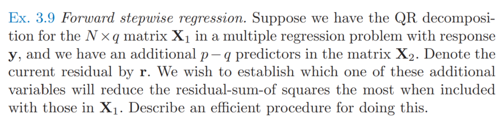

* 解：

  * 定义
    * 记$X_1$的第$j$列为$X_j$
    * 记${X_2}$的第$j$列为$X_{q+j}$
    * 记$Q$为$(u_1,u_2,...,u_q)$

  * 求解：

    * 因为$X_1$可以进行$QR$分解
      $$
      X_1=QR
      $$

    * 当新加入变量$X_{q+j}$
      $$
      X_*=[X,x_{q+j}]\\
      z_{q+j}=x_{q+j}-\sum_{i=1}^q Proj_{u_i}(x_{q+j})\\
      =x_{q+j}-\sum_{i=1}^qu_i<u_i, x_{q+j}>\\
      =x_{q+j}-\sum_{i=1}^qu_iu_i^Tx_{q+j}\\
      =(I-QQ^T)x_{q+j}\\
      Q_*=(Q,u_{q+j}=\frac{z_{q+j}}{\|z_{q+j}\|})
      $$

    * 因此
      $$
      \hat y=QQ^Ty\\
      \hat y_*=Q_*Q_*^Ty\\
      =(Q,u_{q+j})(Q,u_{q+j})^Ty\\
      =(QQ^T+u_{q+j}u_{q+j}^T)y\\
      \\ = \hat y + u_{q+j}u_{q+j}^Ty
      $$

    * 计算残差可以得到
      $$
      r_*=\hat y+u_{q+j}u_{q+j}^Ty-y\\
      = r+u_{q+j}u_{q+j}^Ty\\
      r_*^Tr_*=(r+u_{q+j}u_{q+j}^Ty)^T(r+u_{q+j}u_{q+j}^Ty)\\
      =r^Tr+y^Tu_{q+j}u_{q+j}^Tr+ru_{q+j}u_{q+j}^Ty+y^Tu_{q+j}u_{q+j}^Tu_{q+j}u_{q+j}^Ty\\
      =r^Tr+y^Tu_{q+j}u_{q+j}^Tr+r^Tu_{q+j}u_{q+j}^Ty+y^Tu_{q+j}u_{q+j}^Ty
      \\ = r^Tr+2r^Tu_{q+j}u_{q+j}^Ty+y^Tu_{q+j}u_{q+j}^Ty
      \\ = r^Tr+(2r+y)^Tu_{q+j}u_{q+j}^Ty
      $$

    * 因此只需要最小化
      $$
      S=(2r+y)^Tu_{q+j}u_{q+j}^Ty
      \\ =\frac{（2r+y)^T(I-QQ^T)x_{q+j}x_{q+j}^T(I-QQ^T)y}{\|(I-QQ^T)x_{q+j}\|}
      \\ = \frac{y^T(3I-QQ^T)(I-QQ^T)x_{q+j}x_{q+j}^T(I-QQ^T)y}{\|(I-QQ^T)x_{q+j}\|}
      \\ =  \frac{y^T(3I-QQ^T-3QQ^T+QQ^T)x_{q+j}x_{q+j}^T(I-QQ^T)y}{\|(I-QQ^T)x_{q+j}\|}
      \\ = 3\frac{y^T(I-QQ^T)x_{q+j}x_{q+j}^T(I-QQ^T)y}{x_{q+j}^T(I-QQ^T)(I-QQ^T)x_{q+j}}
      \\ = 3\frac{\|r^Tx_{q+j}\|}{x_{q+j}^T(I-QQ^T)x_{q+j}}
      $$

    * 可得
      $$
      j_*=\arg\min_{j} \frac{\|r^Tx_{q+j}\|}{x_{q+j}^T(I-QQ^T)x_{q+j}}
      $$
      

## Ex 3.10

* 题目：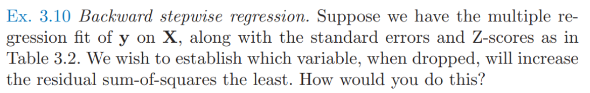

  

* 解：

  * 先去掉gleason，因为他的显著性水平最低
  * 然后重新计算Z score，不断循环

## Ex 3.11

* 题目：

* 

* 第一问：
  * 解法1:
    * $RSS$ 的公式可以转化为非加权的情况
      $$
    RSS(B;Z)=\sum_{i=1}^N(y_i-f(x_i))^T\Sigma^{-1}(y_i-f(x_i))
    \\=tr[(Y-XB)\Sigma^{-1}(Y-XB)^T]\because 矩阵分块
    \\=tr[(Y-XB){\Sigma^{-1/2}}^T\Sigma^{-1/2}(Y-XB)^T]\because 协方差矩阵特征值分解
    \\=tr[(Y{\Sigma^{-1/2}}^T-XB{\Sigma^{-1/2}}^T)(Y{\Sigma^{-1/2}}^T-XB{\Sigma^{-1/2}}^T)^T]
      $$
    * 然后根据原来非加权求解公式
      $$
      \hat B=(X^TX)^{-1}X^TY
      $$
    * 可得
      $$
    \hat B{\Sigma^{-1/2}}^T=(X^TX)^{-1}X^TY{\Sigma^{-1/2}}^T\\
    \hat B=(X^TX)^{-1}X^TY
      $$

  * 解法2:

    * $RSS$公式可以看作
      $$
      RSS(B;Z)=\sum_{i=1}^N(y_i-f(x_i))^T\Sigma^{-1}(y_i-f(x_i))
      \\ =tr[(Y-XB)\Sigma^{-1}(Y-XB)^T]\because 矩阵分块
      $$

    * 求微分
      $$
      dRSS=tr((-XdB)\Sigma^{-1}(Y-XB)^T+(Y-XB)\Sigma^{-1}(-XdB)^T)
      \\ =tr(\Sigma^{-1}(Y-XB)^T(-XdB)+(-XdB)^T(Y-XB)\Sigma^{-1})
      \\ =tr(\Sigma^{-1}(Y-XB)^T(-XdB)+\Sigma^{-1}(Y-XB)^T(-XdB))
      \\ =tr(-2(X^T(Y-XB)\Sigma^{-1})^TdB)
      $$

    * 可以得出导数为
      $$
      \frac{\partial RSS}{\partial B}=-2(X^T(Y-XB)\Sigma^{-1}) =0
      \\ \rightarrow X^T(Y-XB)\Sigma^{-1}=0
      \\ \rightarrow X^T(Y-XB)=0\ \because \Sigma^{-1} 可逆
      \\ \rightarrow B=(X^TX)^{-1}X^TY
      $$
      

* 第二问(TODO)：

  * 定义：

    * 矩阵向量化$Vec$运算符
      $$
      Vec(X) = [X_{11},...,X_{m1}, X_{12},...,X_{m2}, ...., X_1n,...,X_{mn}]^T
      $$

    * $K_{mn}​$ 是交换矩阵,将按列优先的向量化变为按行优先的向量化，例如
      $$
      Vec(A^T)=K_{mn}Vec(A)
      \\K_{23}=\left[
      \begin{matrix}
      1 & 0 & 0 & 0 & 0 & 0\\
      0 & 0 & 1 & 0 & 0 & 0\\
      0 & 0 & 0 & 0 & 1 & 0\\
      0 & 1 & 0 & 0 & 0 & 0\\
      0 & 0 & 0 & 1 & 0 & 0\\
      0 & 0 & 0 & 0 & 0 & 1
      \end{matrix}
      \right]
      ,
      Vec(A^T) = 
      \left[
      \begin{matrix}
      A_{11} \\ A_{12} \\ A_{13} \\
      A_{21} \\ A_{22} \\ A_{23}
      \end{matrix}
      \right]
      ,
      Vec(A) = 
      \left[
      \begin{matrix}
      A_{11} \\ A_{21} \\ A_{12} \\
      A_{22} \\ A_{13} \\ A_{23}
      \end{matrix}
      \right]
      $$
      且有$K_{mn} = K_{nm}^T, K_{mn}K_{nm} = I$

    * $\otimes$是$kronecker$积

  * 对公式进行变换得到
    $$
    RSS(B;Z)=\sum_{i=1}^N(y_i-f(x_i))^T\Sigma_i^{-1}(y_i-f(x_i))
    \\=Vec((Y-XB)^T)^T\left(
    \begin{matrix}
    \Sigma_1^{-1} & 0 & 0 & \dots & 0\\
    0 & \Sigma_2^{-1} & 0 & \dots & 0\\
    0 & 0 & \Sigma_3^{-1} & \dots & 0\\
    0 & 0 & 0 & \ddots & \vdots\\
    0 & 0 & 0 & 0 & \Sigma_N^{-1}\\
    \end{matrix}
    \right) Vec((Y-XB)^T)
    \\=[K_{Nk}Vec(Y)-K_{Nk}(I_k\otimes X)Vec(B)]^T
    \\ diag({\Sigma_1}^{-1},{\Sigma_2}^{-1},\dots,{\Sigma_N}^{-1})
    \\ [K_{Nk}Vec(Y)-K_{Nk}(I_k\otimes X)Vec(B)]
    $$

  * 求微分
    $$
    dRSS=d([K_{Nk}Vec(Y)-K_{Nk}(I_k\otimes X)Vec(B)]^Tdiag({\Sigma_1}^{-1},{\Sigma_2}^{-1},\dots,{\Sigma_N}^{-1}) \\ [K_{Nk}Vec(Y)-K_{Nk}(I_k\otimes X)Vec(B)])
    \\=[-K_{Nk}(I_k\otimes X)dVec(B)]^Tdiag({\Sigma_1}^{-1},{\Sigma_2}^{-1},\dots,{\Sigma_N}^{-1}) \\ [K_{Nk}Vec(Y)-K_{Nk}(I_k\otimes X)Vec(B)]
    \\+[K_{Nk}Vec(Y)-K_{Nk}(I_k\otimes X)Vec(B)]^T diag({\Sigma_1}^{-1},{\Sigma_2}^{-1},\dots,{\Sigma_N}^{-1})\\ [-K_{Nk}(I_k\otimes X)dVec(B)]
    \\=-2[K_{Nk}Vec(Y)-K_{Nk}(I_k\otimes X)Vec(B)]^Tdiag({\Sigma_1}^{-1},{\Sigma_2}^{-1},\dots,{\Sigma_N}^{-1})\\K_{Nk}(I_k\otimes X)dVec(B)
    \\=[-2(I_k\otimes X^T)K_{kN}diag({\Sigma_1}^{-1},{\Sigma_2}^{-1},\dots,{\Sigma_N}^{-1})[K_{Nk}Vec(Y)-K_{Nk}(I_k\otimes X)Vec(B)]]^T\\dVec(B)
    $$

  * 可得
    $$
    \frac{\partial RSS}{\partial Vec(B)}
    \\=-2(I_k\otimes X^T)K_{kN}diag({\Sigma_1}^{-1},{\Sigma_2}^{-1},\dots,{\Sigma_N}^{-1})[K_{Nk}Vec(Y)-K_{Nk}(I_k\otimes X)Vec(B)]=0
    \\ \rightarrow -2(I_k\otimes X^T)K_{kN}diag({\Sigma_1}^{-1},{\Sigma_2}^{-1},\dots,{\Sigma_N}^{-1})K_{Nk}[Vec(Y)-(I_k\otimes X)Vec(B)]=0
    $$

  * 由于$(I_k\otimes X^T)$是行满秩，而列不满秩，且列秩和行秩均为为$kp$，因此$-2(I_k\otimes X^T)K_{kN}diag({\Sigma_1}^{-1},{\Sigma_2}^{-1},\dots,{\Sigma_N}^{-1})K_{Nk}$的秩也为$kp $

  * 因此，$Vec(Y)-(I_k\otimes X)Vec(B)$有$kN-kp$个线性无关的非0解，则解空间$S$可以表示为($c_i​$是解空间基向量)
    $$
    S=
    \{x|x=\sum_{i=1}^{kN-kp}k_ic_i\}
    $$

  * 因此有
    $$
    Vec(Y)-(I_k\otimes X)Vec(B)=\sum_{i=1}^{kN-kp}k_ic_i\\
    (I_k\otimes X)Vec(B)=Vec(Y)-\sum_{i=1}^{kN-kp}k_ic_i\\
    Vec(B) = ((I_k\otimes X)^T(I_k\otimes X))^{-1}(I_k\otimes X)^T(Vec(Y)-\sum_{i=1}^{kN-kp}k_ic_i)\ \because (I_k\otimes X)列满秩
    $$

  * 因此可以得出结论，$B​$的最优解有多个

    

## Ex 3.13 

* 题目

  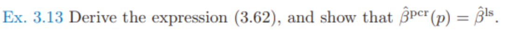

* 第一问
  $$
  \hat y ^{pcr}_{(M)}=\bar y\mathbf{1}+\sum_{m=1}^M \hat \theta_m z_m
  \\ = \bar y\mathbf{1}+X\sum_{m=1}^M \hat \theta_m v_m
  \\ \rightarrow \hat\beta^{pcr}_{(M)}=\sum_{m=1}^M \hat \theta_m v_m
  $$

* 第二问

  * 根据公式，有
    $$
    \hat\beta^{pcr}_{(p)}=\sum_{m=1}^p \hat \theta_m v_m
    \\ = \sum_{m=1}^p \frac{<z_m, y>}{<z_m,z_m>} v_m
    \\ =V 
    \left\{\begin{matrix}
    z_1^Tz_1&&&\\
    &z_2^Tz_2&&\\
    &&\ddots&\\
    &&& z_p^Tz_p
    \end{matrix}\right\}^{-1} Z^Ty
    \\ = V(V^TX^TXV)^{-1}V^TX^T y
    \\ = VV^T(X^TX)^{-1}VV^TX^Ty
    \\ = (X^TX)^{-1}Xy=\hat \beta^{ls}
    $$
    

## Ex 3.14

* 题目：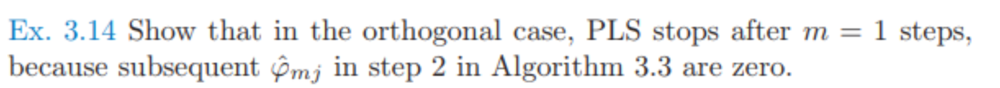

* 证明：

  * $m=1$时

    * 根据算法有
      $$
      \phi_1={X^{(0)}}^Ty
      \\z_1=X^{(0)}\phi_1=X^{(0)}{X^{(0)}}^Ty = X^{(0)}({X^{(0)}}^TX^{(0)})^{-1}{X^{(0)}}^Ty
      $$

    * 因此，预测为
      $$
      \hat y^{(m)}=\hat y^{(m-1)}+\hat\theta_m z_m
      \\ = \bar y\mathbf{1}+\frac{<z_m,y>}{<z_m, z_m>}z_m
      \\ = \bar y\mathbf{1}+\frac{y^TX^{(0)}{X^{(0)}}^Ty}{y^TX^{(0)}{X^{(0)}}^TX^{(0)}{X^{(0)}}^Ty}z_m
      \\ = \bar y\mathbf{1}+z_m=\bar y\mathbf{1}+X^{(0)}({X^{(0)}}^TX^{(0)})^{-1}{X^{(0)}}^Ty
      $$

    * 可见，其最小二乘解就是$m=1​$的情况

  * $m=2$时

    * 根据$x^{(m)}_j=x^{(m-1)}_{j}-\frac{<z_m,x^{(m-1)}_j>}{<z_m,z_m>}z_m​$, 有
      $$
      \phi_{2j}=<{x^{(1)}_j},y>
      \\=<x_j^{(0)}-\frac{<z_1,x_j^{(0)}>}{<z_1,z_1>}z_1, y>
      \\ = <x_j^{(0)}-\frac{<z_1,x_j^{(0)}>}{<z_1,z_1>}z_1, y>
      \\ = <x_j^{(0)}, y> - <\frac{<z_1,x_j^{(0)}>}{<z_1,z_1>}z_1, y>
      \\ = \phi_{1j}-<\frac{\phi_{1j}}{\sum_{j=1}^P \phi_{1j}^2}\sum_{j=1}^P \phi_{1j}x_j^{(0)},y>
      \\ = \phi_{1j}-\frac{\phi_{1j}}{\sum_{j=1}^P \phi_{1j}^2}\sum_{j=1}^P \phi_{1j}<x_j^{(0)},y>
      \\ = \phi_{1j}-\frac{\phi_{1j}}{\sum_{j=1}^P \phi_{1j}^2}\sum_{j=1}^P \phi_{1j}\phi_{1j}=0
      $$
      

  * $m>2$时

    * 若$k=m-1$使得$\phi_{k}=\phi_{m-1}=0, $即有${X^{(m-2)}}^Ty =\mathbf{0} $

    * 则当$k=m​$， 有
      $$
      \phi_{mj}={x^{(m-1)}}^Ty
      \\ =(x^{(m-2)}-\frac{<z_{m-1},x^{(m-2)}_j>}{<z_{m-1},z_{m-1}>}z_{m-1})^Ty
      \\ = (x^{(m-2)}-\frac{<z_{m-1},x^{(m-2)}_j>}{<z_{m-1},z_{m-1}>}\sum_{j=1}^P \phi_{m-1}x_j^{(m-2)})^Ty
      \\ = (x^{(m-2)}-\frac{<z_{m-1},x^{(m-2)}_j>}{<z_{m-1},z_{m-1}>}\sum_{j=1}^P \phi_{m-1}x_j^{(m-2)})^Ty
      \\ = {x^{(m-2)}}^Ty=0
      $$

    * 根据数学归纳，因此有$\phi_m=0,m>2$

## Ex 3.20

* 题目：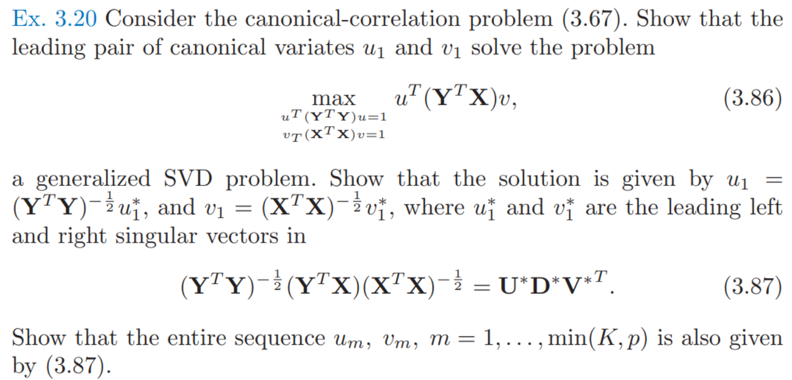

* 假设：假设 $Y$ 和 $X$ 均被中心化

* 前置知识：

  * 若$\Sigma$是(半)正定矩阵，则他存在唯一的平方根$\Sigma^{1/2}$使得$\Sigma=\Sigma^{1/2}\Sigma^{1/2}$, 且$\Sigma^{1/2}$对称并且(半)正定

* 第一问：

  * 由典型相关分析可知，其求解的是最大化相关系数
    $$
    Corr(Xv_1,Yu_1)=\frac{Cov(Xv_1,Yu_1)}{\sqrt{Cov(Xv_1)Cov(Yu_1)}}
    \\ = \frac{u_1^T(Y^TX)v}{\sqrt{v_1^TX^TXv_1}\sqrt{u_1^TY^TYu_1}}
    $$

  * 因为如果分子分母增大相同的倍数，优化目标结果不变

    * 若$v_1$增大$a$倍，$u_1$增大$b$倍，则分子增大$ab$倍，分母也增大$ab$倍
    * 因此可以限制分母$v_1^TX^TXv_1=1, u_1^TY^TYu_1=1$

  * 因此问题可以变为
    $$
    \max_{u^T(Y^TY)u=1\\
    v^T(X^TX)v=1} u^T(Y^TX)v
    $$

* 第二问(方法1 SVD)

  * 对于约束$v^TX^TXv=1, u^TY^TYu=1$, 可以得到
    $$
    ((X^TX)^{1/2}v)^T((X^TX)^{1/2}v)=1\\
    ((Y^TY)^{1/2}u)^T((Y^TY)^{1/2}u)=1\\
    $$

  * 记$v^*=(X^TX)^{1/2}v, u^*=(Y^TY)^{1/2}u$, 因此问题变为
    $$
    \max_{{u^*}^Tu^*=1\\{v^*}^Tv^*=1}{u^*}^T(Y^TY)^{-1/2}(Y^TX)(X^TX)^{-1/2}v^*
    $$

  * 对$H=(Y^TY)^{-1/2}(Y^TX)(X^TX)^{-1/2}$进行SVD分解得到
    $$
    H=U^*D^*{V^*}^T
    $$

  * 因为$u^*$是$U^*$的线性组合，$v^*$是$V^*$的线性组合（因为两者都构成空间的正交基），因此有
    $$
    u^*=U^*a\\
    v^*=V^*b
    $$

  * 因为${u^*}^Tu^*=1,{v^*}^Tv^*=1$，所以
    $$
    a^T{U^*}^TU^*a=a^Ta=1\\
    b^T{V^*}^TV^*b=b^Tb=1
    $$

  * 因此可以转化为优化问题
    $$
    \max_{a^Ta=1\\b^Tb=1}a^T{U^*}^THV^*b
    \\\leftrightarrow \max_{a^Ta=1\\b^Tb=1}a^T{U^*}^TU^*D^*{V^*}^TV^*b
    \\\leftrightarrow \max_{a^Ta=1\\b^Tb=1}a^TD^*b
    $$

  * 因此，当$a$取$H$最大奇异值的行（$D^*$第一行）为1，其他为0，$b$取$H$最大奇异值的列（$D^*$第一列）为1，其他为0，该式子达到最大

  * 此时$u^*=U^*a$是最大奇异值对应的左奇异向量，$v^*=V^*b$最大奇异值对应的左奇异向量，并且有
    $$
    v=(X^TX)^{-1/2}v^*\\
    u=(Y^TY)^{-1/2}u^*\\
    $$

* 第三问(方法1)

  * 由于当$m>1 $时，新的线性组合$Xv_m,Yu_m$必须和之前的正交，即
    $$
    (Xv_j)^T(Xv_m)=v_j^TX^TXv_m=0\\
    (Yu_j)^T(Yu_m)=u_j^TY^TYu_m=0\\
    $$

  * 因此$v^*=(X^TX)^{1/2}v, u^*=(Y^TY)^{1/2}u$也和之前求得的正交
    $$
    {v^*_j}^Tv^*_m=v_j^T(X^TX)^{1/2}(X^TX)^{1/2}v_m=v_j^T(X^TX)v_m=0\\
    {u^*_j}^Tu^*_m=u_j^T(Y^TY)^{1/2}(Y^TY)^{1/2}u_m=u_j^T(Y^TY)u_m=0\\
    $$

  * 因此$a,b$之前选过的地方必须是0，所以第$m$个$u^*,v^*$就应该是第$m$大奇异值对应的左右奇异向量

* 第二问(方法2 拉格朗日乘子法)

  * 对问题进行拉格朗日乘子法得到
    $$
    \max_{u^T(Y^TY)u=1\\
    v^T(X^TX)v=1} u^T(Y^TX)v\\
    J(u,v,\lambda)=u^T(Y^TX)v-\frac{\lambda_1}{2}(u^T(Y^TY)u-1)-\frac{\lambda_2}{2}(v^T(X^TX)v-1)
    $$

  * 求导得
    $$
    \frac{\partial J}{\partial u}=(Y^TX)v-\lambda_1(Y^TY)u=0\\
    \frac{\partial J}{\partial v}=(X^TY)u-\lambda_2(X^TX)v=0\\
    $$

  * 因此有
    $$
    u^T\frac{\partial J}{\partial u}=u^T(Y^TX)v-\lambda_1u^T(Y^TY)u=0\\
    v^T\frac{\partial J}{\partial v}=v^T(X^TY)u-\lambda_2v^T(X^TX)v=0\\
    \rightarrow \lambda_1 = \lambda_2=v^T(X^TY)u=\lambda
    $$

  * 根据导数，并记$v^*=(X^TX)^{1/2}v, u^*=(Y^TY)^{1/2}u$, 有
    $$
    (Y^TY)^{-1/2}\frac{\partial J}{\partial u}=(Y^TY)^{-1/2}(Y^TX)(X^TX)^{-1/2}v^*-\lambda u^*=0\\
    (X^TX)^{-1/2}\frac{\partial J}{\partial v}=(X^TX)^{-1/2}(X^TY)(Y^TY)^{-1/2}u^*-\lambda v^*=0\\
    $$

  * 记$M=(Y^TY)^{-1/2}(Y^TX)(X^TX)^{-1/2}$, 也就是有
    $$
    Mv^*=\lambda u^*\\
    M^Tu^*=\lambda v^*
    $$

  * 也有因此有
    $$
    M^TMv^*=\lambda M^Tu^*=\lambda^2v^*\\
    MM^Tu^*=\lambda Mv^*=\lambda^2 u^*
    $$

  * 根据奇异值分解的推导（具体见[奇异值分解](..\A 基础知识\A.1 代数理论\2 协方差矩阵与矩阵分解), $v$和$u$分别都是$M$的右奇异向量和左奇异向量，而$\lambda$就是其对应的奇异值，由于$\lambda=v^T(X^TY)u$同时也是最优化目标，所以取最大奇异值对应的奇异向量即可

* 第三问(方法2)

  * 根据上面的推导，当$m>1 $时，$v^*=(X^TX)^{1/2}v, u^*=(Y^TY)^{1/2}u$也和之前求得的正交
  * 由于$\lambda=v^T(X^TY)u$是最优化目标， 而因为正交，所以当$m=2$时，$u^*$和$v^*$就应该取第二大奇异值对应的奇异向量

## Ex 3.21

* 题目：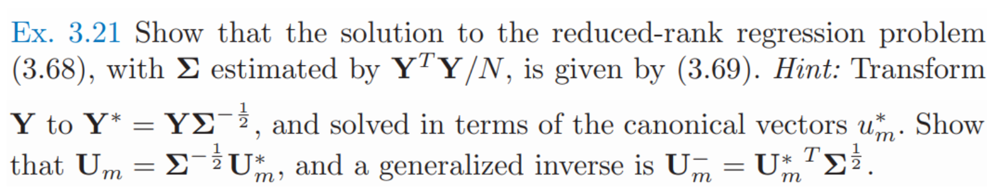

* 求解

  * $\hat B^{rr}(m)$的公式为
    $$
    \hat B^{rr}(m)\\ = {\arg\max}_{rank(B)=m}tr((Y-XB)\Sigma^{-1}(Y-XB)^T)
    $$

  * 因为$\Sigma=\frac{Y^TY}{N}$, 所以其正定并且可以得出其平方根$\Sigma^{1/2}$, 化简公式得到
    $$
    tr((Y-XB)\Sigma^{-1}(Y-XB)^T)
    \\ =tr((Y\Sigma^{-1/2}-XB\Sigma^{-1/2})(Y\Sigma^{-1/2}-XB\Sigma^{-1/2})^T)
    \\ = tr((Y^*-XB\Sigma^{-1/2})(Y^*-XB\Sigma^{-1/2})^T)
    \\ = tr((Y^*-XB\Sigma^{-1/2})^T(Y^*-XB\Sigma^{-1/2}))
    \\ = tr((Y^*)^TY^*-\Sigma^{-1/2}B^TX^TY^*-(Y^*)^TXB\Sigma^{-1/2}+\Sigma^{-1/2}B^TX^TXB\Sigma^{1/2})
    \\ = tr((Y^*)^TY^*-(X^TY^*)^T(X^TX)^{-1}(X^TY^*))
    \\+ tr((X^TY^*)^T(X^TX)^{-1}(X^TY^*)-\Sigma^{-1/2}B^TX^TY^*-(Y^*)^TXB\Sigma^{-1/2}+\Sigma^{-1/2}B^TX^TXB\Sigma^{1/2})
    \\ =tr((Y^*)^TY^*-(X^TY^*)^T(X^TX)^{-1}(X^TY^*))
    \\+tr(((X^TX)^{-1/2}X^TY^*-(X^TX)^{1/2}B\Sigma^{-1/2})^T((X^TX)^{-1/2}X^TY^*-(X^TX)^{-1/2}B\Sigma^{1/2}))
    $$

  * 则只需要求
    $$
    \hat B^{rr}(m) = {\arg\max}_{rank(B)=m}
    \\tr(((X^TX)^{-1/2}X^TY^*-(X^TX)^{1/2}B\Sigma^{-1/2})^T((X^TX)^{-1/2}X^TY^*-(X^TX)^{-1/2}B\Sigma^{1/2}))
    $$

  * 引理：若有$Z_{J\times K}​$, $A_{J\times K}​$, 且$Rank(Z)=min(J,K), Rank(A)=m < Rank(Z)​$, 则有
    $$
    A^*=\arg\min_{A}\|Z-A\|^2=\arg\min_{A}\sum_{i=1}^J\sum_{j=1}^K (Z_{i,j}-A_{i,j})^2
    \\=\arg\min_{A}tr((Z-A)^T(Z-A))
    \\ A^*=\sum_{i=1}^m \mu_iU_iV_i^T
    $$
    其中，$\mu_i​$是$Z​$的第$i​$大奇异值，$u_i, v_i​$是其对应的左右奇异向量

    * 证明：

      * 因为$Rank(A)=m​$, 则$A​$只有$m​$个非0的奇异值，记$A​$为
        $$
        A=X\Phi Y^T\ \because 奇异值分解
        \\=\sum_{i=1}^m \phi_i X_iY_i^T
        $$
        其中$\Phi​$只有对角元有值，设其有且只有前$m​$个对角元非0

      * 对目标函数进行微分，得到
        $$
        d(tr((Z-A)^T(Z-A)))
        \\= tr(-dA^T(Z-A)-(Z-A)^TdA)
        \\ = -2tr((Z-A)^TdA)
        \\ = -2tr(\Phi Y^T(Z-X\Phi Y^T)^TdX+dY((Z-X\Phi Y^T)^TX\Phi)^T)
        \\ = -2tr(((Z-X\Phi Y^T)Y\Phi^T)^TdX+((Z-X\Phi Y^T)^TX\Phi)^TdY)
        \\ 
        \left\{
        \begin{matrix}
        \frac{\partial f}{\partial X} = -2(Z-X\Phi Y^T)Y\Phi^T =0
        \\ \frac{\partial f}{\partial Y} = -2(Z-X\Phi Y^T)^TX\Phi=0
        \end{matrix}
        \right.
        \\ \leftrightarrow 
        \left\{
        \begin{matrix}
        ZY\Phi^T-X\Phi\Phi^T=0
        \\ Z^TX\Phi-Y\Phi^T\Phi =0
        \end{matrix}
        \right.
        \\ \leftrightarrow 
        \left\{
        \begin{matrix}
        X(\Phi\Phi^T)_i = ZY\Phi^T_i\ 
        \\Y(\Phi^T\Phi)_i=Z^TX\Phi_i
        \end{matrix}
        \right.(i=1,2,\dots, m)
        \\ \leftrightarrow 
        \left\{
        \begin{matrix}
        X_i\phi_i^2 = ZY_i\phi_i\ \leftrightarrow X_i\phi_i=ZY_i
        \\Y_i\phi_i^2=Z^TX_i\phi_i\leftrightarrow Y_i\phi_i=Z^TX_i
        \end{matrix}
        \right.(i=1,2,\dots, m)
        $$

      * 由此得到取极值点的必要条件
        $$
        \left\{
        \begin{matrix}
        X_i\phi_i=ZY_i \\
        Y_i\phi_i=Z^TX_i
        \end{matrix}
        \right.(i=1,2,\dots, m)\label{ex_21_1}
        $$

      * 根据上式，可以推出
        $$
        \left\{
        \begin{matrix}
        Y_i\phi_i^2=Z^TZY_i \\
        X_i\phi_i^2=ZZ^TX_i
        \end{matrix}
        \right.(i=1,2,\dots, m) \label{ex_21_2}
        $$

      * 可以推出，$Y_i$是$Z^TZ$特征向量， $X_i$的$ZZ^T$的特征向量，同时根据奇异值分解的定义，$X_i,Y_i$分别是$Z$左右奇异向量，$\phi_i$是$Z$的奇异值，即（这里只要是不同的奇异值即可，还未说明是最大的$m$个奇异值）
        $$
        \phi_i=\mu_i, X_i=U_i, Y_i=V_i\ (i=1,2,\dots, m) \label{ex_21_3}
        $$
        此时又可以推出$\eqref{ex_21_1}$, 因此得到$\eqref{ex_21_1}, \eqref{ex_21_2},\eqref{ex_21_3}$相互等价，且都是目标函数极值点的必要条件。

      * 此时
        $$
        A=\sum_{i=1}^m \phi_i X_iY_i^T=\sum_{i=1}^m\mu_iU_iV_i^T
        $$

      * 此时求得的值为
        $$
        tr((Z-A)^T(Z-A))=tr((\sum_{i=m+1}^{min(J,K)}\mu_i U_iV_i^T )^T(\sum_{i=m+1}^{min(J,K)}\mu_i U_iV_i^T ))
        \\ = tr(\sum_{i=m+1}^{min(J,K)} \mu_i^2 V_iU_i^TU_iV_i^T)
        \\ = tr(\sum_{i=m+1}^{min(J,K)} \mu_i^2 V_iV_i^T)=\sum_{i=m+1}^{min(J,K)} \mu_i^2
        $$

      * 因此，当取最大的$m$个奇异值, 目标函数在所有满足必要条件的里面达到最小， 且值是最小的$min(J,K)-m$个奇异值平方之和$\sum_{i=m+1}^{min(J,K)} \mu_i^2$。而必要条件中最小的值一定是全局最小值，证毕。

  * 根据引理，有
    $$
    (X^TX)^{1/2}B\Sigma^{-1/2} = \sum_{i=1}^m d_jV_j^*(U_j^*)^T\\
    (X^TX)^{-1/2}X^TY^*
    \\ = (X^TX)^{-1/2}X^TY(Y^TY)^{-1/2}\ \because \Sigma = \frac{Y^TY}{N}
    \\ = (U^*D^*{V^*}^T)^T
    \\=V^*{D^*}^T{U^*}^T \label{ex_21_4}\ \because 典则相关分析，Ex3.20
    $$

  * 继续可以推出
    $$
    (X^TX)^{1/2}B\Sigma^{-1/2}=\sum_{i=1}^m  ({V^*}{D^*}^T)_j{U_j^*}^T
    \\ =\sum_{i=1}^m (X^TX)^{-1/2}X^TY^* U^*_j (U_j^*)^T\ \because \eqref{ex_21_4}
    \\ = (X^TX)^{-1/2}X^TY^* \sum_{i=1}^mU^*_j (U_j^*)^T
    \\ \rightarrow \hat B^{rr}(m) = (X^TX)^{-1}X^TY \sum_{i=1}^m \Sigma^{-1/2}U^*_j(U^*_j)^T\Sigma^{1/2}
    \\ = (X^TX)^{-1}X^TY \sum_{i=1}^m U_jU_j^{-}\ \because 题干条件
    \\ = \hat B^{ls}\left(U_1,U_2,\dots,U_m\right)\left(U_1^-,U_2^-,\dots,U_m^-\right)^T
    \\ = \hat B^{ls}  \mathbf{U_m}\mathbf{U^-_m}, \mathbf{U_m} = \Sigma^{-1/2}U^*, \mathbf{U_m^-}={U^*}^T \Sigma^{1/2}
    $$

## Ex 3.22

* 题目：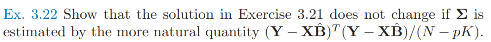

* 求解：

  * 将新采样带入在上一题中$\eqref{ex_21_4}​$，有
    $$
    (X^TX)^{-1/2}X^TY^*
    \\ = (X^TX)^{-1/2}X^TY((Y-X\hat B)^T(Y-X\hat B))^{-1/2}
    \\ = (X^TX)^{-1/2}X^TY((Y-X(X^TX)^{-1}X^T Y)^T(Y-X(X^TX)^{-1}X^T Y))^{-1/2}
    \\ = (X^TX)^{-1/2}X^TY(Y^T(I-X(X^TX)^{-1}X^T)^2Y)^{-1/2}
    \\ = (X^TX)^{-1/2}X^TY(Y^T(I-X(X^TX)^{-1}X^T)Y)^{-1/2}
    $$

## Ex 3.23

* 题目

  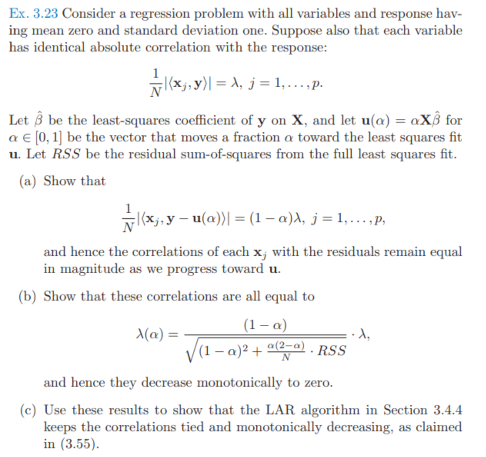

* 思考：我认为协方差和方差应该都按照N-1去取才符合Person 相关系数的定义。但是题干里面很多都用的N就比较迷惑，思考了一下是不是因为这个题都是对中心化和标准化后的X来说的（此时均值和方差均已知），并不是对中心化X前来说。

  * 这里的题意中说到了均值0，标准差1，也就是这两个值是已知的无需估计的，就可以使用**总体Person相关系数**
  * 如果题意并没有提到X均值方差，而是使用了中心化，就应该是**样本Person 相关系数**

* 求解

  * 第一问

    * 由最小二乘可知
      $$
      \frac{\partial RSS(\beta)}{\partial \beta}=-2X^T(y-X\beta)
      =0\\
      \rightarrow <x_j,y-X\hat \beta>=0
      $$

    * 化简题目中的式子可得
      $$
      \frac{1}{N}|<x_j,y-u(\alpha)>|=\frac{1}{N}|<x_j,y-\alpha X\hat\beta>|
      \\ =\frac{1}{N}|<x_j,y-X\hat\beta>+<x_j,(1-\alpha)X\hat\beta>|
      \\ = (1-\alpha)\frac{1}{N}|<x_j,X\hat\beta>|
      \\ = (1-\alpha)\lambda
      $$

    * 因此有结论，随着$u$逼近，$x_j$与残差相关系数绝对值保持不变($\tilde x_j$是标准化前的$x_j$)
      $$
      |\rho|=|Corr(x_j,y-u(\alpha))|
      \\ = \frac{|Cov(x_j,y-u(\alpha))|}{\sqrt{Var(x_j)Var(y-u(\alpha))}}
      \\ = \frac{\frac{1}{N}|<x_j,y-u(\alpha)>|}{\sqrt{\frac{1}{N}<x_j,x_j>\times \frac{1}{N}<y-u(\alpha),y-u(\alpha)>}}
      \\ = \frac{\frac{1}{N}|<x_j,y-u(\alpha)>|}{\sqrt{\frac{1}{N}<\frac{\tilde x_j}{\sqrt{1/N<\tilde x_j,\tilde x_j>}},\frac{\tilde x_j}{\sqrt{1/N<\tilde x_j,\tilde x_j>}}>\times \frac{1}{N}<y-u(\alpha),y-u(\alpha)>}}
      \\=\frac{ (1-\alpha)\lambda}{\sqrt{\frac{1}{N}<y-u(\alpha),y-u(\alpha)>}}
      $$

  * 第二问(这里指的是Person 相关系数)

    * 由第一问继续推导
      $$
      |\rho|=\frac{ (1-\alpha)\lambda}{\sqrt{\frac{1}{N}<y-u(\alpha),y-u(\alpha)>}}
      \\ = \frac{(1-\alpha)\lambda}{\sqrt{\frac{1}{N}(y-\alpha X(X^TX)^{-1}X^Ty)^T(y-\alpha X(X^TX)^{-1}X^Ty)}}
      \\ = \frac{(1-\alpha)\lambda}{\sqrt{\frac{1}{N}y^T(I-\alpha X(X^TX)^{-1}X^T)^T(I-\alpha X(X^TX)^{-1}X^T)y}}
      \\ = \frac{(1-\alpha)\lambda}{\sqrt{\frac{1}{N}y^T(I-(2\alpha-\alpha^2) X(X^TX)^{-1}X^T)y}}
      \\ = \frac{(1-\alpha)\lambda}{\sqrt{\frac{1}{N}y^T((1-2\alpha+\alpha^2)I+(2\alpha-\alpha^2)(I-X(X^TX)^{-1}X^T))y}}
      \\ = \frac{(1-\alpha)\lambda}{\sqrt{\frac{y^Ty}{N}(1-\alpha)^2+\frac{1}{N}((2\alpha-\alpha^2)((I-X(X^TX)^{-1}X^T))y)^T(I-X(X^TX)^{-1}X^T))y)}}
      \\ = \frac{(1-\alpha)\lambda}{\sqrt{Var(y)(1-\alpha)^2+\frac{1}{N}(2\alpha-\alpha^2)RSS}}\ \because y 的方差为1
      \\ = \frac{(1-\alpha)}{\sqrt{(1-\alpha)^2+\frac{2\alpha-\alpha^2}{N}RSS}}\lambda
      $$

  * 第三问

    * 初始满足，活跃集$A_k$与r相关系数相同，均为$\lambda$

    * 因为前进方向是最小二乘方向
      $$
      \delta_k=(X_{A_k}^TX_{A_k})^{-1}X_{A_k}^Tr_k
      $$

    * 由第一问，所以相关系数保持(keep tieds)

    * 由第二问，相关系数慢慢减小0(monotonically decreasing)

## Ex 3.24 

* 题目：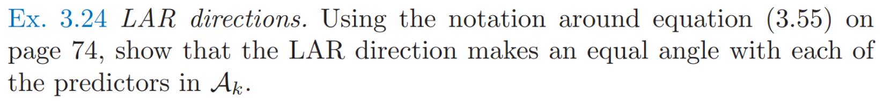

* 解：

  * 这里指的是相关性相同(相关系数绝对值一致)

  * 由于$A_k$和r相关性相等，即有

    $$
    \forall x_j \in A_k, \frac{|<x_j,r_k>|}{\|x_j\|\|r_k\|}=\lambda
    $$

  * 因此有($u_k=X_{A_k}\delta_k=X_{A_k}(X_{A_k}^TX_{A_k})^{-1}X_{A_k}^Tr_k​$)
    $$
    \frac{|<x_j,u_k>|}{\|x_j\|\|u_k\|}
    \\ =\frac{|<x_j,u_k-r_k+r_k>|}{\|x_j\|\|u_k\|}
    \\ =\left|\frac{<x_j,r_k>}{\|x_j\|\|u_k\|}+\frac{<x_j,u_k-r_k>}{\|x_j\|\|u_k\|}\right|
    \\ =\left|\frac{<x_j,r_k>}{\|x_j\|\|u_k\|}+\frac{x_j^T(X_{A_k}(X_{A_k}^TX_{A_k})^{-1}X_{A_k}^T-I)r_k}{\|x_j\|\|u_k\|}\right|
    \\\because X_{A_k}^T(X_{A_k}(X_{A_k}^TX_{A_k})^{-1}X_{A_k}^T-I)r_k=(X_{A_k}^T-X_{A_k}^T)r_k=0,\\ \therefore x_j^T(X_{A_k}(X_{A_k}^TX_{A_k})^{-1}X_{A_k}^T-I)r_k=0
    \\ \left|\frac{<x_j,u_k>}{\|x_j\|\|u_k\|}\right| =\left|\frac{<x_j,r_k>}{\|x_j\|\|u_k\|}\right|
    \\ = \frac{\lambda \|r_k\|}{\|u_k\|}
    $$
    

## Ex 3.25

* 题干

  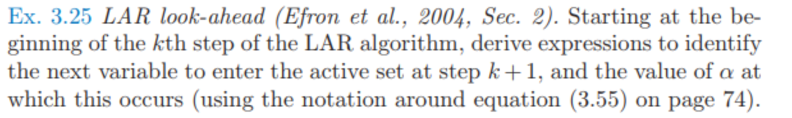

* 求解：

  * 在书中，变量活跃集为$A_k$, 更新方向为$ u_k=X_{A_k}\delta_k= X_{A_k}(X_{A_k}^TX_{A_k})^{-1}X_{A_k}^Tr_k$

  * 因此下一个选择的变量$x_i$满足
    $$
    \max_{x_i\not \in A_k} |<x_i,r_k-\alpha u_k>|\\ = |<x_j,r_k-\alpha u_k>|, j\in A_k
    \\ = (1-\alpha) \lambda \ \because 沿用Ex\ 3.23的定义和结论
    $$

  * 化简得到
    $$
    (1-\alpha) \lambda
    \\ =\max_{x_i\not \in A_k} |<x_i,r_k-\alpha u_k>| 
    \\ =\max_{x_i\not \in A_k} |<x_i,r_k>-\alpha <x_i,u_k>|
    $$

  * 若$<x_{i},r_k>-\alpha <x_{i},u_k>  ​$大于0，则有
    $$
    \alpha=\frac{\lambda -<x_{ i}, r_k>}{\lambda - <x_{ i}, u_k>}
    $$

  * 否则
    $$
    \alpha=\frac{\lambda + <x_{ i}, r_k>}{\lambda + <x_{ i}, u_k>}
    $$

  * 示意图如下：

    * 蓝色的线是$f_k(\alpha)=|<x_i,r_k-\alpha u_k>|$
    * 红色的线是$g(\alpha)=(1-\alpha)\lambda$
    * 蓝色的截距一定小于红色线，也就是初始时，活跃集变量和残差的相关性最大
      * 这是由LAR过程进行数学归纳得出
      * LAR第一步找相关性最大，满足蓝色的截距一定小于红色线截距
      * 若LAR第k步满足蓝色的截距一定小于红色线截距，而LAR是找$\alpha$最小时相关系数相等的变量，由于相关性是连续的，找到后其他变量相关系数肯定更小，因此新的k+1步仍然满足蓝色的截距一定小于红色线截距，即活跃集变量和残差的相关性最大
    * 由于蓝色的截距一定小于红色线，且因为函数连续性，通过示意图可以看出，找$\alpha \in [0, 1]$中$g(\alpha)$和$f_k(\alpha)$变量$\alpha$最小的交点，等价于找$g(\alpha) $与$\max_k(f_k(\alpha))$的交点

    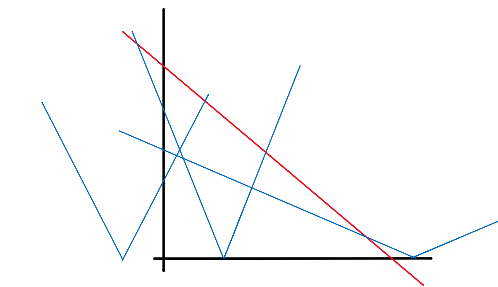

  * 因此有，最后答案为, 其中$\min_{[0, 1]}$含义为只计算在$[0, 1]$区间的最小值，$\min^+$含义为只计算正值最小值
    $$
    \alpha = \min_{[0, 1]}\{\frac{\lambda -<x_{ i}, r_k>}{\lambda - <x_{ i}, u_k>}, \frac{\lambda + <x_{ i}, r_k>}{\lambda + <x_{ i}, u_k>} \}=\mathbf{min}^{+}\{\frac{\lambda -<x_{ i}, r_k>}{\lambda - <x_{ i}, u_k>}, \frac{\lambda + <x_{ i}, r_k>}{\lambda + <x_{ i}, u_k>} \}
    $$
    

    