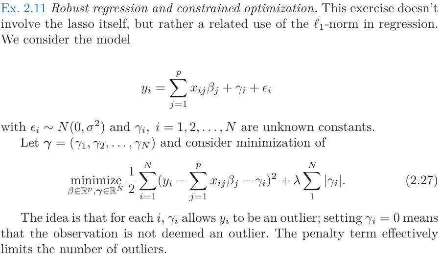
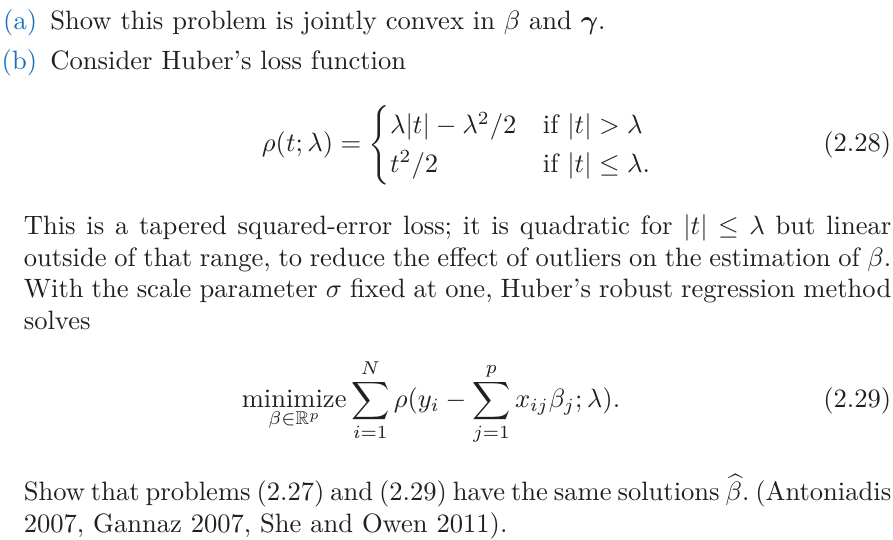
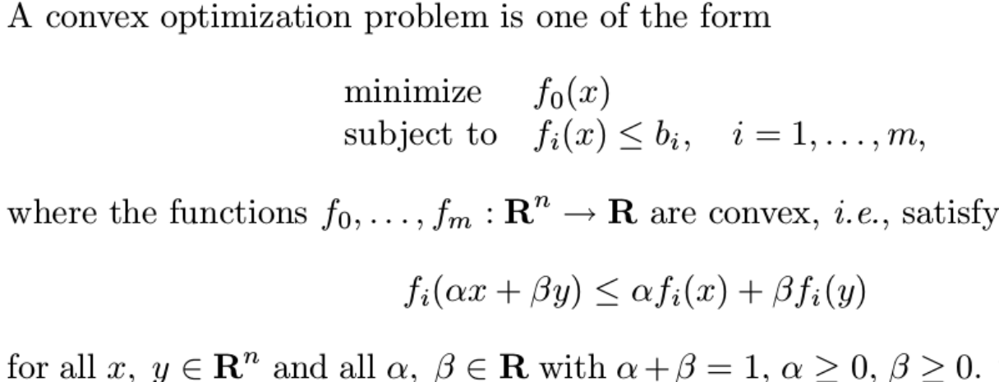

# SLS 习题

## Ex 2.11

* 题干

  

* 第一问：

  * 知识补充：凸优化定义

    

  * 记
    $$
    S(\beta, \gamma) = \frac{1}{2}\sum_{i=1}^N (y_i-x_i^T\beta - \gamma_i)^2 +\lambda \sum_{i=1}^N |\gamma_i|
    \\ = \frac{1}{2} (y-X\beta-\gamma)^T(y-X\beta-\gamma)+\lambda \sum_{i=1}^N |\gamma_i|
    \\ = R(\beta,\gamma)+J(\beta)
    $$

  * 对于$R(\beta,\gamma)$, 是凸函数
    $$
    R(\alpha\beta_1+(1-\alpha)\beta_2,\alpha\gamma_1+(1-\alpha)\gamma_2)
    \\ =\frac{1}{2} (y-X(\alpha\beta_1+(1-\alpha)\beta_2)-(\alpha\gamma_1+(1-\alpha)\gamma_2))^T\\ \times (y-X(\alpha\beta_1+(1-\alpha)\beta_2)-(\alpha\gamma_1+(1-\alpha)\gamma_2))
    \\ = \frac{1}{2} (\alpha (y-X\beta_1-\gamma_1) +(1-\alpha)(y-X\beta_2-\gamma_2))^T
    \\ \times (\alpha (y-X\beta_1-\gamma_1) +(1-\alpha)(y-X\beta_2-\gamma_2))
    \\ = \frac{1}{2} \left[\alpha^2\|(y-X\beta_1-\gamma_1)\|_2^2+ (1-\alpha)^2\|(y-X\beta_2-\gamma_2)\|_2^2\\ +2\alpha(1-\alpha)(y-X\beta_1-\gamma_1)^T(y-X\beta_2-\gamma_2) \right]
    \\ \le \frac{1}{2} \left[\alpha^2\|(y-X\beta_1-\gamma_1)\|_2^2+ (1-\alpha)^2\|(y-X\beta_2-\gamma_2)\|_2^2\\ +\alpha(1-\alpha)(\|(y-X\beta_1-\gamma_1)\|_2^2+\|(y-X\beta_2-\gamma_2)\|_2^2) \right] \\
    \because   \|(y-X\beta_1-\gamma_1)\|_2^2+\|(y-X\beta_2-\gamma_2)\|_2^2 - 2(y-X\beta_1-\gamma_1)^T(y-X\beta_2-\gamma_2) \ge 0
    \\ = \frac{1}{2} \left[\alpha\|(y-X\beta_1-\gamma_1)\|_2^2+ (1-\alpha)\|(y-X\beta_2-\gamma_2)\|_2^2 \right] 
    \\ = \alpha R(\beta_1,\gamma_1)+(1-\alpha)R(\beta_2, \gamma_2)
    $$

  * 对$J(\beta)$ , 是凸函数
    $$
    J(\alpha\gamma_1+(1-\alpha)\gamma_2)
    \\ =\lambda \sum_{i=1}^N |\alpha\gamma_{1i}+(1-\alpha)\gamma_{2i}|
    \\ \le \lambda \alpha\sum_{i=1}^N |\gamma_{1i}|+\lambda (1-\alpha)\sum_{i=1}^N |\gamma_{2i}|
    \\ = \alpha J(\gamma_1)+(1-\alpha)J(\gamma_2)
    $$

  * 因此$S(\beta, \gamma)$ 对$(\beta, \gamma)$也是凸函数

* 第二问

  * 若$\gamma_i =  0$, 此时引入次梯度的概念（$T$是$|\gamma_i|$ 在0处的次梯度）
    $$
    \frac{\partial S}{\part \gamma_i} =-(y_i-x_i^T\beta -\gamma_i)+\lambda T = 0, T\in [-1, 1] 
    \\ \Leftrightarrow  y_i-x_i^T\beta \in  [-\lambda,\lambda]
    $$
    此时损失函数为$S_i = \frac{1}{2} (y_i-x_i^T\beta )^2​$

  * 若$\gamma_i \not = 0​$, 则有$\frac{\partial S}{\part \gamma_i} = 0​$
    $$
    -(y_i-x_i^T\beta -\gamma_i) + \lambda sign(\gamma_i)=0
    $$
    因此
    $$
    \gamma_i =- \lambda sign(\gamma_i)+y_i-x_i^T\beta
    \\S_i =  \frac{1}{2}(y_i-x_i^T\beta  +\lambda sign(\gamma_i)-(y_i-x_i^T\beta))^2 + \lambda |y_i-x_i^T\beta-\lambda sign(\gamma_i)|
    \\ = \frac{1}{2} \lambda^2 +\lambda |y_i-x_i^T\beta-\lambda sign(\gamma_i)|
    $$

    * 若$\gamma_i > 0$, 有
      $$
      \gamma_i =- \lambda sign(\gamma_i)+y_i-x_i^T\beta
      \\ = - \lambda+y_i-x_i^T\beta > 0
      \\ \Leftrightarrow y_i-x_i^T\beta > \lambda
      $$
      此时
      $$
      S_i = \frac{1}{2} \lambda^2 +\lambda |y_i-x_i^T\beta-\lambda|
      \\ = \lambda |y_i-x_i^T\beta| - \lambda^2/2
      $$

    * 若$\gamma_i < 0$, 有
      $$
      \gamma_i =\lambda+y_i-x_i^T\beta < 0
      \\ \Leftrightarrow y_i-x_i^T\beta < -\lambda
      $$
      此时
      $$
      S_i = \frac{1}{2} \lambda^2 +\lambda |y_i-x_i^T\beta+\lambda|
      \\ = -\lambda (y_i-x_i^T\beta) - \lambda^2/2
      \\ = \lambda |y_i-x_i^T\beta| - \lambda^2/2
      $$

  * 综上，可以得到
    $$
    \min_{\beta,\gamma} S(\beta,\gamma)= 
    \min_{\beta,\gamma} \sum_{i=1}^ N S_i(\beta,\gamma_i)
    \\ = \min_{\beta} \sum_{i=1}^ N \min_{\gamma_i}S_i(\beta,\gamma_i)
    \\ = \min_{\beta} \sum_{i=1}^ N S(\beta)
    =
    \begin{cases}
    \frac{1}{2} (y_i-x_i^T\beta )^2 &  |y_i-x_i^T\beta |\le \lambda\\
    \lambda |y_i-x_i^T\beta| - \lambda^2/2 &  |y_i-x_i^T\beta |>\lambda
    \end{cases}
    \\ = \min_{\beta} \sum_{i=1}^N \rho(y_i-x_i^T\beta; \lambda)
    $$
    

