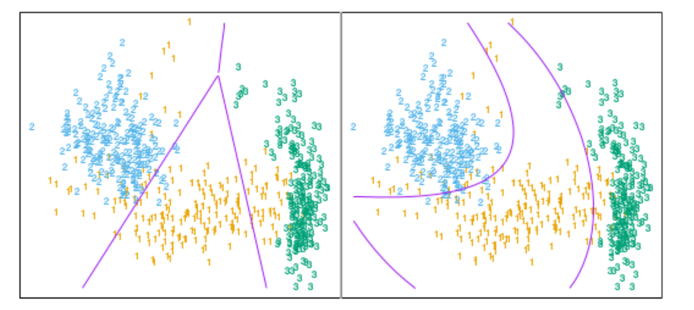

# 导言

## 1 线性判别边界

* 可以根据类别把输入空间分成一些区域的集合。这些区域的边界会随着预测函数的不同而变得粗糙或者光滑，这个过程的一个很重要的类是 **线性判别边界 (decision boundaries)**；这也是我们说的分类的线性方法．

* 例如假设有$K$个类别，第$k$个类别的响应的指示变量拟合的线性模型为（关于指示变量请回顾前文，或者看下一节）
  $$
  \hat f_k(x)=x^T\hat \beta_k
  $$
  则$k,l$类别判别边界满足
  $$
  \hat f_k(x)=\hat f_l(x)
  \\ x \in \{x:x^T(\hat \beta_k - \hat \beta_l)=0\}
  $$
  可以看到，这是一个超平面

## 2 判别函数

* 因为对任意两个类别都成立，输入空间被分块超平面判别边界分成了若干个类别区域，回归方法对每个类别建立的判别函数$\delta_k(x)$， 将$x$分到取最大值判别函数的类别中。

* 后验概率$Pr(G=k|X=x)$就可以当作判别函数

* 什么时候判别边界是线性的

  * 如果判别函数关于$x$线性，则判别边界也一定是线性的

  * 若判别函数的单调变换关于判别边界要是线性的，例如对2个类别
    $$
    Pr(G=1|X=x)=\frac{\exp(x^T\beta)}{1+\exp(x^T\beta)}
    \\
    Pr(G=2|X=x)=\frac{1}{1+\exp(x^T\beta)}
    $$
    其单调变换为
    $$
    \log{\frac{p}{1-p}}
     \\ = \log{\frac{Pr(G=1|X=x)}{Pr(G=2|X=x)}}
     \\ = x^T\beta
    $$
    则其线性边界为
    $$
    \{x:x^T\beta=0\}
    $$
    

## 3 非线性边界

* 对于变量集合$\{x_1,x_2,\cdots, x_p\}$, 加上$p(p+1)/2$个交叉积$\{x_1^2, x_2^2,\cdots, x_p^2,x_1x_2,x_1x_3,\cdots, x_{p-1}x_p\}$, 进行推广，得到$p(p+1)/2+p$增广空间，增广空间的线性函数投影到原空间的二次函数，则线性判别边界转换为二次判别边界

* 下图为五维增广空间${x_1,x_2,x_1x_2,x_1^2,x_2^2}$ 找到的线性边界，这个空间的线性不等式是原空间二次不等式

  

* 该方法可以跟任意基变换 $h(X)$ 一起使用，其中 $h:R_p\mapsto R_q,q>p$

