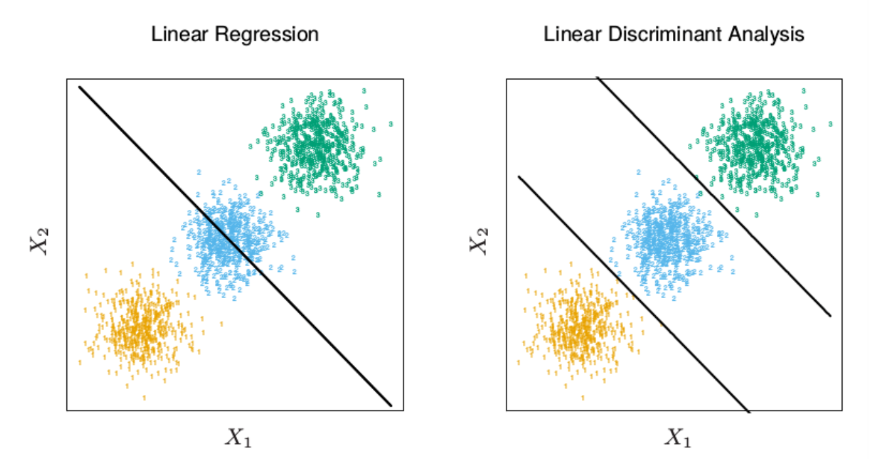
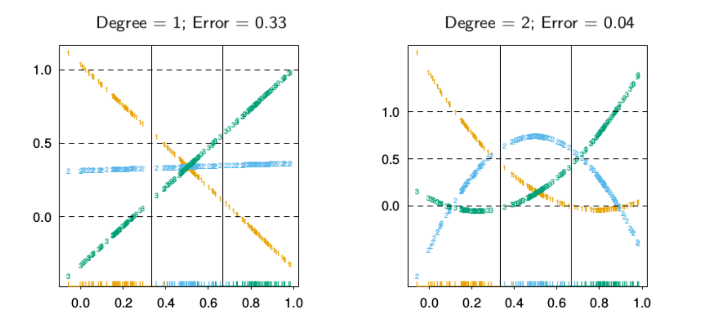
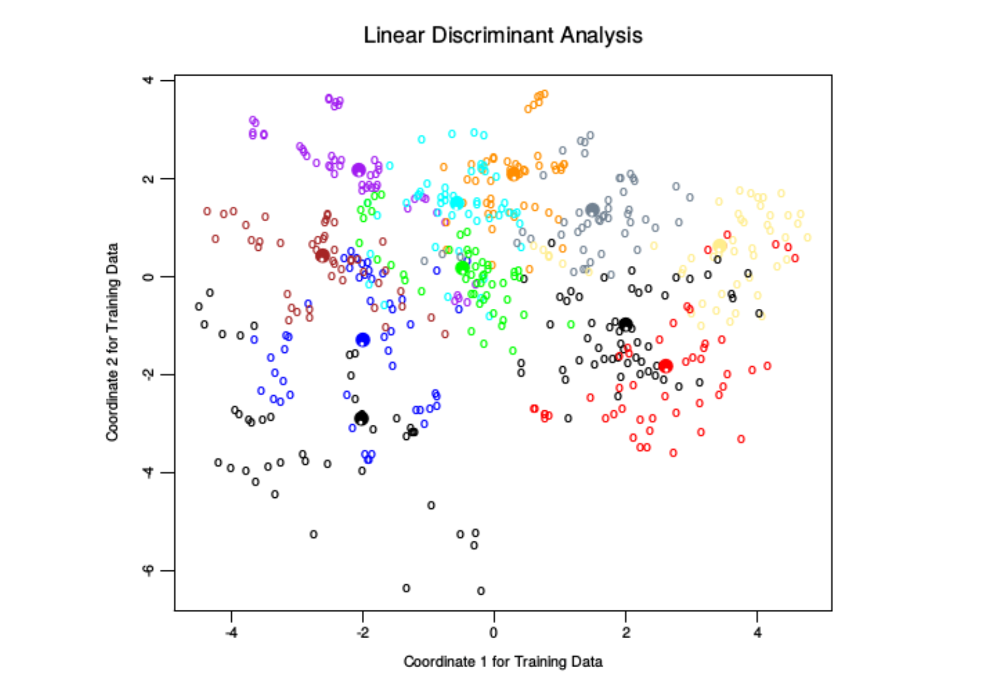

# 指示矩阵的线性回归

## 1 指示变量相应矩阵

* 有$K$个类别，则会有$K$个指示变量$Y=(Y_1,Y_2,\cdots, Y_K)$, 可以得到指示变量相应矩阵$\mathbf{Y}$, 由01组成

* 可以对$Y$的每一列用线性回归做拟合，得到
  $$
  \hat Y = X(X^TX)^{-1}X^TY
  $$

* 其中
  $$
  \hat B = (X^TX)^{-1}X^TY
  $$

  

## 2 分类准则

* 因此对于输入$x$, 可以如此分类
  * 步骤
    * 计算$\hat f(x)^T =(1,x^T)\hat B$， 得到$K$维向量
    * 采用值最大组$\hat G(x) = \arg\max_{k\in G} \hat f_k(x)​$
  * 该方法可以把回归看作条件期望$E(Y_k|X=x)=Pr(G=k|X=x)$的估计
    * 可以证明，$\sum_{k\in G}\hat f_k(x) = 1$ (TODO)
    * 但是由于线性回归的**刚性本质 (ridge nature)** ，特别是如果我们在训练数据之外做预测时，困难出现$\hat f_k(x)$是负数或者大于1

* 更合理的方法是采用目标值去理解

  * 对于$Y$的第$i$行，采用编码方法，如果是第$k$类则为$e_k^T$

  * 通过最小二乘法来拟合线性模型, 这个准则是目标值到拟合向量的欧几里得距离的平方和（$\mathbf{y}_i, \mathbf{x}_i^T$分别表示$Y,X$的第$i$行)
    $$
    \min_{B}\|\mathbf{y}_i - (1,\mathbf{x}_i^T)B\|_2^2
    $$

  * 对于新的观测值，只需要使得它的拟合向量到最近的目标值$e_k$作为其类别$G=k$
    $$
    \hat G(x)=\arg\min_k\{\|\hat f(x) - e_k^T\|_2^2\}
    $$

  * 平方和准则恰巧是**多重响应变量线性回归** 准则

    * 多重响应变量线性回归损失函数可以变为欧几里得距离的平方和
      $$
      \min_B RSS(B)=\sum_{k=1}^K\sum_{i=1}^N (y_{ik} - f_k(x_i))^2
      \\ = \sum_{i=1}^N \sum_{k=1}^K(y_{ik} - f_k(x_i))^2
      \\ = \sum_{i=1}^N \|\mathbf{y}_i - (1,\mathbf{x}_i^T)B\|_2^2
      $$

  * 同时，该目标分类准则，和上面$\hat G(x) = \arg\max_{k\in G} \hat f_k(x)$是一致的

## 3 掩盖问题

* 描述：类别的数目$K\ge 3$ 时候回归方法有个很严重的问题，特别当 $K$ 很大时, 由于回归模型的刚性性质，某个类别可以被其他的类别掩盖掉 (masked)

  * 左图显示了通过对指示响应变量的线性回归找到的边界，中间的类别完全被掩盖掉了；右侧图显示了通过线性判别分析找到的边界

  * 原因：

    * 将三种数据的中心进行连线，并且将数据进行投影。下图显示了其指示变量$Y_1,Y_2,Y_3$(列)的值

      * 

        到横轴的投影称为rug plot, 也就是在坐标轴上标出元素出现的频数，出现一次就会话一个小竖。其中横轴表示了$X_1$（或者$X_2$)，纵轴表示**横轴所对应的投影连线**上的$X_1,X_2$对应的指示变量$Y_1,Y_2,Y_3$的值

      * 左侧是指示矩阵线性回归进行拟合的，也就是
        $$
        (Y_1,Y_2,Y_3)=(1, X_1,X_2)B
        $$
        例如，蓝色的数据点$Y_2$由于只有中间的数据$Y_2$, 两侧的均为0，又因为$y_2 =(1, x_1,x_2)\hat B_2$随着坐标是线性变化的，所以只能是个直线，且为了达到$RSS$最小，斜率接近于0且值大概在$1/3$处

      * 右侧是指示矩阵二次回归进行拟合的，即
        $$
        (Y_1,Y_2,Y_3)=(1, X_1,X_2, X_1^2,X_2^2,X_1X_2)B
        $$
        由于这里公式是二次拟合，所以在投影方向的也是二次的。

* 可以看到，对于$K$个类别，在投影曲线方向上，可能要$K-1$次一元多项式才可以解决问题，这意味着如果是$p$维空间，需要$K-1$阶，也就是$O(p^{k-1})$ 项多项式和交叉积才可以解决。

* 一个例子：

  * 下图是一个元音训练数据的二维图像，其在$p=10$维空间有$11$个类别。颜色深的圆圈是每个类的投影均值向量，这些类的重叠度很高。

    

  * 其中有3个维度，通过主成分分析可以解释90%的方差，下表是一些算法结果，可以看到线性回归被掩盖破坏

    