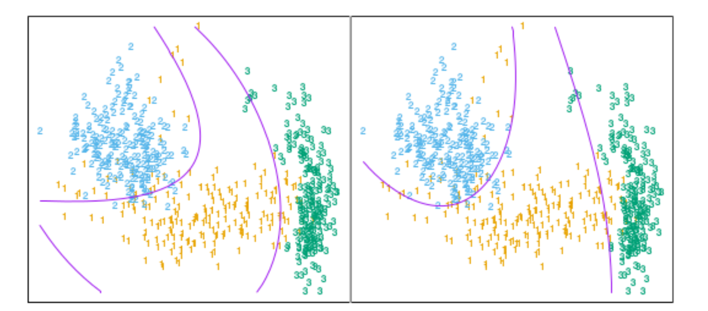
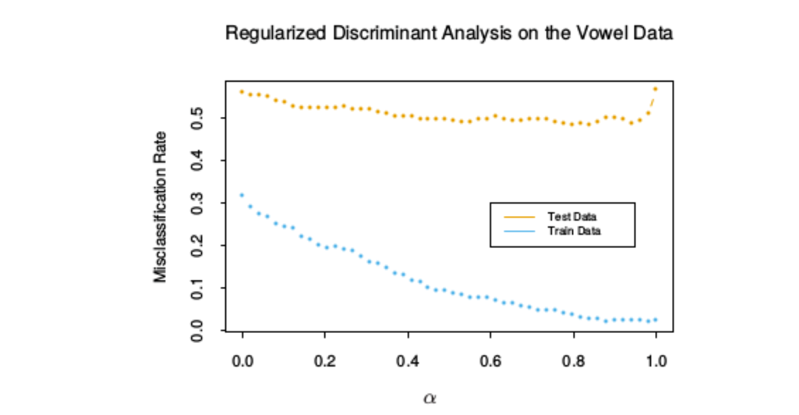
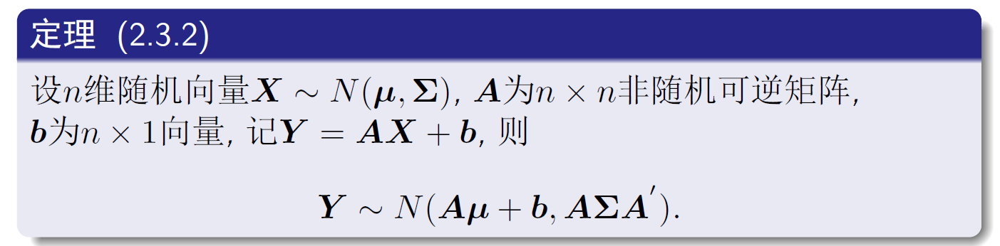
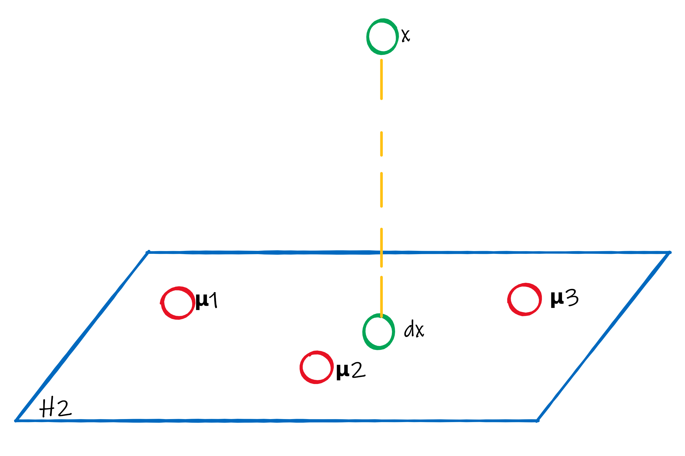

# 线性判别分析

## 1 类别密度

* 已知目标是求最优分类的类别后验概率$Pr(G|X)$

* 设$f_k(x)$是$G=k$的$x$的类别密度， 也就是类别为$k$在空间中的概率；并且还已知$\pi_k$是类别$k$的先验概率有$\sum_{k=1}^K \pi_k = 1$, 则根据先验和后验公式，可以得到后验概率和类别密度的关系
  $$
  Pr(G=k|X=x)
  \\=\frac{Pr(X=x|G=k)Pr(G=k)}{\sum_{l=1}^K Pr(X=x|G=l)Pr(G=l)}
  \\=\frac{f_k(x)\pi_k}{\sum_{l=1}^K f_l(x)\pi_l}
  $$

* 由此可见，直到类别密度基本等于知道后验概率$Pr(G|X)$

## 2 线性判别分析推导

* 假设类别密度符合高斯分布，且其协方差矩阵$\forall k \in G, \Sigma_k=\Sigma$是相同的
  $$
  f_k(x)=\frac{1}{(2\pi)^{p/2}|\Sigma_k|^{1/2}}\exp{-\frac{1}{2}(x-\mu_k)^T\Sigma_K^{-1}(x-\mu_k)}
  $$

* 则比较两个类别后验概率的$log-ratio$即可
  $$
  \log{\frac{Pr(G=k|X=x)}{Pr(G=l|X=x)}}
  \\ = \log{\frac{f_k(x)}{f_l(x)}}+\log{\frac{\pi_k}{\pi_l}}
  \\ = \log{\frac{\pi_k}{\pi_l}} - \frac{1}{2}((x-\mu_k)^T\Sigma^{-1}(x-\mu_k)-(x-\mu_l)^T\Sigma^{-1}(x-\mu_l))
  \\ = \log{\frac{\pi_k}{\pi_l}} - \frac{1}{2}((x^T\Sigma^{-1}x+\mu_k^T\Sigma^{-1}\mu_k -2x^T\Sigma^{-1}\mu_k)\\-(x^T\Sigma^{-1}x+\mu_l^T\Sigma^{-1}\mu_l -2x^T\Sigma^{-1}\mu_l))
  \\ = \log{\frac{\pi_k}{\pi_l}} -\frac{1}{2}(\mu_k^T\Sigma^{-1}\mu_k-\mu_l^T\Sigma^{-1}\mu_l+2x^T\Sigma^{-1}(\mu_l-\mu_k))
  \\ = \log{\frac{\pi_k}{\pi_l}} -\frac{1}{2}(\mu_k+\mu_l)^T\Sigma^{-1}(\mu_k-\mu_l)+x^T\Sigma^{-1}(\mu_k-\mu_l) \label{2_eq1}
  $$
  可以看到，分类边界是一个超平面，所有的判别边界都是线性的

* 一个例子

  * 下左图是$p=2$, 也有三个类别的例子

    

    * 左图是三个协方差相同的高斯分布每个类别 95% 可能性的等高线，图中画出了线性边界
    * 右图是使用了每个类别的30个样本点进行拟合后的LDA判别边界

  * 根据$\eqref{2_eq1}$, 可以看出线性判别函数为
    $$
    \delta_k(x)= x^T\Sigma^{-1}\mu_k-\frac{1}{2}\mu_k^T\Sigma^{-1}\mu_k + \log{\pi_k }
    $$
    如果有先验概率相等且协方差矩阵为$\sigma^2 I​$, 则判别函数可以化简为
    $$
    \delta_k(x)= \frac{2x^T\mu_k-\mu_k^T\mu_k}{2\sigma^2}
    $$
    判别规则即$G(x)=\arg\max_{k}\delta_k(x)$

* 参数估计：高斯分布的参数是不可知的，需要使用训练数据去估计

  * $\hat\pi_k = N_k/N​$

  * $\hat \mu_k=\sum_{g_i=k}x_i/N_k​$

  * $\mathbf{\hat\Sigma}=\sum_{k=1}^K\sum_{g_i=k}(x_i-\hat\mu_k)(x_i-\hat\mu_k)^T/(N-K)​$

    * 无偏性证明

      根据[协方差估计-对预测变量的估计](..\A 基础知识\4 统计概率\4 相关系数与(协)方差#对预测变量的估计)，有
      $$
      E(\sum_{g_i=k}(x_i-\hat\mu_k)(x_i-\hat\mu_k)^T) = (N_k - 1)\Sigma
      $$
      于是，有
      $$
      E(\sum_{k=1}^K\sum_{g_i=k}(x_i-\hat\mu_k)(x_i-\hat\mu_k)^T) = \sum_{k=1}^K(N_k - 1)\Sigma 
      \\=(N-K)\Sigma
      $$
      因此有
      $$
      E(\sum_{k=1}^K\sum_{g_i=k}(x_i-\hat\mu_k)(x_i-\hat\mu_k)^T/(N-K)) = \Sigma
      $$

  

* 两个类别下的 LDA 方向

  * 在两个类别的情况下，将估计参数带入$\eqref{2_eq1}$, 可以得到满足下列判定条件时，分给第2类
    $$
    \log{\frac{Pr(G=2|X=x)}{Pr(G=1|X=x)}}
    \\=\log{\frac{\pi_2}{\pi_1}} -\frac{1}{2}(\mu_2+\mu_1)^T\Sigma^{-1}(\mu_2-\mu_1)+x^T\Sigma^{-1}(\mu_2-\mu_1) >0
    \\=\log{\frac{N_2}{N_1}} -\frac{1}{2}(\hat \mu_2+\hat\mu_1)^T\Sigma^{-1}(\hat\mu_2-\hat\mu_1)+x^T\Sigma^{-1}(\hat\mu_2-\hat\mu_1) >0
    \\ \Leftrightarrow x^T\Sigma^{-1}(\hat\mu_2-\hat\mu_1)> \frac{1}{2}(\hat \mu_2+\hat\mu_1)^T\Sigma^{-1}(\hat\mu_2-\hat\mu_1)-\log{\frac{N_2}{N_1}}
    $$

  * 可以看到，$\Sigma^{-1}(\hat\mu_2-\hat\mu_1)​$相当于方向向量，而$x^T\Sigma^{-1}(\hat\mu_2-\hat\mu_1)​$就是通过$x​$在方向向量的投影，进行判断类别的

  * 两个类别的情况下在线性判别分析和线性最小二乘之间有一个简单的对应，若将两个类别分别编码为$+1,-1$，则最小二乘的系数向量与$\Sigma^{-1}(\hat\mu_2-\hat\mu_1)$方向成比例，具体证明见[习题 Ex 4.2](./A 习题)

  * 当多余两个类别时，LDA 与类别指示矩阵的线性回归不是一样的，且避免了跟这个方法有关的掩藏问题

  

## 3 平方判别函数

* 若没有假设$Σ_k$相等, 则$\eqref{2_eq1}$变为
  $$
  \log{\frac{Pr(G=k|X=x)}{Pr(G=l|X=x)}}
  \\ = \log{\frac{f_k(x)}{f_l(x)}}+\log{\frac{\pi_k}{\pi_l}}
  \\ = [\log{\pi_k}-\frac{1}{2}(x-\mu_k)^T\Sigma^{-1}(x-\mu_k)-\frac{1}{2}\log{|\Sigma_k|}]-[\log{\pi_l}-\frac{1}{2}(x-\mu_l)^T\Sigma^{-1}(x-\mu_l)-\frac{1}{2}\log{|\Sigma_l|}]
  $$

* 因此得到了 QDA 平方判别函数
  $$
  \delta_k(x)=\log{\pi_k}-\frac{1}{2}(x-\mu_k)^T\Sigma_k^{-1}(x-\mu_k)-\frac{1}{2}
  log{|\Sigma_k|}
  $$

* 对类别对$k,l$, 其判别边界为
  $$
  \{x|\delta_k(x)=\delta_l(x)\}
  $$

* 与高维空间LDA比较

  * 图像
  * 上图中，左边是LDA在$X_1,X_2,{X_1}^2,{X_2}^2,X_1X_2$增广空间运用 LDA 得到的，右侧是QDA

* 参数个数

  * 对于 QDA，协方差矩阵必须要按每一类来估计，这意味着参数个数有显著增长。假设判断第$K$个类别的边界（共$K$类）

    * 则LDA需要的系数参数个数为
      $$
      \underbrace{(K-1)\times (P+1)}_{\mu}+\underbrace{\frac{P(P+1)}{2}}_{\Sigma}
      $$

    * 则QDA需要的系数参数个数为
      $$
      (K-1)\times (\underbrace{P+1}_{\mu}+\underbrace{\frac{P(P+1)}{2}}_{\Sigma})
      $$

* LDA 和 QDA 表现好的原因

  * 在众多问题上表现好的原因并不是数据近似服从高斯分布，对于 LDA 协方差矩阵也不可能近似相等。很可能的一个原因是数据仅仅可以支持简单的判别边界比如线性和二次，并且通过高斯模型给出的估计是稳定的，这是一个偏差与方差之间的权衡——我们可以忍受线性判别边界的偏差因为它可以通过用比其它方法更低的方差来弥补

## 4 正则化判别分析

* 概念： LDA 和 QDA 之间的一个权衡，使得 QDA 的协方差阵向 LDA 中的共同协方差阵收缩
  $$
  \hat\Sigma_k(\alpha)=\alpha\hat\Sigma_k+(1-\alpha)\hat\Sigma,\alpha\in[0,1]
  $$
  $\alpha$ 可以基于在验证数据的表现上进行选择，或者通过交叉验证

* 误差曲线：

  

  * 在 0.9 左右，测试误差达到最低，此时和二次判别分析很接近。
  * 二次判别分析使得参数变多，模型更复杂，更容易发生过拟合，而LDA项起到正则化的作用

* 对$\hat \Sigma ​$修改

  * 将$\hat \Sigma $ 项标量协方差$\hat \sigma^2 I$收缩，可以得到
    $$
    \hat\Sigma_k(\alpha,\gamma)=\alpha\hat\Sigma_k+(1-\alpha)\hat\Sigma(\gamma),\alpha\in[0,1],\gamma \in [0,1]
    \\ = \alpha\hat\Sigma_k+(1-\alpha)(\gamma\hat\Sigma+(1-\gamma)\hat\sigma^2 I)
    $$

  * $\hat\Sigma_k(\alpha,\gamma)$ 是一个一般的协方差阵族

## 5 LDA 和 QDA 计算

* LDA 和 QDA 的判别函数（均以 $\Sigma_k$ 表示）为
  $$
  \delta_k(x)=\log{\pi_k}-\frac{1}{2}(x-\mu_k)^T\hat\Sigma_k^{-1}(x-\mu_k)-\frac{1}{2}
  log{|\hat \Sigma_k|}
  $$

* 对$\Sigma_k​$进行特征值分解
  $$
  \hat \Sigma_k =U_kD_kU_k^T
  \\\hat\Sigma_k^{-1} = U_kD_k^{-1}U_k^T
  \\ = (D_k^{-1/2}U_k^T)^TD_k^{-1/2}U_k^T
  $$

* 则判别函数表示为($d_{kl}$是$D_k$的第$l$个对角元)
  $$
  \delta_k(x)=\log{\pi_k}-\frac{1}{2}(x-\mu_k)^T\hat\Sigma_k^{-1}(x-\mu_k)-\frac{1}{2}
  log{|\hat \Sigma_k|}
  \\ = \log{\pi_k}-\frac{1}{2}(D_k^{-1/2}U_k^Tx-D_k^{-1/2}U_k^T\mu_k)^T(D_k^{-1/2}U_k^Tx-D_k^{-1/2}U_k^T\mu_k)-\frac{1}{2}
  \sum_{l}\log{d_{kl}}
  $$

* 因此 LDA 的计算步骤可以写为

  * 关于$\hat\Sigma_k​$进行球面化（其实是标准化）
    $$
    X^* \leftarrow D^{-1/2}U^TX
    $$
    

    球面化的含义（标准化后的新变量服从协方差矩阵为$I$的正态分布）：

    * 根据[参考资料 回归分析-chap 2 正态向量](..\D 参考资料\1 回归分析\chap 2.pdf)， 有

      

    * $$
      X^*\sim N(D^{-1/2}U^T\mu, D^{-1/2}U^T\hat \Sigma(D^{-1/2}U^T)^T)
      \\ \Leftrightarrow X^*\sim N(D^{-1/2}U\mu, D^{-1/2}U^TUDU^T(D^{-1/2}U^T)^T)
      \\ \Leftrightarrow X^*\sim N(D^{-1/2}U^T\mu, I)
      $$

  

  * 在 LDA 中，根据$X^*$到形心$D^{-1/2}U^T\mu_k ​$的距离，并且考虑先验概率影响， 进行判断其属于第几类，即判断下列公式
    $$
    \arg\min_{k} \delta_k(x)
    \\=\log{\pi_k}-\frac{1}{2}(X^*-D^{-1/2}U^T\mu_k)^T(X^*-D^{-1/2}U^T\mu_k)-\frac{1}{2}
    \sum_{l}\log{d_{kl}}
    $$

## 6 降维线性判别分析

### 6.1 为什么要降维

* 若在$p$维输入空间的$K$个形心，其一定位于维数$\le K-1$的子空间$H_{K-1}$内，当$p$比$K$大得多，维数会有显著降低

* 在确定某个$x$所属形心$\mu_k$的时候，可以忽略到子空间的垂直距离，这是因为$x -\mu_k$可以分解为两部分
  $$
  x-\mu_k=x-d_x+d_x-\mu_k\because d_k是x到子空间H_{K-1}的投影
  $$
  由于对于不同的$k$, $x-d_x$对$x$来说是相同的, 则只需要比较$X^*$在形心张成子空间$H_{K-1}$投影到不同类别形心的距离（这里已经经过Section 5 中的变化了，只需要判断距离即可）

* 距离：当$K=3$, 则可以在二维图中观察数据，且不会丢失任何 LDA 分类信息

  * 示意图

    

    

  * 在上图中，$d_x$是$x$的投影，并且有三个形心$\mu_1,\mu_2,\mu_3$, 且其都在张成子空间$H_2$中
  * $x$到$\mu_1,\mu_2,\mu_3$的距离大小关系，与$d_x$到$\mu_1,\mu_2,\mu_3$是一致的

  

### 6.2 如何降维

