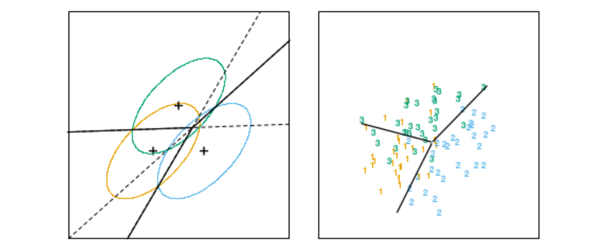

# 线性判别分析

## 1 类别密度

* 已知目标是求最优分类的类别后验概率$Pr(G|X)$

* 设$f_k(x)$是$G=k$的$x$的类别密度， 也就是类别为$k$在空间中的概率；并且还已知$\pi_k$是类别$k$的先验概率有$\sum_{k=1}^K \pi_k = 1$, 则根据先验和后验公式，可以得到后验概率和类别密度的关系
  $$
  Pr(G=k|X=x)
  \\=\frac{Pr(X=x|G=k)Pr(G=k)}{\sum_{l=1}^K Pr(X=x|G=l)Pr(G=l)}
  \\=\frac{f_k(x)\pi_k}{\sum_{l=1}^K f_l(x)\pi_l}
  $$

* 由此可见，直到类别密度基本等于知道后验概率$Pr(G|X)$

## 2 线性判别分析

### 2.1 线性判别分析导数

* 假设类别密度符合高斯分布，且其协方差矩阵$\forall k \in G, \Sigma_k=\Sigma$是相同的
  $$
  f_k(x)=\frac{1}{(2\pi)^{p/2}|\Sigma_k|^{1/2}}\exp{-\frac{1}{2}(x-\mu_k)^T\Sigma_K^{-1}(x-\mu_k)}
  $$

* 则比较两个类别后验概率的$log-ratio$即可
  $$
  \log{\frac{Pr(G=k|X=x)}{Pr(G=l|X=x)}}
  \\ = \log{\frac{f_k(x)}{f_l(x)}}+\log{\frac{\pi_k}{\pi_l}}
  \\ = \log{\frac{\pi_k}{\pi_l}} - \frac{1}{2}((x-\mu_l)^T\Sigma^{-1}(x-\mu_l)-(x-\mu_k)^T\Sigma^{-1}(x-\mu_k))
  \\ = \log{\frac{\pi_k}{\pi_l}} - \frac{1}{2}((x^T\Sigma^{-1}x+\mu_l^T\Sigma^{-1}\mu_l -2x^T\Sigma^{-1}\mu_l)\\-(x^T\Sigma^{-1}x+\mu_k^T\Sigma^{-1}\mu_k -2x^T\Sigma^{-1}\mu_k))
  \\ = \log{\frac{\pi_k}{\pi_l}} -\frac{1}{2}(\mu_l^T\Sigma^{-1}\mu_l-\mu_k^T\Sigma^{-1}\mu_k+2x^T\Sigma^{-1}(\mu_k-\mu_l))
  \\ = \log{\frac{\pi_k}{\pi_l}} -\frac{1}{2}(\mu_l+\mu_k)^T\Sigma^{-1}(\mu_l-\mu_k)+x^T\Sigma^{-1}(\mu_k-\mu_l) \label{2_eq1}
  $$
  可以看到，分类边界是一个超平面，所有的判别边界都是线性的

* 一个例子

  * 下左图是$p=2$, 也有三个类别的例子

    

    * 左图是三个协方差相同的高斯分布每个类别 95% 可能性的等高线，图中画出了线性边界
    * 右图是使用了每个类别的30个样本点进行拟合后的LDA判别边界

  * 根据$\eqref{2_eq1}$, 可以看出线性判别函数为
    $$
    \delta_k(x)= x^T\Sigma^{-1}\mu_k-\frac{1}{2}\mu_k^T\Sigma^{-1}\mu_k + \log{\pi_k }
    $$
    如果有先验概率相等且协方差矩阵为$\sigma^2 I$, 则判别函数可以化简为
    $$
    \delta_k(x)= \frac{2x^T\mu_k-\mu_k^T\mu_k}{2\sigma^2}
    $$
    判别规则即$G(x)=\arg\max_{k}\delta_k(x)$

* 参数估计：高斯分布的参数是不可知的，需要使用训练数据去估计

  * $\hat\pi_k = N_k/N$

  * $\hat \mu_k=\sum_{g_i=k}x_i/N_k​$

  * $\mathbf{\hat\Sigma}=\sum_{k=1}^K\sum_{g_i=k}(x_i-\hat\mu_k)(x_i-\hat\mu_k)^T/(N-K)​$

    * 无偏性证明

      根据[协方差估计-对预测变量的估计](..\A 基础知识\4 统计概率\4 相关系数与(协)方差#对预测变量的估计)，有
      $$
      E(\sum_{g_i=k}(x_i-\hat\mu_k)(x_i-\hat\mu_k)^T) = (N_k - 1)\Sigma
      $$
      于是，有
      $$
      E(\sum_{k=1}^K\sum_{g_i=k}(x_i-\hat\mu_k)(x_i-\hat\mu_k)^T) = \sum_{k=1}^K(N_k - 1)\Sigma 
      \\=(N-K)\Sigma
      $$
      因此有
      $$
      E(\sum_{k=1}^K\sum_{g_i=k}(x_i-\hat\mu_k)(x_i-\hat\mu_k)^T/(N-K) = \Sigma
      $$

  

### 2.2 