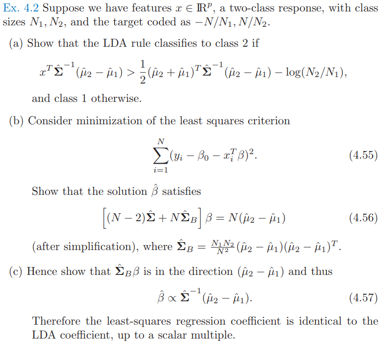
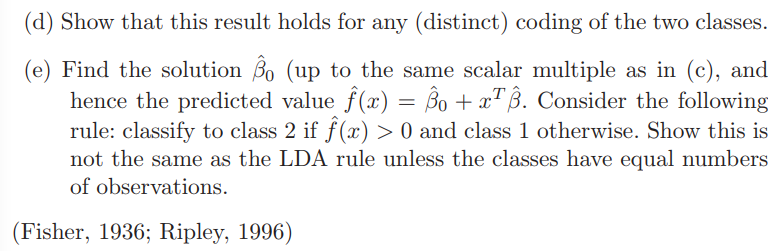

# 习题

## Ex 4.2

* 题目

  

  

  

* 第一问

  * 判别函数为
    $$
    \delta_k(x) = x^T\Sigma^{-1}\mu_k-\frac{1}{2}\mu_k^T\Sigma^{-1}\mu_k + \log{\pi_k }
    $$
    

  * 因此有
    $$
    \delta_2(x)-\delta_1(x)
    \\=\log{\frac{\pi_2}{\pi_1}} -\frac{1}{2}(\mu_2+\mu_1)^T\Sigma^{-1}(\mu_2-\mu_1)+x^T\Sigma^{-1}(\mu_2-\mu_1) >0
    \\=\log{\frac{N_2}{N_1}} -\frac{1}{2}(\hat \mu_2+\hat\mu_1)^T\Sigma^{-1}(\hat\mu_2-\hat\mu_1)+x^T\Sigma^{-1}(\hat\mu_2-\hat\mu_1) >0
    \\ \Leftrightarrow x^T\Sigma^{-1}(\hat\mu_2-\hat\mu_1)> \frac{1}{2}(\hat \mu_2+\hat\mu_1)^T\Sigma^{-1}(\hat\mu_2-\hat\mu_1)-\log{\frac{N_2}{N_1}}
    $$

* 第二问：

  * 可以知道，优化目标为
    $$
    RSS=\sum_{i=1}^N (y_i-\beta_0-x_i^T\beta)^2
    $$

  * 进行$\beta_0$求导，可以知道
    $$
    \frac{\partial RSS}{\partial \beta_0} = -2\sum_{i=1}^N(y_i-\beta_0-x_i^T\beta)
    \\ = -2(\sum_{i=1}^N y_i-N\beta_0-\sum_{i=1}^Nx_i^T\beta) 
    \\ = -2(N_1\times -\frac{N}{N_1}+N_2\times \frac{N}{N_2}-N\beta_0-\sum_{i=1}^Nx_i^T\beta)
    \\ = 2(N\beta_0+(N_1\hat \mu_1+N_2\hat \mu_2)^T\beta) = 0 \label{42_eq1}
    $$

  * 对$\beta$ 求导，可以知道
    $$
    RSS =  (y-\beta_0-X\beta)^T(y-\beta_0-X\beta)\\
    dRSS = tr((-Xd\beta)^T(y-\beta_0-X\beta)+(y-\beta_0-X\beta)^T(-Xd\beta))
    \\ = tr(-2(y-\beta_0-X\beta)^TXd\beta)
    \\ = tr((-2X^T(y-\beta_0-X\beta))^Td\beta)
    \\ \frac{\partial RSS}{\partial \beta} = -2X^T(y-\beta_0-X\beta) =0 \label{42_eq2}
    $$

  * 联立$\eqref{42_eq1}, \eqref{42_eq2}$，可得
    $$
    X^T(y-\beta_0-X\beta) =0
    \\ \Leftrightarrow  X^T(y+\mathbf{1}\frac{(N_1\hat \mu_1+N_2\hat \mu_2)^T}{N}\beta-X\beta ) =0
    \\  \Leftrightarrow X^T(X-\mathbf{1}\hat\mu^T)\beta = X^Ty
    \\  \Leftrightarrow (X^TX-X^T\mathbf{1}\hat\mu^T)\beta = \sum_{i=1}^{N_1}x_{1_i}y_{1_i}+\sum_{i=1}^{N_1}x_{2_i}y_{2_i}\because x_i^T代表X的第i行
    \\ \Leftrightarrow (X^TX-N\hat \mu\hat\mu^T)\beta = -\sum_{i=1}^{N_1}x_{1_i}(N/N_1)+\sum_{i=1}^{N_1}x_{2_i}(N/N_2)
    \\ \Leftrightarrow (X^TX-N\hat \mu\hat\mu^T)\beta = N(\hat\mu_2 -\hat\mu_1) \label{eq_42_3}
    $$

  * 对$X^TX$进行变化，得到
    $$
    X^TX
    \\ = \sum_{i=1}^{N_1}x_{1_i}x_{1_i}^T+\sum_{i=1}^{N_2}x_{2_i}x_{2_i}^T
    \\ = \sum_{i=1}^{N_1}(x_{1_i}-\hat\mu_1)(x_{1_i}-\hat\mu_1)^T+2\sum_{i=1}^{N_1}x_{1_i}\hat\mu_1^T-N_1\hat\mu_1\hat\mu_1^T
    \\+\sum_{i=1}^{N_2}(x_{2_i}-\hat\mu_2)(x_{2_i}-\hat\mu_2)^T+2\sum_{i=1}^{N_2}x_{2_i}\hat\mu_2^T-N_2\hat\mu_2\hat\mu_2^T
    \\ = \sum_{i=1}^{N_1}(x_{1_i}-\hat\mu_1)(x_{1_i}-\hat\mu_1)^T+N_1\hat\mu_1\hat\mu_1^T
    +\sum_{i=1}^{N_2}(x_{2_i}-\hat\mu_2)(x_{2_i}-\hat\mu_2)^T+N_2\hat\mu_2\hat\mu_2^T
    \\ = (N-2)\hat \Sigma+N_1\hat\mu_1\hat\mu_1^T+N_2\hat\mu_2\hat\mu_2^T\because \hat \Sigma=\sum_{k=1}^K\sum_{g_i=k}(x_i-\hat\mu_k)(x_i-\hat\mu_k)^T/(N-K) \label{eq_42_4}
    $$

  * 联立$\eqref{eq_42_3}, \eqref{eq_42_4}​$, 可得
    $$
    (X^TX-N\hat \mu\hat\mu^T)\beta = N(\hat\mu_2 -\hat\mu_1) 
    \\ \Leftrightarrow ((N-2)\hat \Sigma+N_1\hat\mu_1\hat\mu_1^T+N_2\hat\mu_2\hat\mu_2^T-\frac{(N_1\hat \mu_1+N_2\hat \mu_2)(N_1\hat \mu_1+N_2\hat \mu_2)^T}{N})\beta = N(\hat\mu_2 -\hat\mu_1)
    \\  \Leftrightarrow ((N-2)\hat \Sigma
    \\+\frac{N_1^2\hat\mu_1\hat\mu_1^T+N_1N_2\hat\mu_1\hat\mu_1^T+N_1N_2\hat\mu_2\hat\mu_2^T+N_2^2\hat\mu_2\hat\mu_2^T-N_1^2\hat\mu_1\hat\mu_1^T-N_2^2\hat\mu_2\hat\mu_2^T-2N_1N_2\hat\mu_1\hat\mu_2^T}{N})\beta 
    \\= N(\hat\mu_2 -\hat\mu_1)
    \\  \Leftrightarrow
    ((N-2)\hat \Sigma+\frac{N_1N_2\hat\mu_1\hat\mu_1^T+N_1N_2\hat\mu_2\hat\mu_2^T-2N_1N_2\hat\mu_1\hat\mu_2^T}{N})\beta = N(\hat\mu_2 -\hat\mu_1)
    \\  \Leftrightarrow
    ((N-2)\hat \Sigma+N\frac{N_1N_2(\hat\mu_2-\hat\mu_1)(\hat\mu_2-\hat\mu_1)^T}{N^2})\beta = N(\hat\mu_2 -\hat\mu_1)
    \\  \Leftrightarrow
    ((N-2)\hat \Sigma+\hat\Sigma_B)\beta = N(\hat\mu_2 -\hat\mu_1)
    $$

* 第三问

  * 首先证明$\hat\Sigma_B\beta $在$\hat\mu_2-\hat\mu_1$方向上
    $$
    \hat\Sigma_B\beta 
    \\=\frac{N_1N_2(\hat\mu_2-\hat\mu_1)}{N^2}(\hat\mu_2-\hat\mu_1)^T\beta
    \\=\frac{N_1N_2(\hat\mu_2-\hat\mu_1)}{N^2}c
    \\= c\frac{N_1N_2}{N^2}(\hat\mu_2-\hat\mu_1)
    $$

  * 因此就有
    $$
    (N-2)\hat\Sigma\beta +Nc\frac{N_1N_2}{N^2}(\hat\mu_2-\hat\mu_1) =N(\hat\mu_2-\hat\mu_1)
    \\ \Leftrightarrow \hat\Sigma\beta=\frac{(N-c\frac{N_1N_2}{N})}{N-2}(\hat\mu_2-\hat\mu_1)
    \\ \Leftrightarrow \beta=\frac{(N-c\frac{N_1N_2}{N})}{N-2}{\hat\Sigma}^{-1}(\hat\mu_2-\hat\mu_1)
    \\ \Rightarrow \hat\beta\propto(\hat\mu_2-\hat\mu_1)
    $$

  * 事实上，正比系数可以计算出来
    $$
    c=(\hat\mu_2-\hat\mu_1)^T\beta
    \\ = \frac{(N-c\frac{N_1N_2}{N})}{N-2}(\hat\mu_2-\hat\mu_1)^T{\hat\Sigma}^{-1}(\hat\mu_2-\hat\mu_1)
    \\ \Leftrightarrow (N-2+\frac{N_1N_2}{N}(\hat\mu_2-\hat\mu_1)^T{\hat\Sigma}^{-1}(\hat\mu_2-\hat\mu_1))c=N(\hat\mu_2-\hat\mu_1)^T{\hat\Sigma}^{-1}(\hat\mu_2-\hat\mu_1)
    \\ \Leftrightarrow c=\frac{N(\hat\mu_2-\hat\mu_1)^T{\hat\Sigma}^{-1}(\hat\mu_2-\hat\mu_1)}{N-2+\frac{N_1N_2}{N}(\hat\mu_2-\hat\mu_1)^T{\hat\Sigma}^{-1}(\hat\mu_2-\hat\mu_1)} \label{42_eq_c}
    $$

* 第四问

  * 在$\eqref{42_eq1}$用到了编码，则设两个类编码为$g_1,g_2​$, 则该式变为
    $$
    2(N_1g_1+N_2g_2+N\beta_0+(N_1\hat \mu_1+N_2\hat \mu_2)^T\beta) = 0
    $$

  * 因此$\eqref{eq_42_3}​$变为
    $$
    X^T(y-\beta_0-X\beta) =0
    \\ \Leftrightarrow X^T(y+\mathbf{1}\frac{(N_1\hat \mu_1+N_2\hat \mu_2)^T}{N}\beta-X\beta -\frac{N_1g_1+N_2g_2}{N}) =0
    \\  \Leftrightarrow X^T(X-\mathbf{1}\hat\mu^T)\beta = X^Ty-X^T\mathbf{1}\bar g
    \\ \Leftrightarrow (X^TX-N\hat \mu\hat\mu^T)\beta = \sum_{i=1}^{N_1}x_{1_i}(g_1-\frac{N_1g_1+N_2g_2}{N})+\sum_{i=1}^{N_1}x_{2_i}(g_2-\frac{N_1g_1+N_2g_2}{N})
    \\ \Leftrightarrow (X^TX-N\hat \mu\hat\mu^T)\beta = \sum_{i=1}^{N_1}x_{1_i}\frac{N_2}{N}(g_1-g_2)+\sum_{i=1}^{N_1}x_{2_i}\frac{N_1}{N}(g_2-g_1)
    \\ \Leftrightarrow (X^TX-N\hat \mu\hat\mu^T)\beta = \frac{\sum_{i=1}^{N_1}x_{1_i}}{N_1}\frac{N_1N_2}{N}(g_1-g_2)+\frac{\sum_{i=1}^{N_1}x_{2_i}}{N_2}\frac{N_1N_2}{N}(g_2-g_1)
    \\ \Leftrightarrow (X^TX-N\hat \mu\hat\mu^T)\beta = \frac{N_1N_2}{N}(g_2-g_1)(\hat \mu_2-\hat \mu_1)
    $$

  * 可以看到式子右侧方向没有改变，因此结论仍然成立

* 第五问

  * 根据$\eqref{42_eq1}$，有
    $$
    \hat \beta_0 = -\frac{N_1\hat \mu_1^T+N_2\hat \mu_2^T}{N}\hat \beta=-\hat\mu^T\hat\beta
    $$

  * 因此，预测为
    $$
    \hat f(x)=\hat\beta_0+x^T\hat\beta
    \\ = (x-\hat\mu)^T\hat\beta
    \\ = \frac{(N-c\frac{N_1N_2}{N})}{N-2}(x-\hat\mu)^T{\hat\Sigma}^{-1}(\hat\mu_2-\hat\mu_1)
    $$

  * 当$N_1==N_2$

    * LDA判别准则是
      $$
      -\frac{1}{2}(\hat \mu_2+\hat\mu_1)^T\Sigma^{-1}(\hat\mu_2-\hat\mu_1)+x^T\Sigma^{-1}(\hat\mu_2-\hat\mu_1)
      $$

    * 而预测为
      $$
      \hat f(x)\\ = \frac{(1-\frac{c}{4})N}{N-2}[x^T{\hat\Sigma}^{-1}(\hat\mu_2-\hat\mu_1)-\frac{1}{2}(\hat\mu_1+\hat\mu_2)^T{\hat\Sigma}^{-1}(\hat\mu_2-\hat\mu_1)]
      $$

    * 其中, 根据$\eqref{42_eq_c}$
      $$
      1-\frac{c}{4}
      \\=1 -\frac{\frac{N}{4}(\hat\mu_2-\hat\mu_1)^T{\hat\Sigma}^{-1}(\hat\mu_2-\hat\mu_1)}{N-2+\frac{N}{4}(\hat\mu_2-\hat\mu_1)^T{\hat\Sigma}^{-1}(\hat\mu_2-\hat\mu_1)} >0
      \\=\frac{N-2}{N-2+\frac{N}{4}(\hat\mu_2-\hat\mu_1)^T{\hat\Sigma}^{-1}(\hat\mu_2-\hat\mu_1)}
      \\ \frac{(1-\frac{c}{4})N}{N-2} =\frac{N}{N-2+\frac{N}{4}(\hat\mu_2-\hat\mu_1)^T{\hat\Sigma}^{-1}(\hat\mu_2-\hat\mu_1)} >0
      $$

    * 因此可见预测和LDA准则一致

  * 若$N_1 \not = N_2$, 则不一致

