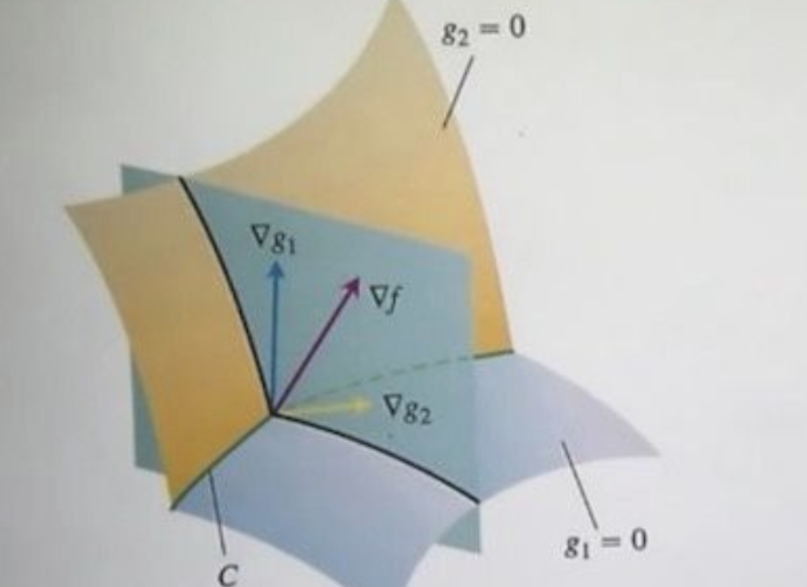

# 拉格朗日乘子法

## 1 一般形式的拉格朗日乘子法

1. 定义：对于函数 $f(x_1,x_2,…,x_n)​$,以及限制条件:$s.t. h_k(x_1,x_2,…,x_n)=0​$ 其中$(k=1,2,…,l)​$

   定义函数
   $$
   F(x, \lambda) = f(x) + \sum_{i = 1}^k\lambda_ih_i(x)
   $$
   通过联立求解
   $$
   \left\{
   \begin{matrix}
   \frac{\partial F}{\partial x_1} = 0 \\
   \frac{\partial F}{\partial x_2} = 0 \\
   ...\\
   \frac{\partial F}{\partial x_n} = 0 \\
   \frac{\partial F}{\partial \lambda_1} = 0 \\
   \frac{\partial F}{\partial \lambda_2} = 0 \\
   ...\\
   \frac{\partial F}{\partial \lambda_l} = 0 
   \end{matrix}
   \right.
   $$
   可以求得$f(x_1,x_2,…,x_n)$得最小值所需要的$\mathbf{x}$

2. 解释：

   

   $\nabla f$一定在$\nabla g_1$和$\nabla g_2$张成的空间

## 2 向量形式的拉格朗日乘子法

1. 定义：对于函数$f(\mathbf{x})$, 和限制条件$\mathbf{h}(\mathbf{x})=0$

   定义函数
   $$
   F(\mathbf{x}, \mathbf{\lambda}) = f(\mathbf{x})+\mathbf{\lambda^T}\mathbf{h}(\mathbf{x})
   $$
   联立求解
   $$
   \left\{
   \begin{matrix}
   \frac{\partial F}{\partial \mathbf{x}} = 0 \\
   \frac{\partial F}{\partial \mathbf{\lambda}} = 0
   \end{matrix}
   \right.
   $$
   可以求得$f(\mathbf{x})​$得最小值所需得$\mathbf{x} ​$

## 3 例题

1. 已知$h(x_1,x_2)=2x_1+3x_2-6​$, $f(x_1,x_2)=4x_1^2+5x^2​$, 求$h=0​$时$f​$最小值
   $$
   F(x,\lambda)=x^T
   \left[
   \begin{matrix}
   4 & 0\\
   0 & 5
   \end{matrix}
   \right]
   x +\lambda([2,3]x - 6)
   = x^TAx +\lambda(k^Tx - 6)
   \\ \frac{\partial F}{\partial x} = tr(dx^TAx+x^TAdx+\lambda k^Tdx)
   \\ = tr((Ax + A^Tx + \lambda k)^Tdx)
   \\ 
   \left[
   \begin{matrix}
   8x_1 + 2\lambda\\
   10x_2+3\lambda
   \end{matrix}
   \right] = 0
   \\ \frac{\partial F}{\partial \lambda} = tr(d\lambda(k^Tx-6))=tr((k^Tx - 6)^Td\lambda)
   \\ 2x_1+3x_2-6 = 0
   \\ 解得\ x = 
   \left[
   \begin{matrix}
   \frac{15}{14}\\
   \frac{9}{7}
   \end{matrix}
   \right]
   $$

2. 已知$h_1(x_1,x_2, x_3)=2x_1+3x_2-6x_3+2, h_2(x_1,x_2, x_3)=6x_2-2x_3+6​$, $f(x_1,x_2,x_3)=4x_1^2+5x^2+2x^3​$, 求$\mathbf {h}=0​$时$f​$最小值
   $$
   F(x,\lambda)=x^T
   \left[
   \begin{matrix}
   4 & 0 & 0 \\
   0 & 5 & 0 \\
   0 & 0 & 2
   \end{matrix}
   \right]
   x +\lambda^T(
   \left[
   \begin{matrix}
   2 & 3 & -6 \\
   0 & 6 & 2
   \end{matrix}
   \right]
   x + \alpha)
   \\ x^TAx +\lambda^T(Bx + \alpha)
   \\ \frac{\partial F}{\partial x} = tr(dx^TAx+x^TAdx+\lambda^T Bdx)
   \\ = tr((Ax + A^Tx +  B^T\lambda)^Tdx) = 0
   \\ 
   \left[
   \begin{matrix}
   8x_1 +2\lambda_1 \\
   10x_2 + 3\lambda_1 + 6\lambda_2 \\
   4x_3 - 6\lambda_1 + 2\lambda_2
   \end{matrix}
   \right] = 0
   \\ \frac{\partial F}{\partial \lambda} = tr(d\lambda^T(Bx+\alpha))=tr(((Bx + \alpha)^T)^Td\lambda) = 0
   \\ 
   \left[
   \begin{matrix}
   2x_1 + 3x_2 - 6x_3 + 2  \\
   6x_2-2x_3+6
   \end{matrix}
   \right] = 0
   $$
   

## 4 对偶性

### 4.1 原始问题

1. $f(x), c_i(x), h_j(x)$是定义在$R^n$上连续可微函数，则称约束最优化问题

$$
\min_{x\in R^n}\  f(x)\\
s.t. \  c_i(x)\le 0, \ i =1,2,...,k\\
h_j(x) = 0, \ j = 1,2,...,l
$$

​	为原始优化问题

2. 拉格朗日函数
   $$
   L(x,\alpha,\beta) = f(x)+\sum_{i=1}^k\alpha_i c_i(x) + \sum_{j=1}^l\beta_j h_j(x)
   $$
   其中$\alpha_i\ge 0 $称为松弛变量/KKT变量，$\beta_i$是拉格朗日乘子。

* $L(x,\alpha,\beta)​$关于$(\alpha,\beta)​$是仿射函数
* 若$f(x),c(x)$是凸函数, $h(x)$是仿射函数，则$L(x,\alpha,\beta)$是关于$x$的凸函数。

3. 构造

$$
\theta_p(x) = \max_{\alpha,\beta} L(x, \alpha, \beta)
$$

* 如果某个$x​$违反约束条件， 即存在$i​$使得$c_i(x) > 0​$或者$h_j(x) \not =0​$, 可以令$\alpha_i c_i(x) \rightarrow +\infty​$或者$\beta_jh_j(x)\rightarrow +\infty​$, 从而$\theta_p(x) = +\infty​$

* 若均符合条件，$\theta_p(x) = f(x)$

* 即
  $$
  \theta_p(x)=
  \left\{
  \begin{matrix}
  f(x), &x满足原始问题约束\\
  +\infty, &否则 
  \end{matrix}
  \right.
  $$

* 极小化问题

  $$
  \min_x \theta_P(x) = \min_x \max_{\alpha,\beta} L(x,\alpha,\beta)
  $$

  与原始问题等价，则有相同的解。
  $$
  \min_x \max_{\alpha,\beta} L(x,\alpha,\beta)
  $$
  称为广义拉格朗日函数极小极大化问题。

* 原始问题的最优值
  $$
  p^*=\min_x \theta_P(x)
  $$

### 4.2 对偶问题

1. 构造
   $$
   \theta_D(\alpha, \beta) = \min_x L(x, \alpha, \beta)
   $$
   则极大化问题
   $$
   \max_{\alpha,\beta} \theta_D(\alpha, \beta) = \max_{\alpha,\beta} \min_x L(x,\alpha, \beta)
   $$
   称为广义拉格朗日函数的极大极小问题。

   表示为约束最优化问题为：
   $$
   \max_{\alpha,\beta} \theta_D(\alpha, \beta) = \max_{\alpha,\beta} \min_x L(x,\alpha, \beta) \\
   s.t. \  \alpha_i \ge 0, i = 1,2,...,k
   $$
   这称为原始问题的对偶问题。

2. 定义对偶问题的最优值
   $$
   d^*=\max_{\alpha,\beta} \theta_D(\alpha,\beta)
   $$

3. 性质：此函数为凹函数
   $$
   \theta_D(\lambda\alpha_1+(1-\lambda)\alpha_2,\lambda\beta_1+(1-\lambda)\beta_2) \ge \lambda\theta_D(\alpha_1,\beta_1)+(1-\lambda)\theta_D(\alpha_2,\beta_2)
   \\ \theta_D(\lambda\alpha_1+(1-\lambda)\alpha_2,\lambda\beta_1+(1-\lambda)\beta_2) 
   \\ = \min_x(L(x, \lambda\alpha_1+(1-\lambda)\alpha_2, \lambda\beta_1+(1-\lambda)\beta_2))
   \\ = \min_x(\lambda L(x,\alpha_1,\beta_1)+(1-\lambda)L(x,\alpha_2,\beta_2))
   \\ \ge \min_x(\lambda L(x,\alpha_1,\beta_1))+\min_x((1-\lambda)L(x,\alpha_2,\beta_2))
   \\ = \lambda\theta_D(\alpha_1,\beta_1)+(1-\lambda)\theta_D(\alpha_2,\beta_2)
   $$

* 当$x​$固定时，$L(x,\alpha,\beta)​$是一个关于$(\alpha, \beta)​$的仿射函数，既是凸的也不是凹的，满足$L(x, \lambda\alpha_1+(1-\lambda)\alpha_2, \lambda\beta_1+(1-\lambda)\beta_2) = \lambda L(x,\alpha_1,\beta_1)+(1-\lambda)L(x,\alpha_2,\beta_2)​$

### 4.3 原始问题和对偶问题的关系

1. 弱对偶性
   $$
   d^* \le p^*
   $$

* 对于所有优化问题都成立，即使原始问题非凸

* 证明：
  $$
  d^* = \theta_D(\alpha^*,\beta^*) 
  \\= \min_xL(x,\alpha^*,\beta^*) 
  \\ = \min_x(f(x) + \sum_{i=1}^m\alpha_i^*c_i(x) + \sum_{j=1}^n\beta_j^*h_j(x)) 
  \\ \le f(x^*) + \sum_{i=1}^m\alpha_i^*c_i(x^*) + \sum_{j=1}^n\beta_j^*h_j(x^*) 
  \\ \le \max_{\alpha,\beta}(f(x^*) + \sum_{i=1}^m\alpha_ic_i(x^*) + \sum_{j=1}^n\beta_jh_j(x^*)) \\  = \theta_P(x^*)=p^*
  $$

* 更进一步的解释$\theta_D(\alpha,\beta)  < \theta_P(x)$
  $$
  \theta_D(\alpha,\beta) 
  \\= \min_xL(x,\alpha,\beta) 
  \\ = \min_x(f(x) + \sum_{i=1}^m\alpha_ic_i(x) + \sum_{j=1}^n\beta_jh_j(x)) 
  \\ \le f(x) + \sum_{i=1}^m\alpha_ic_i(x) + \sum_{j=1}^n\beta_jh_j(x) 
  \\ \le \max_{\alpha,\beta}(f(x) + \sum_{i=1}^m\alpha_ic_i(x) + \sum_{j=1}^n\beta_jh_j(x)) \\  = \theta_P(x)
  $$
  

2. 强对偶性
   $$
   d^* = p^*
   $$
   并不是所有的对偶问题都满足强对偶性 ，在 SVM 中是直接假定了强对偶性的成立，其实只要满足一些条件，强对偶性是成立的，比如说 Slater 条件与KKT条件。

* Slater条件

  * 凸优化条件
    * $f(x)$和$c_i(x)$是凸函数
    * $h_j(x)$是仿射函数
  * $c_i(x)​$严格可行
    * 存在$x_0$, 对所有的$i$有$c_i(x_0) < 0$

  则存在$x^*, \alpha^*, \beta^*$, 使得$x^*$是原始问题的解，$\alpha^*, \beta^*$是对偶问题的解，并且
  $$
  p^* = d^* = L(x^*, \alpha^*, \beta^*)
  $$
  即：原始问题是凸优化问题并且满足严格可行条件的话，那么强对偶性成立

* KTT条件

  * 满足Slater条件

  * 若$x^*$是原始问题的解，$\alpha^*,\beta^*$是对偶问题的解的充分必要条件是$x^*,\alpha^*,\beta^*$满足：
    $$
    \begin{align}
    &(1)\ c_i(x^*) \le 0,\ i = 1,2,...,k\\
    &(2)\ h_j(x^*) = 0,\ j = 1,2,...,l\\
    &(3)\ \nabla_xL(x^*,\alpha^*,\beta^*) = 0\\
    &(4)\ \alpha_i^* \ge 0,\ i = 1,2,...,k\\
    &(5)\ \alpha_i^*c_i(x^*) = 0,\ i = 1,2,...,k\\
    
    \end{align}
    $$
    且$\theta_P(x^*) = \theta_D(\alpha^*,\beta^*)​$

  * 证明

    * 必要性：

    1. 由于 $x^*​$ 是原问题的解，所以满足第 $(1),(2)​$条。

    2. 由于$\theta_D(\alpha^*, \beta^*) = \theta_P(x^*)​$, 则$\theta_D(\alpha^*, \beta^*)  = \min_x(L(x,\alpha^*,\beta^*)) = L(x^*,\beta^*,\alpha^*)​$, 则梯度为0，满足$(3)​$

    3. 由于$\alpha^*, \beta^*$是对偶问题的解，所以满足$(4)$

    4. 对于$(5)$, 经过公式：
       $$
       \theta_P(x^*) = \theta_D(\alpha^*,\beta^*) 
       \\= \min_xL(x,\alpha^*,\beta^*) 
       \\ = \min_x(f(x) + \sum_{i=1}^m\alpha_i^*c_i(x) + \sum_{j=1}^n\beta_j^*h_j(x)) 
       \\ \le f(x^*) + \sum_{i=1}^m\alpha_i^*c_i(x^*) + \sum_{j=1}^n\beta_j^*h_j(x^*) 
       \\ \le \max_{\alpha,\beta}(f(x^*) + \sum_{i=1}^m\alpha_ic_i(x^*) + \sum_{j=1}^n\beta_jh_j(x^*)) \\  = \theta_P(x^*) = f(x^*)
       $$

       由于两侧等于，所以等号都成立，则$\sum_{i=1}^m\alpha_i^*c_i(x^*) = 0$,所以$\alpha_i^*c_i(x^*) = 0$

    * 充分性：

    1. 根据对偶问题的定义
       $$
       \theta_D(\alpha^*,\beta^*) = \min_x(f(x) + \sum_{i=1}^m\alpha_i^*c_i(x) + \sum_{j=1}^n\beta_j^*h_j(x))
       $$

    2. 由于$(3)$梯度为0，且$L(x,\alpha,\beta)$函数关于$x$凸函数，则
       $$
       \theta_D(\alpha^*,\beta^*) = \min_x(f(x) + \sum_{i=1}^m\alpha_i^*c_i(x) + \sum_{j=1}^n\beta_j^*h_j(x))
       \\ =  f(x^*) + \sum_{i=1}^m\alpha_i^*c_i(x^*) + \sum_{j=1}^n\beta_j^*h_j(x^*)
       \\ = f(x^*) = \theta_P(x^*)
       $$

    3. 由于$\theta_P(x)$是凸函数，$\theta_D(\alpha,\beta)$是凹函数。且 $\theta_D(\alpha, \beta) \le \theta_P(x)$，我们就知道原问题肯定取到了最小值，而对偶问题肯定取到了最大值，说明我们找到了两者的解。

  * KTT的直观理解

    约束问题：
    $$
    \min_x \ f(x)\\
    s.t. \ g(x) \le 0
    $$

    1. $g(x)\le 0​$称为原始可行性

    2. 定义可行域$K = \{x \in R^n|g(x)\le 0\}$

    * 若$g(x^*) < 0​$, 则落在可行域内，称为内部解，约束条件无效，只需要检验满足原始可行性就可, 根据拉格朗日乘子
      $$
      \nabla f= 0\\
      \lambda = 0
      $$

    * 若$g(x^*) = 0$, 则在$K$的边界，称为边界解，此时约束条件是有效的。
      $$
      \nabla f = -\lambda \nabla g\\
      \lambda >= 0(对偶可行性)
      $$
      由于$f$在边界取到，所以$\nabla f$和$\nabla g $方向相反，从而产生了对偶可行性

    3. 可以看到$\lambda g(x) = 0$恒成立，所以称为互补松弛性

    4. 最后得到$KTT$条件
       $$
       \nabla f + \lambda \nabla g = 0\\
       \ g(x) \le 0\\
       \lambda >= 0\\
       \lambda g(x) = 0
       $$
    5. 对于普遍情况
       $$
       \min_{x\in R^n}\  f(x)\\
       s.t. \  c_i(x)\le 0, \ i =1,2,...,k\\
       h_j(x) = 0, \ j = 1,2,...,l\\
       L(x,\alpha,\beta) = f(x)+\sum_{i=1}^k\alpha_i c_i(x) + \sum_{j=1}^l\beta_j h_j(x)
       $$
       
       得到KTT条件
       
       $$
       \nabla_xL(x^*,\alpha^*,\beta^*) = 0\\
       \alpha_i \ge 0\\
       c_i(x) \le 0\\
       h_h(x)  = 0\\
       \alpha_ic_i(x) = 0
       $$

