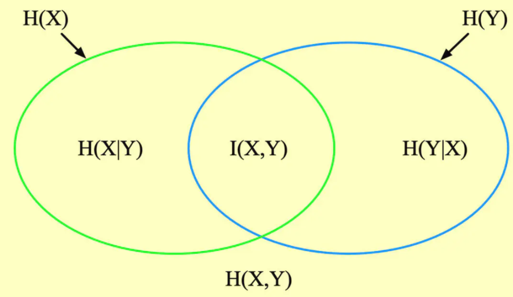

# 信息熵

## 1 信息量
$$
I(x_0) = -\log(p(x_0))
$$

## 2 信息熵

$$
H(X) = -\sum_{i=1}^np(x_i)\log(p(x_i))
$$

* 信息量度量的是一个具体事件发生了所带来的信息，而熵则是在结果出来之前对可能产生的信息量的期望

* 信息熵越大，变量包含的信息量越大，变量的不确定性也越大。

## 3 条件熵

1. 定义：在$X$给定的条件下，$Y$的条件概率分布的熵对$X$的数学期望
   $$
   H(Y|X) = \sum_{x\in X}p(x)H(Y|X=x)\\
   $$

2. 理解条件熵可以使用决策树进行特征选择的例子：我们期望选择的特征要能将数据的标签尽可能分得比较“纯”一些，特征将数据的标签分得“纯”，则熵就小，信息增益就大

3. 变形：
   $$
   H(Y|X) = \sum_{x\in X}p(x)H(Y|X=x)\\
   = -\sum_{x\in X}p(x)\sum_{y\in Y} p(y|x)\log(p(y|x))\\
   = -\sum_{x\in X}\sum_{y\in Y} p(x)p(y|x)\log(p(y|x))\\
   = -\sum_{x\in X}\sum_{y\in Y} p(x,y)\log(p(y|x))
   $$
   条件熵就是“被特征分割以后的信息熵的加权平均”。

## 4 联合熵

1. 定义
   $$
   H(X,Y)=-\sum_{x\in X}\sum_{y\in Y}p(x,y)\log(p(x,y))
   $$
   

## 5 互信息(信息增益)

1. 定义：互信息(Mutual Information)是衡量随机变量之间相互依赖程度的度量。
   $$
   H(Y)-H(Y|X)\\
   = -\sum_{y\in Y}\sum_{x\in X} p(x,y)\log(p(y))+\sum_{x\in X}\sum_{y\in Y} p(x,y)\log(p(y|x))
   \\ = \sum_{x\in X}\sum_{y \in Y}p(x,y)\log(\frac{p(y|x)}{p(x)})
   \\ = \sum_{x\in X}\sum_{y \in Y}p(x,y)\log(\frac{p(x,y)}{p(x)p(y)})\\
   H(X)-H(X|Y)\\
   = -\sum_{x\in X}\sum_{y\in Y} p(x,y)\log(p(x))+\sum_{y\in Y}\sum_{x\in X} p(x,y)\log(p(x|y))
   \\ = \sum_{y\in Y}\sum_{x \in X}p(x,y)\log(\frac{p(x|y)}{p(y)})
   \\ = \sum_{y\in Y}\sum_{x \in X}p(x,y)\log(\frac{p(x,y)}{p(x)p(y)})\\
   \longrightarrow H(Y)-H(Y|X) = H(X)-H(X|Y)\\
   I(X,Y)  = H(Y)-H(Y|X) = H(X)-H(X|Y)\\
   H(Y|X) = H(Y) - I(X,Y)\\
   H(X|Y) = H(X) - I(X,Y)\\
   $$

2. 关系

* $$
  H(X,Y)=-\sum_{x\in X}\sum_{y\in Y}p(x,y)\log(p(x,y))
  \\= -\sum_{x\in X}\sum_{y\in Y}p(x,y)\log(p(y|x))-\sum_{x\in X}\sum_{y\in Y}p(x,y)\log(\frac{p(x)p(y)}{p(x,y)}p(y|x))
  \\ = H(Y|X)+H(Y|X)-I(X,Y)
  $$

## 6 相对熵

1. 相对熵又称 KL 散度，如果我们对于同一个随机变量$X$有两个单独的概率分布$P(X)$和$Q(X)$, 使用 KL 散度来衡量这两个分布的差异。差异越大则相对熵越大，差异越小则相对熵越小。

2. 计算公式：
   $$
   D_{KL}(p\|q) = \sum_{i=1}^np(x_i)\log(\frac{p(x_i)}{q(x_i)})
   \\ = \sum_{i=1}^np(x_i)\log(p(x_i))-\sum_{i=1}^np(x_i)\log(q(x_i))
   $$
   

## 7 交叉熵

1. 定义：
   $$
   H(p,q) = -\sum_{i=1}^n p(x_i)\log(q(x_i))
   $$

2. 相对熵和交叉熵的关系
   $$
   D_{KL}(p||q) 
   \\ = \sum_{i=1}^np(x_i)\log(p(x_i))-\sum_{i=1}^np(x_i)\log(q(x_i))
   \\ = -H(p(x)) +[-\sum_{i=1}^np(x_i)\log(q(x_i))]
   \\ = -H(p(x)) + H(p,q)
   $$
   如果$DL$散度前半部分$H(q)$是一个常量, 则交叉熵和DL散度等价。

3. 交叉熵可以用作代价

   模型目标是最小化模型分布$P(model)$和训练数据$P(training)$的差异，也就是最小化$D_{KL}(P(training)|P(model))$

   训练数据的分布A是给定的。那么A固定不变，$DL$散度就等价求$H(A,B)$

4. 交叉熵与极大似然估计

   假设有一个真实分布为$P(x,\theta)​$的随即变量，我们对它进行了N次独立同分布实验，对于每个可能的结果$x​$观察到的次数为$N(x)​$, 那么他的似然值为：
   $$
   L(\theta) = \prod_x P(x,\theta)^{N(x)}\\
   \ln(L(\theta)) = \sum_{x}N(x)\ln(P(x,\theta))\\
   $$
   这个式子有两个缺点，第一它是个负数，第二它的数值跟样本数有关，样本越多数值越大，因此除以一下总的样本数归一化，再取个相反数，然后改用频率表示
   $$
   -\frac{\ln(L(\theta))}{N} =-\sum_{x}\frac{N(x)}{N}\ln(P(x,\theta)) = -\sum_{x}P_o(x)\ln(P(x,\theta))
   $$
   因此可以看出，交叉熵最小实质上就是似然值最大。

   给定$P_o(x)$的情况下，使交叉熵最小的分布一定有$P=P_o$， 使用拉格朗日乘子法
   $$
   W = -\sum_{x}P_o(x)\ln(P(x,\theta)) + \lambda(\sum_{x}P(x,\theta) - 1)
   $$
   对$\theta$求偏导：
   $$
   \nabla_{\theta}W = \sum_{x}(-\frac{P_o(x)}{P(x,\theta)}\nabla_{\theta}P+\lambda\nabla_{\theta}P)=0
   $$
   则$P(x,\theta)$与$P_o(x)$为比例，因为归一化条件，所以$P(x,\theta) = P_o(x)$

5. 逻辑回归与交叉熵
   $$
   H(p,q) = -\sum_{i}p_i\log(q_i) = -y\log(\hat y)-(1-y)\log(1-\hat y)\\
   J(w) = \frac{1}{N} \sum_{n=1}^N H(p_n,q_n)
   \\=-\frac{1}{N} \sum_{n=1}^N(y\log(\hat y)+(1-y)\log(1-\hat y))\\
   $$
   