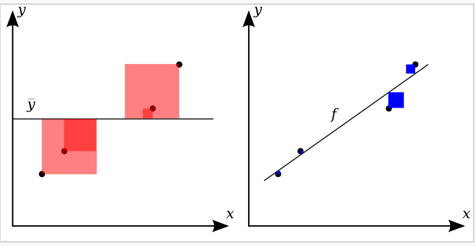

# 平方和与拟合优度

## 1 平方和

### 1.1 总平方和

* 名称：总离差平方和\总平方和 TSS (Total Sum of Squares)

* 公式：
  $$
  TSS=(y-\bar y)^T(y-\bar y)
  $$

* 含义：反应了观测真实值$y$和真实平均值之间的偏差情况，这里没有使用误差而是因为$y$和$\bar y $都是真实值，一个是观测到的，一个是真实值计算出来的

### 1.2 回归平方和

* 名称：回归平方和、或者解释平方和 ESS(Explained Sum of Squares)

* 公式：
  $$
  ESS=(\hat y-\bar y)^T(\hat y-\bar y)
  $$

### 1.3 残差平方和

* 名称：残差平方和、或者剩余平方和

* 公式：
  $$
  RSS=(y-\hat y)^T(y-\hat y)
  $$

### 1.4 关系

* 公式：
  $$
  TSS=RSS+ESS
  $$

* 解释：如果我们使用观测到的真实值，通过线性回归模型对它们进行拟合计算，那么观测到的真实值与真实平均值之间的偏差会表现在模型的两个方面，第一个方面是模型估计值与真实平均值之间的偏差，另一个方面是观测真实值与模型估计值之间的偏差，而且正好是这两个方面的总和。

* 推导：
  * 首先对$RSS​$进行展开 
    $$
    TSS=(y-\bar y)^T(y-\bar y)
    \\=(y-\hat y+\hat y-\bar y)^T(y-\hat y+\hat y-\bar y)
    \\=(y-\hat y)^T(y-\hat y)+(\hat y-\bar y)^T(\hat y-\bar y)+2(y-\hat y)^T(\hat y-\bar y)
    \\=RSS+ESS+2(y-\hat y)^T\hat y-2(y-\hat y)^T\bar y
    $$

  * 由于有
    $$
    \frac{\partial RSS(\beta)}{\partial \beta} = 2X^T(X\beta - y) = 0\\
    (X\hat\beta)^T(X\hat\beta-y)=0\\
    \rightarrow \hat y^T(\hat y-y)=0\\
    \mathbf{1}^T(X\beta-y)=0\ \because X第一列是\mathbf{1}\\
    \rightarrow \mathbf{1}^T(\hat y-y)=0
    $$

    * 由此可以推出定理：一定有$\bar x\hat \beta =\bar y$

      $$
      \bar x\hat\beta=\frac{\mathbf{1}^TX}{N}\hat\beta\\
      \\ =\frac{\mathbf{1}^T\hat y}{N}
      \\ = \bar y
      $$

    

  * 因此有
    $$
    TSS
    \\=RSS+ESS+2(y-\hat y)(\hat y-\bar y)
    \\=RSS+ESS+2(y-\hat y)^T\hat y-2(y-\hat y)^T\bar y\mathbf{1}
    \\=RSS+ESS-2(y-\hat y)^T\bar y\mathbf{1}
    \\=RSS+ESS-2\bar y(y-\hat y)^T\mathbf{1}
    \\=RSS+ESS
    $$

## 2 拟合优度（可决系数和相关系数）

* 定义：

  * 回归方程对观测值拟合的怎么样，就叫做拟合优度，R-square，就是度量拟合优度的一个统计量，即常说的r方，它叫做可决系数
  * 相关系数：

* 公式：
  $$
  R^2=1-\frac{RSS}{TSS}
  =1-\frac{(y-\hat y)^T(y-\hat y)}{(y-\bar y)^T(y-\bar y)}\\
  R^2=\frac{ESS}{TSS}
  $$

* 意义

  

  * 线性回归（右侧）比均值（左侧）拟合数据越好，则$R^2$越接近1
  * 蓝色区域面积代表相对于线性回归的平方残差，红色区域代表相对于平均值的平方残差。

* 拟合优度还有另一个测定指标是相关系数，相关系数的公式

  * 公式
    $$
    r=\rho(x,y)=\frac{\sum_{i=1}^n (x_i-\bar x)(y_i-\bar y)}{\sqrt{\sum_{i=1}^n(x_i-\bar x)^2\sum_{i=1}^n (y_i-\bar y)^2}}
    \\ =\frac{\sum_{i=1}^n (nx_i-\sum_{j=1}^n x_j)(ny_i-\sum_{j=1}^n y_j)}{\sqrt{\sum_{i=1}^n(nx_i-\sum_{j=1}^n x_j)^2\sum_{i=1}^n (ny_i-\sum_{j=1}^n y_j)^2}}
    \\ =\frac{n^2\sum_{i=1}^n x_iy_i-n\sum_{i=1}^n \sum_{j=1}^nx_jy_i-n\sum_{i=1}^n x_i\sum_{j=1}^n y_j+\sum_{i=1}^n\sum_{j=1}^nx_j\sum_{j=1}^ny_j}{\sqrt{(n^2\sum_{i=1}^n x_i^2+n(\sum_{j=1}^n x_j)^2-2n\sum_{i=1}^n x_i\sum_{j=1}^n x_j)(n^2\sum_{i=1}^n y_i^2+n(\sum_{j=1}^n y_j)^2-2n\sum_{i=1}^n y_i\sum_{j=1}^n y_j)}}
    \\ =\frac{n^2\sum_{i=1}^n x_iy_i-n\sum_{i=1}^n \sum_{j=1}^nx_jy_i-n\sum_{i=1}^n x_i\sum_{j=1}^n y_j+n\sum_{j=1}^nx_j\sum_{j=1}^ny_j}{\sqrt{(n^2\sum_{i=1}^n x_i^2+n(\sum_{j=1}^n x_j)^2-2n(\sum_{i=1}^n x_i)^2)(n^2\sum_{i=1}^n y_i^2+n(\sum_{j=1}^n y_j)^2-2n(\sum_{i=1}^n y_i)^2)}}
    \\ =\frac{n^2\sum_{i=1}^n x_iy_i-n\sum_{i=1}^n \sum_{j=1}^nx_jy_i-n\sum_{i=1}^n x_i\sum_{j=1}^n y_j+n\sum_{j=1}^nx_j\sum_{j=1}^ny_j}{\sqrt{(n^2\sum_{i=1}^n x_i^2+n(\sum_{j=1}^n x_j)^2-2n(\sum_{i=1}^n x_i)^2)(n^2\sum_{i=1}^n y_i^2+n(\sum_{j=1}^n y_j)^2-2n(\sum_{i=1}^n y_i)^2)}}
    \\ =\frac{n\sum_{i=1}^n x_iy_i-\sum_{j=1}^nx_j\sum_{j=1}^ny_j}{\sqrt{(n\sum_{i=1}^n x_i^2-(\sum_{j=1}^n x_j)^2)(n\sum_{i=1}^n y_i^2-(\sum_{j=1}^n y_j)^2}}
    $$

  * 可以看出可决系数只是相关系数的平方
    $$
    r^2=\rho(x,y)^2=\frac{(x-\bar x)^T(y-\bar y)(x-\bar x)^T(y-\bar y)}{(x-\bar x)^T(x-\bar x)(y-\bar y)^T(y-\bar y)}
    \\ = \frac{(ax+b-(a\bar x+b))^T(y-\bar y)(ax+b-(a\bar x+b))^T(y-\bar y)}{(ax+b-(a\bar x+b))^T(ax+b-(a\bar x+b))(y-\bar y)^T(y-\bar y)}
    \\ = \frac{(\hat y-\bar y)^T(y-\bar y)(\hat y-\bar y)^T(y-\bar y)}{(\hat y-\bar y)^T(\hat y-\bar y)(y-\bar y)^T(y-\bar y)}
    \\ = \frac{(\hat y-\bar y)^T(\hat y-\bar y+(y-\hat y))(\hat y-\bar y)^T(\hat y-\bar y+(y-\hat y))}{(\hat y-\bar y)^T(\hat y-\bar y)(y-\bar y)^T(y-\bar y)}
    \\ = \frac{(\hat y-\bar y)^T(\hat y-\bar y)(\hat y-\bar y)^T(\hat y-\bar y)}{(\hat y-\bar y)^T(\hat y-\bar y)(y-\bar y)^T(y-\bar y)}
    \\ = \frac{(\hat y-\bar y)^T(\hat y-\bar y)(\hat y-\bar y)^T(\hat y-\bar y)}{(\hat y-\bar y)^T(\hat y-\bar y)(y-\bar y)^T(y-\bar y)}
    \\ = \frac{(\hat y-\bar y)^T(\hat y-\bar y)}{(y-\bar y)^T(y-\bar y)}=R^2
    $$
    

  * 它们存在的目的是为了提供互相补充的信息，它俩最著要的区别在于：相关系数有正负，正意味着因变量随自变量递增，拟合直线从左到右上升，反之意味着递减，从左到右下降

  * 最后，其实有
    $$
    \rho(\hat y,y)\\ = \frac{(\hat y-\bar y)^T(y-\bar y)}{\sqrt{(\hat y-\bar y)^T(\hat y-\bar y)(y-\bar y)^T(y-\bar y)}}
    \\ = \frac{(ax+b-(a\bar x+b))^T(y-\bar y)}{\sqrt{(ax+b-(a\bar x+b))^T(ax+b-(a\bar x+b))(y-\bar y)^T(y-\bar y)}}
    \\=\frac{a(x-\bar x)^T(y-\bar y)}{|a|\sqrt{(x-\bar x)^T(x-\bar x)(y-\bar y)^T(y-\bar y)}}
    \\=sgn(a)\rho(x,y)
    $$
    

    