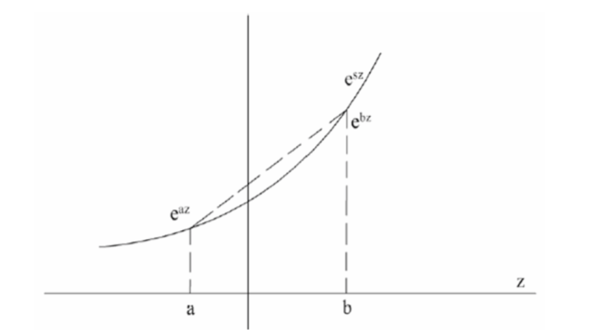

# 霍夫丁不等式

## 1 简述

1. 定义：霍夫丁不等式给出了随机变量的和与其期望值偏差的概率上限

## 2 霍夫丁不等式

### 2.1 伯努利随机变量特例

* 掷硬币，假设证明朝上的概率为$p$，反面朝上的概率为$1-p$, 投掷$n$次，正面朝上次数的期望值为$np$。进一步，有不等式
  $$
  P(H(n)\le k) = \sum_{i=0}^kC_{n}^i p^i(1-p)^{n-i}
  $$
  其中$H(n)$是$n$次投掷中正面朝上的次数
  $$
  P(|H(n)-pn|\le \epsilon) \ge 1 - 2\exp(-\frac{2\epsilon^2}{n})
  $$
  

### 2.2 普遍情况

* 令$X_1，X_2，\dots，X_n​$为$[0,1]​$的独立随机变量，即$0\le X_i \le 1​$。我们定义这些变量的经验均值为：
  $$
  \overline X = \frac{1}{n}(X_1+\dots+X_n)\\
  $$
  则有
  $$
  P(\overline X - E(\overline X) \ge t) \le \exp(-2nt^2)
  $$

* 进一步，若知道$X_i​$严格的边界范围$[a_i，b_i]​$(即$X_i​$属于$[a_i,b_i]​$)时，霍夫丁定理更加广泛：
  $$
  P(\overline X - E(\overline X) \ge t) \le \exp(-\frac{2n^2t^2}{\sum_{i=1}^n (b_i-a_i)^2})\\
  P(|\overline X - E(\overline X)| \ge t) \le 2\exp(-\frac{2n^2t^2}{\sum_{i=1}^n (b_i-a_i)^2})
  $$

* 令$S_n = \sum_{i=1}^n X_i​$, 则
  $$
  P(S_n - E(S_n) \ge t ) \le \exp(-\frac{2t^2}{\sum_{i=1}^n (b_i - a_i)^2})\\
  P(|S_n - E(S_n)| \ge t ) \le 2\exp(-\frac{2t^2}{\sum_{i=1}^n (b_i - a_i)^2})
  $$

* 需要注意的是对于$X_i$为不放回的抽样该等式依然成立；在这样的例子中这些随机变量不在是独立的了。这种情形的证明可以看Hoeffding在1963年发表的论文。

## 3 证明

### 3.1 霍夫丁引理

1. 概述：假设$X​$为一均值为$0​$的实数随机变量并且满足

   $$
   P(X\in [a,b]) = 1
   $$
   则有
   $$
   E(e^{sX}) \le \exp(\frac{1}{8}s^2(b-a)^2)
   $$

2. 证明

   

   $e^{sX}$是一个凸函数，则$e^{sX} \le \frac{X - a}{b - a} e^{sb} + \frac{b - X}{b - a}e^{sa}$, 则$E(e^{sX})\le \frac{E(X) - a}{b - a} e^{sb} + \frac{b - E(X)}{b - a} e^{sa}$, 令$h = s(b - a), P = -\frac{a}{b - a}, L(h) = -hP+\ln (1 - P+Pe^h)$, 则
   $$
   e^{L(h)} = e^{sa}(1+\frac{a}{b - a} - \frac{a}{b - a}e^{s(b - a)})\\ = \frac{b}{b - a}e^{sa}-\frac{a}{b - a} e^{sb} \\
   \ge \frac{b}{b - a}e^{sa}-\frac{a}{b - a} e^{sb} + \frac{E(X)(e^{sb} - e^{sa})}{b - a}\\
   \ge E(e^{sX})
   $$
   对于$L(h), L(0) = 0, L^{(1)}(0) = 0, L^{(2)}(h) \le \frac{1}{4}$ ,
   $$
   L^{(1)}(h) = -P + \frac{1}{1 - P + Pe^h}Pe^h\\
   L^{(2)}(h) = \frac{-Pe^h}{(1 - P + Pe^h)^2}Pe^h + \frac{1}{1 - P + Pe^h}Pe^h
   \\ = \frac{-Pe^h+1 - P + Pe^h}{(1 - P + Pe^h)^2}Pe^h\\
   =  \frac{1 - P}{(1 - P + Pe^h)^2}Pe^h\\
   \\ = \frac{(1-P)Pe^h}{(1-P+Pe^h)^2}\\
   \le \frac{(1-P)Pe^h}{(1-P)^2+(Pe^h)^2 + 2(1-P)Pe^h}\\
   \le \frac{(1-P)Pe^h}{4(1-P)Pe^h}(基本不等式)\\
   =\frac{1}{4}
   $$
   

   则根据泰勒展开的二阶形式，存在$v \in (0, h)$, 使得$L(h) = \frac{1}{2!}L^{(2)}(v)v^2 \le \frac{1}{8}h^2 = \frac{s^2(b-a)^2}{8}$ ，则得证
   $$
   E(e^{sX}) \le \exp(\frac{1}{8}s^2(b-a)^2)
   $$
   

### 3.2 马尔可夫不等式

* 若$\alpha>0​$,$x​$为非负随机变量,则$P(x\ge \alpha)\le \frac{E(x)}{\alpha}​$

* 证明：
  $$
  E(x)\ge \alpha P(x\ge \alpha)+0P(x< \alpha) = \alpha P(x\ge \alpha)\\
  P(x\ge \alpha)\le \frac{E(x)}{\alpha}
  $$
  

  

### 3.3 霍夫丁不等式证明

* 假设$X_1, X_2,...,X_n$为$n$个独立分布的随机变量并且满足
  $$
  P(X_i\in [a_i,b_i]) = 1, 1\le i \le n
  $$

* 令$S_n = \sum_{i=1}^n X_i$, 对于$S,t>0$, 有
  $$
  P(S_n - E(S_n)\ge t) = P(e^{s(S_n - E(S_n))}\ge e^{st})
  \\ \le e^{-st} E(e^{s(S_n-E(S_n))})\\
  = e^{-st} \prod_{i=1}^n E(e^{s(X_i-E(X_i))})\\
  \le e^{-st} \prod_{i=1}^n e^{\frac{s^2(b_i-a_i)^2}{8}}
  \\ = \exp(-st + \frac{1}{8} s^2\sum_{i=1}^n(b_i - a_i)^2)
  $$
  此时需要取$s$最小化$\exp(-st + \frac{1}{8} s^2\sum_{i=1}^n(b_i - a_i)^2)$, 有$\exp(-st + \frac{1}{8} s^2\sum_{i=1}^n(b_i - a_i)^2) \le \exp(-\frac{2t^2}{\sum_{i=1}^n(b_i-a_i)^2})$

  则
  $$
  P(S_n - E(S_n)\ge t)  \le \exp(-\frac{2t^2}{\sum_{i=1}^n(b_i-a_i)^2})
  $$
  

