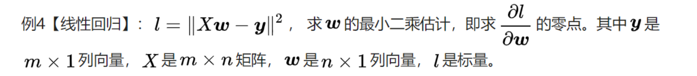
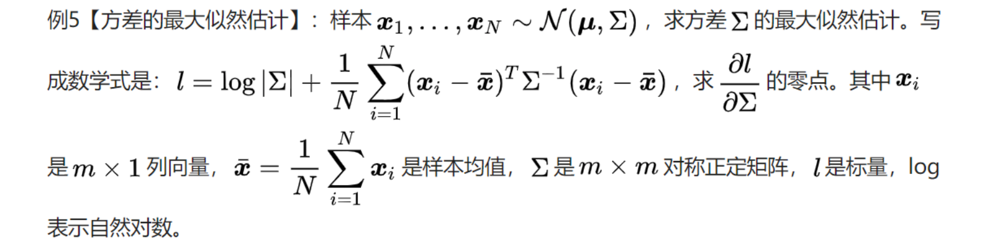
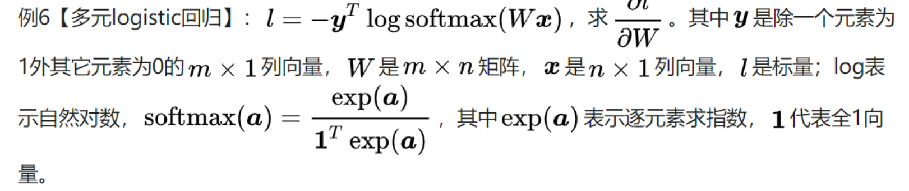
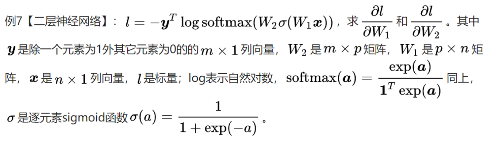
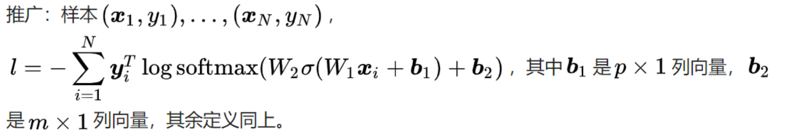

# 标量函数矩阵求导方法

## 1 矩阵求导的定义

标量f对矩阵X的导数，定义为:
$$
\frac{\partial f}{\partial X} = \left[ \frac{\partial f}{\partial X_{ij}}\right]
$$
也就是逐元素求导的和X尺寸一致的矩阵。

## 2 矩阵导数表示方法

### 2.1 标量对标量和向量的导数

1. 在标量对标量的导数中，导数和微分的联系为：
   $$
   df = f^{'}(x)dx
   $$

2. 在标量对向量的导数中，引入了梯度的概念：
   $$
   df = \sum_{i=1}^n\frac{\partial f}{\partial x_i}dx_i = \frac{\partial f}{\partial \textbf{x}} d \textbf{x} 
   $$
   这里面，第一个等会是因为全微分公式，第二个等号表达了梯度和微分的关系。可以理解为，当$\textbf{x}​$方向上每增加$\Delta \textbf{x}​$, $f​$的增量$\Delta f = \left< \frac{\partial f}{\partial \textbf{x} }, \Delta x \right> + o(\Delta x)​$

### 2.2 标量对矩阵的导数

$$
df = \sum_{i = 1}^m \sum_{j = 1}^n \frac{\partial f}{\partial X_{ij}} dX_{ij} = tr\left( \frac{\partial f}{\partial X}^T dX \right)
$$

对尺寸相同的矩阵A,B，$tr(A^TB) = \sum_{i,j}A_{ij}B_{ij}$，即是$ tr(A^TB)$矩阵A,B的内积。这里第一个等号是全微分公式，第二个等号表达了矩阵导数与微分的联系

## 3 矩阵微分运算法则

1. 一般运算

* 加减法
  $$
  d(X\pm Y) = dX \pm dY
  $$
  证明很显然

* 乘法
  $$
  d(XY) = (dX)Y+X(dY)\\
  证明：
  d([\sum_{k} X_{ik}Y_{kj}]) = [\sum_{k}d(X_{ik}Y_{kj})]
  \\=[\sum_{k}d(X_{ik})Y_{kj} + \sum_{k}X_{ik}dY_{kj}]
  \\=(dX)Y+XdY
  $$

* 转置和矩阵的迹
  $$
  d(X^T)=(dX)^T\\
  dtr(X) = tr(dX)
  $$
  

2. 逆运算

$$
d(X^{-1}) = -X^{-1}dXX^{-1}\\
证明：dE=d(X^{-1}X)
\\=d(X^{-1})X + X^{-1}dX =0
\\ \longrightarrow d(X^{-1}) = -X^{-1}dXX^{-1} 
$$

3. 行列式

* 

$$
d|X| = tr(X^*dX)\\
当X可逆时，d|X| = |X|tr(X^{-1}dX)\\
$$

* 证明：
  $$
  |X| = \sum_{i=1}^n c_{ij}x_{ij}\\
  \frac{\partial |X|}{\partial x_{ij}}=c_{ij}\\
  d|X| = \sum_{i = 1}^n\sum_{j = 1}^n c_{ij}dx_{ij} = tr(X^*dX)
  $$
  

4. 逐元素乘法

* $$
  d(X\otimes Y) = dX \otimes Y + X \otimes dY\\
  证明：
  d([X_{ij}Y_{ij}])=[dX_{ij}Y_{ij} + X_{ij}dY_{ij}]=dX\otimes Y+X \otimes dY
  $$

5. 逐元素函数：

* $$
  d\sigma(X) = \sigma'(X)dX\\
  其中，\sigma(X) = [\sigma(X_{ij})], \sigma'(X) = [\sigma'(X_{ij})]
  $$

  

## 4 矩阵微分和导数的转换

### 4.1 迹技巧(trace trick)

1. 对于标量$a = tr(a)$
2. 转置：$tr(A^T)=tr(A)$
3. 加减法：$tr(A \pm B) = tr(A) \pm tr(B)$

4. 矩阵乘法交换：

* $$
  tr(AB) = tr(BA),其中A与B^T尺寸相同, 两侧都等于\sum_{i,j}=A_{ij}B{ji}
  $$

5. 交换律

* $$
  tr(A^T(B\otimes C)) = tr((A \otimes B)^TC)\\
  证明：tr(A^T(B\otimes C))= \sum_{i,j}A_{ij}B_{ij}C_{ij}=tr((A \otimes B)^TC)
  $$

### 4.3 微分和导数（梯度）关系

1. 对于向量

* 由$df = \frac{\partial f}{\partial x}^T dx$, 则可以得到若$df = Adx$, 则$\frac{\partial f}{\partial x} = A^T$

2. 对于矩阵

* 由于$df = tr\left( \frac{\partial f}{\partial X}^T dX \right) ​$, 可以得到如果$df = tr(AdX)​$, 则$\frac{\partial f}{\partial x}=A^T​$
* 若标量函数f是矩阵X经加减乘法、逆、行列式、逐元素函数等运算构成，则使用相应的运算法则对f求微分，再使用迹技巧给df套上迹并将其它项交换至dX左侧，对照导数与微分的联系就能得到导数。

## 5 复合函数求导

1. 不能随意沿用标量的链式法则, 因为矩阵对矩阵的导数未定义。所以应该从微分入手，写写出$df = tr(\frac{\partial f}{\partial Y}^TdY)​$， 然后把$dY​$用$dX​$表示出来

2. 对于$Y=AXB$, 有
   $$
   df = tr(\frac{\partial f}{\partial Y}^T dY) 
   \\= tr(\frac{\partial f}{\partial Y}^T AdXB)
   \\=tr(B\frac{\partial f}{\partial Y}^T AdX)
   \\=tr((A^T\frac{\partial f}{\partial Y}B^T)dX)
   \\ \longrightarrow \frac{\partial f}{\partial X} = A^T\frac{\partial f}{\partial Y}B^T
   $$

3. 对于$f​$和$g​$都是标量，且$\frac{\partial g}{\partial A}​$已知，则$\frac{\partial f}{\partial A}=\frac{\partial f}{\partial g}\frac{\partial g}{\partial A}​$

* 证明：
  $$
  df = \frac{\partial f}{\partial g} dg
  \\ = \frac{\partial f}{\partial g}tr(\frac{\partial f}{\partial A}^TdA)
  \\ = tr((\frac{\partial f}{\partial g}\frac{\partial f}{\partial A})^TdA)
  \\ \longrightarrow \frac{\partial f}{\partial A}=\frac{\partial f}{\partial g}\frac{\partial g}{\partial A}
  $$

## 6 算例

1. $f = a^TXb$, 求$\frac{\partial f}{\partial X}​$, 其中a和b是向量。
   $$
   df = d(a^TXb)
   \\={da}^TXb + a^TdXb + a^TXdb 
   \\= a^TdXb 
   \\= tr(a^TdXb)
   \\= tr((ab^T)^TdX)
   \\ \rightarrow \frac{\partial f}{\partial X} = ab^T
   $$

2. $f = a^Texp(Xb)$, 求$\frac{\partial f}{\partial X}$。
   $$
   df = d(a^Texp(Xb))
   \\= a^T(exp(Xb)\otimes((dX)b))
   \\= tr((a\otimes exp(Xb))^T\otimes((dX)b)))
   \\= tr((a \otimes exp(Xb))^T(dX)b))
   \\ = tr(b(a \otimes exp(Xb))^TdX)
   \\ = tr((a \otimes exp(Xb)b^T)^TdX)
   \\ \longrightarrow \frac{\partial f}{\partial X}=(a\otimes exp(Xb))b^T
   $$

3. $f=tr(Y^TMY), Y = \sigma(WX)$, 求$\frac{\partial f}{\partial X}$ , 其中$M$是对称矩阵。
   $$
   df = d(tr(Y^TMY))
   \\ =tr(d(Y^TMY))
   \\ = tr((dY)^TMY + Y^TMdY) = tr((MY + M^TY)^T dY)
   \\ = tr((2MY)^T dY)
   \\ = tr((2MY)^T \sigma'(WX)\otimes (WdX))
   \\ = tr((2MY \otimes \sigma'(WX))^TWdX)
   \\ = tr(W^T(2M\sigma(WX) \otimes \sigma'(WX))^TdX)
   \\ \longrightarrow \frac{\partial f}{\partial X} = W^T(2M\sigma(WX) \otimes \sigma'(WX))^T
   $$

4. 

$$
dl = d((Xw-y)^T(Xw - y)) = (Xdw)^T(Xw - y) + (Xw - y)^TXdw
\\ = tr((2X^T(Xw - y))^Tdw)
\\ \longrightarrow \frac{\partial l}{\partial w} = 2X^T(Xw - y) = 0
\\ \longrightarrow w = (XX^T)^{-1}X^Ty
$$

5. 
   $$
   dl = d(\log|\Sigma| + \frac{1}{N}\sum_{i = 1}^N(x_i - \overline x)^T\Sigma^{-1}(x_i - \overline x))
   \\ = |\Sigma|^{-1}|\Sigma|tr(\Sigma^{-1}d\Sigma) + \frac{1}{N}\sum_{i = 1}^N (x_i - \overline x)^Td(\Sigma^{-1})(x_i - \overline x)
   \\ = tr(\Sigma^{-1}d\Sigma - \frac{1}{N}\sum_{i = 1}^N (x_i - \overline x)^T\Sigma^{-1}(d\Sigma)\Sigma^{-1}(x_i - \overline x))
   \\ = tr(\Sigma^{-1}d\Sigma - \frac{1}{N}\sum_{i = 1}^N \Sigma^{-1}(x_i - \overline x)(x_i - \overline x)^T\Sigma^{-1}(d\Sigma))
   \\ = tr((\Sigma^{-1} - \frac{1}{N}\sum_{i = 1}^N \Sigma^{-1}(x_i - \overline x)(x_i - \overline x)^T\Sigma^{-1})^Td\Sigma)
   \\ \longrightarrow \Sigma = \frac{1}{N}(x_i - \overline x)(x_i - \overline x)^T
   $$

6. 
   $$
   dl = -y^Td(log(\frac{exp(Wx)}{1^Texp(Wx)}))
   \\=-y^Td(Wx - log(1^Texp(Wx)))
   \\ = -y^TdWx+\frac{1^T(exp(Wx)\otimes dWx)}{1^Texp(Wx)}
   \\ = tr(-xy^TdW+\frac{(exp(Wx)x^T)^T dW}{1^Texp(Wx)})
   \\ = tr((-yx^T + \frac{(exp(Wx)x^T)}{1^Texp(Wx)})^TdW)
   \\ = tr((-yx^T + softmax(Wx)x^T)^TdW)
   \\ = tr(((softmax(Wx) - y)x^T)^TdW)
   \\ \longrightarrow \frac{\partial l}{\partial W} = (softmax(Wx) - y)x^T 
   $$

7. 
  * $$
       l = tr((softmax(Wa) - y)^Tda)
       \\ = tr((softmax(Wa) - y)^TdW_2\sigma(W_1x))
       \\ = tr(((softmax(Wa) - y)\sigma(W_1x)^T)^TdW_2)
       \\ \longrightarrow \frac{\partial l}{\partial W_2} =  (softmax(Wa) - y)\sigma(W_1x)^T
       $$

       

  * $$
       l = -y^T\log softmax(a), a = W_2\sigma(W_1x)\\
            dl = tr((softmax(Wa) - y)^Tda)
            \\ = tr((softmax(Wa) - y)^TW_2(\sigma'(W_1x)\otimes (dW_1x)))
            \\ = tr(((W_2^T(softmax(Wa) - y)) \otimes \sigma'(W_1x)x^T)^TdW_1))
            \\ \longrightarrow \frac{\partial l}{\partial W_2}=(W_2^T(softmax(Wa) - y)) \otimes \sigma'(W_1x)x^T
       $$

* 

  * 方法1：直接硬算

  * 方法2：矩阵表示

    * $$
      X = [x_1, x_2, ..., x_N]\\
      A_1 = [a_{1,1}, a_{1, 2}, ..., a_{1,N}] = W_1X + b_11^T\\
      H_1 = [h_{1,1}, h_{1, 2}, ..., h_{1,N}] = \sigma(A_1)\\
      A_2 = [a_{2,1}, a_{2, 2}, ..., a_{2,N}] = W_2H_1 + b_21^T\\
      \frac{\partial l}{\partial A_2}=[softmax(a_{2, 1}) - y_1, ..., softmax(a_{2, N}) - y_N]\\
      dl = tr(\frac{\partial l}{\partial A_2}^TdA_2) 
      \\= tr(\frac{\partial l}{\partial A_2}^TdW_2H_1) + tr(\frac{\partial l}{\partial A_2}^TW_2dH_1) + tr(\frac{\partial l}{\partial A_2}^Tdb_21^T)
      \\=tr((\frac{\partial l}{\partial A_2}H_1^T)^TdW_2)+tr((W_2^T\frac{\partial l}{\partial A_2})^TdH_1)+tr((\frac{\partial l}{\partial A_2}1)^Tdb_2)
      \\ dl_2 = tr((W_2^T\frac{\partial l}{\partial A_2})^TdH_1)
      \\ = tr((W_2^T\frac{\partial l}{\partial A_2})^T(\sigma'(A_1) \otimes dW_1x))
      \\+tr((W_2^T\frac{\partial l}{\partial A_2})^T(\sigma'(A_1) \otimes db_11^T))
      \\= tr((W_2^T\frac{\partial l}{\partial A_2}\otimes\sigma'(A_1)x^T)^T dW_1))
      \\+tr((W_2^T\frac{\partial l}{\partial A_2}\otimes\sigma'(A_1)1)^T db_1))
      $$

8. $l(A)=\sum_{i=1}^m(-y_iA^T x_i+ln(1 + e^{A^T x_i}))​$, 给出牛顿迭代$A^{t+1} = A^t -  (\frac{\partial^2 l(A)}{\partial A \partial A^T})^{-1}\frac{\partial l(A)}{\partial A}​$的形式(求$\frac{\partial l(A)}{\partial A}, \frac{\partial^2 l(A)}{\partial A \partial A^T}​$)

* 一阶导数 
  $$
  dl = \sum_{i=1}^m-y_idA^T x_i + \sum_{i=1}^m \frac{e^{A^Tx_i}(dA^Tx_i)}{1+e^{A^Tx_i}}
  \\=\sum_{i=1}^m-(x_iy_i)^TdA + \sum_{i=1}^m \frac{(x_ie^{x_i^TA})^TdA}{1+e^{A^Tx_i}}
  \\ = (-\sum_{i=1}^mx_i(y_i - p_1(x_i;A)))^TdA
  \\ \longrightarrow \frac{\partial l}{\partial A} = -\sum_{i=1}^mx_i(y_i - p_1(x_i;A))
  $$

  

* 二阶导数 

  * 法1

    $$
  设\ p =-\sum_{i=1}^mx_i(y_i - p_1(x_i;A))\\
  =-\sum_{i=1}^mx_i(y_i - \frac{e^{A^Tx_i}}{1 + e^{A^Tx_i}})\\
  dp_j = tr(\sum_{i=1}^mx_{ij}d\frac{e^{A^Tx_i}}{1 + e^{A^Tx_i}})
  \\ =tr(\sum_{i=1}^mx_{ij}\frac{1}{(1 + e^{A^Tx_i})^2}de^{A^Tx_i})
  \\ =tr(\sum_{i=1}^mx_{ij}\frac{1}{(1 + e^{A^Tx_i})^2}e^{A^Tx_i}dA^Tx_i)
  \\ =tr(\sum_{i=1}^mx_{ij}x_i^T\frac{1}{(1 + e^{A^Tx_i})^2}e^{A^Tx_i}dA)
  \\ =tr(\sum_{i=1}^m(x_{ij}x_i^T\frac{1}{(1 + e^{A^Tx_i})^2}e^{A^Tx_i})^TdA)
  \\ =tr(\sum_{i=1}^m(x_{ij}x_i^Tp_1(x_i;A)(1-p_1(x_i;A)))^TdA)
  \\ dp = [dp_1;dp_2;...;dp_n] = \frac{\partial p}{\partial A} = \sum_{i=1}^m(x_ix_i^Tp_1(x_i;A)(1-p_1(x_i;A))
  \\ \longrightarrow\frac{\partial^2 l(A)}{\partial A \partial A^T} = \frac{\partial p}{\partial A} = \sum_{i=1}^m(x_ix_i^Tp_1(x_i;A)(1-p_1(x_i;A))
    $$

  

  * 法2
    $$
    设\ p =-\sum_{i=1}^mx_i(y_i - p_1(x_i;A))\\
    =-\sum_{i=1}^mx_i(y_i - \frac{e^{A^Tx_i}}{1 + e^{A^Tx_i}})\\
    dp = \sum_{i=1}^mx_{i}d\frac{e^{A^Tx_i}}{1 + e^{A^Tx_i}}\\
    =\sum_{i=1}^mx_{i}\frac{1}{(1 + e^{A^Tx_i})^2}e^{A^Tx_i}dA^Tx_i\\
    \\ =(\sum_{i=1}^mx_{i}x_i^T\frac{1}{(1 + e^{A^Tx_i})^2}e^{A^Tx_i})^TdA
    \\ \longrightarrow\frac{\partial^2 l(A)}{\partial A \partial A^T} = \frac{\partial p}{\partial A} = \sum_{i=1}^m(x_ix_i^Tp_1(x_i;A)(1-p_1(x_i;A))
    $$

