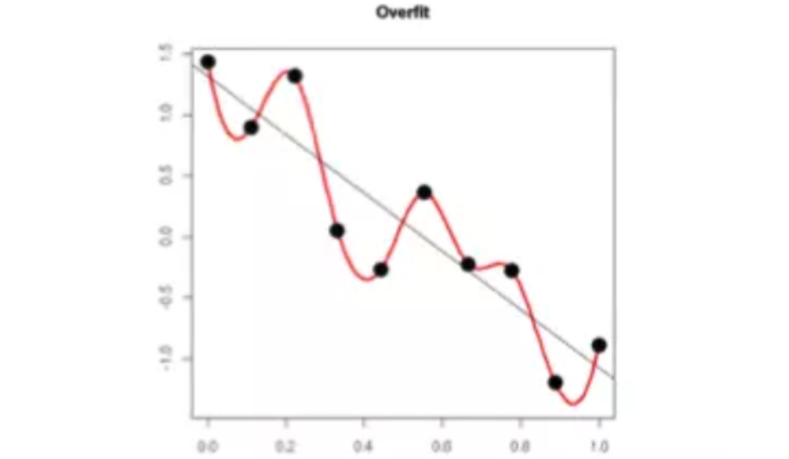
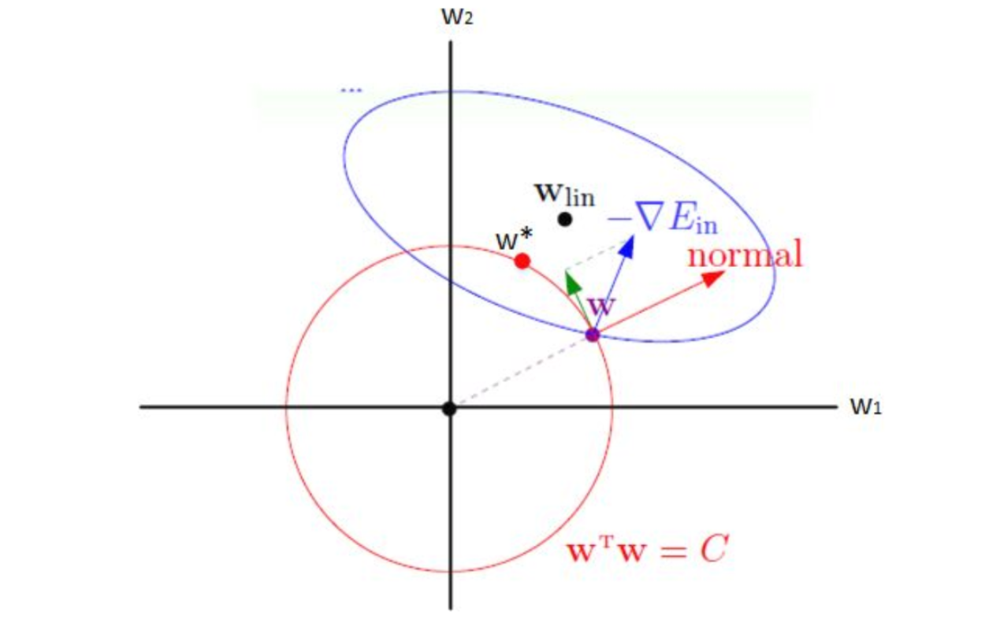
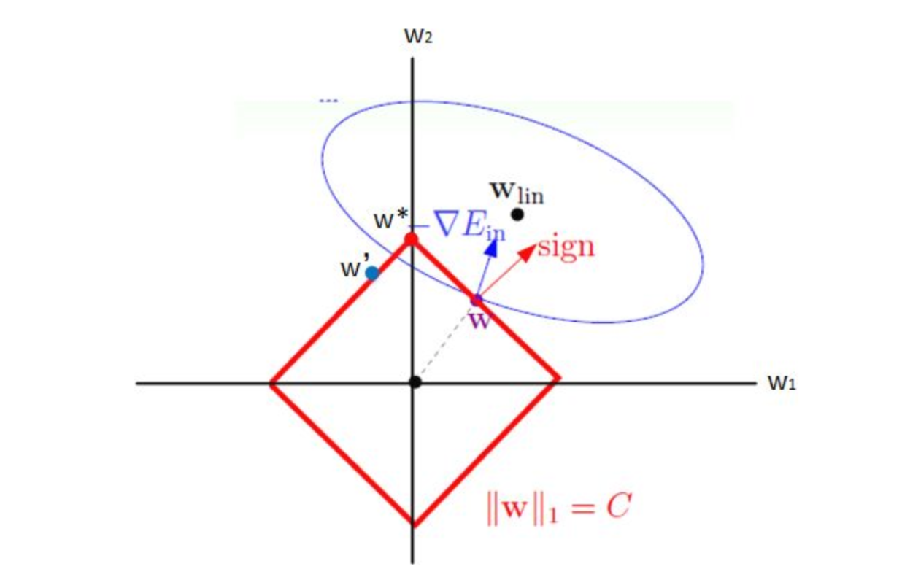
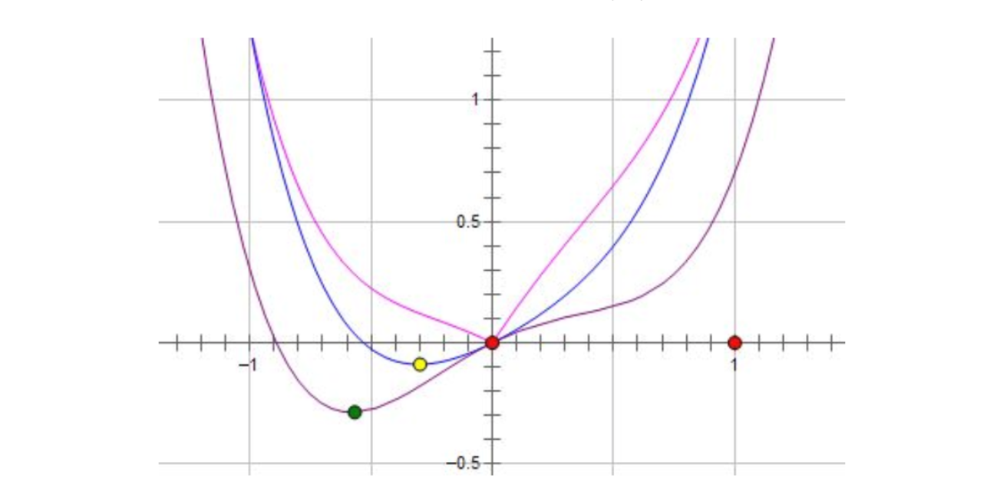

# 正则化

## 1 正则化的一般形式
$$
\overline J(w; X, y) = J(w;X, y) + \alpha \Omega(w)\\
L1:\Omega(w) = \|w\|_1 = \sum_{i=1}|w_i|\\
L2:\Omega(w) = \|w\|_2^2 = \sum_{i=1}w_i^2\\
$$

## 2 来源推导

### 2.1 基于约束条件的最优化

1. 根据VC维分析，$w$个数越多，VC维越大，模型越复杂。为了限制模型的复杂度，则应该限制$w$的个数：
   $$
   \min_{w} J(w;X,y)\\
   s.t.\ \|w\|_0 \le C
   $$

2. 由于上面是np问题，所以使用L1或者L2范数近似
   $$
   \begin{matrix}
   \min_{w} J(w;X,y)& \min_{w} J(w;X,y)\\
   s.t.\ \|w\|_1 \le C& s.t.\ \|w\|_2^2 \le C
   \end{matrix}
   $$
   拉格朗日函数为
   $$
   L_1(w,\alpha) = J(w;X,\alpha) + \alpha(\|w\|_1-C)\\
   L_2(w,\alpha) = J(w;X,\alpha) + \alpha(\|w\|_2^2-C)
   $$
   

   其中$\alpha\gt0$, 假设$\alpha$的最有解为$\alpha^*$, 则最小化拉格朗日函数，与原问题等价
   $$
   \min_wJ(w;X,y) +\alpha^* \|w\|_1\\
   \min_wJ(w;X,y) +\alpha^* \|w\|_2^2\\
   $$
   这与$\min_w \overline J(w;X,y)$相似

   

### 2.2 基于最大后验概率估计

#### 2.2.1 L2正则化

1. 在最大似然估计中，是假设权重$w$是未知的参数，从而求得对数似然函数：
   $$
   l(w) = log(P(y|X;w)) = \log[\prod_iP(y_i|x_i;w)]
   $$

2. 若我们对$w$一无所知，假设$y^i \sim N(w^Tx_i, \sigma^2)$, 则
   $$
   l(w)=\log[\prod_i\frac{1}{\sqrt{2\pi}\sigma}e^{-\frac{(y_i-w^Tx_i)^2}{2\sigma^2}}] = -\frac{1}{2\sigma^2}\sum_{i}(y_i-w^Tx_i)^2+C
   $$
   令$J(w;X,y) = -l(w)$, 即可得到一般代价函数

3. 若我们假设$w$的分布已知，我们可以使用最大后验概率估计

   最大后验概率估计中，则将权重看作随机变量，也具有某种分布
   $$
   P(w|X,y) = \frac{P(w,X,y)}{P(X,y)} = \frac{P(X,y|w)P(w)}{P(X,y)} \\= \frac{P(X|w)P(y|X,w)P(w)}{P(X,y)}  \sim P(y|X,w)P(w)\\
   MAP = \log{P(y|X,w)} + \log P(w)
   $$

   这里是因为$P(X,y) = P(y|X)p(X)$是先验概率，可以分析数据获得。$P(X|w)= P(X)​$也是可以通过分析数据获得。

   * 其他写法：
     $$
     P(w|y;X) = \frac{P(w,y;X)}{P(y;X)} = \frac{P(y|w;X)P(w)}{P(y;X)}   \sim P(y|X;w)P(w)\\
     MAP = \log{P(y|X,w)} + \log P(w)
     $$
     其中$P(y;X)$是先验概率，可以通过样本获得。$P(y|w;X)$与$P(y|X;w)$等价。

* 若$w_j$的先验分布为$N(o,r^2)$
  $$
  \log P(w)  =\log\prod_j(\frac{1}{\sqrt{2\pi}\sigma}e^{-\frac{w_j^2}{2r^2}}) =-\frac{1}{2\sigma^2}\sum_{j}w_j^2+C^{'}
  $$
  可以看到，先验高斯分布下$\log{P(w)}$的效果等价于再代数函数增加了$l_2​$

* 若$w_j$的先验分布为拉普拉斯分布$\frac{1}{\sqrt{2a}}e^\frac{-|w_j|}{a}$
  $$
  \log P(w)  =\log\prod_j(\frac{1}{\sqrt{2a}}e^\frac{-|w_j|}{a}) =-\frac{1}{a}\sum_{j}|w_j|+C^{'}
  $$
  可以看到，先验高斯分布下$\log{P(w)}$的效果等价于再代数函数增加了$l_2$

## 3 直观理解

### 3.1 保证导数值不要过大

* 

  上图中，模型过于复杂是因为模型尝试去兼顾各个测试数据点， 导致模型函数如下图，处于一种动荡的状态， 每个点的到时在某些很小的区间里，函数值的变化很剧烈。这就意味着函数在某些小区间里的导数值（绝对值）非常大，由于自变量值可大可小，所以只有系数足够大，才能保证导数值很大。加入正则能抑制系数过大的问题。

### 3.2 梯度分析

1. L2正则化

   

   当达到最低点时，有$\nabla J(w) + \lambda w = 0​$, 此时达到最优解，也就相当于求
   $$
   \overline J(w) = J(w)+\frac{\lambda}{2}w^Tw
   $$
   的极值点

2. L1正则化

   

* $w$将要朝着$J(w)$减小的方向沿着边界移动，直到到达顶点，得到最优解$w = (0,1)$, 这也是$L1$正则化产生稀疏性的原因。

* 考虑边延伸后的四边形
  $$
  \nabla J(w) + \lambda sign(w) = 0\\
  \overline J(w) = J(w)+\lambda\|w\|_1
  $$

* 稀疏性的另一种解释

  

  紫色时原来的函数$L(w)$，蓝色是$L(w)+Cw^2$的函数，粉色是$L(w)+C|w|$的函数，可以看到施加L1 时，只要正则项的系数 C 大于原先费用函数在 0 点处的导数的绝对值，$x = 0$ 就会变成一个极小值点。当模型$L(w) $发生微小改变时，最优值仍然是$x$，这表示了其稀疏性。

### 3.3 稀疏性的理论分析

1. L2正则化的非稀疏性

   设$w^*$是$J(w)$最优解，且二节可导，则进行二阶泰勒展开有
   $$
   \hat J(w) = J(w^*)+\frac{1}{2}(w-w^*)^TH(w-w^*)\\
   $$
   设$J_1(w) = \hat J(w)+\frac{\alpha}{2}\|w\|_2^2 =  \hat J(w)+\frac{\alpha}{2}w^Tw$, 设其最优解为$w^{'}$ , 则：
   $$
   \nabla J_1(w')=H(w^{'}-w^*)+\alpha w^{'} = 0\\
   w^{'} = (H+\alpha I)^{-1}Hw^*
   $$

   由于$H​$对称，可以特征值分解为$H=U\Lambda U^T​$, 其中$U​$正交，且为$H​$的特征向量，则
   $$
   w^{'} = U(\Lambda+ \alpha I)^{-1}\Lambda U^Tw^*
   $$
   其中$\Lambda$为对角矩阵，对角线元素为$H$的特征值$\lambda_i$，可以看到$w^{'}$是$w^*$在特征向量为基的空间中，第$i$个特征向量方向缩放$\frac{\lambda_i}{\lambda_i+\alpha}$得到的，若$\lambda_i>>\alpha$, 则$w^*$受到正则化影响较小。若$\lambda_i << \alpha$较大，且收缩到接近于0。因为$w_i^*\not=0\rightarrow w_i^{'} \not = 0$, 则正则化不会产生稀疏性的效果。

2. L1正则化的稀疏性
   $$
   \nabla J_2(w')=H(w^{'}-w^*)+\alpha sign(w^{'}) = 0\\
   $$
   假设$H$为对角阵，$H = diag[H_{11}, H_{22}, ..., H_{nn}], H_{ii} > 0$, 则
   $$
   w^{'}_j = sign(w_j^*)\max\{|w_j^*| - \frac{\alpha}{H_{jj}}, 0\}
   $$

* 若$|w_j^*| \le \frac{\alpha}{H_{jj}}$, 则会使得最优解的某些元素是0，从而产生稀疏性
* 否则，会使得最优解便宜一个常数值

综上，L2正则化的效果是对原最优解的每个元素进行不同比例的放缩； L1 正则化则会使原最优解的元素产生不同量的偏移，并使某些元素为0，从而产生稀疏性。