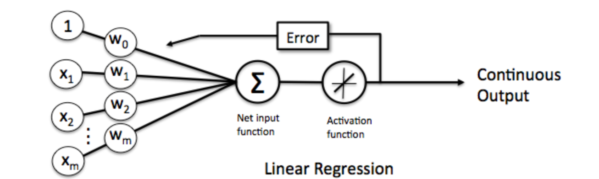
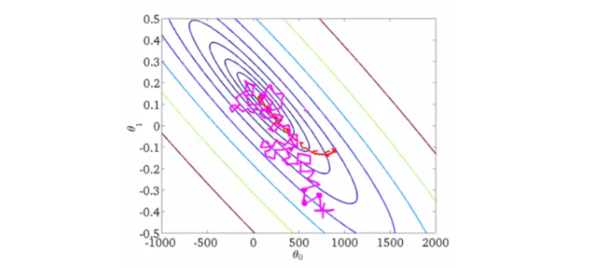

# 线性单元和梯度下降

## 1 线性单元概念

1. 感知器存在的问题

   感知器有一个问题，当面对的数据集不是**线性可分**的时候，『感知器规则』可能无法收敛，这意味着我们永远也无法完成一个感知器的训练。

2. 线性单元

   为了解决这个问题，我们使用一个**可导**的**线性函数**来替代感知器的**阶跃函数**，这种感知器就叫做**线性单元**。线性单元在面对线性不可分的数据集时，会收敛到一个最佳的近似上。

   

   线性单元的激活函数可以简单设置为为$f(x) = x$。这样替换了激活函数之后，**线性单元**将返回一个**实数值**而不是**0,1分类**。因此线性单元用来解决**回归**问题而不是**分类**问题。

3. 模型表达式

$$
y=h(x) = w^T\hat x+b = \beta^T x
$$

​	输出就是输入特征的**线性组合**。

## 2 目标函数

1. 单个样本误差
   $$
   e= \frac{1}{2}(y - \beta^Tx)^2
   $$

2. 模型的误差
   $$
   E(w) = e_1+e_2+...+e_n
   \\ = \frac{1}{2}\sum_{i=1}^n(y_i-\beta^Tx_i)^2
   $$

3. 梯度下降法优化

* 求梯度

  $$
  dE = -\sum_{i=1}^n(y_i-\beta^Tx_i)d\beta^Tx_i
  \\ = -\sum_{i=1}^n(y_i-\beta^Tx_i)x_i^Td\beta
  \\ \longrightarrow \nabla_w E = -\sum_{i=1}^n(y_i-\beta^Tx_i)x_i
  $$

* 梯度下降法公式
  $$
  \beta_{new} = \beta_{old} + \eta\sum_{i=1}^n(y_i-\beta_{old}^Tx_i)x_i
  $$
  $\eta$是步长，也称作**学习速率**。

4. 随机梯度下降法

* 要遍历训练数据中所有的样本进行计算，我们称这种算法叫做**批梯度下降(Batch Gradient Descent)**。如果我们的样本非常大，比如数百万到数亿，那么计算量异常巨大。在SGD算法中，每次更新$\beta$的迭代，只计算一个样本。这样对于一个具有数百万样本的训练数据，完成一次遍历就会对$\beta $更新数百万次，效率大大提升。由于样本的噪音和随机性，每次更新$\beta  $并不一定按照$E$减少的方向。然而，虽然存在一定随机性，大量的更新总体上沿着$E$减少的方向前进的，因此最后也能收敛到最小值附近。

   

* SGD不仅仅效率高，而且随机性有时候反而是好事。今天的目标函数是一个『凸函数』，沿着梯度反方向就能找到全局唯一的最小值。然而对于非凸函数来说，存在许多局部最小值。随机性有助于我们逃离某些很糟糕的局部最小值，从而获得一个更好的模型。