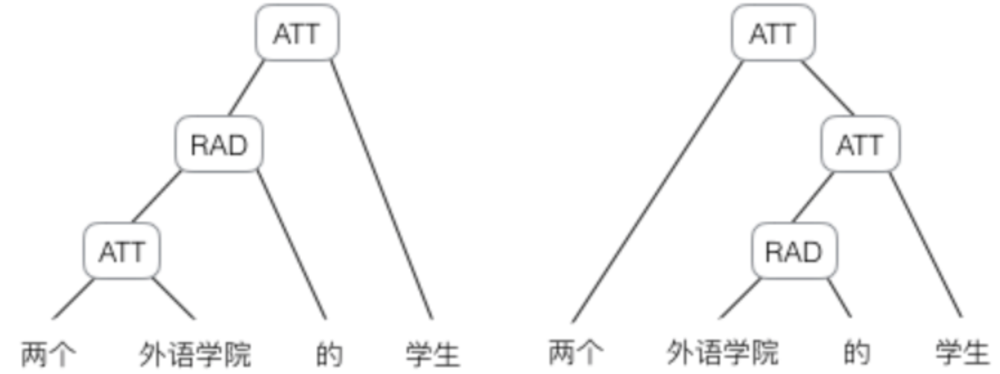
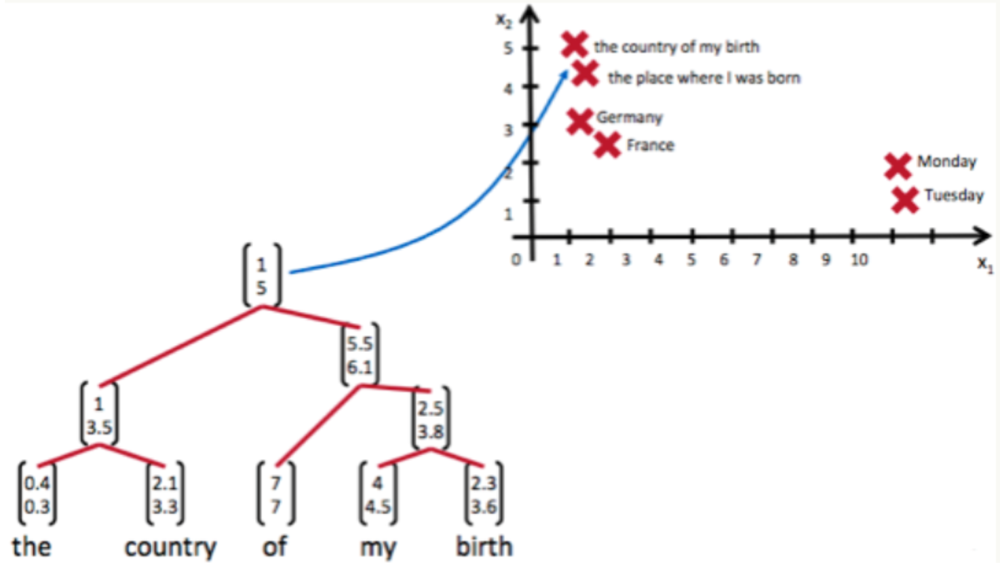
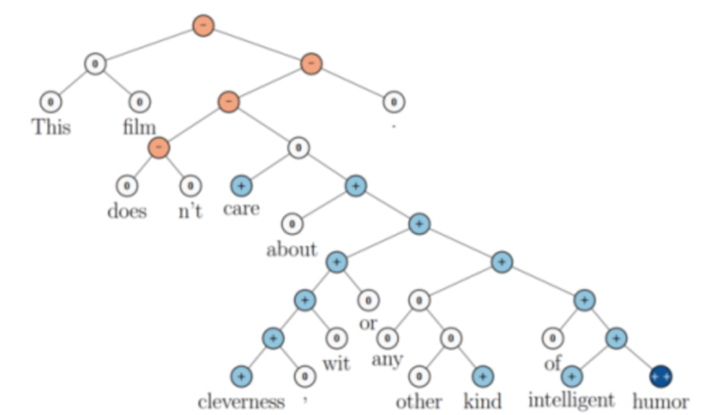
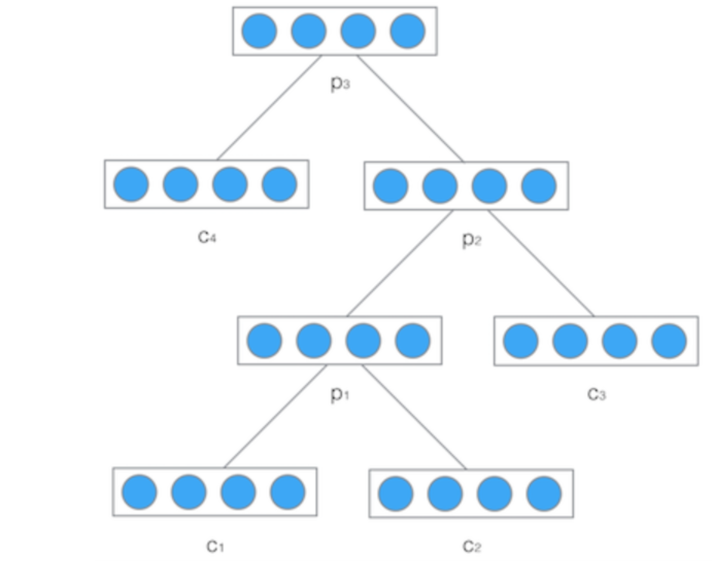
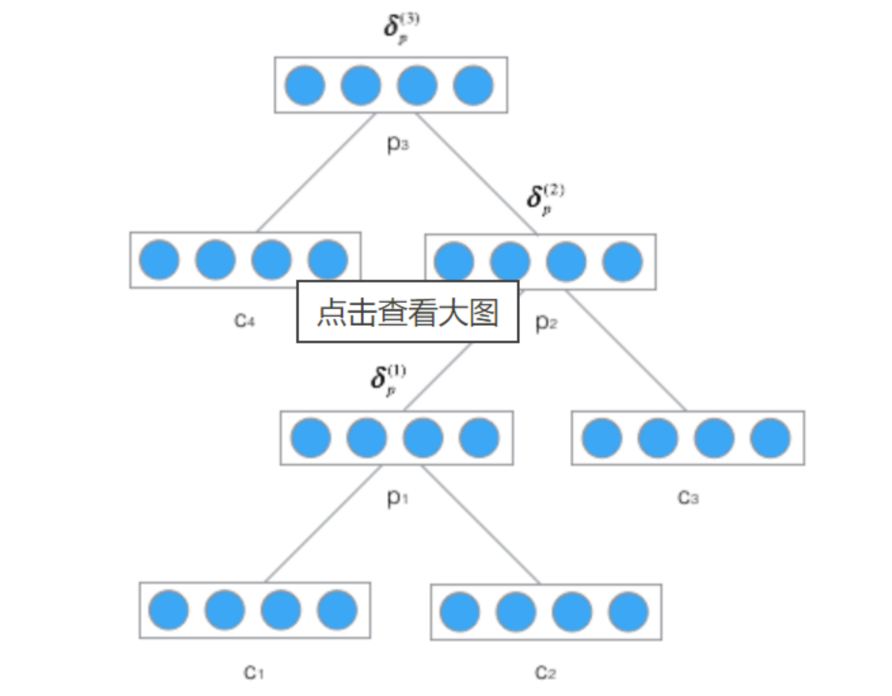

# 递归神经网络

## 1 递归神经网络概念

1. 因为神经网络的输入层单元个数是固定的，因此必须用循环或者递归的方式来处理长度可变的输入。有时候把句子看做是词的序列是不够的

   

   上图显示了这句话的两个不同的语法解析树。可以看出来这句话有歧义，不同的语法解析树则对应了不同的意思。为了能够让模型区分出两个不同的意思，我们的模型必须能够按照树结构去处理信息，而不是序列，这就是递归神经网络的作用。当面对按照树/图结构处理信息更有效的任务时，递归神经网络通常都会获得不错的结果。

2. 递归神经网络可以把一个树/图结构信息编码为一个向量，也就是把信息映射到一个语义向量空间中，语义相似的向量距离更近。

   

3. 递归神经网络是一种表示学习，它可以将词、句、段、篇按照他们的语义映射到同一个向量空间中，也就是把可组合（树/图结构）的信息表示为一个个有意义的向量。递归神经网络在做情感分析时，可以比较好的处理否定句，这是胜过其他一些模型的：

   

   白色是中性评级，蓝色表示正面评价，红色表示负面评价。每个节点是一个向量，这个向量表达了以它为根的子树的情感评价。

4. 缺点：递归神经网络具有更为强大的表示能力，但是在实际应用中并不太流行。其中一个主要原因是，递归神经网络的输入是树/图结构，而这种结构需要花费很多人工去标注。想象一下，如果我们用循环神经网络处理句子，那么我们可以直接把句子作为输入。然而，如果我们用递归神经网络处理句子，我们就必须把每个句子标注为语法解析树的形式。

## 2 递归神经网络前向计算

1. 结构图

   

2. 公式：
   $$
   p = \tanh(W
   \left[
   \begin{matrix}
   c_1\\c_2
   \end{matrix}
   \right]
   +b )
   $$
   递归神经网络的权重和偏置项在所有的节点都是共享的。

## 3 递归神经网络的训练

1. 残差$\delta_k$从当前时刻$t_k$反向传播到初始时刻$t_1$, 也就是BPTS算法
   $$
   \delta_p = \frac{\partial E}{\partial net_p}\\
   net_p = W
   \left[
   \begin{matrix}
   c_1\\c_2
   \end{matrix}
   \right]
   +b
   \\
   c=f(net_c)\\
   \delta_c =  \frac{\partial E}{\partial net_{c}} =  \frac{\partial c}{\partial net_{c}}\frac{\partial net_p}{\partial c}\frac{\partial E}{\partial net_p} = diag[f'(net_c)]W\delta_p\\
   $$

* 算例：

* $$
  \delta^2 = diag[f'(net^2)]W\delta_p^3\\
  \delta_p^2 = [\delta^2]_p\\
  \delta^1 = diag[f'(net^1)]W\delta_p^2\\
  \delta_p^1 = [\delta^1]_p\\
  $$

2. 权重梯度计算
   $$
   net_p^l = W^lc^l+b\\
   \frac{\partial E}{\partial W^l} = \frac{\partial net_{p}^l}{\partial W^l}\frac{\partial E}{\partial net_{p}^l} = c^l\delta_p^l
   $$
   由于权重是在所有层共享的，所以和循环神经网络一样，递归神经网络的最终的权重梯度是各个层权重梯度之和:
   $$
   \frac{\partial E}{\partial W} = \sum_{l}\frac{\partial E}{\partial W^l}
   $$

3. 偏置项的计算
   $$
   \frac{\partial E}{\partial b^l} = \frac{\partial net_p^l}{\partial b^l}\frac{\partial E}{\partial net_p^l} = \delta_p^l\\
   \frac{\partial E}{\partial b} = \sum_{l}\frac{\partial E}{\partial b^l}
   $$

3. 权重更新
   $$
   W \leftarrow W+\mu \frac{\partial E}{\partial W}\\
   b \leftarrow b+\mu \frac{\partial E}{\partial b}\\
   $$
   