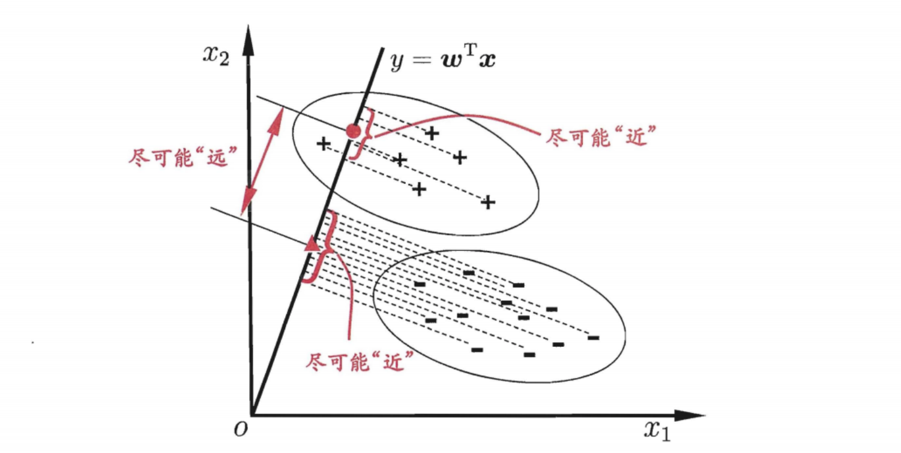
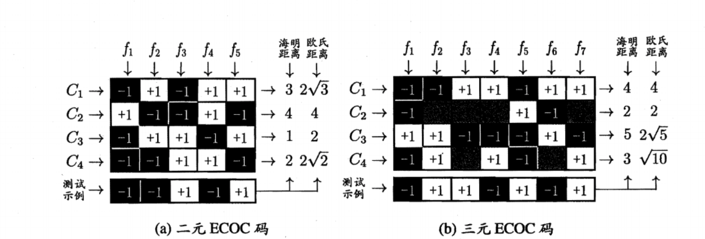

# 线性模型

### 3.1 基本形式

1. $$
   f(x) = \omega^Tx+b\\
   \omega=(\omega_1;\omega_2;...;\omega_d)
   $$

### 3.2 线性回归

1. 一元线性回归
2. 多元线性回归

* $$
  X = 
  \left(
  \begin{matrix}
  x_{11} & x_{12} & ...  & x_{1d} & 1 \\
  x_{21} & x_{22} & ...  & x_{2d} & 1 \\
  x_{31} & x_{32} & ...  & x_{3d} & 1 \\
  ... & ... & ... & ... & 1 \\
  x_{m1} & x_{m2} & ...  & x_{md} & 1 \\
  \end{matrix}
  \right)
  =
  \left(
  \begin{matrix}
  x_1^T & 1\\
  x_2^T & 1\\
  x_3^T & 1\\
  ... & 1\\
  x_m^T & 1
  \end{matrix}
  \right)
  \\
  \bar \omega^*={argmin}_{\hat \omega}(y-X\bar \omega)^T(y-X\bar\omega) = {argmin}_{\hat \omega}E_{\hat \omega}\\
  \frac{\partial E_{\hat \omega}}{\partial \hat \omega} = 2X^T(X\hat \omega - y) = 0\\
  \hat \omega^*=(X^TX)^{-1}X^Ty\\
  f(\hat x_i) = \hat x_i^T(X^TX)^{-1}X^Ty
  $$

  3. 对数线性回归和广义线性回归

* $$
  y=g^{-1}(w^Tx+b)
  $$

### 3.3 对数几率回归

1. 对数几率函数近似单位阶跃函数

* $$
  y=\frac{1}{1+e^{-z}}=\frac{1}{1+e^{-(w^Tx+b)}}\\
  \ln{\frac{y}{1-y}} = w^Tx+b\\
  \ln{\frac{p(y=1|x)}{p(y=0|x)}}=w^Tx+b\\
  p(y=1|x) = \frac{e^{w^T+b}}{1+e^{w^T+b}}\\
  p(y=0|x) = \frac{1}{1+e^{w^T+b}}\\
  def\quad \beta=(\omega;b), \hat x = (x; 1)\\
  w^Tx+b=\beta^T\hat x\\
  p(y_i|x_i;\omega,b)=p_1(\hat x_i;\beta)^{y_i} p_0(\hat x_i;\beta)^{1-y_i}\\
  l(\omega,b) = \sum_{i = 1}^m \ln(p(y_i|x_i;\omega,b))
  \\=\sum_{i = 1}^m y_i\ln(p_1(\hat x_i;\beta)) + (1-y_i)\ln(p_0(\hat x_i;\beta))
  \\l(\beta)=\sum_{i=1}^m (y_i\beta^T\hat x_i - \ln(1+e^{\beta^T\hat x_i}))
  \\\beta^* = argmin_{\beta}(l(\beta))
  $$

* 牛顿法求解
  $$
  \beta^{t+1} = \beta^t -  (\frac{\partial^2 l(\beta)}{\partial \beta \partial \beta^T})^{-1}\frac{\partial l(\beta)}{\partial \beta}
  $$
  
  >矩阵求导法：
  >$$
  >dl = \sum_{i=1}^m-y_idA^T x_i + \sum_{i=1}^m \frac{e^{\beta^Tx_i}(dA^Tx_i)}{1+e^{\beta^Tx_i}}
  >\\=\sum_{i=1}^m-(x_iy_i)^TdA + \sum_{i=1}^m \frac{(x_ie^{x_i^TA})^TdA}{1+e^{\beta^Tx_i}}
  >\\ = (-\sum_{i=1}^mx_i(y_i - p_1(x_i;A)))^TdA
  >\\ \longrightarrow \frac{\partial l}{\partial \beta} = -\sum_{i=1}^mx_i(y_i - p_1(x_i;A))
  >\\设\ p =-\sum_{i=1}^mx_i(y_i - p_1(x_i;A))\\
  >=-\sum_{i=1}^mx_i(y_i - \frac{e^{\beta^Tx_i}}{1 + e^{\beta^Tx_i}})\\
  >dp = \sum_{i=1}^mx_{i}d\frac{e^{\beta^Tx_i}}{1 + e^{\beta^Tx_i}}\\
  >=\sum_{i=1}^mx_{i}\frac{1}{(1 + e^{\beta^Tx_i})^2}e^{\beta^Tx_i}dA^Tx_i\\
  >\\ =(\sum_{i=1}^mx_{i}x_i^T\frac{1}{(1 + e^{\beta^Tx_i})^2}e^{\beta^Tx_i})^TdA
  >\\ \longrightarrow\frac{\partial^2 l(\beta)}{\partial \beta \partial \beta^T} = \frac{\partial p}{\partial \beta} = \sum_{i=1}^m(x_ix_i^Tp_1(x_i;A)(1-p_1(x_i;A))
  >$$
  >
  >

### 3.4 线性判别分析

1. 概念：线性判别分析(LDA) 的思想非常朴素: 给定训练样例集，设法将样例投影到一条使得同样例的投影点尽可能接近、 异类样例投影点尽可能远离;在对新样本进行分类时，将其投影到同样的这条直线上，再根据投点的位置来确定样本的类别。

   

   这里需要修正得是并不是$y=w^Tx$，而是直线的单位方向向量为$w^T$。

2. 最大化目标$J$

* $X_i, \mu_i, \Sigma_i$表示第$i\in\{0,1\}$类实例的集合、均值向量、协方差矩阵。

* 投影到直线上之后，两类样本均值，协方差矩阵变为$w^T\mu_0, w^T\mu_1,w^T\Sigma_0w,w^T\Sigma_1w$。
  $$
  设Y = wX
  \\ \Sigma_X = E[(X-\mu_X)(X-\mu_X)^T]
  \\ \Sigma_Y= E[(Y-\mu_Y)(Y-\mu_Y)^T]
  \\ = E[(wX-w\mu_X)(wX-w\mu_X)^T]
  \\ = wE[(X-\mu_X)(X-\mu_X)^T]w^T
  \\ = w\Sigma_X w^T
  $$

  由于直线是一维空间，所以都为实数。

* 类内散度矩阵
  $$
  S_w = \Sigma_0+\Sigma_1
  \\ = \sum_{x\in X_0}(x-\mu_0)(x-\mu_0)^T + \sum_{x\in X_1}(x-\mu_1)(x-\mu_1)^T
  $$
  

* 类间散度矩阵
  $$
  S_b = (\mu_0 - \mu_1)(\mu_0-\mu_1)^T
  $$
  

* $$
  J = \frac{||w^T\mu_0 - w^T\mu_1||}{w^T\Sigma_0w+w^T\Sigma_1w}
  \\ = \frac{w^T(\mu_0 - \mu_1)(\mu_0 - \mu_1)^Tw}{w^T(\Sigma_0+\Sigma_1)w}
  \\ = \frac{w^TS_bw}{w^TS_ww}
  $$

* 求解

  * 法1：直接求导
    $$
    dJ=tr(\frac{(dw^TS_bw + w^TS_bdw)w^TS_ww-w^TS_bw(dw^TS_ww + w^TS_wdw)}{(w^TS_ww)^2})
    \\ = tr(\frac{S_bw+S_b^Tw}{w^TS_ww}^Tdw)-tr(\frac{S_www^TS_bw+S_w^Tww^TS_b^Tw}{(w^TS_ww)^2}^Tdw)
    \\ \longrightarrow S_bww^TS_ww-S_www^TS_bw = 0
    \\ \longrightarrow \lambda(\mu_0-\mu_1)w^TS_ww= \lambda^2 S_ww
    \\ \longrightarrow ?
    $$

  * 法2：拉格朗日乘子法
    $$
    min_w\ -w^TS_bw
    \\s.t.\ w^TS_ww = 1\\
    F(w) = -w^TS_bw+\lambda (w^TS_ww - 1)\\
    dF = tr(-dw^TS_bw-w^TS_bdw+\lambda dw^TS_ww+\lambda w^TS_wdw)
    \\ = tr((-S_bw-S_bw+\lambda S_ww+\lambda S_ww)^Tdw)
    \\ \lambda S_ww = S_bw
    \\ \frac{\partial F}{\partial \lambda} = w^TS_ww - 1 = 0
    \\w^TS_bw = \lambda
    \\((\mu_0-\mu_1)^Tw)^T(\mu_0-\mu_1)^Tw = \lambda
    \\(\mu_0-\mu_1)^Tw = \sqrt{\lambda}
    \\ \lambda S_ww=\sqrt{\lambda}(\mu_0-\mu_1)
    \\ w = \frac{1}{\sqrt{\lambda}}S_w^{-1}(\mu_0-\mu_1)
    \\ 因为与方向无关，可取w = S_w^{-1}(\mu_0-\mu_1)
    $$
    

    

* 多分类

  * 假设有$N$个类别，维度为$d$，每个类别样本数目为$m_i$。

  * 全局散度矩阵
    $$
    S_t = S_b + S_w
    \\ = \sum_{i  = 1}^m (x_i - \mu)(x_i-\mu)^T
    \\S_w = \sum_{i=1}^NS_{w_i}
    \\ S_{w_i} = \sum_{x\in X_i} (x-\mu_i)(x-\mu_i)^T
    \\S_b = S_t - S_w
    \\ = \sum_{i=1}^m(x_i-\mu_{class(x_i)}+\mu_{class(x_i)}-\mu)(x_i-\mu_{class(x_i)}+\mu_{class(x_i)}-\mu)^T
    \\ - \sum_{i=1}^N\sum_{x\in X_i} (x-\mu_i)(x-\mu_i)^T
    \\ = \sum_{i=1}^m(x_i-\mu_{class(x_i)})(x_i-\mu_{class(x_i)})^T
    \\ +\sum_{i=1}^m(x_i-\mu_{class(x_i)})(\mu_{class(x_i)}-\mu)^T
    \\ +\sum_{i=1}^m(\mu_{class(x_i)}-\mu)(x_i-\mu_{class(x_i)})^T
    \\ + \sum_{i=1}^m(\mu_{class(x_i)}-\mu)(\mu_{class(x_i)}-\mu)^T
    \\ - \sum_{x\in X_i} (x-\mu_i)(x-\mu_i)^T
    \\ S_b = \sum_{i=1}^Nm_i(\mu_i - \mu)(\mu_i - \mu)^T \ ?
    $$

  * 优化目标
    $$
    J = \max_W \frac{tr(W^TS_bW)}{tr(W^TS_wW)}
    \\ W^TSW = 
    \left[
    \begin{matrix}
    w_1^TS\\
    w_2^TS\\
    ...\\
    w_{N-1}^TS
    \end{matrix}
    \right]
    \left[
        \begin{matrix}
        w_1 & w_2 & ... & w_{N-1}
        \end{matrix}
    \right]
    \\ = \left[
    \begin{matrix}
    w_1^TSw_1 & w_1^TSw_2 & ... & w_1^TSw_{N-1}\\
    w_2^TSw_1 & w_2^TSw_2 & ... & w_2^TSw_{N-1}\\
    ... & ... & ... & ...\\
    w_{N-1}^TSw_1 & w_{N-1}^TSw_2 & ... & w_{N-1}^TSw_{N-1}
    \end{matrix}
    \right]
    \\tr(W^TSW) = \sum_{i = 1}^{N-1} w_i^TSw_i
    \\ J = \max_W\frac{\sum_{i = 1}^{N-1} w_i^TS_bw_i}{\sum_{i = 1}^{N-1} w_i^TS_ww_i}
    \\
    $$

  * 拉格朗日乘子法求解

    可以设$s.t.\ tr(W^TS_wW) = 1, f  = tr(W^TS_bW)$
    $$
    F(W,\lambda) = tr(W^TS_bW) + \lambda(tr(W^TS_wW)) = 1
    \\ dF = tr(-dW^TS_bW-W^TS_bdW+\lambda dW^TS_wW+\lambda W^TS_wdW)
    \\ = tr((-S_bW-S_bW+\lambda S_wW+\lambda S_wW)^Tdw)
    \\S_bW = \lambda S_wW
    \\ W 为 S_w^{-1}S_b 的N-1个最大广义特征值对应的特征向量组成的矩阵。\ ?
    $$
    

### 3.5 多分类学习

1. 概念：将多分类任务拆为若干个二分类任务求解。具体来说，先对问题进行拆分，然后为拆出的每个二分类任务训练一个分类器;在测试时，对这些分类器的预测结果进行集成以获得最终的多分类结果.
2. 策略

* 一对一

  一共$\frac{N(N-1)}{2}$个二分类任务，最后结果由投票产生

* 一对多

  每次将一个类的样例作为正例、所有其他类的样例作为反例来训练$N$个。若有多个分类器分类为正类，则选择置信度最大的的类别作为分类结果。

* 多对多

  * 输出纠错码ECOC

    * 编码：对$N$个类别做$M$次划分， 每次划分将一部分类别划为正类，一部
      分划为反类，从而形成一个二分类训练集;这样一共产生$M$个训练集,可
      训练出个分类器.

    * 解码：:M 个分类器分别对测试样本进行预测，这些预测标记组成一个编
      码。将这个预测编码与每个类别各自的编码进行比较，返回其中距离最小
      的类别作为最终预测结果。

    * 类划分（二元码、三源码）

      

### 3.6 类别不平衡问题

1. 概念:类别不平衡就是指分类任务中不同类别的训练样例数目差别很大的情况。

2. 对于规划函数$y = w^Tx+b$, $\frac{y}{1-y}$反映了正反例可能性之比。然而，当训练集中正、反例的数目不同时，令 $m^+$表示正倒数目， $m^-$表示反例数目，则观测几率是$\frac{m^+}{m^-}$，由于我们通常假设训练集是真实样本总体的无偏采样.因此观测几率就代表了真实几率。于是，只要分类器的预测几率高于观测几率就应判定为正例。
   $$
   \frac{y}{1-y}>\frac{m^+}{m^-}, 为正
   $$

3. 再缩放
   $$
   \frac{y^{'}}{1-y^{'}}= \frac{y}{1-y}\frac{m^-}{m^+}\\
   $$
   阈值移动

## 4 例题

1. 试证明，对于参数 $w$，对率回归的目标函数$y=\frac{1}{1+e^{-(w^Tx+b)}}$是非凸的，但其对数似然函数$l(w) = \sum_{i=1}^m(-y_i(w^Tx_i+b)+ln(1+e^{-(w^Tx_i+b)})$是凸的。

* 目标函数
  $$
  df = \frac{-e^{-(w^Tx+b)}w^T}{(1+e^{-(w^Tx+b)})^2}dx\\
  \Delta_wf = \frac{-e^{-(w^Tx+b)}w}{(1+e^{-(w^Tx+b)})^2}\\
  y(w_0+\Delta w)= \frac{1}{1+e^{-((w_0+\Delta w)^Tx+b)}}\\
  y(w_0) + \Delta w^T\Delta_wf = \frac{1}{1+e^{-(w_0^Tx+b)}} - \frac{\Delta w^Te^{-( w_0^Tx+b)}w_0}{1+e^{-(w_0^Tx+b)}}
  \\ = \frac{1-e^{-( w_0^Tx+b)}\Delta w^Tw_0}{1+e^{-(w_0^Tx+b)}}
  \\ a.\ when \  \Delta w^Tw_0 > e^{w_0^Tx+b}, y(w_0) + \Delta w^T\Delta_wf < 0 < y(w_0+\Delta w)
  \\ b.\ when  \ \Delta w^Tw_0  = 0,y(w_0) + \Delta w^T\Delta_wf = \frac{1}{1+e^{-(w_0^Tx+b)}}
  \\if \ \Delta w^Tx < 0, y(w_0) + \Delta w^T\Delta_wf > y(w_0+\Delta w)
  \\ else \ y(w_0) + \Delta w^T\Delta_wf <= y(w_0+\Delta w)
  $$
  因为$\Delta w$和$w_0$正交时有两个方向, 总有一个方向使得$\Delta w^Tx<0$, 从而不满足凸性。

* 似然函数

  只需要证明其汉森矩阵是半正定矩阵, 根据上文可以得到汉森矩阵是半正定矩阵$kx^Tx$，所以是凸的。

