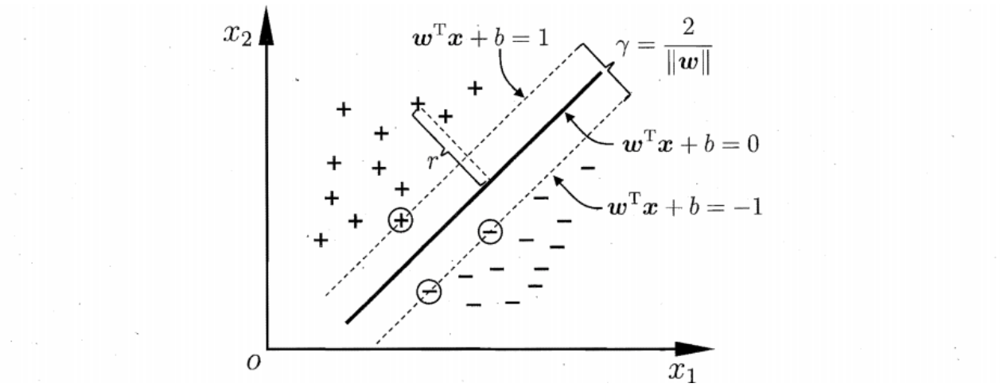
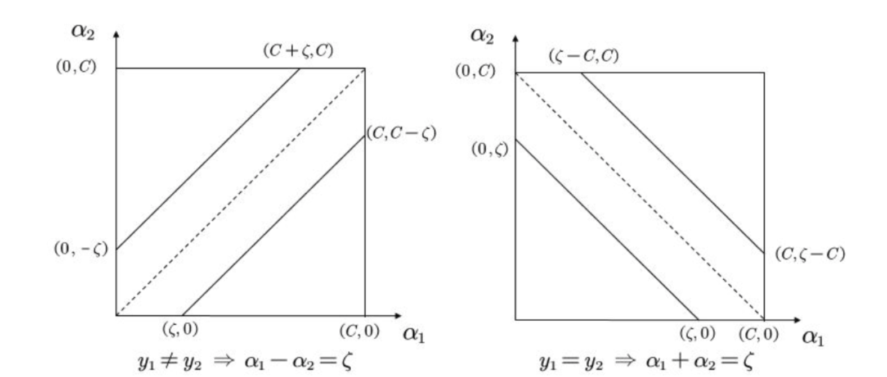

# 支持向量机

###  6.1 间隔与支持向量

1. 给定训练样本集$D =\{(\mathbf{x_1}, y_1), (\mathbf{x_2}, y_2),... (\mathbf{x_m}, y_m)\}, y_i\in\{+1, -1\}$, 最基本的想法就是基于训练集$D$在样本空间中找到一个划分超平面。

2. 划分超平面线性方程
   $$
   w^Tx+b=0\\
   w=(w_1;w_2;...;w_d)为法向量，d为位移项
   $$

3. 点到超平面的距离
   $$
   r=\frac{|w^Tx+b|}{||w||}
   $$

   证明：
$$
   设x_1的投影点为x_0\\
   w^Tx_0 + b= 0\\
   |<w,\overline{x_0x_1}>| = \|w\|r\\
   = |<w,\overline{Ox_1}> -<w,\overline{Ox_0}>|
   \\ = |<w,\overline{Ox_1}> + b|
   \\ = |w^Tx_1 + b|
   \\ \longrightarrow r= \frac{|w^Tx_1 + b|}{\|w\|}
$$

4. 如果$(w,b)$能将样本正确分类，即$(x_i,y_i)\in D$, 若$y_i=+1$, 则$w^Tx_i+b > 0$, 若$y_i = -1$, 则有$w^Tx_i + b < 0$。则给$(w,b)$乘一个系数后，必定有：
   $$
   \left\{
   \begin{matrix}
   w^Tx_i+b \ge +1, & y_i=+1\\
   w^Tx_i+b \le -1, & y_i=-1
   \end{matrix}
   \right.
   $$

* 

  * 且距离超平面最近的样本的样本点使得等号成立，这被称为一个支持向量。

  * 两个异类支持向量到超平面的距离和为，这被称为间隔$\gamma$。
    $$
    \gamma = \frac{2}{\|w\|}
    $$

5. 数学模型
   $$
   \max_{w,b}\  \frac{2}{\|w\|}\\
   s.t.\  y_i(w^Tx_i+b)\ge 1, i = 1,2,3..,m
   $$
   

* 基本型：
  $$
  \min_{w,b}\  \frac{1}{2}\|w\|^2\\
  s.t.\  y_i(w^Tx_i+b)\ge 1, i = 1,2,3..,m
  $$
  

### 6.2 对偶问题

#### 6.2.1 原始问题

1. $f(x), c_i(x), h_j(x)$是定义在$R^n$上连续可微函数，则称约束最优化问题

$$
\min_{x\in R^n}\  f(x)\\
s.t. \  c_i(x)\le 0, \ i =1,2,...,k\\
h_j(x) = 0, \ j = 1,2,...,l
$$

​	为原始优化问题

2. 拉格朗日函数
   $$
   L(x,\alpha,\beta) = f(x)+\sum_{i=1}^k\alpha_i c_i(x) + \sum_{j=1}^l\beta_j h_j(x)
   $$
   其中$\alpha_i\ge 0 $称为松弛变量/KKT变量，$\beta_i$是拉格朗日乘子。

* $L(x,\alpha,\beta)​$关于$(\alpha,\beta)​$是仿射函数
* 若$f(x),c(x)$是凸函数, $h(x)$是仿射函数，则$L(x,\alpha,\beta)$是关于$x$的凸函数。

3. 构造

$$
\theta_p(x) = \max_{\alpha,\beta} L(x, \alpha, \beta)
$$

* 如果某个$x​$违反约束条件， 即存在$i​$使得$c_i(x) > 0​$或者$h_j(x) \not =0​$, 可以令$\alpha_i c_i(x) \rightarrow +\infty​$或者$\beta_jh_j(x)\rightarrow +\infty​$, 从而$\theta_p(x) = +\infty​$

* 若均符合条件，$\theta_p(x) = f(x)$

* 即
  $$
  \theta_p(x)=
  \left\{
  \begin{matrix}
  f(x), &x满足原始问题约束\\
  +\infty, &否则 
  \end{matrix}
  \right.
  $$

* 极小化问题

  $$
  \min_x \theta_P(x) = \min_x \max_{\alpha,\beta} L(x,\alpha,\beta)
  $$

  与原始问题等价，则有相同的解。
  $$
  \min_x \max_{\alpha,\beta} L(x,\alpha,\beta)
  $$
  称为广义拉格朗日函数极小极大化问题。

* 原始问题的最优值
  $$
  p^*=\min_x \theta_P(x)
  $$

#### 6.2.2 对偶问题

1. 构造
   $$
   \theta_D(\alpha, \beta) = \min_x L(x, \alpha, \beta)
   $$
   则极大化问题
   $$
   \max_{\alpha,\beta} \theta_D(\alpha, \beta) = \max_{\alpha,\beta} \min_x L(x,\alpha, \beta)
   $$
   称为广义拉格朗日函数的极大极小问题。

   表示为约束最优化问题为：
   $$
   \max_{\alpha,\beta} \theta_D(\alpha, \beta) = \max_{\alpha,\beta} \min_x L(x,\alpha, \beta) \\
   s.t. \  \alpha_i \ge 0, i = 1,2,...,k
   $$
   这称为原始问题的对偶问题。

2. 定义对偶问题的最优值
   $$
   d^*=\max_{\alpha,\beta} \theta_D(\alpha,\beta)
   $$

3. 性质：此函数为凹函数
   $$
   \theta_D(\lambda\alpha_1+(1-\lambda)\alpha_2,\lambda\beta_1+(1-\lambda)\beta_2) \ge \lambda\theta_D(\alpha_1,\beta_1)+(1-\lambda)\theta_D(\alpha_2,\beta_2)
   \\ \theta_D(\lambda\alpha_1+(1-\lambda)\alpha_2,\lambda\beta_1+(1-\lambda)\beta_2) 
   \\ = \min_x(L(x, \lambda\alpha_1+(1-\lambda)\alpha_2, \lambda\beta_1+(1-\lambda)\beta_2))
   \\ = \min_x(\lambda L(x,\alpha_1,\beta_1)+(1-\lambda)L(x,\alpha_2,\beta_2))
   \\ \ge \min_x(\lambda L(x,\alpha_1,\beta_1))+\min_x((1-\lambda)L(x,\alpha_2,\beta_2))
   \\ = \lambda\theta_D(\alpha_1,\beta_1)+(1-\lambda)\theta_D(\alpha_2,\beta_2)
   $$

* 当$x​$固定时，$L(x,\alpha,\beta)​$是一个关于$(\alpha, \beta)​$的仿射函数，既是凸的也不是凹的，满足$L(x, \lambda\alpha_1+(1-\lambda)\alpha_2, \lambda\beta_1+(1-\lambda)\beta_2) = \lambda L(x,\alpha_1,\beta_1)+(1-\lambda)L(x,\alpha_2,\beta_2)​$

#### 6.2.3 原始问题和对偶问题的关系

1. 弱对偶性
   $$
   d^* \le p^*
   $$

* 对于所有优化问题都成立，即使原始问题非凸

* 证明：
  $$
  d^* = \theta_D(\alpha^*,\beta^*) 
  \\= \min_xL(x,\alpha^*,\beta^*) 
  \\ = \min_x(f(x) + \sum_{i=1}^m\alpha_i^*c_i(x) + \sum_{j=1}^n\beta_j^*h_j(x)) 
  \\ \le f(x^*) + \sum_{i=1}^m\alpha_i^*c_i(x^*) + \sum_{j=1}^n\beta_j^*h_j(x^*) 
  \\ \le \max_{\alpha,\beta}(f(x^*) + \sum_{i=1}^m\alpha_ic_i(x^*) + \sum_{j=1}^n\beta_jh_j(x^*)) \\  = \theta_P(x^*)=p^*
  $$

* 更进一步的解释$\theta_D(\alpha,\beta)  < \theta_P(x)$
  $$
  \theta_D(\alpha,\beta) 
  \\= \min_xL(x,\alpha,\beta) 
  \\ = \min_x(f(x) + \sum_{i=1}^m\alpha_ic_i(x) + \sum_{j=1}^n\beta_jh_j(x)) 
  \\ \le f(x) + \sum_{i=1}^m\alpha_ic_i(x) + \sum_{j=1}^n\beta_jh_j(x) 
  \\ \le \max_{\alpha,\beta}(f(x) + \sum_{i=1}^m\alpha_ic_i(x) + \sum_{j=1}^n\beta_jh_j(x)) \\  = \theta_P(x)
  $$
  

2. 强对偶性
   $$
   d^* = p^*
   $$
   并不是所有的对偶问题都满足强对偶性 ，在 SVM 中是直接假定了强对偶性的成立，其实只要满足一些条件，强对偶性是成立的，比如说 Slater 条件与KKT条件。

* Slater条件

  * 凸优化条件
    * $f(x)$和$c_i(x)$是凸函数
    * $h_j(x)$是仿射函数
  * $c_i(x)​$严格可行
    * 存在$x_0$, 对所有的$i$有$c_i(x_0) < 0$

  则存在$x^*, \alpha^*, \beta^*​$, 使得$x^*​$是原始问题的解，$\alpha^*, \beta^*​$是对偶问题的解，并且
  $$
  p^* = d^* = L(x^*, \alpha^*, \beta^*)
  $$
  即：原始问题是凸优化问题并且满足严格可行条件的话，那么强对偶性成立

* KTT条件

  * 满足Slater条件

  * $x^*$是原始问题的解，$\alpha^*,\beta^*$是对偶问题的解的充分必要条件是$x^*,\alpha^*,\beta^*​$满足：
    $$
    \begin{align}
    &(1)\ c_i(x^*) \le 0,\ i = 1,2,...,k\\
    &(2)\ h_j(x^*) = 0,\ j = 1,2,...,l\\
    &(3)\ \nabla_xL(x^*,\alpha^*,\beta^*) = 0\\
    &(4)\ \alpha_i^* \ge 0,\ i = 1,2,...,k\\
    &(5)\ \alpha_i^*c_i(x^*) = 0,\ i = 1,2,...,k\\
    
    \end{align}
    $$
    且$\theta_P(x^*) = \theta_D(\alpha^*,\beta^*)$

  * 证明

    * 必要性：

    1. 由于 $x^*$ 是原问题的解，所以满足第 $(1),(2)$条。

    2. 由于$\theta_D(\alpha^*, \beta^*) = \theta_P(x^*)$, 则$\theta_D(\alpha^*, \beta^*)  = \min_x(L(x,\alpha^*,\beta^*)) = L(x^*,\beta^*,\alpha^*)$, 则梯度为0，满足$(3)​$

    3. 由于$\alpha^*, \beta^*​$是对偶问题的解，所以满足$(4)​$

    4. 对于$(5)$, 经过公式：
       $$
       \theta_P(x^*) = \theta_D(\alpha^*,\beta^*) 
       \\= \min_xL(x,\alpha^*,\beta^*) 
       \\ = \min_x(f(x) + \sum_{i=1}^m\alpha_i^*c_i(x) + \sum_{j=1}^n\beta_j^*h_j(x)) 
       \\ \le f(x^*) + \sum_{i=1}^m\alpha_i^*c_i(x^*) + \sum_{j=1}^n\beta_j^*h_j(x^*) 
       \\ \le \max_{\alpha,\beta}(f(x^*) + \sum_{i=1}^m\alpha_ic_i(x^*) + \sum_{j=1}^n\beta_jh_j(x^*)) \\  = \theta_P(x^*) = f(x^*)
       $$

       由于两侧等于，所以等号都成立，则$\sum_{i=1}^m\alpha_i^*c_i(x^*) = 0$,所以$\alpha_i^*c_i(x^*) = 0$

    * 充分性：

    1. 根据对偶问题的定义
       $$
       \theta_D(\alpha^*,\beta^*) = \min_x(f(x) + \sum_{i=1}^m\alpha_i^*c_i(x) + \sum_{j=1}^n\beta_j^*h_j(x))
       $$

    2. 由于$(3)$梯度为0，且$L(x,\alpha,\beta)$函数关于$x$凸函数，则
       $$
       \theta_D(\alpha^*,\beta^*) = \min_x(f(x) + \sum_{i=1}^m\alpha_i^*c_i(x) + \sum_{j=1}^n\beta_j^*h_j(x))
       \\ =  f(x^*) + \sum_{i=1}^m\alpha_i^*c_i(x^*) + \sum_{j=1}^n\beta_j^*h_j(x^*)
       \\ = f(x^*) = \theta_P(x^*)
       $$

    3. 由于$\theta_P(x)$是凸函数，$\theta_D(\alpha,\beta)$是凹函数。且 $\theta_D(\alpha, \beta) \le \theta_P(x)$，我们就知道原问题肯定取到了最小值，而对偶问题肯定取到了最大值，说明我们找到了两者的解。

  * KTT的直观理解

    约束问题：
    $$
    \min_x \ f(x)\\
    s.t. \ g(x) \le 0
    $$

    1. $g(x)\le 0$称为原始可行性

    2. 定义可行域$K = \{x \in R^n|g(x)\le 0\}$

    * 若$g(x^*) < 0$, 则落在可行域内，称为内部解，约束条件无效，只需要检验满足原始可行性就可, 根据拉格朗日乘子
      $$
      \nabla f= 0\\
      \lambda = 0
      $$

    * 若$g(x^*) = 0$, 则在$K$的边界，称为边界解，此时约束条件是有效的。
      $$
      \nabla f = -\lambda \nabla g\\
      \lambda >= 0(对偶可行性)
      $$
      由于$f$在边界取到，所以$\nabla f$和$\nabla g $方向相反，从而产生了对偶可行性

    3. 可以看到$\lambda g(x) = 0​$恒成立，所以称为互补松弛性

    4. 最后得到$KTT$条件
       $$
       \nabla f + \lambda \nabla g = 0\\
       \ g(x) \le 0\\
       \lambda >= 0\\
       \lambda g(x) = 0
       $$

    5. 对于普遍情况
       $$
       \min_{x\in R^n}\  f(x)\\
       s.t. \  c_i(x)\le 0, \ i =1,2,...,k\\
       h_j(x) = 0, \ j = 1,2,...,l\\
       L(x,\alpha,\beta) = f(x)+\sum_{i=1}^k\alpha_i c_i(x) + \sum_{j=1}^l\beta_j h_j(x)
       $$
       得到KTT条件
       $$
       \nabla_xL(x^*,\alpha^*,\beta^*) = 0\\
       \alpha_i \ge 0\\
       c_i(x) \le 0\\
       h_h(x)  = 0\\
       \alpha_ic_i(x) = 0
       $$
       

#### 6.2.4 SVM的推导

1. 原问题
   $$
   \min_{w,b}\  \frac{1}{2}\|w\|^2\\
   s.t.\  y_i(w^Tx_i+b)\ge 1, i = 1,2,3..,m
   $$

2. 拉格朗日函数
   $$
   L(w, b, \alpha ) = \frac{1}{2}\|w\|^2+\sum_{i=1}^m\alpha_i(1-y_i(w^Tx_i+b))
   \\ = \frac{1}{2}w^Tw + \sum_{i=1}^m\alpha_i(1-y_i(w^Tx_i+b))
   $$

   使得$\nabla_w L=0, \nabla_b L = 0​$, 即
   $$
   dL = \frac{1}{2}(dw^Tw+w^Tdw) - \sum_{i=1}^m\alpha_iy_idw^Tx_i\\
   = w^Tdw - \sum_{i=1}^m\alpha_iy_ix_i^Tdw\\
   = (w-\sum_{i=1}^m \alpha_iy_ix_i)^T dw\\
   \longrightarrow \nabla_w L = w-\sum_{i=1}^m\alpha_iy_ix_i = 0\\
   \nabla_b L = \sum_{i=1}^m \alpha_iy_i= 0
   $$
   

   带入原式得到对偶问题$\max_{\alpha} \theta_D(\alpha)​$
   $$
   \max_{\alpha} \frac{1}{2}w^Tw + \sum_{i=1}^m \alpha_i - w^Tw = \sum_{i=1}^m \alpha_i - \frac{1}{2}\sum_{i=1}^m\sum_{j=1}^m\alpha_i\alpha_jy_iy_jx_i^Tx_j
   \\s.t. \ \sum_{i=1}^m\alpha_iy_i = 0
   \\ \alpha_i \ge 0,\  i = 1,2,..,m
   $$
   解出$\alpha$后, 求出$w$和$b$, 模型为:
   $$
   f(x) = w^Tx+b\\
   =\sum_{i=1}^m\alpha_i y_ix_i^Tx + b
   $$
   注意原始问题含有不等式约束，所以$\alpha, b$满足$KKT$条件
   $$
   \left\{
   \begin{matrix}
   \alpha_i(y_if(x_i) - 1) = 0\\
   y_if(x_i) - 1 \ge 0\\
   \alpha_i\ge 0
   \end{matrix}
   \right.
   $$
   根据这个条件可以解出$b$。

   注意，对任意训练样本$(x_i,y_i)$, 总有$\alpha_i = 0$或者$y_if(x_i) = 1$, 若$\alpha_i = 0$, 则对$w$无贡献；若$y_if(x_i) = 1$, 则对应的样本点是一个支持向量，这显示出支持向量机的一个重要性质:训练完成后?大部分的训练样本都不需 保留，最终模型仅与支持向量有关。

3. 对偶问题的求解：SMO

* 求解：
  $$
  \max_{\alpha} \sum_{i=1}^m \alpha_i - \frac{1}{2}\sum_{i=1}^m\sum_{j=1}^m\alpha_i\alpha_jy_iy_jx_i^Tx_j
  \\s.t. \ \sum_{i=1}^m\alpha_iy_i = 0
  \\ \alpha_i \ge 0,\  i = 1,2,..,m
  $$

* 基本思路：由于 存在约束$\sum_{i=1}^m a_iy_i = 0​$，若固定$a_i​$之外的其他变量, 可由其他变量导出。于是， SMO每次选择两个变量$a_i ​$和$a_j​$，并固定其他参数，求在$a_i​$上的极值。这样，在参数初始化后， SMO不断执行如下两个步骤直至收敛:
  * 选取一对需更新的变量$a_i$和$a_j$
  * 固定$a_i$和$a_j$以外的参数，求解后获得更新的$a_i$和$a_j$
    *  直观来看， KKT 条件违背的程度越大, 则变量更新后可能导致的目标函数值增幅越大。于是， SMO 先选取违背 KKT条件程度最大的变量。第二个变量应选择一个使目标函数值减小最快的变量，但由于比较各变量所对应的目标函数值减幅的复杂度过高，因此 SMO 采用了一个启发式: 使选取的两变量所对应样本之间的问隔最大。直观的解释是，这样的两个变量有很大的差别，与对两个相似的变量进行更新相比，对它们的更新会带给目标函数值更大的变化.

* SMO 算法之所以高效，恰由于在固定其他参数后7 仅优化两个参数的过程 能做到非常高效，具体来说，仅考虑$a_i$，$a_j$, 则约束可以重写为
  $$
  \alpha_iy_i+\alpha_jy_j = c\ （c = -\sum_{k\not = i,j}a_ky_k）\\
  此时得到了关于a_i的单变量二次规划问题，约束为a_i \ge 0\\
  闭式解为：\\
  a_i^{new} =
  \left\{
  \begin{matrix}
  0, & if\ a_i^{new,unclipped} \le 0\\
  a_i^{new,unclipped}, & if\ a_i^{new,unclipped} > 0\\
  \end{matrix}
  \right.
  $$

* 求解偏移项$b$

  注意所有的支持向量$(x_s,y_s)$都有$y_sf(x_s) = 1$, 即
  $$
  记: S=\{i|\alpha_i > 0, i = 1,2,...,m\}\\
  y_s(\sum_{i\in S}\alpha_iy_ix_i^Tx_s+b) = 1
  $$
  则可以选取支持向量求解的平均值
  $$
  b = \frac{1}{|S|}\sum_{s\in S}(\frac{1}{y_s} - \sum_{i\in S} \alpha_iy_ix_i^Tx_s)
  $$
  

### 6.3 核函数

1. 对于非线性可分问题，可将样本从原始空间映射到-个更高维的特征空间，使得 样本在这个特征空间内线性可分。如果原始 空间是有限维， 即属性数有限?那么一定存在一个高维特征空间使样本可分。

2. 令$\phi(x)$表示将x映射之后的特征向量，于是，在特征空间中划分超平面所对应的模型可以表示为
   $$
   f(x)=w^T\phi(x)+b\\
   $$
   则有
   $$
   原始问题：\\
   \min_{w,b} \frac{1}{2}\|w\|^2\\
   s.t. \ y_i(w^T\phi(x_i)+b)\ge 1,\ i=1,2,...,m\\
   对偶问题：\\
   \max_{\alpha}\sum_{i=1}^m\alpha_i-\frac{1}{2}\sum_{i=1}^m\sum_{j=1}^m \alpha_i\alpha_jy_iy_j\phi(x_i)^T\phi(x_j)\\
   s.t.\ \sum_{i=1}^m\alpha_iy_i=0\\
   \alpha_i \ge 0,\ i=1,2,...,m
   $$

   于特征空间维数可能很高，因此直接计算$\phi(x_i)^T\phi(x_j)$通常是困难的，为此引入
$$
   \kappa(x_i,x_j)=\left<\phi(x_i),\phi(x_j)\right>=\phi(x_i)^T\phi(x_j)
$$
   即 $x_i$ 与 $x_j$ 在特征空间的内积等于它们在原始样本空间中通过函数$\kappa(.,.)$计算 的结果。

   对偶问题可以重写为：
$$
   \max_{\alpha}\sum_{i=1}^m\alpha_i-\frac{1}{2}\sum_{i=1}^m\sum_{j=1}^m \alpha_i\alpha_jy_iy_j\kappa(x_i,x_j)\\
   s.t.\ \sum_{i=1}^m\alpha_iy_i=0\\
   \alpha_i \ge 0,\ i=1,2,...,m\\
$$
   $\kappa(.,.)$称为核函数， $f(x)=\sum_{i=1}^m\alpha_iy_i\kappa(x,x_i)+b$显示出模型最优解可通过训练样本的核函数展开，这一展式亦称"支持向量展式"。

3. 核函数定理(Mercer定理)

   令$\chi ​$为输入空间, $\kappa(.,.)​$是定义在$\chi \times \chi​$上的对称函数，$\kappa ​$是核函数当且仅当对于任意数据$D=\{x_1,x_2,...,x_m\}​$, 核矩阵$\Kappa​$总是半正定的：
   $$
   K = 
   \left[
   \begin{matrix}
   \kappa(x_1,x_1)&\cdots&\kappa(x_1,x_j)&\cdots&\kappa(x_1,x_m)\\
   \vdots&\ddots&\vdots&\ddots&\vdots\\
   \kappa(x_1,x_1)&\cdots&\kappa(x_i,x_j)&\cdots&\kappa(x_i,x_m)\\
   \vdots&\ddots&\vdots&\ddots&\vdots\\
   \kappa(x_m,x_1)&\cdots&\kappa(x_m,x_j)&\cdots&\kappa(x_m,x_m)
   \end{matrix}
   \right]
   $$

* 证明：
  * 必要性：

    如果$\kappa(.,.)$是核函数,
    $$
    K = 
    \left[
    \begin{matrix}
    \phi(x_1)^T\\
    \phi(x_2)^T\\
    \vdots\\
    \phi(x_m)^T\\
    \end{matrix}    
    \right]
    \left[
    \begin{matrix}
    \phi(x_1)&
    \phi(x_2)&
    \dots&
    \phi(x_m)
    \end{matrix}    
    \right]
    \\y^TKy = (\sum_{i=1}^m\phi(x_i)y_i)^T\sum_{i=1}^m\phi(x_i)y_i\ge 0
    \\ \longrightarrow K为半正定
    $$

  * 充分性：

    由于$\Kappa​$是半正定矩阵，所以可以对角化，且对角矩阵元素都非负(特征值非负)：
    $$
    K=U\Lambda U^T=(U\Lambda^{\frac{1}{2}})(U\Lambda^{\frac{1}{2}})^T
    $$
    令$U\Lambda^{\frac{1}{2}}​$为$\left[
    \begin{matrix}
    \phi(x_1)^T\\
    \phi(x_2)^T\\
    \vdots\\
    \phi(x_m)^T\\
    \end{matrix}    
    \right]​$, 则有$K = 
    \left[
    \begin{matrix}
    \phi(x_1)^T\\
    \phi(x_2)^T\\
    \vdots\\
    \phi(x_m)^T\\
    \end{matrix}    
    \right]
    \left[
    \begin{matrix}
    \phi(x_1)&
    \phi(x_2)&
    \dots&
    \phi(x_m)
    \end{matrix}    
    \right]​$

    可见$\Kappa​$对应着核函数。

    * 以上就表示了可再生性，即用核函数生成两个函数的内积
      $$
      K = \phi(\mathbf{x})^T\phi(\mathbf{x})
      $$
      

* 常用核函数
  * 线性核：
    $$
    \kappa(x_i,x_j) = x_i^Tx_j\\
    $$

  * 多项式核：
    $$
    \kappa(x_i,x_j) = (x_i^Tx_j)^d\\
    $$
    $d\ge1$为多项式的次数

  * 高斯核：
    $$
    \kappa(x_i,x_j)=exp(-\frac{\|x_i-x_j\|}{2\sigma^2})
    $$
    $\sigma>0$为高斯核的带宽

  * 拉普拉斯核:
    $$
    \kappa(x_i,x_j)=exp(-\frac{\|x_i-x_j\|}{\sigma})
    $$
    $\sigma > 0$

  * Sigmoid核：
    $$
    \kappa(x_i,x_j) = \tanh(\beta x_i^Tx_jj+\theta)
    $$
    $\tanh$为双曲正切函数， $β> 0, \beta < 0 $

* 核函数的运算

  * $\kappa_1,\kappa_2​$是核函数，任意正数$\gamma_1,\gamma_2​$
    $$
    \gamma_1\kappa_1+\gamma_2\kappa_2 也是核函数
    $$

  * $\kappa_1,\kappa_2​$是核函数, 核函数的直积也是核函数
    $$
    \kappa_1\otimes\kappa_2(x,z)=\kappa_1(x,z)\kappa_2(x,z)
    $$

  * $\kappa_1$是核函数，则对于任意函数$g(x)​$
    $$
    \kappa(x,z)=g(x)\kappa_1(x,z)g(z)也是核函数
    $$
    

### 6.4 软间隔与正则化

1. 问题：

   在现实任务中往往很难确定合适的核函数使得训练样本在特征空间中线性可分; 退一步说， 即使恰好找到了某个核函数使训练集在特征空间中线性可分。也很难断定这个貌似线性可分的结果不是由于过拟合所造成的。

2. 软间隔支持向量机

* 缓解该问题的一个办法是允许支持向量机在一些样本上出错。为此，要引入"软间隔" 的概念。

  优化目标变为：

  $$
  \min_{w,b} \frac{1}{2}\|w\|^2+C\sum_{i=1}^ml_{0/1}(y_i(w^Tx_i+b) - 1)\\
  C>0是一个常数，l_{0/1}是"0/1"损失函数\\
  l_{0/1}=
  \left\{
  \begin{matrix}    
  1,&if\ z<0\\
  0,&otherwise
  \end{matrix}    
  \right\}
  $$

  当$C$无穷大，严格满足约束条件$y_i(w^Tx_i+b)\ge 0$。否则取有限值时。允许一些样本不满足约束。

* $l_{0/1}$非凸、非连续，数学性质不太好，不易直接求解。于是用其他函数来代替
  $$
  l_{hinge}(z) = \max(0, 1-z)\\
  l_{exp}(z)=\exp(-z)\\
  l_{log}(z) = \log(1+\exp(-z))
  $$

* 采用$hinge$损失，引入松弛变量$\xi_i\ge 0$, 可以重写为
  $$
  \min_{w,b,\xi_i} \frac{1}{2}\|w\|^2+C\sum_{i=1}^m\xi_i\\
  s.t.\ y_i(w^Tx_i+b)\ge 1 - \xi_i\\
  \xi_i\ge 0,\ i = 1,2,...,m
  $$

* 拉格朗日函数
  $$
  L(w,b,\alpha,\xi,\mu) 
  \\= \frac{1}{2}\|w\|^2+C\sum_{i=1}^m\xi_i+\sum_{i=1}^m\alpha_i(1-\xi_i-y_i(w^Tx_i+b))-\sum_{i=1}^m\mu_i\xi_i
  $$
  对$w,b,\xi_i$求偏导
  $$
  w=\sum_{i=1}^m\alpha_iy_ix_i\\
  0 = \sum_{i=1}^m \alpha_iy_i\\
  C = \alpha_i+\mu_i
  $$

* 带入得对偶问题
  $$
  \max_{\alpha}\sum_{i=1}^m\alpha_i-\frac{1}{2}\sum_{i=1}^m\sum_{j=1}^m\alpha_i\alpha_jy_iy_jx_i^Tx_j\\
  s.t.\ \sum_{i=1}^m\alpha_iy_i = 0\\
  0\le\alpha_i\le C,\ i = 1,2,...,m
  $$

* $KKT$条件：
  $$
  \left\{
  \begin{matrix}
  \alpha_i \ge 0,& \mu_i\ge 0\\
  y_if(x_i)-1+\xi_i \ge 0,& \alpha_i(y_if(x_i)-1+\xi_i ) = 0\\
  \xi_i\ge 0,& \mu_i\xi_i=0
  \end{matrix}
  \right.
  $$

  可以看到，总有$\alpha_i = 0$或者$y_if(x_i) = 1-\xi_i​$

  * 若$\alpha_i = 0$, 不会对$f(x)$有任何影响，为正确分类的内部向量
  * 若$\alpha_i>0$, 必有$y_if(x_i) = 1-\xi_i$, 即该样本为支持向量
    * 若$\alpha_i < C$, 则由$C = \alpha_i+\mu_i$, ​$\mu_i >0 $, 有$\xi_i = 0$, 则该样本恰在最大间隔边界
    * 若$\alpha_i = C$, 则$\mu_i = 0$
      * 若$\xi_i\le 1$, 则样本落在最大间隔内部
      * 若$\xi_i>1$, 则被错误分类。

  也就是
  $$
  \left\{
  \begin{matrix}   
  \alpha_i = 0\ \&\ y_if(x_i)\ge 1\\
  0<\alpha_i < C\ \&\ y_if(x_i) = 1\\
  \alpha_i = C\ \&\ y_if(x_i) \le 1\\
  \end{matrix}    
  \right.
  $$

* 更一般的形式
  $$
  \min_f \Omega(f)+C\sum_{i=1}^ml(f(x_i),y_i)
  $$

  $\Omega$称为结构风险，用来描述$f​$的某些性质；第二项称为经验风险，用于描述模型与训练数据的契合程度。

* 具有软间隔和核函数的SMO算法

  1. 只选用$\alpha_1$,$\alpha_2$当作变量，其他是固定的，所以优化问题可以写为
     $$
     \min_{\alpha_1,\alpha_2} W(\alpha_1,\alpha_2)
     \\ = \frac{1}{2}K_{11}\alpha_1^2+\frac{1}{2}K_{22}\alpha_2^2+y_1y_2K_{12}\alpha_1\alpha_2-(\alpha_1+\alpha_2) 
     \\+ y_1\alpha_1\sum_{i=3}^Ny_i\alpha_iK_{i1} + y_2\alpha_2\sum_{i=3}^Ny_i\alpha_iK_{i2}\\
     s.t. \alpha_1y_1+\alpha_2y_2=-\sum_{i=3}^Ny_i\alpha_i = \zeta
     $$

  2. 为了求解，画出约束条件

     

     可以知道：
     $$
     \left\{
     \begin{matrix}
     L = \max(0,a_2^{old} - a_1^{old}), H = min(C,C+a_2^{old}-a_1^{old}), &y_1\not = y_2\\
     L = \max(0,a_2^{old}+a_1^{old} -C), H = min(C,a_2^{old}+a_1^{old}), &y_1 = y_2
     \end{matrix}    
     \right.
     $$
     因为$\alpha_1y_1+\alpha_2y_2 = \zeta$, 同时乘以$y1$, 得到$\alpha_1+s\alpha_2 = w$, 其中$s = y_1y_2, w = \zeta y_2$

     可得
     $$
     W(\alpha_2) 
     \\= \frac{1}{2}K_{11}(w-s\alpha_2)^2+\frac{1}{2}K_{22}\alpha_2^2
     \\+sK_{12}(w-s\alpha_2)\alpha_2-((w-s\alpha_2)+\alpha_2) 
     \\+ y_1(w-s\alpha_2)\sum_{i=3}^Ny_i\alpha_iK_{i1} + y_2\alpha_2\sum_{i=3}^Ny_i\alpha_iK_{i2}\\
     \frac{\partial W}{\partial a_2} = 
     \\-sK_{11}(w-sa_2)+K_{22}\alpha_2-K_{12}\alpha_2+sK_{12}(w-s\alpha_2)
     \\+ s - 1 -y_2\sum_{i=3}^Ny_i\alpha_i^*K_{i1}+y_2\sum_{i=3}^Ny_i\alpha_i^*K_{i2} = 0
     \\ \rightarrow
     \alpha_2(K_{11}+K_{22}-2K_{12})
     \\=s(K_{11}-K_{12})w+y_2(\sum_{i=3}^Ny_i\alpha_i^*K_{i1}-\sum_{i=3}^Ny_i\alpha_i^*K_{i2}) + 1 - s
     \\=-y_2(K_{11}-K_{12})\sum_{i=3}^ny_i\alpha_i^*
     \\+y_2(f(x_1)-y_1\alpha_1^*K_{11}-y_2\alpha_2^*K_{12} - f(x_2) + y_1\alpha_1^*K_{12}+y_2\alpha_2^*K_{22}) 
     \\+ 1 - s
     \\ =s(K_{11}-K_{12})w
     \\+y_2(f(x_1)-y_1(w-s\alpha_2^*)K_{11}-y_2\alpha_2^*K_{12} - f(x_2) + y_1(w-s\alpha_2^*)K_{12}+y_2\alpha_2^*K_{22}) 
     \\+ 1 - s
     \\ = y_2(f(x_1)+y_2\alpha_2^*K_{11}-y_2a_2^*K_{12}-f(x_2)-y_2\alpha_2^*K_{12}+y_2\alpha_2^*K_{22})+1-s
     \\ = \alpha_2^*(K_{11}+K_{22}-2K_{12})+y_2(f(x_1)-f(x_2)+y_2-y_1)
     $$
     记$E_i=f(x_i)-y_i$为误差项，$\eta=K_{11}+K_{22}-2K_{12}$为学习速率
     $$
     a_2^{new,unclipped} = a_2^{old}+\frac{y_2(E_2-E_1)}{\eta}\\
     a_2^{new} = 
     \left\{
     \begin{matrix}
     H, &a_2^{new,unclipped} > H\\
     a_2^{new,unclipped}, &L\le a_2^{new,unclipped}\le H\\
     L, &a_2^{new,unclipped} \le L
     \end{matrix}
     \right.\\
     a_1^{new}=a_1^{old}+y_1y_2(a_2^{old}-a_2^{new})
     $$

  3. 启发式选择参数

  * 简化：检查训练样本中每个点$(x_i,y_i)$是否满足KKT条件，如果不满足，则它对应的$\alpha_i$可以被优化，然后随机选择另一个变量$\alpha_j$进行优化。

  * 完整版：先通过一个外循环来选择第一个$\alpha_i$，并且其选择过程会再两种方式之间进行交替：一种方式是在所有数据集上进行单遍扫描，另一种方式则是在非边界$\alpha$中实现单遍扫描。所谓非边界$\alpha$即那些$\alpha\not = 0$或 $\alpha\not = C$的 $\alpha$。

    之后算法会通过内循环选择第二个$\alpha_j$, 优化过程中会通过最大化步长的方式来获取第二个$\alpha_j $。

  4. 阈值$b​$
     $$
     \sum_{i=1}^N\alpha_iy_iK_{i1}+b = y_1\\
     b_1^{new} = y_1 - \sum_{i=3}^N\alpha_iy_iK_{i1}-\alpha_1^{new}y_1K_{11}-a_2^{new}y_2K_{21}
     \\ = -E_1 - y_1K_{11}(\alpha_1^{new}-\alpha_1^{old})-y_2K_{21}(\alpha_2^{new}-\alpha_2^{old})+b_{old}
     \\b_2^{new}
     = -E_2 - y_1K_{12}(\alpha_1^{new}-\alpha_1^{old})-y_2K_{22}(\alpha_2^{new}-\alpha_2^{old})+b_{old}
     $$
     如果$\alpha_1^{new},\alpha_2^{new}$同时满足条件$0<\alpha_i^{new}<C$, 则$b_1^{new}=b_2^{new}$, 如果是$0，C$， 则$b_1^{new}, b_2^{new}$之间的数都满足$KKT$条件的阈值， 则选择他们的中点
     $$
     b^{new}=\frac{b_1^{new}+b_2^{new}}{2}
     $$
     

### 6.5 支持向量回归

1. SVR

* 支持向量回归(Support Vector Regression，简称 SVR), 假设我们能容忍$f(x)$与 $y$ 之间最多有$\epsilon$的偏差，即仅当$f(x)$与$y$之间的差别绝对值大于$\epsilon$时才计算损失。

* 这相当于以$f(x)$为中心构建了一个宽度为杂的问隔带，若训练样本落入此间隔带，则认为是被预测正确的。

2. 数学模型
   $$
   \min_{w,b}\frac{1}{2}\|w\|^2+C\sum_{i=1}^ml_{\epsilon}(f(x_i)-y_i)\\
   l_{\epsilon}(z)=
   \left\{
   \begin{matrix}
   0, & if\ |z|\le \epsilon\\
   |z|-\epsilon, & otherwise
   \end{matrix}
   \right.
   $$
   可以重写为
   $$
   \min_{w,b,\xi_i,\hat\xi_i} \frac{1}{2}\|w\|^2+C\sum_{i=1}^m(\xi_i+\hat\xi_i)\\
   s.t. \ f(x_i)-y_i\le \epsilon+\xi_i\\
   y_i-f(x_i)\le\epsilon+\hat\xi_i\\
   \xi_i\ge 0,\hat\xi_i\ge 0,i=1,2,...,m引入拉格朗日乘子$\mu_i\ge 0, \hat \mu_i\ge 0,\alpha_i\ge 0,\hat\alpha_i\ge 0$
   $$
   引入拉格朗日乘子$\mu_i\ge 0, \hat \mu_i\ge 0,\alpha_i\ge 0,\hat\alpha_i\ge 0$
   $$
   L(w,b,\xi,\hat\xi,\alpha,\hat\alpha,\mu,\hat\mu)
   \\= \frac{1}{2}\|w\|^2+C\sum_{i=1}^m(\xi_i+\hat\xi_i)-\sum_{i=1}^m\mu_i\xi_i-\sum_{i=1}^m\hat\mu_i\hat\xi_i
   \\ + \sum_{i=1}^m\alpha_i(f(x_i)-y_i-\epsilon-\xi_i)+\sum_{i=1}^m \hat\alpha_i(y_i-f(x_i)-\epsilon-\hat\xi_i)\\
   求偏导得到：\\
   w = \sum_{i=1}^m(\hat\alpha_i-\alpha_i)x_i\\
   0 = \sum_{i=1}^m(\hat\alpha_i-\alpha_i)\\
   C = \alpha_i+\mu_i\\
   C = \hat\alpha_i+\hat\mu_i
   $$
   

* 对偶问题：

  带入可得
  $$
  \max_{\alpha,\hat\alpha}\ \sum_{i=1}^my_i(\hat\alpha_i-\alpha_i)-\epsilon(\hat\alpha^i+\alpha_i)-\frac{1}{2}\sum_{i=1}^m\sum_{j=1}^m(\hat\alpha_i-\alpha_i)(\hat\alpha_j-\alpha_j)x_i^Tx_j\\
  s.t.\ \sum_{i=1}^m(\hat\alpha_i-\alpha_i) = 0\\
  0\le\alpha_i,\hat\alpha_i\le C
  $$
  满足$KTT$条件，即
  $$
  \left\{
  \begin{matrix}
  \alpha_i(f(x_i)-y_i-\epsilon-\xi_i) = 0\\
  \hat\alpha_i(f(x_i)-y_i-\epsilon-\hat\xi_i) = 0\\
  (C-\alpha_i)\xi_i=0\\
  (C-\hat\alpha_i)\hat\xi_i=0
  \end{matrix}
  \right.
  $$
  

  * 可以看出当且仅当$f(x_i)-y_i-\epsilon - \xi_i = 0$, 有$\alpha_i $可以取非0；当且仅当$f(x_i)-y_i-\epsilon - \hat\xi_i = 0$, 有$\hat\alpha_i $可以取非0。也就是当样本$(x_i,y_i)$落入$\epsilon$区间时，相应的$\alpha_i,\hat\alpha_i$才能取非0值。但是两个条件不能同时成立，所以$\alpha_i,\hat\alpha_i$至少有一个时0。

  * 同时，若干落在间隔带内，则$\alpha_i=\hat\alpha_i = 0$。
  * $(C-\alpha_i)\xi_i=0, \alpha_i(f(x_i)-y_i-\epsilon-\xi_i) = 0$, 若$0<\alpha_i<C$, 则必有$\xi_i =0$, 从而有$b=y_i+\epsilon-\sum_{j=1}^m(\hat\alpha_j-\alpha_j)x_j^Tx_i$, 因此可以选取$0<\alpha_i<C$的多个样本取平均值。

  $SVR$解的形式为：
  $$
  f(x)=\sum_{i=1}^m(\hat\alpha_i-\alpha_i)x_i^Tx+b
  $$
  $\hat\alpha_i-\alpha_i\not=0$的为，支持向量，他一定落在$\epsilon$间隔带之外，

* 若考虑特征映射
  $$
  w = \sum_{i=1}^m(\hat\alpha_i-\alpha_i)\phi(x_i)\\
  f(x)=\sum_{i=1}^m(\hat\alpha_i-\alpha_i)\kappa(x,x_i)+b
  $$
  

### 6.6 核方法

1. 表示定理

   令$H$为核函数$\kappa$对应的再生核希尔伯特空间，$\|h\|_{H}$表示$H$空间中关于$h$的范数，对于任意单调递增的$\Omega:[0,\infty]\rightarrow R$和任意非负损失函数$l:R^m\rightarrow[0,\infty]$， 优化问题
   $$
   \min_{h\in H}F(h)=\Omega(\|h\|_{H})+l(h(x_1),h(x_2),...,h(x_m))\\
   $$
   的解总可写为
   $$
   h^*(x)=\sum_{i=1}^m\alpha_i\kappa(x,x_i)
   $$
   表示应理对损失函数没有限制，对正则化项$\Omega$仅要求单调递增, 设置不要求时凸函数。一系列基于核函数的学习方法，统称为"核方法" 。

2. 核性判别分析

* 通过核化来对线性判别分析进行非线性拓展从而得到"核线性判别分析"

* 先假设可通过某种映射$\phi:X\rightarrow F$ 将样本映射到一个特征空间$F$，然后在$F$中执行线性判别分析。
  $$
  h(x)=w^T\phi(x)\\
  学习目标：\max_{w}J(w)=\frac{w^TS_b^{\phi}w}{w^TS_w^{\phi}w}\\
  \mu_i^{\phi}=\frac{1}{m_i}\sum_{x\in X_i}\phi(x)\\
  S_b^{\phi}=(\mu_1^{\phi}-\mu_0^{\phi})(\mu_1^{\phi}-\mu_0^{\phi})^T\\
  S_w^{\phi}=\sum_{x\in X_0}(\phi(x)-\mu_0^{\phi})(\phi(x)-\mu_0^{\phi})^T+\sum_{x\in X_1}(\phi(x)-\mu_1^{\phi})(\phi(x)-\mu_1^{\phi})^T
  $$
  把$J(W)$当作算是函数，$\Omega=0$, 则$h(x)$可以写为
  $$
  h(x)=\sum_{i=1}^m\alpha_i\kappa(x,x_i)\\
  则 w = \sum_{i=1}^m \alpha_i\phi(x_i)
  $$

  令$\Kappa\in R^{m\times m}$为核函数矩阵，设$p_i\in\{0,1\}^{m\times 1}$为第$i$类样本的指示向量，即$p_i$得第$j$个分量为1当且仅当$x_j\in X_i$, 再令
$$
\hat\mu_0 = \frac{1}{m_0}Kp_0\\
(\hat\mu_0)_i=\frac{1}{m_0}\sum_{j=1}^{m_i}\kappa(x_i,x^0_j)\\
  \hat\mu_1 = \frac{1}{m_1}Kp_1\\
(\hat\mu_1)_i=\frac{1}{m_1}\sum_{j=1}^{m_i}\kappa(x_i,x^1_j)\\
  M = (\hat\mu_0-\hat\mu_1)(\hat\mu_0-\hat\mu_1)^T\\
  N = KK^T-\sum_{i=0}^1m_i\hat\mu_i\hat\mu_i^T\\
  w^T\mu_i^{\phi}=\frac{1}{m_i}\sum_{j=1}^m\sum_{k=1}^{m_i}\alpha_j\phi(x_j)^T\phi(x^i_k) 
\\= \frac{1}{m_i}\sum_{j=1}^m\sum_{k=1}^{m_i}\alpha_j\kappa(x_j,x_k^i)
= \alpha^T\hat\mu_i\\
w^TS_b^{\phi}w=(w^T(\mu_1^{\phi} - \mu_0^{\phi}))(w^T(\mu_1^{\phi} - \mu_0^{\phi}))^T
\\ = \alpha^T(\hat\mu_1-\hat\mu_0)(\hat\mu_1-\hat\mu_0)^T\alpha = \alpha^TM\alpha
\\w^TS_w^{\phi}w =w^T(\sum_{j=0}^1\sum_{x\in X_j}(\phi(x)-\mu_j^{\phi})(\phi(x)-\mu_j^{\phi})^T)w
\\ = \sum_{j=0}^1\sum_{k=1}^{m_j}(\sum_{i=1}^m\alpha_i\kappa(x_i,x_k^j)-\alpha^T\hat\mu_j)(\sum_{i=1}^m\alpha_i\kappa(x_i,x_k^j)-\alpha^T\hat\mu_j)^T
\\ = \alpha^T(\sum_{j=0}^1\sum_{k=1}^{m_j}(\kappa(\mathbf{x},x_k^j) - \hat\mu_j)(\kappa(\mathbf{x},x_k^j) - \hat\mu_j)^T)\alpha
\\ = \alpha^T(\sum_{i=1}^{m}\kappa(\mathbf{x},x_i)\kappa(\mathbf{x},x_i)^T + \sum_{j=0}^1m_j\hat \mu_j\hat\mu_j^T-2\sum_{j=0}^1m_j\hat\mu_j\mu_j^T)\alpha
\\ = \alpha^T(KK^T-\sum_{i=0}^1m_i\hat\mu_i\hat\mu_i)\alpha=\alpha^TN\alpha
$$

​	本质在于凑出$\phi(x_i)\phi(x_j)$, 用$\kappa(x_i,x_j)$来表示内积。

​	学习目标$J(w)$等价于
$$
\max_{\alpha}J(\alpha)=\frac{\alpha^TM\alpha}{\alpha^TN\alpha}
$$