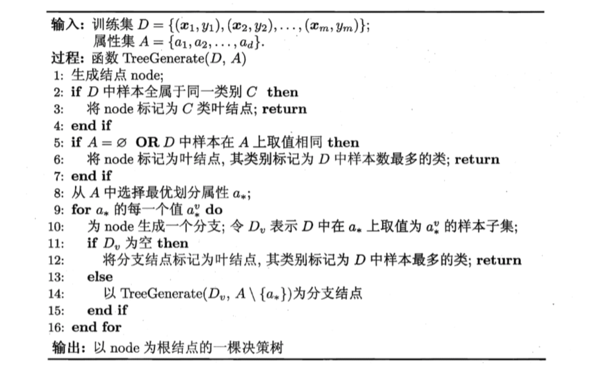

# 决策树

## 4.1 基本流程

1. 基本算法

   

* 递归返回情况
  * 当前结点包含的样本全属于同一类别，无需划分
  *  当前属性集为空，或是所有样本在所有属性上取值相同，无法划分
  * 当前结点包 含的样本集合为空，不能划分

## 4.2 划分选择

### 4.2.1 信息增益

1. 信息熵
   $$
   Ent(D) = -\sum_{k=1}^{|y|}p_k\log(p_k)\\
   0 \le Ent(D) \le |y|
   $$
   $Ent(D)$的值越小，则$D​$的纯度越高。

* 信息增益
  $$
  Gain(D,a) = Ent(D) - \sum_{v=1}^V \frac{|D^v|}{|D|}Ent(D^v)\\
  a^* = argmax_{a\in A} Gain(D,a)
  $$
  

### 4.2.2 增益率

1. ，信息增益准则对可取值数目较多的属性有所偏好，为减少这种 偏好可能带来的不利影响，著名的$C4.5$决策树算法不直接使 用信息增益，而是使用"增益率" (gain ratio) 来选择最优划分属性
   $$
   Gain\_ratio(D,a) = \frac{Gain(D,a)}{IV(a)}\\
   固有值：IV(a) = -\sum_{v=1}^V \frac{|D^v|}{|D|}\log(\frac{|D^v|}{|D|})
   $$

2. 增益率准则对可取值数目较少的属性有所偏好，$C4.5$算法并不是直接选择增益率最大的候选划分属性，而是使用了一个启发式: 先从候选划分属性中找出信息增益高于平均水平的属性，再从中选择增益率最高的.

### 4.2.3 基尼指数

1. CART决策树采用基尼指数划分属性
   $$
   Gini(D) = \sum_{k=1}^{|y|}\sum_{k'\not = k} p_kp_{k'} = 1-\sum_{k=1}^{|y|}p_k^2\\
   Gini_index(D,a)  =\sum_{v=1}^V\frac{D^v}{D}Gini(D^v)\\
   a_* = arg\min_{a\in A} Gini\_index(D,a)
   $$
   

## 4.3 减枝处理

### 4.3.1 概念

1. 过拟合问题：.在决策树学习中，为了尽可能正确分类训练样本，结点划分过程将不断重复，有时会造成决策树分支过多，这时就可能因训练样本学得"太好"了，以致于把训练集自身 的一些特点当作所有数据都具有的一般性质而导致过拟合.
2.  预剪枝是指在决策树生成过程中，对每个结点在划 分前先进行估计，若当前结点的划分不能带来决策树泛化性能提升，则停止划分并将当前结点标记为叶结点
3. 后剪枝则是先从训练集生成一棵完整的决策树， 然后自底向上地对非叶结点进行考察，若将该结点对应的子树替换为叶结点能带来决策树泛化性能提升，则将该子树替换为叶结点
4. 为了验证泛化性能，使用留出法预留一部分数据作为验证集，以进行性能评估。

### 4.3.2 预剪枝

1. 采用验证集计算正确率，如果正确率下降或者不变，则使用预剪枝策略剪去
2. 预剪枝不仅降低了过拟合的风险，还显著减少了决策树的训练时间开销和测试时间开销。
3. 缺点：有些分支的当前划分虽不能提升泛化性能，甚至可 能导致泛化性能暂时下降。但在其基础上进行的后续划分却有可能导致性能显著提高。预剪枝基于"贪心"本质禁止这些分支展开7 给预剪枝决策树带来了欠拟含的风险

### 4.3.4 后剪枝

1. 采用验证集计算正确率，如果减枝后正确率上升或者不变，则使用后剪枝策略剪去
2. 后剪枝决策树通常比预剪枝决策树保留 了更 多的分支. 一般情形下后剪枝决策树的欠拟合风险很小，泛化性能往往优于预剪枝决策树
3. 训练时间开销比未剪枝决策树和预剪枝决策树都要大得多.

## 4.4 连续与缺失值

### 4.4.1 连续属性

1. 由于连续属性的可取值数目不再有限，因此，不能直接根据连续属性的可取值来对结点进行划分.此时连续属性离散化技术可派上用场. 最简单的策 略是采用二分法(bi-partition)对连续属性进行处理
   $$
   连续属性取值：\{a^1, a^2,...,a^n\}\\
   设置划分点集合：T_a=\{\frac{a^i+a^{i+1}}{2}|1 \le i \le n - 1\}\\
   分别把\frac{a^i+a^{i+1}}{2}作为划分点\\
   Gain(D,a) = \max_{t\in T_a} Gain(D,a,t) \\
   =\max_{t\in T_a}Ent(D) - \sum_{\lambda\in \{+,-\}}\frac{D_t^{\lambda}}{D}Ent(D_t^\lambda)
   $$

2. 与离散属性不同，若当前结点划分属性为连续属性?该属性还 可作为其后代结点的划分属性.

### 4.4.2 缺失值处理

1. 仅使用无缺失值的样本来进行学习，显然是对数据信息极大的浪费，有必要考虑利用有缺失属性值的训练、样例来进行学习.
2. 需要解决两个问题

* 在属性值缺失的情况下进行划分属性的选择
  $$
  给定属性a,取值为\{a_1,a_2,...,a_V\}\\
  \overline D: D中在属性a中没有缺失值的子集\\
  \overline D^v: \overline D中在属性a上取值为a_v的子集\\
  \overline D_k:\overline D中属于第k(k=1,2,...,|y|)类的的样本子集\\
  \overline D = \cup_{k=1}^{|y|}\overline D_k = \cup_{v=1}^{V}\overline D^v\\
  为每个样本x赋予一个权重w_x,并定义:\\
  \rho = \frac{\sum_{x\in\overline D}w_x}{\sum_{x\in D}w_x}\\
  \overline \rho_k = \frac{\sum_{x\in\overline D_k}w_x}{\sum_{x\in D}w_x}\\
  \overline r_v = \frac{\sum_{x\in\overline D^v}w_x}{\sum_{x\in D}w_x}\\
  \rho:辰无缺失值样本所占的比例\\
  \overline \rho_k:表示无缺失值样本中第k类所占的比例\\
  \overline r_v：则表示无缺失值样本中在属性a上取值旷的样本所占的比例\\
  \sum_{k=1}^{|y|}\overline \rho_k = 1, \sum_{v=1}^{V}\overline r_v = 1\\
  Gain(D,a) = \rho\times Gain(\overline D, a)
  \\ = \rho\times (Ent(\overline D) - \sum_{v-1}^VEnt(\overline D^v))\\
  Ent(\overline D^v) = -\sum_{k=1}^{|y|} \overline p_k\log(\overline p_k)
  $$

* 给定划分属性，在划分属性值确实的情况下对样本进行划分

  * 如果样本x的在划分属性a的取值已知，则将x划入与其取值对应的子节点，且样本保持为$w_x$。 若样本x在划分属性a上的取 值未知，则将x同时划入所有子结点，且样本权值在与属性值$a^v$对应的子结点中调整为$\overline r_v\overline w_x$

## 4.5 多变量决策树

1. 若我们把每个属性视为坐标空间中的一个坐标轴，则 d 个属性描述的样本 就对应了 d 维空间中的一个数据点，对样本分类则意味着在这个坐标空间中寻 找不同类样本之间的分类边界.决策树所形成的分类边界有一个明显的特点: 轴平行(axis-parallel)，即它的分类边界由若干个与坐标轴平行的分段组成。在学习任务的真实分类边界比较复杂时，必须使用很多段划分才能获得较好的近似。
2. 实现斜划分的多变量决策树为例，在此类决 策树中，非叶结点不再是仅对某个属性，而是对属性的线性组合进行测试;换言 之，每个非叶结点是一个形如$\sum_{i=1}^d w_ia_i = 1$的线性分类器，其中$w_i$是属性向 的权重，$w_i$和$t$可在该结点所含的样本集和属性集上学得