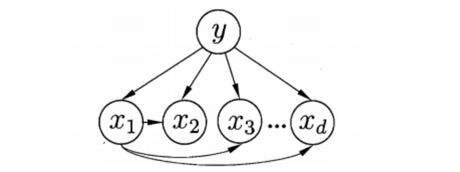
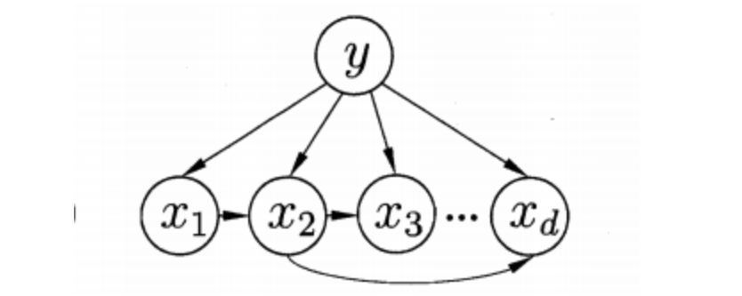
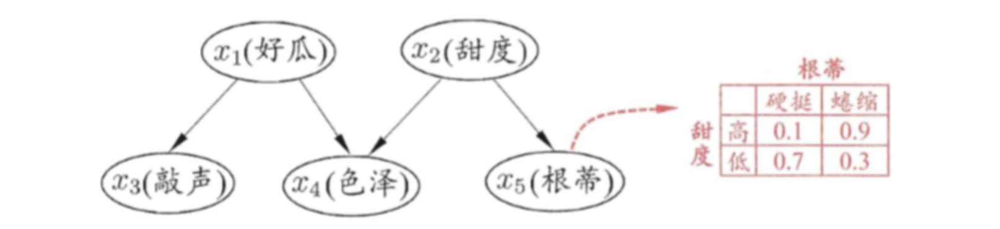
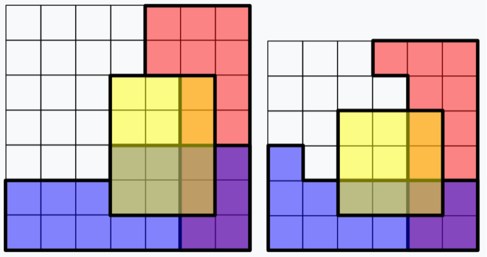
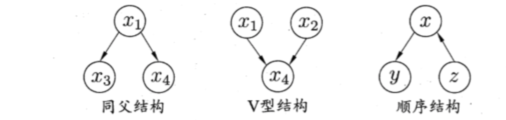
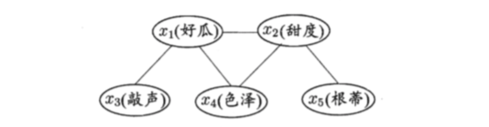
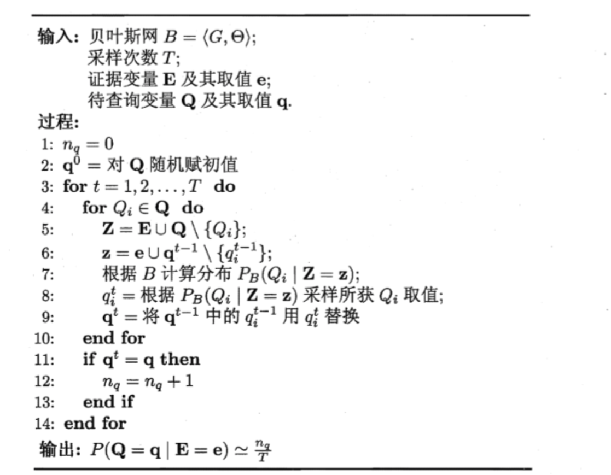

# 贝叶斯分类器

## 1 贝叶斯决策论

1. 概念：贝叶斯决策论(Bayesian decision theory) 是概率框架下实施决策的基本方
   法。对分类任务来说?在所有相关概率都己知的理想情形 ，贝叶斯决策论考虑如何基于这些概率和误判损失来选择最优的类别标记.

2. 样本$x$上的条件风险：假设有$N$种可能的$label$, 也就是$Y=\{c_1,c_2,..,c_N\}$, $\lambda_{ij}$是将一个真实标记为$c_j$的样本误分类为$c_i$产生的损失，基于后验概率可以获得将$x$分类为$c_i$产生的期望损失，即在样本$x$上的条件风险
   $$
   R(c_i|x) = \sum_{j=1}^N\lambda_{ij}P(c_j|x)
   $$

3. 判定准则$h:X\rightarrow Y$最小化总体风险
   $$
   R(h) = E_x[R(h(x)|x)]\\
   $$
   对于每个样本$x$，若$h$能最小化风险$R(h(x)|x)$, 则总体风险$R(h)$也将最小化，这届产生了贝叶斯判定准则：
   $$
   h^*(x)=\arg \min_{c\in Y} R(c|x)
   $$
   $h^*(x)​$称为贝叶斯最优分类器，与之对应的总体风险$R^(h^*)​$称为贝叶斯风险，$1-R^(h^*)​$反映了分类器所能达到的最好性能，也就是通过机器学习所能产生的模型精度的理论上限。

4. 最小化分类错误率

* 若目标是最小化分类错误率，则误判损失$\lambda_{ij}$写为:
  $$
  \lambda_{ij} = \left\{
  \begin{matrix}
  0, &i == j\\
  1, &otherwise
  \end{matrix}
      
  \right.
  $$

* 条件风险和贝叶斯判定准则：
  $$
  R(c|x) = 1-P(c|x)\\
  h^*(x) = \arg\max_{c\in Y} P(c|x)
  $$
  可以看出，对于每个样本，选择使得后验概率$p(c|x)$最大的类别标记

5. 后验概率

* 欲使用贝叶斯判定准则来最小化决策风险，首先要获得后验概$P(c |x)$. 然而，在现实任务中这通常难以直接获得.从这个角度来看机器学习所要实现的是基于有限的训练样本集尽可能准确地估计出后验概率$P(c|x)$。 

* 估计后验概率的两种策略

  * 对于给定的$x$, 直接建模$P(c|x)$来预测$P(c|x)$, 这样的到的是判别式模型

    * 决策树，神经网络，支持向量机

  * 也可以先对联合分布$P(x,c)$建模，然后由此获得$P(c|x)​$, 这样得到的是生成式模型

    * 根据条件概率，$P(c|x) = \frac{P(x,c)}{P(x)}​$,基于贝叶斯定理：
      $$
      P(c|x) = \frac{P(c)P(x|c)}{P(x)}
      $$
      其中$P(c)$是先验概率，$P(x|c)$是样本$x$相对于标记$c$的类条件概率，或则称为似然，$P(x)$称为归一化的证据因子，对于给定样本$x$, $P(x)$与类标记无关，因此$P(c|x)$就转化为如何训练数据$D$来估计先验概率$P(c)$和$P(x|c)$

    * $P(c)$表达了样本主 问中各类样本所占的比例。根据大数定律，当训练集包含充足的独立同分布样本时，$P(c)$可通过各类样本出现的频率来进行估计。

    * 对于$P(x|c)$, 他涉及了$x$所有属性的联合概率，因此他的样本空间过大，直接使用频率来估计$P(x|c)$ 显然不可行

## 2 极大似然估计

1. 估计类条件概率的一种常用策略是先假定其具有某种确定的概率分布形式，再基于训练样本对概率分布的参数进行估计。记关于类别的类条件概率为$P(x |c), $ 假设$P(x|c)$ 具有确定的形式并且被参数向量$\theta_c$唯一确定，记$P(x|c)$记为$P(x|\theta_c)$
2. 概率模型的训练过程就是参数估计(parameter estimation) 过程.对于参数估计，统计学界的两个学派分别提供了不同的解决方案:

* 频率主义学派(Frequentist) 认为参数虽然未知，但却是客观存在的固定值，因此，可通过优化似然函数等准则来确定参数值

  * 记$D_c$表示$D$中第$c$类样本组成的集合，假设这些样本是独立同分布，则$\theta_c$ 对于$D_c$的似然为
    $$
    P(D_c|\theta_c) = \prod_{x\in D_c} p(x|\theta_c)
    $$
    为了避免连乘法造成下溢出，则采用对数似然
    $$
    LL(\theta_c) = \log(P(D_c|\theta_c)) = \sum_{x\in D_c} \log(P(x|\theta_c))\\
    \hat \theta_c = \arg\max_{\theta_c} LL(\theta_c)
    $$

  * 举例：假设在连续属性下，假设概率密度函数$P(x|c) \sim N(\mu_c, \sigma_c^2)$, 则$\mu_c$和$\sigma_c^2$的计大似然估计为：
    $$
    \mu_c = \frac{1}{|D_c|} \sum_{x\in D_c} x\\
    \sigma_c^2 = \frac{1}{|D_c|} \sum_{x\in D_c} (x-\hat \mu_c)(x-\hat\mu_c)^T
    $$
    这显然是一个符合直觉的结果.在离散属性情形下也可通过类似的方式估计类条件概率.

  * 虽然简单，但是估计结果的准确性严重依赖于所假设的概率分布形式是否符合潜在的真实数据分布.

* 贝叶斯学派(Bayesian) 则认为参数是未观察到的随机变量其本身也可有分布，因此，可假定参数服从一个先验分布，然后基于观测到的数据来计算参数的后验分布

  > 知识补充：
  > #### 1 最大后验估计
  >
  > 1. 最大后验估计公式：
  > $$
  > arg\max_{\theta}\ P(\theta|X)  
  > \\ = arg\max_{\theta}\ \frac{P(X|\theta)P(\theta)}{P(X)} 
  > \\ = arg\max_{\theta}\ P(X|\theta)P(\theta)
  > \\ = arg\max_{\theta}\ (\prod_i P(x_i|\theta))P(\theta)
  > \\ = arg\max_{\theta}\ \log(\prod_i P(x_i|\theta))P(\theta)
  > \\ = arg\max_{\theta}\ \sum_i\log(P(x_i|\theta))+\log P(\theta)
  > $$
  >
  > 2. 大后验估计不只是关注当前的样本的情况，还关注已经发生过的先验知识。样本很少的时候我们的观测结果很可能出现偏差，此时先验知识会把估计的结果“拉”向先验。
  >
  > 3. 对于二项分布，可以采用$Beta(\alpha, \beta)$作为参数的先验估计
  > $$
  > x\sim Beta(\alpha,\beta)\\
  > f(x;\alpha,\beta) = \frac{1}{\Beta(\alpha,\beta)} x^{\alpha - 1}(1-x)^{\beta - 1}
  > $$
  >
  > #### 2 贝叶斯估计
  >
  > 1. 特点：
  >
  > * 贝叶斯估计是最大后验估计的进一步扩展，贝叶斯估计同样假定$\theta $是一个随机变量，但贝叶斯估计并不是直接估计出的$ \theta $某个特定值，而是估计$\theta  $的分布
  >
  > * 由于是计算概率分布，此时分母的$P(X)$就不能忽略了
  >
  > 2. 公式
  > $$
  > P(\theta|X) = \frac{P(X|\theta)P(\theta)}{\int_{\Theta}P(X|\theta)P(\theta) d\theta}
  > $$
  >
  > 3. 共轭先验
  >
  > * 在贝叶斯统计中，如果后验分布与先验分布属于同类，则先验分布与后验分布被称为共轭分布，而先验分布被称为似然函数的共轭先验。
  >
  > * 对于一个特定的似然函数，如果我们选定一个先验概率分布，得到的后验概率分布和先验概率分布相同，则似然函数分布和先验概率分布就组成了一对共轭分布。此时训练出来的是后验概率分布
  >   * 若$P(X| \theta)$是二项分布，$P(\theta)$是$Beta$分布，则$P(\theta|X )$也是$Beta$分布, 所以$Beta$分布是二项分布的共轭分布
  >   * 若$P(X| \theta)$是高斯分布，$P(\theta)$是高斯分布，则$P(\theta|X )$也是高斯分布, 所以高斯分布是高斯分布的共轭分布
  >   * 若$P(X| \theta)$为多项式分布，$P(\theta) $为$Dirichlet$分布($Beta$分布的一个扩展)，则$P(\theta|X )$也为$Dirichlet$分布，所以$Dirichlet $分布是多项式分布的共轭分布
  >   * 指数分布参数的共轭先验是$Gamma$分布
  >   * 泊松分布的共轭先验是$Gamma$分布
  >
  > 4. 计算过程
  >
  > * 以抛硬币为例，假设有一枚硬币，现在要估计其正面朝上的概率$\theta $。为了对$\theta$ 进行估计，进行了$10$次独立同分布实验, 其中正面朝上的次数为6次，反面朝上的次数为4次，结果为$(1,0,1,1,0,0,0,1,1,1)$
  >
  > * 可以知道，$Beta$分布是二项分布的共轭分布，所以设$P(\theta) \sim Beta(\alpha, \beta)$
  > $$
  > P(\theta) = f(\theta;\alpha, \beta) = \frac{1}{\Beta(\alpha, \beta)}\theta^{\alpha - 1}(1 - \theta)^{\beta - 1}\\
  > P(\theta|X) = \frac{P(X|\theta)P(\theta)}{\int_{\Theta}P(X|\theta)P(\theta) d\theta}
  > \\ = \frac{\theta^6(1-\theta)^4\theta^{\alpha - 1}(1-\theta)^{\beta - 1}}{\Beta(\alpha, \beta)} = \frac{1}{\Beta(\alpha, \beta)}\theta^{\alpha + 6 - 1}(1 - \theta)^{\beta + 4 - 1}\\
  > $$
  > 可以得到，$P(\theta|X) \sim Beta(\alpha + 6, \beta + 4)$
  >
  > * 可以通过分布，分析$\theta $的均值和方差
  >
  > * 而是用来估计新测量数据出现的概率，对于新出现的数据$x^*$
  >
  > $$
  > P(x^*|X) = \int_{\Theta} P(x^*|\theta)P(\theta|X) = \int_{\Theta} P(x^*|\theta)\frac{P(X|\theta)P(\theta)}{\int_{\Theta}P(X|\theta)P(\theta) d\theta}
  > $$
  >

  * 这里假定参数符合一个先验分布，然后进行估计

## 3 朴素贝叶斯分类器

1. 基于贝叶斯公式估计后验概率的困难

* 条件概率$P(x | c)$是所有属性上的联合概率，难以从有限的训练样本直接估计而得。为避开这个障碍，朴素贝叶斯分类器(naive Bayes classifier) 采用了"属性条件独立性假设" (attribute conditional independence assumption):对已知类别, 假设所有属性相互独立。换言之，假设每个属性独立地对分类结果发生影响。

2. 朴素贝叶斯分类器表达式

* 根据属性的独立性假设，$P(c|x)$可以重写为：
  $$
  P(c|x) = \frac{P(c)P(x|c)}{P(x)} = \frac{P(c)}{P(x)}\prod_{i=1}^dP(x_i|c)
  $$
  其中$d$为属性数目，$x_i$为$x$在第$i$个属性上的取值

* 对所有类别来说$P(x)​$相同，因此基于式的贝叶斯判定准则有
  $$
  h_{nb}(x) = \arg\max_{c\in Y} P(c)\prod_{i=1}^dP(x_i|c)
  $$

* 朴素贝叶斯分类器的训练过程就是基于训练集来估计类先验概率$P(c)​$并为每个属性估计条件概率$P(x_i|c)​$.

  * 对于离散属性：

  $$
  P(c) = \frac{|D_c|}{|D|}\\
  P(x_i|c) = \frac{|D_{c,x_i}|}{|D_c|}
  $$

  * 对于连续属性：

    计算出第$c$类样本在第$i$个属性的样本的均值$\mu_{c,i}$和方差$\sigma^2_{c,i}$,则有

  $$
  P(x_i|c) = \frac{1}{\sqrt{2\pi \sigma_{c,i}}}\exp(-\frac{(x_i - \mu_{c,i})^2}{2\sigma_{c,i}^2})
  $$

  

* 拉普拉斯修正
  * 如果出现$D_{c,x_i}$为0，会导致最后的结果$P(c|x)$为0， 从而不管其他的$D_{c, x_j}$多大，其他属性上明显是$c$，分类的结$P(c|x)$都是0

  * 了避免其他属性携带的信息被训练集中未出现的属性值抹去，在估计概率值时通常要进行"平滑" (smoothing)。常用"拉普拉斯修正" (Laplacian correctio 具体来说，令$N ​$表示训练集$D​$中可能的类别数, $N_i ​$表示第$i​$个属性可能的取值数
    $$
    \hat P(c) = \frac{|D_c| + 1}{|D|+N}\\
    P(x_i|c) = \frac{|D_{c,x_i}| + 1}{|D_c| + N_i}
    $$

  * 拉普拉斯修正避免了因训练集样本不充分而导致概率估值为零的问题，并且在训练集变大时，修正过程所引入的先验(prior) 的影响也会逐渐变得可忽略使得估值渐趋向于实际概率值

  * 拉普拉斯修正实质上假设了属性值与类别均匀分布，这是在朴素贝叶斯学
    刁过程中额外引入的关于数据的先验

  

## 4 半朴素贝叶斯分类器

1. 朴素贝叶斯分类器的局限

   为了降低贝叶斯公式中估计后验概率$P(c|x)$的困难，朴素贝叶斯分类器采用了属性条件独立性假设，但在现实任务中这个假设往往很难成立

2. 半朴素贝叶斯分类器的基本想法是适当考虑一部分属性问的相互依赖信息。从而既不需进行完全联合概率计算，又不至于彻底忽略了比较强的属性依赖关系

3. 独依赖估计(One-Dependent Estimator ，简称 ODE)

* 独依赖估计是半朴素贝叶斯分类器最常用的一种策略。"独依赖"就是假设每个属性在类别之外最多仅依赖于一个其他属性
  $$
  P(c|x) \propto P(c)\prod_{i=1}^d P(x_i|c, pa_i)
  $$
  其中$pa_i$为属性$x_i$所依赖的属性，称为$x_i$的父属性。此时，如果每个属性$x_i$已知，则就可以估计概率$p(x_i|c, pa_i)​$, 问题的关键在如何确定每个属性的父属性

  * 最直接的做法是假设所有属性都依赖于同一个属性，称为"超父"(superm parent) ，然后通过交叉验证等模型选择方法来确定超父属性，由此形成了SPODE (Super-Parent ODE)方法.

    

  * TAN (Tree Augmented naive Bayes) 是在最大带权生成树(maximinum weighted spann tree)算法的基础上，通过以下爱步骤将依赖关系简化为如下图的树形结构

    

    * 计算两个属性之间的条件互信息
      $$
      I(x_i, x_j|y) = \sum_{x_i, x_j\in Y} P(x_i,x_j|c)\log(\frac{P(x_i,x_j|c)}{p(x_i|c)p(x_j|c)})
      $$

    * 以属性为结点构建完全图, 任意两个结点之间边的权重设为$I(x_i, x_j|y)$

    * 构建此完全图的最大带权生成树，挑选根变量将边置为有向

    * 加入类别结点$y​$增加从$y​$到每个属性的有向边

    * $$
      除了直接后裔，其他都是条件独立的，具体见后文\\
      P(c|x) \propto P(c) P(x_1|c)P(x_2|c,x_1)P(x_3|c,x_2)P(x_4|c,x_2)\\
       = P(c) P(x_1|c)P(x_2|c,x_1)P(x_3, x_4|c,x_2)\\
       = P(c) P(x_1, x_2|c)P(x_3, x_4|c,x_2)\\
       = P(c) P(x_2|c)P(x_1|c, x_2)P(x_3, x_4|c,x_2)\\
       = P(c) P(x_2|c)P(x_1, x_3, x_4|c,x_2)\\
       = P(c) P(x_1, x_2, x_3, x_4|c)
      $$

      

  * AODE (Averaged One-Dependent Estimator) 

    * AODE是一种集成学习基于集成学习机制、更为强大的独依赖分类器. 与SPODE 通过模型选择确定超父属性不同， AODE尝试将每个属性作为超父来构SPODE, 然后将有足够训练数据支撑是SPODE集成起来作为最终结果

    * $$
      P(c|x)= \sum_{i=1，|D_{x_i}\ge m'|}^d P(c,x_i)\prod_{j=1}^dP(x_j|c, x_i)
      $$

    * $D_{x_i}$是在第$i$个属性上取值为$x_i$的集合，$m'$为阈值常数

    * $$
      \hat P(c,x_i) = \frac{|D_{c,x_i}| + 1}{|D| + N_i}\\
      \hat P(x_j|c, x_i) = \frac{|D_{c,x_i,x_j}| + 1}{|D_{c,x_i}| + N_j}
      $$

      $N_i$是第$i$个属性可能的取值数，$D_{c,x_i}$是类别$c$在第$i$g个属性上为$x_i$的样本集合，$D_{c,x_i, x_j}$是类别$c$在第$i$个属性上为$x_i$, 在第$j$个属性上为$x_j$的样本集合

    * AODE 无需模型选择，既能通过预计算节省预测时间?也能采取懒惰学习方 式在预测时再进行计数，井且易于实现增量学习.

4. 既然将属性条件独立性假设放松为独依赖假设可能获得泛化性能的提升， 那么，能否通过考虑、属性间的高阶依赖来进一步提升泛化性能呢

* 将式(7.23)中的属性$pa_i$向替换为包含$k$个属性的集合$pa$, 从而将$ODE$拓展为$kDE$。 需注意的是，随着$k$的增加，准确估计概率$P(x_i| c, pa_i)$ 所需的训练样本数量将以指数级增加。因此，若训练数据非常充分, 泛化性能有可能提升, 但在有限样本条件下则又陷入估计高阶联合概率的泥沼

## 5 贝叶斯网

1. 概念：贝叶斯网(Bayesian network)亦称"信念网" (belief network)，它借助有向无环图(Directed Acyclic Graph，简称 DAG)来刻画属性之间的依赖关系，并使用条件概率表(Conditional Probability Table， 简称 CPT)来描述属性的联合概率分布.

2. 组成：一个贝叶斯网($B$)由结构$G$和参数$\Theta$两部分构成，即$B=<G,\Theta>$, 网络结构$G$是一个有向无环图，没个节点对应于一个属性。若两个属性由直接依赖关系，则他们由一条边连接起来。参数$\Theta $定量描述这种依赖关系，假设属性$x_i $在$G$中父结点集合为$\pi_i$, 则$\Theta $包含了每个属性的条件概率表$\theta_{x_i|\pi_i} = P_B(x_i|\pi_i)​$。

   

3. 结构：给定父结点集，贝叶斯网假设每个属性与它的非后裔属性独立。于是$B=<G,\Theta>$将属性$x_1, x_2,\dots , x_d$的联合分布定义为
   $$
   P_B(x_1,x_2,...,x_d)=\prod_{i=1}^d P_B(x_i| \pi_i) = \prod_{i=1}^d \theta_{x_i|\pi_i}联合概率分布定义为：
   $$
   以上图为例，联合概率分布定义为：
   $$
   P(x_1,x_2,x_3,x_4, x_5) = P(x_1)P(x_2)P(x_3|x_1)P(x_4|x_1,x_2)P(x_5| x_2)\\
   $$
   在$x_1$给定时，$x_3$和$x_4$独立。当$x_2$给定时，$x_4$和$x_5$独立。记为$x_3 \perp x_4|x_2$, $x_5 \perp x_4|x_2$。

   > 条件独立性：如果$P(X,Y|Z) = P(X|Z)P(Y|Z)​$, 则称$X,Y​$对于给定事件$Z​$是条件独立的。
   >
   > * 或者等价的写作$P(X|Y,Z) = P(X|Z)​$
   >   * $P(X|Y,Z) = \frac{P(X,Y|Z)}{P(Y|Z)} = P(X|Z)​$ 
   >
   > * 事件 Z 的发生，使本来可能不独立的事件A和事件B变得独立起来；
   > * 事件Z 的出现或发生，解开了X 和 Y 的依赖关系。
   > * 举例：
   >   * 两个说明条件独立的例子。每个小方格都表示一种等概率的可能结果。事件*R*、*B*、*Y*分别用红色、蓝色、黄色阴影部分表示。事件*R*和*B*的重叠部分用紫色表示。这些事件发生的概率等于相应阴影部分面积和图形总面积的比值。在这两个例子中，事件*R*和*B*在给定*Y*时都是条件独立的，这是因为$P(R,B|Y) = P(R|Y)P(B|Y)$。 事件*R*和*B*在给定*Y*不发生时不是条件独立的$P(R,B|\overline Y) \not= P(R|\overline Y)P(B|\overline Y)$

* 贝叶斯网中三个变量之间的典型依赖关系

  * 

  * 同父结构中，给定$x_1$的取值，$x_3$和$x_4$条件独立。

  * 在V型结构中，给定$x_4$的取值，$x_1$和$x_2$必不独立。

    * $x_4$未知时，$x_1$和$x_2$相互独立, 称为边际独立性

      * $$
        P(x_1,x_2) = \sum_{x_4}P(x_1,x_2,x_4)
        \\ = \sum_{x_4} P(x_4,x_2|x_1)P(x_1)
        \\ = \sum_{x_4} P(x_4|x_1,x_2)P(x_1)P(x_2)
        \\ = P(x_1)P(x_2)?
        $$

  * 在顺序结构中，给定$x$取值，$y$和$z$条件独立。

* 为了分析有向图中变量间的条件独立性，可使用"有向分离" 

  * 过程
    * 找出有向图中的所有 V 型结构，在 V 型结构的两个父结点之间加上一条无向边
    * 将所有有向边改为无向边
  * 由此产生的无向图称为"道德图" (moral graph)，令父结点相连的过程称为 "道德化" (moralization)
    * 基于道德图能直观、迅速地找到变量间的条件独立性。假设道德图有遍历$x, y$, 和变量集合$z = \{z_i\}$。若从道德图中将变量集合$z$去除后, $x$ 和$y$分属两个连通分支，则称变量$x, y$ 被$z$有向分离 
    * 
    * 可以看到$x_3 \perp x_2|x_1$, $x_5,x_1|x_2$。

4. 学习

* 网络结构己知，即属性间的依赖关系己知，则贝叶斯网的学习过程相对 简单，只需通过对训练样本"计数"，估计出每个结点的条件概率表即可

* 在 现实应用中我们往往并不知晓网络结构于是，贝叶斯网学习的首要任务就是 根据训练数据集来找出结构最"恰当"的贝叶斯网

  * 评分搜索：我们先定义一个评分函数(score function)，以此来评估贝叶斯网与训练数据的契合程度，然后基于这个评分函数来寻找结构最优 的贝叶斯网

  * 常用评分函数通常基于信息论准则，此类准则将学习问题看作一个数据压缩任务，学习的目标是找到一个能以最短编码长度描述训练数据的模型，此时 编码的长度包括了描述模型自身所需的字节长度和使用该模型描述数据所需 的字节长度。对贝叶斯网学习而言，模型就是一个贝叶斯网，同时，每个贝叶斯网描述了一个在训练数据上的概率分布，自有一套编码机制能使那些经常出现的样本有更短的编码。于是我们应选择那个综合编码长度(包括描述网络和编码数据)最短的贝叶斯网这就是"最小描述长度" (Minimal Description Length，简称 MDL)准则

  * 给定训练集$D = \{x_1,x_2,...,x_m\}$, 贝叶斯网$B=<G, \Theta>$在$D$上的评分函数可以写为
    $$
    s(B|D) = f(\theta)|B| - LL(B|D)\\
    LL(B|D) = \sum_{i=1}^m\log(P_B(x_i))
    $$
    其中$f(\theta)$是每个参数$\theta$所需要字节数，$|B|$是参数个数，$LL(B|D)$是贝叶斯网的对数似然。学习任务就转化为一个优化任务，即寻找一个贝叶斯网 B 使评分函数$s(B|D)$最小

    * 若$f(\theta) = 1$,即每个参数用 1 字节描述，则得到 AIC 评分函数

    * 若$f(\theta) = \frac{1}{2}\log m$，即每个参数用$f(\theta) = \frac{1}{2}\log m$字节描述，则得到 BIC 评分函数

    * 若$f(\theta) =0 $, 则退化为极大似然估计

    * 若网络结构固定，则第一项为常数，此时变为为$\Theta$的极大似然估计，此时取
      $$
      \theta_{x_i|\pi_i} = \hat P(x_i|\pi_i)
      $$

    * 由此可知，只需要对网络结构进行搜索，而$\Theta $的取值可以很方便计算得到。 不幸的是，从所有可能的网络结构空间搜索最优贝叶斯网结构是一个$NP$难问题。有两种常用的策略能在有限时间内求得近似解

      * 第一种是贪心法，例如从某个网络结构出发，每次调整一条边(增加、删除、调整方向)，直到评分函数值不再降低
      * 第二种是给网络结构施加约束来削减搜索空间，比如限定为树形结构(半朴素贝叶斯分类器可以看作贝叶斯网)

5. 推断

* 最理想的是直接根据贝叶斯网定义的联合概率分布来精确计算后验概率， 不幸的是，这样的"精确推断"己被证明是 NP 难。当网络结点较多、连接稠密时?难以进行精确推断，此时需借助"近似推断"。

*  使用吉布斯采样

  * $Q = \{Q_1, Q_2, ...,Q_n\}$表示待查询变量，$E=\{E_1,E_2,...,E_k\}$表示证据变量，其中$e = \{e_1, e_2,...,e_n\}$是证据变量的一组取值，$q = \{q_1, q_2,...,q_n\}$是待查询变量的一组取值。以西瓜问题为例，待查询变 量为$Q= \{好瓜，甜度\}$，证据变量为$E= \{色泽，敲声，根蒂\}$, 且已知其取值为$e=\{青绿，浊响，蜷缩\}$，查询的目标值是 $q=\{是，高\}$

  * 目的是为了计算后验概率$P(Q = q| E = e)$, 即这是好瓜且甜度高的 概率有多大

  * 算法流程：

    * 随机产生一个和证据$E=e​$一致的样本$q_0​$作为初始点

    * 后每步从当前样本出发产生下一个样本

      * 在第$t$次采样中，算法先假设$q_t = q_{t-1}$, 然后对非证据变量逐个进行采样改变其取值，采样概率根据贝叶斯网$B$和其他变量的当前取值(即 $Z = z$)计算获得。假定经过$T$次采样得到的与$q$一致的样本共有 $n_q​$个，则可近似估算出后验概率
        $$
        P(Q=q|E = e) = \frac{n_q}{T}
        $$

      * 

## 6 EM算法

### 6.1 预备知识

1. 极大似然估计
2. Jensen不等式

- 如果$f$是凸函数，$X$是随机变量，那么
  $$
  E(f(X))\ge f(E[X])
  $$
  证明：
  $$
  E(f(X))=\int f(x)p(x)dx\ge f(\int xp(x)dx)=f(E(x))[琴生不等式]
  $$
  凹函数则反过来
  $$
  E(f(X))\le f(E[X])
  $$

### 6.2 EM算法详述

#### 6.2.1 问题描述

1. 我们目前有100个男生和100个女生的身高，但是我们不知道这200个数据中哪个是男生的身高，哪个是女生的身高，即抽取得到的每个样本都不知道是从哪个分布中抽取的。这个时候，对于每个样本，就有两个未知量需要估计：
   - 这个身高数据是来自于男生数据集合还是来自于女生？
   - 男生、女生身高数据集的正态分布的参数分别是多少？
2. 基本步骤：

- 初始化参数：先初始化男生身高的正态分布的参数
- 计算每一个人更可能属于男生分布或者女生分布
- 通过分为男生的n个人来重新估计男生身高分布的参数（最大似然估计），女生分布也按照相同的方式估计出来，更新分布。
- 重复上面三步，直到参数不发生变换

#### 6.2.2 EM算法推导

1. 对于$n$个样本观察数据$x=(x_1, x_2,...,x_n)$, 找出样本的模型参数$\theta$, 极大化模型分布的对数似然函数：
   $$
   \hat \theta = argmax\sum_{i=1}^n \log{p(x_i;\theta)}
   $$
   如果我们得到的观察数据有未观察到的隐含数据$z=(z_1,z_2,...,z_n)$ ，即上文中每个样本属于哪个分布是未知的。
   $$
   \hat \theta = argmax\sum_{i=1}^n \log{p(x_i;\theta)}=argmax\sum_{i=1}^n \log{\sum_{z_i}p(x_i,z_i;\theta)}
   $$
   引入新的分布$Q_i(z_i)$, 表示$z_i$的分布概率
   $$
   \sum_{i=1}^n \log{\sum_{z_i}p(x_i,z_i;\theta)}=\sum_{i=1}^n \log{\sum_{z_i}Q_i(z_i)\frac{p(x_i,z_i;\theta)}{Q_i(z_i)}}
   \\ \ge \sum_{i=1}^n\sum_{z_i}Q_i(z_i)\log{\frac{p(x_i,z_i;\theta)}{Q_i(z_i)}}
   $$
   这里可以看作对$l(\theta)$求了下界。如果$\theta$以及给定，则$l(\theta)$的值就决定于$Q_i(z_i)，p(x_i,z_i)$。 我们可以通过调整这两个概率使下界不断上升，以逼近$l(\theta)​$的真实值。

   根据Jensen不等式，要想让等式成立，需要让随机变量变成常数值
   $$
   \frac{p(x_i,z_i;\theta)}{Q_i(z_i)} = c\\
   \sum_{z}Q_i(z_i) = 1 \rightarrow \sum_{z}p(x_i,z_i;\theta) = c\\
   \rightarrow Q_i(z_i) = \frac{p(x_i,z_i;\theta)}{p(x_i;\theta)} 
   =p(z_i|x_i;\theta)
   $$
   也就是固定参数后，$Q_i(z_i)$就是后验概率，这就是E步。

   则需要极大化
   $$
   argmax\sum_{i=1}^n\sum_{z_i}Q_i(z_i)\log{\frac{p(x_i,z_i;\theta)}{Q_i(z_i)}} = \\ \sum_{i=1}^n\sum_{z_i}Q_i(z_i)\log{p(x_i,z_i;\theta)} -Q_i(z_i)\log{Q_i(z_i)}
   \\ \rightarrow argmax \sum_{i=1}^n\sum_{z_i}Q_i(z_i)\log{p(x_i,z_i;\theta)}
   $$
   这就是M步。

### 6.3 算法流程

1. 输入：观察数据$x = (x_1,x_2,...,x_n)$, 联合分布$p(x,z;\theta)$, 条件分布$p(z|x;\theta)$, 最大迭代次数$J$
2. 流程：

- 随机初始化模型参数θ的初值$\theta_0$

- $j=1,2,...,J $开始$EM$算法迭代

  - E步：计算联合分布的条件概率期望
    $$
    Q_i(z_i)=p(z_i|x_i,\theta_j)\\
    l(\theta, \theta_j) = \sum_{i=1}^n\sum_{z_i}Q_i(z_i)\log\frac{p(x_i,z_i;\theta)}{Q_i(z_i)}
    $$

  - M步：极大化$l(\theta, \theta_j)$, 得到$\theta_{j+1}=argmax_\theta l(\theta,\theta_j)$， 如果已经收敛，则算法结束。

3. 输出参数

### 6.4 EM算法分析

1. 隐变量：我们一直假设训练样本所有属性变量的值都已被观测到， 即训练样本是"完整"的.但在现实应用中往往会遇到"不完整"的训练样 本，例如由于西瓜的根蒂己脱落，无法看出是"蜷缩"还是"硬挺"，则训练样 本的"根蒂"属性变量值未知.在这种存在"未观测"变量的情形下，仍能对模型参数进行估计

* 未观测变量的学名是"隐变量" (latent variable). 令$X​$表示己观测变量集， $Z​$表示隐变量集，$\Theta  ​$表示模型参数。若欲对$ \Theta  ​$做极大似然估计，则应最大化对数似然
  $$
  LL(\Theta| X,Z) = \ln P(X,Z|\Theta)
  $$
  然而由于$Z​$是隐变量，上式无法直接求解.此时我们可通过对$Z​$计算期望, 最大化己观测数据的对数"边际似然"
  $$
  LL(\Theta| X) = \ln P(X|\Theta) = \ln \sum_Z P(X,Z|\Theta)
  $$

2. EM算法

* EM (Expectation-Maximization) 算法是常用的估 计参数隐变量的利器，它是一种迭代式的方法：其基本想法是:若参数$ \Theta$己知， 则可根据训练数据推断出最优隐变量$Z$的值 (E 步);反之，若$Z$的值已知，则可方便地对参数$\Theta$做极大似然估计 (M 步).

* 步骤：

  * 以初始值$\Theta_0$为起点，对式$LL(\Theta| X,Z) = \ln P(X,Z|\Theta)​$，可迭代执行以下步骤直至收敛:
    * E步：基于$ \Theta $推断隐变量$Z$的期望，记为$Z^t$
    * M步：基于已观测变量$X$和$Z^t$ 对参数$ \Theta$做极大似然估计，记为$\Theta^{t+1}$

* 若不是估计$Z$的期望，而是基于$\Theta^t$计算$Z$概率分布$P(Z|X, \Theta^t)$, 则步骤应该是

  * 以初始值$\Theta_0​$为起点，对式$LL(\Theta| X,Z) = \ln P(X,Z|\Theta)​$，可迭代执行以下步骤直至收敛:

    * E步：以当前参数$\Theta^t $推断隐变量分布$P(Z|X, \Theta^t)$, 并且计算$LL(\Theta| X,Z) = \ln P(X,Z|\Theta)$关于$Z​$的期望
      $$
      Q(\Theta|\Theta^t) = E_{Z|X,\Theta^t} LL(\Theta |X, Z)
      $$

    * M 步：寻找参数最大化期望似然
      $$
      \Theta^{t+1} = \arg\max_{\Theta} Q(\Theta|\Theta^t)
      $$
      

* 事实上，隐变量估计问题也可通过梯度下降等优化算法求解，但由于求和的项数将随着隐变量的数目以指数级上升，会给梯度计算带来麻烦; EM 算法可看作用坐标下降法来最大化对数似然下界 的过程坐标下降法参见法则可看作一种非梯度优化方法