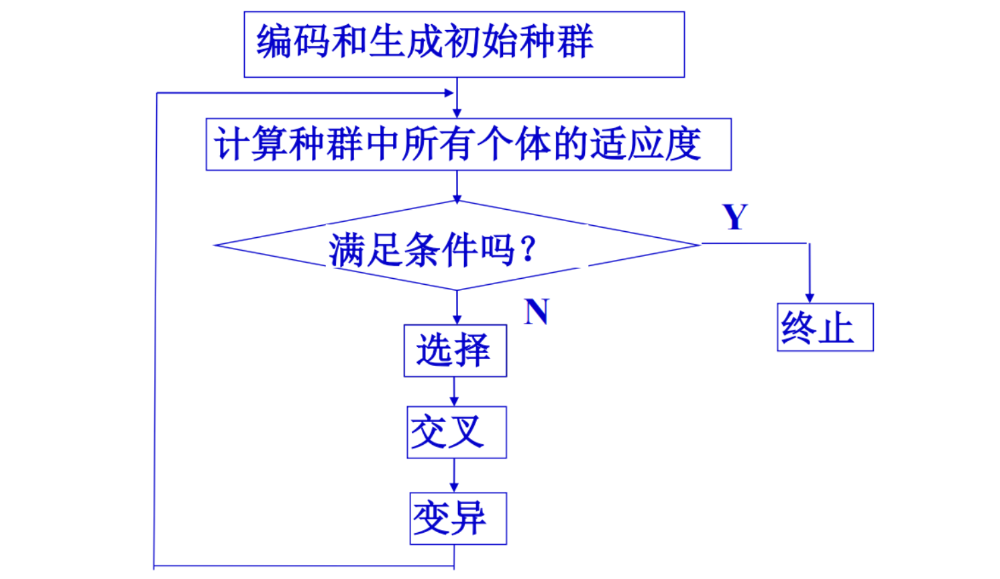
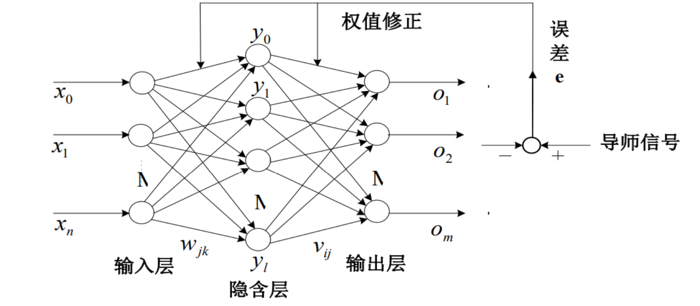

# 演化学习

## 1 基础知识

1. 定义：演化学习基于演化算法提供的优化工具设计机器学习算法
2. 演化算法：是一个“算法簇”，其灵感都来自于大自然的生物进化。演化算法有很多的版本，比如，有不同的遗传基因表达方式，不同的交叉和变异算子，以及不同的再生和选择方法，与传统的优化算法相比，其特点在于

* 具有高鲁棒性和广泛适应性
* 具有自组织、自适应、自学习的特性
* 本质并行性
* 能够不受问题性质的限制，有效处理传统优化算法难以解决的复杂问题

3. 分类：

* 传统演化算法
  * 遗传算法
  * 遗传规划
  * 演化规划
* 广义演化算法
  * 模拟退火算法
  * 差分演化算法
  * 粒子群算法
  * 蚁群算法

4. 通用流程

* 产生初试解集合，计算目标函数值
* 使用启发式算子从解集合产生一批新解，并计算目标函数值
* 根据启发式评价准则，将解集合中较差的一部分解删除
* 如果停止准则满足，则输出最优解，否则返回步骤2

## 2 遗传算法

1. 定义：遗传算法是模拟生物在自然环境中的遗传和演化过程而形成的一种自适应全局优化概率搜索算法。

2. 流程：

* 

3. 遗传算法编码

* 二进制编码
  * 二进制编码是将原问题的结构变换为染色体的位串结构
  * 首先要确定二进制字符串的长度，该长度与变量的定义域和所求问题的计算精度有关
  * 缺点:汉明悬崖
    * 7到8的二进制为$0111$和$1000$,算法从7到8时，必须改变所有位
* 实数编码
  * 实数编码是将每个个体的染色体都用某一范围的一个实数表示
  * 其编码长度等于问题变量的个数
  * 实数编码适应于多维、高精度要求的连续函数优化问题
* 有序串编码
  * 很多组合优化问题中，目标函数的值不仅与表示解的字符串中各字符的值有关，而且与其所在字符串的位置有关，这时，需要采用独特的有序串编码，

4. 适应性度量

* 原始适应度函数

  * 直接将待求解问题的目标函数$f(x)$定义为遗传算法的适应度函数。
  * 是有可能出现适应度值为负的情况

* 标准适应度函数

  * 一般要求适应度函数值非负，并且适应度值越大越好，这就往往需要对原始适应度函数进行某种变换

  * 对于极小化问题，可以表示为
    $$
    f_{normal}(x) = \left\{
    \begin{matrix}
    f_{max}(x) - f(x), & f(x) < f_{max}(x))\\
    0, & otherwise
    \end{matrix}
    \right.
    $$

5. 选择算子操作

* 选择操作是指根据选择概率按某种策略从当前种群中挑选出一定数目的个体，使它们能够有更多的机会被遗传到下一代
* 比例选择：
  * 每个个体被选中的概率与其适应度大小成正比。

6. 交叉操作

* 交叉操作是指按照某种方式对选择的父代个体的染色体的部分基因进行交叉重组，从而形成新的个体
* 二进制交叉
  * 单点交叉
    * 指在个体编码串中只随机设置一个交叉点，然后在该点相互交换两个配对个体的部分染色体。
  * 两点交叉
    * 在个体编码串中随机设置了两个交叉点，然后再进行部分基因交换。
  * 均匀交叉
    * 两个配对个体的每个基因座上的基因都以相同的交叉概率进行交换，从而形成两个新个体。
* 实值交叉

7. 变异操作

* 变异是指对选中个体的染色体中的某些基因进行变动，以形成新的个体。
* 遗传算法中的变异操作增加了算法的局部随机搜索能力，从而可以维持种群的多样性。根据个体编码方式的不同，变异操作可分为二进制变异和实值变异两种类型。
* 二进制变异
  * 该变异方法是先随机地产生一个变异位，然后将该变异位置上的基因值取反，产生一个新个体
* 实质变异
  * 基于位置的变异方法
    * 该方法是先随机地产生两个变异位置，然后将第二个变异位置上的基因移动到第一个变异位置的前面。
    * $20,16^*, 19,12^*,21,30\rightarrow 20,12^*,16^*, 19,21,30​$
  * 基于次序的变异
    * 该方法是先随机地产生两个变异位置，然后交换这两个变异位置上的基因
    * $20,16^*, 19,12^*,21,30\rightarrow 20,12^*, 19,16^*,21,30​$

## 3 演化神经网络

### 3.1 概念

* 演化神经网络是基于演化计算和神经网络两大研究方向，将二者有机融合而产生的一种全新神经网络模型。把演化计算的自适应机制与神经网络的学习机制有机的结合在一起，有效地克服了传统人工神经网络的很多缺点。
* 演化神经网络模型的一个主要特点就是它对动态环境的自适应性。这种自适应性过程通过演化的三个等级实现，即连接权值和阈值、网络结构和学习规则的演化。

### 3.2 演化神经网络类型

1. 初始权值和阈值演化

2. 网络结构演化
3. 结构和权值阈值同时演化
4. 学习规则演化

### 3.3 初始权值阈值演化

* 以遗传算法优化BP神经网络的连接权值和阈值为例
* 

* 优化目标：用遗传算法优化BP神经网络的初始权值和阈值，使优化后的BP神经网络具有更好的预测精度。
* 基本思路:
  * 对神经网络的初始权值和阈值进行编码
  * 然后对种群所有个体进行解码，生成多个神经网络
  * 对每个神经网络进行BP训练，然后以均方根误差作为评价标准，对种群中所有个体进行适应度评价。
  * 进行选择、交叉、变异操作，产生新的种群
  * 判断是否达到停止条件，否则转到2运行