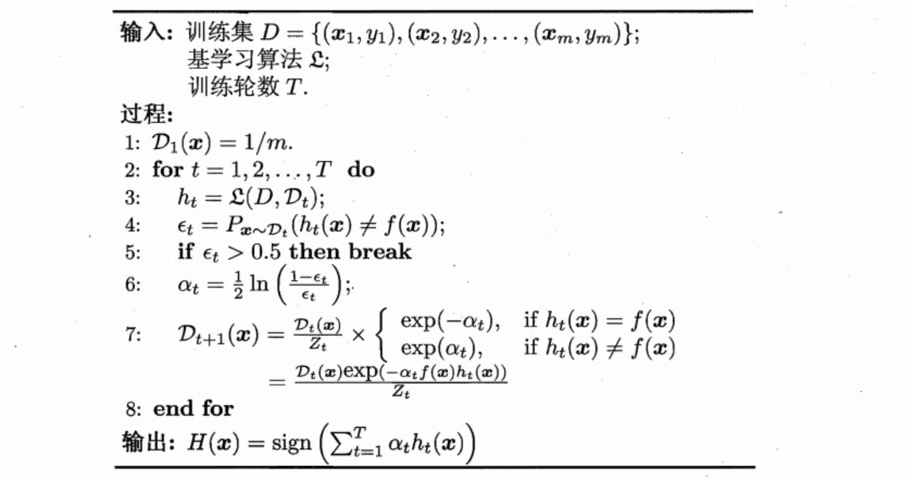
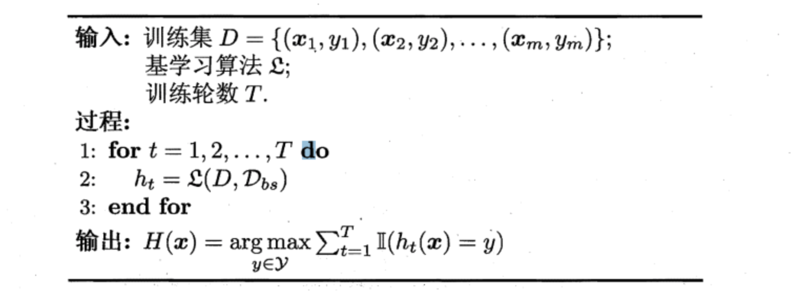
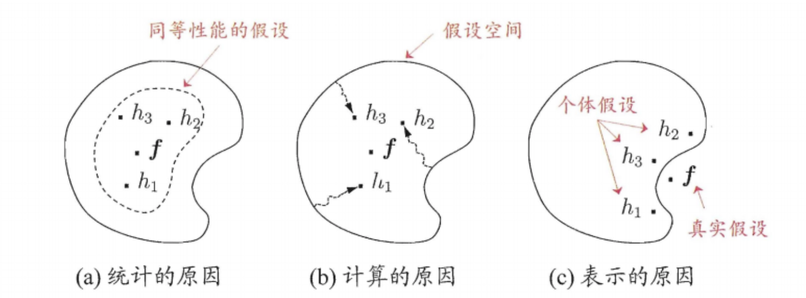
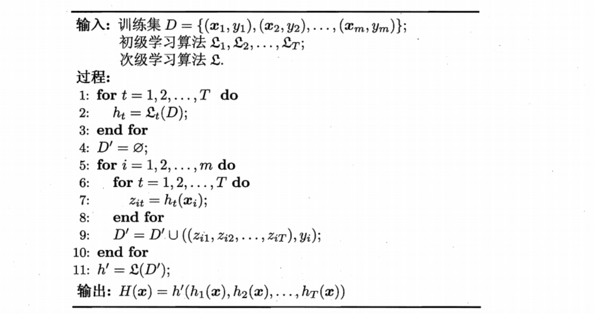
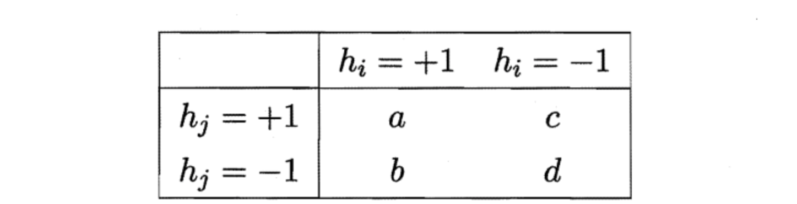
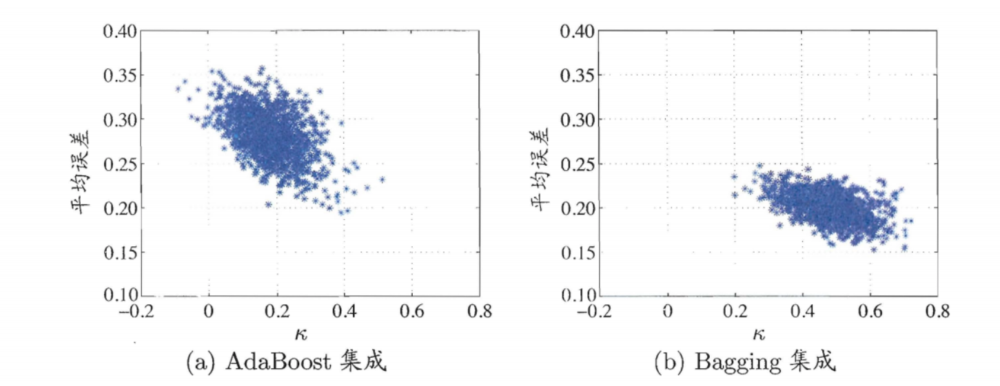
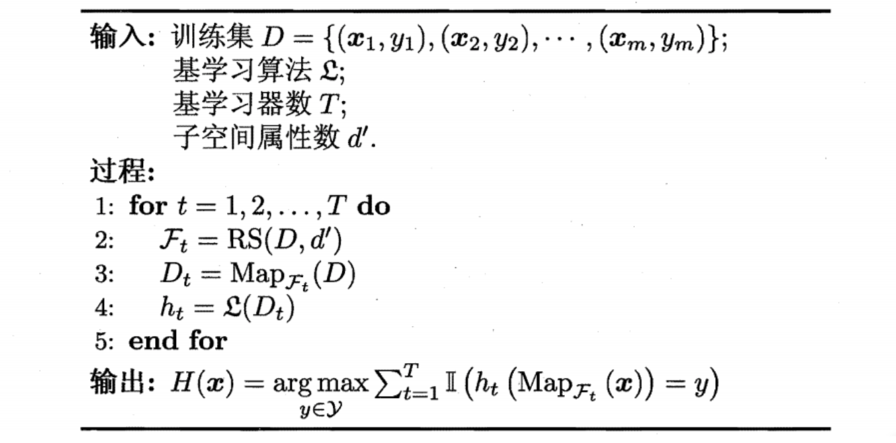

# 集成学习

## 1 个体与集成

### 1.1 基本概念

1. 一般结构：先产生一组"个体学习器" (individual learner) ，再用某种策略将它们结合起来
2. 同质：集成中只包含同种类型的个体学习器，这样的集成是"同质" (homogeneous) 的。同质集成中的个体学习器亦称"基学习器" (base learner), 相应的学习算法称为"基学习算法" (base learning algorithm). 
3. 异质：异质集成中的个体学习器由不同的学习算法生成，这时就不再有基学习算法;相应的，个体学习器一般不称为基学习器，常称为"组件学习器" (component learner) 或直接称为个体学习器.
4. 集成学习通过将多个学习器进行结合，常可获得比单一学习器显著优越的泛化性能这对"弱学习器"尤其明显，基学习器有时也被直接称为弱学习器
5. 个体学习器的要求：个体学习器要有一定的准确性(至少不弱于弱学习器)，学习器之间应该具有差异。

### 1.2 投票法分析

* 考虑二分类问题$y\in \{+1,-1\}$和真实函数$f$, 假设第$i$个分类器是$h_i$, 假设基分类器的错误率为$\epsilon$, 则对于每个基分类器$h_i$有
  $$
  P(h_i(x)\not = f(x)) = \epsilon
  $$

* 假设集成通过简单投票法结合$T$个基分类器，若有超过半数的基分类器正确，
  则集成分类就正确:
  $$
  H(x) = sign(\sum_{i=1}^T h_i(x))
  $$
  假设基分类器的错误率相互独立，则由$Hoeffding$不等式可知，集成的错误概率为：
  $$
  P(H(x)\not = f(x)) = P(\sum_{i=1}^T h_i(x) \le \lfloor \frac{T}{2} \rfloor)
  \\= \sum_{k=0}^{\lfloor \frac{T}{2} \rfloor} C_T^k (1-\epsilon)^k\epsilon^{T-k}\\
  =  P(\sum_{i=1}^T h_i(x) \le (\epsilon - \frac{1}{2}(2\epsilon - 1))T) \\
  \le \exp(-\frac{2T^2(2\epsilon - 1)^2}{4T}) = \exp(-\frac{T(2\epsilon - 1)^2}{2}) 
  $$
  这显示出，随着着集成中个体分类器数目$T$的增大, 集成的错误率将指数级下
  降，最终趋向于零。

### 1.3 集成学习分类

* 据个体学习器的生成方式，目前的集成学习方法大致可分为两大类。即个体学习器间存在强依赖关系、必须串行生成的序列化方法，以及个体学习器间不存在强依赖关系、可同时生成的并行化方法。前者的代表是$Boosting$，后者的代表是$Bagging$ 和"随机森林"

## 2 Boosting

### 2.1 Boosting概念

* Boosting 是一族可将弱学习器提升为强学习器的算法。这族算法的工作机制类似:先从初始训练集训练出一个基学习器，再根据基学习器的表现对训练样本分布进行调整，使得先前基学习器做错的训练样本在后续受到更多关注，然后基于调整后的样本分布来训练下一个基学习器。直至基学习器数目达到事先指定的值$T$, 最终将这 $T$个基学习器进行加权结合

### 2.2 AdaBoost

1. 算法流程

* 

* $y_i \in \{+1, -1\}, f$是真实函数

* 算法基于加性线性模型，即基学习器的线性组合
  $$
  H(x) = \sum_{t=1}^T \alpha_t h_t(x)
  $$

* 算法的目标是最小化指数损失函数
  $$
  l_{e}(H|D) = E_{x\sim D} (e^{-f(x)H(x)})
  $$

* 流程

  * 初始化样本权值分布
  * 基于分布$D_t$从数据集$D$中训练出分类器$h_t$
  * 估计$h_t$的误差
  * 确定$h_t$的权重$\alpha_t$
  * 更新样本分布$D_{t+1}$, 其中$Z_t$是规范化因子，以确保$D_{t+1}$具有归一性

2. 分布和权重的推导

* 最小化指数损失函数的意义

  * 为了使得最小化指数损失函数，使$l_e$对$H(x)$求偏导
    $$
    l_e = e^{-H(x)}P(f(x) = 1|x)+e^{H(x)}P(f(x) = -1|x)\\
    \frac{\partial l_e(H|D)}{\partial H(x)} = -e^{-H(x)}P(f(x) = 1|x)+e^{H(x)}P(f(x) = -1|x)\\
    $$

  * 令上式为0
    $$
    H(x) = \frac{1}{2} \ln(\frac{P(f(x) = 1|x)}{P(f(x) = -1|x)})\\
    sign(H(x)) = sign(\frac{1}{2} \ln(\frac{P(f(x) = 1|x)}{P(f(x) = -1|x)}))\\
    = 
    \left\{
    \begin{matrix}
    1,& P(f(x) = 1|x) > P(f(x) = -1|x)\\
    -1,& P(f(x) = 1|x) < P(f(x) = -1|x)\\
    \end{matrix}
    \right.
    \\= \arg\max_{y\in \{-1, 1\}} P(f(x) = y|x)
    $$

    这意味$sign(H(x))$达到了贝叶斯最优错误率，换言之如果指数损失函数最小化，则分类错误率也最小化。可以得出，指数损失函数是$0/1$损失函数的一致性替代函数，因为这个替代函数连续可微，因此用它代替$0/1$损失函数作为优化目标

* 新的分布$D_t​$的推导

  * $AdaBoost$算法获得$H_{t-1}$之后样本分布将进行调整，使下一轮的基学习器能纠正$H_{t-1}$的一些错误。理想的$h_t$能纠正$H_{t-1}$的全部错误，也就是最小化
    $$
    l_{e}(H_{t-1}+h_t|D) = E_{x\sim D}(e^{-f(x)(H_{t-1}(x)+h_t(x))})
    \\=E_{x\sim D}(e^{-f(x)H_{t-1}(x)}e^{-f(x)h_t(x)})
    \\ \approx E_{x\sim D}(e^{-f(x)H_{t-1}(x)}(1-f(x)h_t(x)+\frac{1}{2}f(x)^2h_t(x)^2))
    \\ = E_{x\sim D}(e^{-f(x)H_{t-1}(x)}(1-f(x)h_t(x)+\frac{1}{2}))\ [f(x)^2=h_t(x)^2=1]
    $$

  * 因此
    $$
    h_t(x) = \arg \min_{h} E_{x\sim D}(e^{-f(x)H_{t-1}(x)}(1-f(x)h_t(x)+\frac{1}{2}))
    \\ = \arg \max_{h} E_{x\sim D}(e^{-f(x)H_{t-1}(x)}f(x)h_t(x))
    \\ = \arg \max_{h} E_{x\sim D}(\frac{e^{-f(x)H_{t-1}(x)}}{E_{x\sim D}(e^{-f(x)H_{t-1}(x)})}f(x)h_t(x))
    $$

  * 其中$E_{x\sim D}(e^{-f(x)H_{t-1}(x)})$是一个常数，令$D_t$表示一个分布
    $$
    D_t (x) = \frac{D(x)e^{-f(x)H_{t-1}(x)}}{E_{x\sim D}(e^{-f(x)H_{t-1}(x)})}\\
    \sum_{x\in D} D_t(x) = \frac{\sum_{x\in D}D(x)e^{-f(x)H_{t-1}(x)}}{E_{x\sim D}(e^{-f(x)H_{t-1}(x)})}=1
    $$

  * 则$h_t$等价于
    $$
    h_t(x) =\arg \max_{h} E_{x\sim D}(\frac{e^{-f(x)H_{t-1}(x)}}{E_{x\sim D}(e^{-f(x)H_{t-1}(x)})}f(x)h_t(x))
    \\ =\arg \max_{h} \sum_{x\in D} D(x)\frac{e^{-f(x)H_{t-1}(x)}}{E_{x\sim D}(e^{-f(x)H_{t-1}(x)})}f(x)h_t(x)
    \\ =\arg \max_{h} E_{x\sim D_t}(f(x)h_t(x))
    $$

  * 由于$h(x),f(x) \in \{+1, -1\}$, 等价于
    $$
    f(x)h(x)=1-2l(f(x)\not = h(x))\\
    h_t(x) =\arg \min_{h} E_{x\sim D_t}(l(f(x)\not = h(x)))
    $$
    由此可见，理想的基学习器$h_t$将在分布$D_t$下最小化分类误差。因此，弱分类器将基于$D_t$训练，且针对$D_t$的误差应该小于$0.5$

  * 根据$D_t$和$D_{t+1}$的关系可以的得到
    $$
    D_{t+1}(x) = \frac{D(x)e^{-f(x)H_{t}(x)}}{E_{x\sim D}(e^{-f(x)H_{t}(x)})}
    \\ = \frac{D(x)e^{-f(x)H_{t-1}(x)}e^{-f(x)\alpha_t h_t(x)}}{E_{x\sim D}(e^{-f(x)H_{t}(x)})}
    \\ = D_t(x) e^{-f(x)H_{t-1}(x)} \frac{E_{x\sim D}(e^{-f(x)H_{t-1}(x)})}{E_{x\sim D}(e^{-f(x)H_{t}(x)})}
    $$
    可以得到$D_t$的递推式

* 权重$\alpha_t$的推导

  * 当基分类器$h_t$基于$D_t$产生后，该基分类器的权重$\alpha_t$应该使得$\alpha_th_t$最小化$D_t​$的分类误差，也就最小化指数损失函数
    $$
    l_e(\alpha_th_t|D_t) = E_{x\sim D_t}(e^{-f(x)\alpha_t h_t(x)})\\
    = e^{-\alpha_t}P_{x\sim D_t}(f(x) = h_t(x)) + e^{\alpha_t}P_{x\sim D_t}(f(x) \not = h_t(x))
    \\ = e^{-\alpha_t}(1-\epsilon _t)+e^{\alpha_t}\epsilon_t\\
    \epsilon_t = P_{x\sim D_t}(f(x) \not = h_t(x))\\
    \frac{\partial l_e}{\partial \alpha_t} = -e^{-\alpha_t}(1-\epsilon _t)+e^{\alpha_t}\epsilon_t = 0\\
    \alpha = \frac{1}{2}\ln(\frac{1-\epsilon_t}{\epsilon_t})
    $$

3. 对特定的数据分布进行学习

* 重赋权法
  * 即在训练过程的每一轮中，根据样本分布为每个训练样本重新赋予一个权重
* 重采样法
  * 对无法接受带权样本的基学习算法，即在每一轮学习中，根据样本分布对训练集重新进行采样，再用重采样而得的样本集对基学习器进行训练
  * Boosting 算法在训练的每一轮都要检查当前生成的基学习器是否满足基本条件，一旦条件不满足，则当前基学习器即被抛弃。初始设置的学习轮数$T$也许遥远未达到，可能导致最终集成中只包含很少的基学习器而性能不佳。若采用"重采样法"，则可获得"重启动"机会以避免训练过程过早停止，，从而使得学习过程可以持续到预设的$T$轮完成

4. 从偏差/方差的角度看，$Boosting​$的复杂度主要用来降低偏差。

## 3 Bagging与随即森林

### 3.1 Bagging

1. 直接基于自助采样法，给定包含$m​$个样本的数据集，我们先随机取出一个样本放入采样集中，再把该样本放回初始数据集，使得下次采样时该样本仍有可能被选中，这样，经过$m​$次随机采样操作，我们得到含$m​$个样本的采样集，初始训练集中有的样本在采样集多次出现，有的则从未出现。初始训练集中约有$63.2\%​$的样本出现在采样集中。

2. 流程：采样出$T$个含$m​$个训练样本的采样集，然后基于每个采样集训练出一个基学习器，再将这些基学习器进行结合。对预测输出进行结合时， Bagging 通常对分类任务使用简单投票法，对回归任务使用简单平均法。若分类预测时出现两个类收到同样票数的情形，则最简单的做法是随机选择一个，也可进一步考察学习器投票的置信度来确定最终胜者。

   

3. 复杂度：假定基学习器的计算复杂度为$O(m)$，$Bagging$的复杂度大致为$T(O(m) + O(s))$ ，考虑到采样与投票/平均过程的复杂度$O(s)$根小，而$T$通常是一个不太大的常数。训练一个$Bagging$集成与直在使用基学习算法复杂度同阶。

4. 包外估计：自助采样过程还给$Bagging$带来了另一个优点:由于每个基学习器只使用了初始训练集中约$63.2\%$的样本，剩下约$36.8\%$的样本可用作验证集来对泛化性能进行"包外估计"。为此需记录每个基学习器所使用的训练样本。令$D_t$表示$h_t$实际使用的训练样本集，令 $H^{oob}(x)$ 表示对样本的包外预测，即仅考虑那些未使用$x$训练的基学习器在$x$上的预测，有
   $$
   H^{oob}(x) = \arg \max _{y\in Y} \sum_{t=1}^T I(h_t(x)=y)I(x\not in D_t)
   $$
   则$Bagging$的泛化误差的包外估计为
   $$
   \epsilon^{oob} = \frac{1}{|D|} \sum_{(x,y)\in D} I(H^{oob}(x)\not = y)
   $$

* 包外样本还有许多其他用途
  * 当基学习器是决策树时，可使用包外样本来辅助剪枝或用于估计决策树中各结点的后验概率以辅助对零训练样本结点的处理
  * 当基学习器是神经网络时可使用包外样本来辅助早期停止以减小过拟合风险

5. 从偏差/方差的角度看，$Bagging$的复杂度主要用来降低方差。因此他在不剪枝决策树、神经网络等易受样本扰动的学习器上效用更为明显

### 3.2 随机森林

1. 随机森林是$Bagging$的一种变体，在以决策树为基学习器构建Bagging集成的基础上，进一步在决策树的训练过程中进入了随机属性的选择。对基决策树的每个结点，先从该结点的属性集合中随机选择一个包含$k$个属性的子集，然后从这个子集中选择的一个最有属性用于划分。一般情况推荐$k = \log_2d$
2. 随机森林对$Bagging$只做了小改动，与$Bagging$基学习器的"多样性"仅通过样本扰动不同，随机森林的基学习器的多样性还来自属性扰动。这就使得最终的泛化性能可通过个体学习器之间差异度的增加而进一步提升

## 4 结合策略

### 4.1 学习器结合好处

1. 首先从统计的方面来看，由于学习任务的假设空间往往很大，可能有多个假设在训 练集上达到同等性能。此时若使用单学习器可能因误选致泛化性能不佳，结合多个学习器减小风险

2. 从计算的方面来看，学习算法往往会陷入局部极小点，泛化性能可能很糟糕。通过多次运行结合之后降低陷入糟糕局部极小点的风险

3. 从表示的方面来看，某些任务务的真实假设不在当前学习算法所考虑的假设空间 ，此时若使用单学习器无效，而通过结合多个学习器假设空有所扩大，有可能学到更好的近似

   

### 4.2 常见策略

假定集成包含$T$个基学习器$\{h_1, h_2, \dots, h_T\}$，其中$h_i$在示例$x$的输出为$h_i(x)$

1. 平均法

* 对数值型输$h_i(x) \in R $最, 最常见的结合策略

* 简单平均法
  $$
  H(x) = \frac{1}{T} \sum_{i=1}^T h_i(x)
  $$

* 加权平均法
  $$
  H(x) = \sum_{i=1}^T w_ih_i(x)\\
  w_i\ge 0, \sum_{i=1}^T w_i = 1
  $$
  加权平均法可认为是集成学习研究的基本出发点，对给定的基学习器，不同的集成学习方法可视为通过不同的方式来确定加权平均法中的基学习器权重

2. 投票法

* 对分类任务来说，学习器将从类别标记集合$\{c_1, c_2, \dots, c_N\}$ 中预测出一
  个标记，最常见的结合策略是使用投票法。将$h_i$在样本$x$上的预测输出表示为一个$N$维的向量$(h_i^1(x); h_i^2(x);...;h_i^N(x))$, 其中$h_i^j(x)$是$h_i$在标记类别$c_j$上的输出

* 绝对多数投票法

  * 即若某标记得票过半数，则预测为该标记。否则拒绝预测。
    $$
    H(x) = \left\{
    \begin{matrix}
    c_j, & if \ \sum_{i=1}^T h_i^j(x) > 0.5\sum_{k=1}^N
    \sum_{i=1}^T h_i^k(x)\\
    reject, & otherwose
    
    \end{matrix}
    \right.
    $$

  * 相对多数投票法
    $$
    H(x) = c_{\arg\max_{j}\sum_{i=1}^T h_i^j(x)}
    $$

  * 加权投票法
    $$
    H(x) = c_{\arg \min_{j}\sum_{i=1}^T w_ih_i^j(x)}\\
    w_i\ge 0, \sum_{i=1}^T w_i = 1
    $$

* 类概率与类标记

  * 用类标记的投票亦称"硬投票", 预测类别为1，其他为0
    $$
    h_i^j(x) \in \{0, 1\}
    $$

  * 使用类概率的投票亦称"软投票", $h_i^j(x)$相当于对$p(c_j|x)$的一个估计
    $$
    h_i^j(x) \in [0, 1]
    $$

  * 不同类型的时$h_i^j(x)​$值不能混用。对一些能在预测出类别标记的同时产生
    分类置信度的学习器，其分类置信度可转化为类概率使用

    * Platt缩放
    * 等分回归

  * 虽然分类器估计出的类概率值一般都不太准确。但基于类概率进行结合却往往比直接基于类标记进行结合性能更好

  * 需注意若基学习器的类型不同则其类概率值不能直接进行比较，在此种情形下，通常可将类概率输出转化为类标记输出然后投票

3. 学习法

* 当训练数据很多时，一种更为强大的结合策略是使用"学习法"，通过另一个学习器来进行结合
* 把个体学习器称为初级学习器，用于结合的学习器称为次级学习器或元学习器
* $Stacking$是学习法的典型代表
  * 
  * $Stacking$先从初始数据集训练出初级学习器，然后"生成"一个新数据集用于训练次级学习器。在这个新数据集中，初级学习器的输出被当作样例输入特征，而初始样本的标记仍被当作样例标记
  * 为了避免过拟合，使用交叉验证方法，使用对于$D$的$k$划分$D_1,D_2,\dots , D_k$，对于$h_t$, 使用第$t$个算法在$D-D_j$训练，使用$D_j$的每个样本$x_i$来生成$z_{it}$。 $T$个学习器生成$z_i = \{z_{i1}, z_{i2}, \dots, z_{iT}\}$, 最后得到的次级训练集为$D' =\{(z_1, y_1),(z_2,y_2),\dots, (z_m, y_m)\}$

## 5 多样性

### 5.1 误差-分歧分解

* 欲构建泛化能力强的集成，个体学习器应"好而不同"

* 假定我们用个体学习器$h_1,h_2,\dots, h_T$通过加权平均法结合产生的集成来完成回归学习任务$f:R^d\rightarrow R$, 对示例$x$，定义学习器$h_i$的"分歧"为
  $$
  A(h_i|x) = (h_i(x) - H(x))^2
  $$
  则集成分歧为
  $$
  \overline A(h|x) = \sum_{i=1}^T w_iA(h_i|x)\\
  = \sum_{i=1}^T w_i(h_i(x) - H(x))^2
  $$
  这里的"分歧"项表征了个体学习器在样本$x$上的不一致性，即在一定程度上反映了个体学习器的多样性。个体学习器$h_i$和集成$H$的平方误差为
  $$
  E(h_i|x) = (f(x) - h_i(x))^2\\
  E(H|x) = (f(x) - H(x))^2
  $$
  令$\overline E (h|x) = \sum_{i=1}^T w_i E(h_i|x)$表示个题学习器误差的加权平均，则有
  $$
  \overline A(h|x) 
  = \sum_{i=1}^T w_i(h_i(x) - H(x))^2
  \\ = \sum_{i=1}^T w_i(h_i(x)^2 - 2h_i(x)H(x)+H(x)^2)
  \\ =\sum_{i=1}^T w_ih_i(x)^2 - 2\sum_{i=1}^Th_i(x)H(x)+H(x)^2
  \\ = \sum_{i=1}^T w_ih_i(x)^2 - H(x)^2
  
  \\ \overline E(h|x) - E(H|x)
  \\ = \sum_{i=1}^T w_iE(h_i|x) - E(H|x)
  \\ = \sum_{i=1}^T w_i(f(x) - h_i(x))^2-(f(x) - H(x))^2
  \\ = \sum_{i=1}^Tw_if(x)^2-2\sum_{i=1}^Th_i(x)f(x) + \sum_{i=1}^Tw_ih_i(x)^2
  \\ - f(x)^2 + 2H(x)f(x)-H(x)^2
  \\ = \sum_{i=1}^T w_ih_i(x)^2 - H(x)^2\\
  \overline A(h|x) = \overline E(h|x) - E(H|x)
  $$
  上式对所有样本$x$都成立，令$p(x)$表示样本的概率密度，则在全样本有
  $$
  \sum_{i=1}^T w_i \int A(h_i|x)p(x)dx = \sum_{i=1}^Tw_i\int E(h_i|x)p(x)dx - \int E(H|x)p(x)dx
  $$
  个体学习器在全样本的泛化误差和分歧项为
  $$
  E_i = \int E(h_i|x)p(x)dx\\
  A_i = \int A(h_i|x)p(x)dx
  $$
  集体的泛化误差为
  $$
  E = \int E(H|x)p(x)dx
  $$
  使得$\overline E = \sum_{i=1}^T w_iE_i, \overline A = \sum_{i=1}^T w_iA_i$
  $$
  E = \overline E - \overline A
  $$
  这表明，个体学习器准确性越高、多样性越大，则集成越好。上述推理过程仅仅适用于回归学习，难以推广到分类学习。

### 5.2 多样性度量

1. 多样性度量(diversity measure) 是用于度量集成中个体分类器的多样性，即估算个体学习器的多样化程度

2. 给定数据集$D = \{(x_1,y_1), (x_2,y_2),\dots (x_m,y_m)\}$, 对于二分类任务$y_i \in \{+1, -1\}$, 分类器$h_i,h_j$的结果列联表为

   

   其中$a$表示$h_i,h_j$均预测为正类的样本数目, 且$a+b+c+d = m$

* 不合度量
  $$
  dis_{ij} = \frac{b+c}{m} \in [0,1]
  $$
  值越大多样性越大

* 相关系数
  $$
  \rho_{ij} = \frac{Conv(h_i,h_j)}{\sqrt{Var(h_i)}\sqrt{Var(h_j)}}
  \\ = \frac{\frac{a+d-(b+c)}{a+b+c+d}-\frac{(a+b-(c+d))(a+c-(b+d))}{(a+b+c+d)^2}}{\sqrt\frac{4(a+b)(c+d)}{(a+b+c+d)^2}\sqrt\frac{4(a+c)(b+d)}{(a+b+c+d)^2}}
  \\ = \frac{(a+d)^2-(b+c)^2-(a-d)^2+(b-c)^2}{4\sqrt{(a+b)(a+c)(c+d)(b+d)}}
  \\ = \frac{2a2d-2b2c}{4\sqrt{(a+b)(a+c)(c+d)(b+d)}}
  \\ = \frac{ad-bc}{\sqrt{(a+b)(a+c)(c+d)(b+d)}}
  $$
  值域为$[-1, 1]$, 若$h_i$与$h_j$无关，则为0；正相关为正，否则为负

* $Q-$统计量
  $$
  Q_{ij} = \frac{ad-bc}{ad+bc}
  $$
  $Q_{ij}$与$\rho_{ij}$符号相同，且$|Q_{ij}| \le |\rho_{ij}|$

* $\kappa-$统计量
  $$
  \kappa = \frac{p_1-p_2}{1-p_2}\\
  p_1:两个分类器取得一致的概率\\
  p_2:两个分类器偶然达成一致的概率\\
  p_1 = \frac{a+d}{m}\\
  p_2 = \frac{(a+b)(a+c)+(c+d)(b+d)}{m^2}
  $$
  若$h_i,h_j$在$D$上完全一致，则$\kappa = 1$;若仅仅是偶然一致，则$\kappa = 0$;通常非负，处分$h_i,h_j$达成一致的概率甚至低于偶然

* $\kappa-$误差图

  

### 5.3 多样性增强

1. 一般思路是在学习过程中引入随机性 ，常见做法主要对数据样本、 输入属性、输出表示、算法参进行扰动
2. 扰动

* 数据样本扰动
  * 给定初始数据集可从中产生出不同的数据子集 再利用不同的数据子集训练出不同的个体学习器
* 输入属性扰动
  * 训练样本通常由一组属性描述，不同的"子空间"提供了观察数据的不同视角。
  * 随机子空间算法
    * 
* 输出表示扰动
  * 此类做法的基本思路是对输出表示进行操纵以增强多样性.可对训练样本
    的类标记稍作变动。比如随机改变一些训练样本的标记
* 算法参数扰动
  * 通过随机设置不同的参数往往可产生差别较大的个体学习器.
