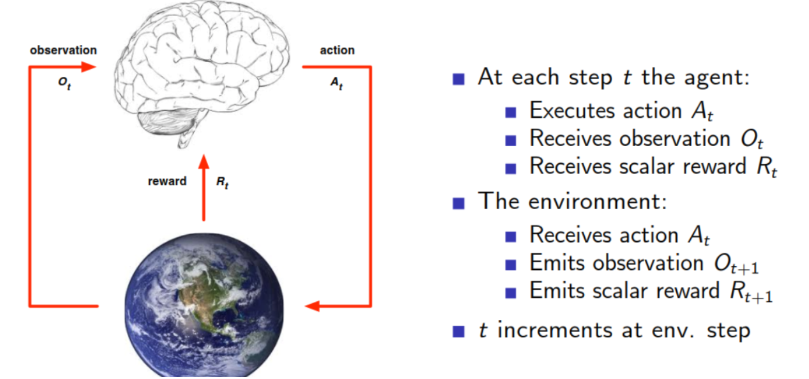
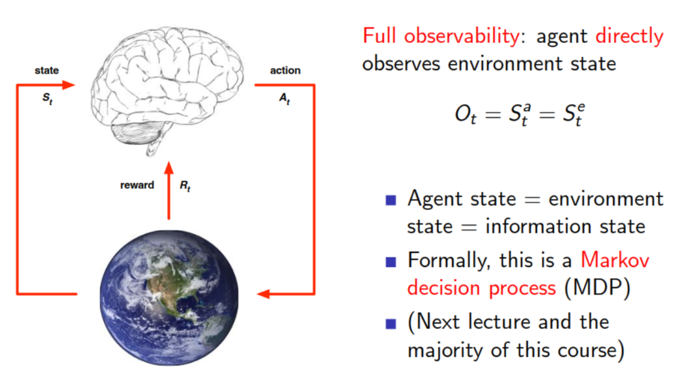

# 增强学习

## 1 基础知识

1. 强化/增强学习是机器学习中的一个领域，强调如何基于环境而行动，以取得最大化的预期利益。其灵感来源于心理学中的行为主义理论，即有机体如何在环境给予的奖励或惩罚的刺激下，逐步形成对刺激的预期，产生能获得最大利益的习惯性行为。这个方法具有普适性，因此在其他许多领域都有研究，例如博弈论、控制论、运筹学、信息论、仿真优化方法、多主体系统学习、群体智能、统计学以及遗传算法。

2. 简而言之，增强学习是一种基于环境反馈而做决策的通用框架。其研究的是智能体（agent）如何在一个环境（environment）中采取动作（action）以最大化我们想要的奖励（reward）。

### 1.1 强化学习特点

1. 机器学习包括三大类：有监督学习、无监督学习和强化学习。
2. 有机体如何在环境给予的奖励或惩罚的刺激下，逐步形成对刺激的预期，产生能获得最大利益的惯性行为。比如：在训练狗狗站起来时，如果狗狗站起来就给它奖励，如给它肉条吃，如果不站起来就给它一些惩罚，如用鞭子打它，这样的话，通过不断的强化，从而让狗能够学会站起来这个动作。
3. 相比于有监督学习和无监督学习，强化学习有以下特点

* 没有监督数据，只有**奖励信号**；
* 奖励信号不一定是实时的，而很可能是延后的，即一般具有**延时性**；
* **时间（序列）** 是一个重要因素，即强化学习的每一步与时间顺序前后关系紧密；
* 当前的行为影响后续接收到的数据；

### 1.3 基本概念

1. **智能体(Agent)**

    是强化学习中的动作实体，处于某一**环境** 中。在每个时刻，智能体和环境都有自己的**状态**。智能体根据当前状态确定一个**动作**，并执行该动作。之后它和环境进入下一个状态，同时系统给它一个**反馈值**，对动作进行奖励或惩罚，以迫使智能体执行正确的动作。

2. **奖励(Reward)**

   奖励$R_t$是信号反馈，是一个标量，反映智能体在$t$时刻做得怎么样。智能体的目标是最大化累积奖励。一种通用的累计奖励的定义是将这些奖励值进行加权求和：
   $$
   G_t=w_tR_t+w_{t+1}R_{t+1}+w_{t+2}R_{t+2}+...
   $$
   强化学习的目的就转化为在每个时刻，使未来的期望回报值最大。

   回报值有两种，分为无衰减和有衰减：
   $$
   w_{t+n}=\gamma^n,\gamma \in [0,1]
   $$
   其中**γ称为衰减系数**

   

3. **序列决策(Sequential Decision Making)**

   目标：选择一系列动作来最大化未来的总体奖励；这些动作可能产生长期的后果；奖励可能是延迟的；为了获得更多的长期奖励（long-term reward），有时会牺牲即时奖励（immediate reward）

4. **智能体和环境(Agent and Environment)**

   

5. **历史和状态(History and State)**

* 历史是观测（observations）、动作（actions）和奖励（rewards）的序列：

$$
H_t = O_1,R_1,A_1,...,A_{t-1},O_t,R_t
$$

* 状态是用来决定接下来发生什么的信息，是关于历史的一个函数：
  $$
  S_t=f(H_t)
  $$
  状态分为：**环境状态**、**智能体状态**和**信息状态**

  * 环境状态$S_t^e$是环境的私有表示，即环境用来决定下一个观测/奖励的所有数据，对智能体通常是不可见的。即使$S_t^e$是可见的，也可能包含不相关的信息。

  * 智能体状态$S_t^a$是智能体的内部表示，即智能体用来选择下一个动作的所有信息。智能体状态是强化学习算法可以利用的信息。它可以是历史的任何函数：$S_t^a=f(H_t)$。

  * 信息状态（又称为Markov状态）包括历史的所有有用信息。

    一个状态$S_t$是Markov的，当且仅当：
    $$
    P[S_{t+1}|S_t] = P[S_{t+1}|S_1,...,S_t]
    $$
    即当前状态包含了所有相关的历史，只要当前状态可知，所有的历史信息都不需要。

6. **完全可观测环境(Fully Observable Environments)**

   

7. **部分可观测环境(Partially Observable Environments)**

   在这种情况下，智能体状态$≠$环境状态；

   智能体必须构建自己的状态表示$S_t^a $，例如：

* 记住完整的历史：$S_t^a=H_t$

* 使用循环神经网络（Recurrent Neural Network, RNN），只根据智能体$t-1$时刻的状态$S_{t-1}^a$和当前观测$O_t$来获得当前状态$S_t^a$的表示：
  $$
  S_t^a = \sigma(S_{t-1}^aW_s+O_tW_o)
  $$
  其中，$W_s$和$W_o$表示状态和观测的权重。

8. **学习和规划(Learning and Planning)**

   在序列决策中主要包括两类基本问题：

* 学习：环境在初始时是未知的，智能体通过与环境交互来改善它的策略；
* 规划：环境模型是已知的，智能体使用其模型执行计算，而不与环境进行任何交互，从而改善策略。

9. **探索和利用(Exploration and Exploitation)**

   强化学习是一个**试错（trail-and-error）** 的学习过程，智能体需要从与环境的交互中发现好的策略，同时在这个过程中不至于丢失太多的奖励；

* 探索（Exploration）是为了发现关于环境更多的信息；即尝试不同的行为继而收集更多的信息、期望得到更好的决策。
* 利用（Exploitation）是根据现有的已知信息，采取当前认为最优的策略，从而来最大化奖励；
* 探索（**未知信息**）和利用（**已有信息**）这两者是矛盾的，如果“仅利用”，则可能只是得到局部最优，而得不到真正的最优策略；而“仅探索”则可能得到的策略或奖励都比较差；因此，智能体在进行决策时需要在探索和利用之间进行权衡。

10. **预测和控制(Prediction and Control)**

    预测：**给定**一个策略，来**评估**未来的奖励；

    控制：**发现**一个策略， 来**优化**未来的奖励；

### 1.4 强化学习智能体的主要组成部分

1. **策略函数(Policy Function)**

   策略是智能体的行为，是状态$s$到动作$a$的映射。

* 对于确定性策略，在每种状态下智能体要执行的动作是唯一的
  $$
  a=\pi(s)
  $$

* 对于不确定性（随机性）策略，智能体在一种状态下可以执行的动作有多种，策略函数给出的是执行每种动作的概率，即按概率从各种动作中随机选择一种执行：
  $$
  \pi(a|s) = P[A_t=a|S_t = s]
  $$
  

2. **价值函数(Value Function)**

   价值函数是对未来奖励的预测，用来评价状态的好坏程度，进而来决定动作的选择，例如：
   $$
   {V_\pi }(s) = {{\rm E}_\pi }[{R_{t + 1}} + \gamma {R_{t + 2}} + {\gamma ^2}{R_{t + 3}} + ...|{S_t} = s]
   $$

3. **模型(Model)**

   模型是智能体对环境的表示，体现了智能体是如何思考环境运行机制的。

* 状态转移概率，即预测下一个状态的概率：
  $$
  p_{ss'}^a = P[{S_{t + 1}} = s'|{S_t} = s,{A_t} = a]
  $$

* 即时奖励，即预测可能获得的即时奖励：
  $$
  R_s^a = E[{R_{t + 1}}|{S_t} = s,{A_t} = a]
  $$
  

### 1.5 强化学习的分类

1. 按**智能体的成分**分类：

* 基于**价值函数**（Value Based）：定义了状态或动作的价值函数，来表示达到某种状态或执行某种动作后得到的奖励；倾向于选择价值最大的状态或动作；
* 基于**策略**（Policy Based）：不需要定义价值函数，动作直接由策略函数产生，可以为动作分配概率分布，按照概率分布来执行动作；
* **Actor-Critic**：既有价值函数，也有策略函数，两者相互结合解决问题。

2. 按**有无模型**分类

* **有模型/基于模型**（Model Based）：智能体尝试建立一个描述环境动作过程的模型，以此来指导价值或策略函数的更新；主要是基于**动态规划**的算法，包括**策略迭代算法**和**值迭代算法**；
* **无模型/不基于模型**（Model Free）：智能体不需要关于环境的信息，不试图了解环境如何工作，仅聚焦于价值或策略函数；主要包括**蒙特卡洛算法**和**时序差分学习**等；

## 2 马尔可夫决策过程

在机器学习领域，环境通常被阐释成一个马尔可夫决策过程（Markov Decision Process, MDP），许多强化学习算法都是用了动态编程（dynamic programming）技术。传统技术和强化学习算法之间主要不同在于后者并不需要关于 MDP 的知识并且它们的目标是无法获取明确的方法的大型 MDP。强化学习要解决的问题可以抽象成马尔可夫决策过程。这里先介绍下马尔可夫过程，再进一步介绍马尔可夫决策过程。

### 2.1  马尔可夫过程

1. **马尔可夫特性(Markov Property)**

   一个状态$S_t$是Markov的，当且仅当：
   $$
   P[S_{t+1}|S_t] = P[S_{t+1}|S_1,...,S_t]
   $$
   马尔可夫特性：当一个随机过程在给定当前状态及所有过去状态情况下，其未来状态的条件概率分布仅依赖于当前状态。

2. **马尔可夫过程(Markov Process)**

   马尔可夫过程：又称为马尔可夫链（Markov Chain），是一个无记忆的随机过程，其中，随机过程是指一个系统的状态随着时间线随机演化。也就是说，马尔可夫过程是一个具有马尔可夫特性的随机状态序列$S_1,S_2,...$

   马尔可夫过程可以表示成一个二元组：
   $$
   <S,P>
   $$
   其中，$S$是有限的状态集合，$P$是一个状态转移概率矩阵。

   对于马尔可夫状态$s$和其后继状态$s′$，状态转移概率定义为：
   $$
   P_{ss^{'}} = P[S_{t+1}=s^{'}|S_t = s]\\
   P = \mathop {
   \left[ 
       \begin{array}{*{20}{c}}
       {{P_{11}}}& \cdots &{{P_{1n}}}\\
        \vdots &{}&{}\\
       {{P_{n1}}}& \cdots &{{P_{nn}}}
       \end{array}
   \right]
   }
   $$
   

### 2.2 马尔可夫决策过程

1. 与马尔可夫过程不同的是，在马尔可夫决策过程（MDP）中，智能体可以执行动作，从该改变自己和环境的状态，并且得到反馈（即惩罚或奖励）。MDP可以表示成一个五元组：
   $$
   <S,A,P,R,\gamma>
   $$
   

* $S$为有限的状态集合；

* $A$为有限的动作集合；

* $P$为状态转移矩阵，
  $$
  P^a_{ss′}=P[S_{t+1}=s′|S_t=s,A_t=a]
  $$

* $R$为奖励函数（reward function），
  $$
  R_a^s=E[R_{t+1}|S_t=s,A_t=a]
  $$

* 这个函数是即时奖励的期望，即在时刻$t$时，智能体的状态为$s$，在执行动作$a$后，下一个时刻$t+1$立即能得到的奖励$R_{t+1}$的期望。

* $\gamma$为折扣因子（discount factor），$\gamma\in [0,1]$；

2. **回报(Return)**

   定义回报（Return）$G_t$是从$t​$时刻之后未来执行一组动作能够获得的奖励的总和，即：
   $$
   G_t = R_{t+1}+\gamma R_{t+2}+...=\sum_{k=0}^{inf} \lambda^k R_{t+k+1}
   $$

3. **策略(Policy)**

   策略$π​$是给定状态下动作的概率分布，用$π(a|s)​$表示在MDP中某一状态$s​$采取动作$a​$的概率：
   $$
   \pi(a|s)=P[A_t = a|S_t = s]
   $$
   

   一个策略完整定义了智能体的行为，即定义了智能体在各个状态下各种可能的动作及其概率的大小。MDP的策略仅和当前状态有关，与历史信息无关；

4. **价值函数(Value Function)**

   类似于有监督学习中需要定义损失函数来评价预测函数的优劣，在强化学习中也需要对策略的优劣进行评价，为此定义了了价值函数。价值函数包括**状态价值函数**（state-value function）vπ(s)$v_π(s)$和**动作价值函数**（action-value function)$q_π(s,a)$。

* 状态价值函数$v_π(s)$表示在状态$s$下，遵循策略$π$执行动作，能够获得的回报期望
  $$
  v_{\pi}(s)=E_{\pi}[G_t|S_t=s]
  $$

* 动作价值函数$q_π(s,a)$表示在遵循策略$π$时，对当前状态$s$执行具体的动作$a$时所能获得的回报期望；或者说在执行策略$π$时，评估处在状态$s$时执行动作$a$的价值大小。
  $$
  q_{\pi}(s,a)=E_{\pi}[G_t|S_t=s,A_t=a]
  $$
  这个函数衡量的是按照某一策略，在某一状态时执行各种动作的价值。

5. **贝尔曼期望方程(Bellman Expectation Equation)**

* 状态价值函数$v_π(s)$可以分解为即时奖励与其后继状态的折扣价值之和，即：
  $$
  v_{\pi}(s)=E_{\pi}[R_{t+1}+\gamma v_{\pi}(S_{t+1})|S_t = s]
  $$

* 动作价值函数可以转化为即时奖励与后继状态执行相应动作的折扣价值之和，即
  $$
  q_{\pi}(s,a)=E_{\pi}[R_{t+1}+{\gamma}q_{\pi}(S_{t+1},A_{t+1})|S_t=s,A_t=a]
  $$

* 方程推导

  * 使用$q_π(s,a)$表示$v_π(s)$

  $$
  v_{\pi}(s) = \sum_{a\in A} \pi(a|s) q_{\pi}(s,a)
  $$

  
  * 使用$v_{\pi}(s)$表示$q_{\pi}(s,a)$

  $$
  q_{\pi}(s,a) = R_a^s+\gamma\sum_{s'\in S}P_{ss'}^a v_{\pi}(s^{'})
  $$

  * 结合
    $$
    {v_\pi }(s) = \sum\limits_{a \in A} {\pi (a|s)}(R_s^a + \gamma \sum\limits_{s' \in S} {P_{ss'}^a{v_\pi }(s'))}
    \\{q_\pi }(s,a) = R_s^a + \gamma \sum\limits_{s' \in S} {P_{ss'}^a\sum\limits_{a' \in A} {\pi (a'|s'){q_\pi }(s',a')}}
    $$
    

6. **最优价值函数(Optimal Value Function)**

* 最优状态价值函数$v_∗(s)$从所有策略产生的状态价值函数中，选取使状态$s$价值最大的函数
  $$
  v_*(s)=\max_{\pi}v_{\pi}(s)
  $$

* 类似的，最优动作价值函数$q_∗(s,a)$是从所有策略产生的动作价值函数中，选取使状态动作对$<s,a>$价值最大的函数：
  $$
  q_*(s,a)=\max_{\pi}q_{\pi}(s,a)
  $$

7. **最优策略(Optimal Policy)**

* 对于任何状态$s$，当遵循策略$π$的价值不小于策略$π′$的价值时，则策略$π$优于策略$π′$
* 对于任何MDP
  * 存在一个最优策略，好于或等于所有其他策略
  * 所有的最优策略都实现了最优价值函数，包括最优状态价值函数和最优动作价值函数

* 如何寻找最优策略

  最优策略可以通过最大化最优动作价值函数$q_∗(s,a)$来寻找
  $$
  {\pi _*}(a|s) = \left\{ \begin{array}{l}
  \begin{array}{*{20}{c}}
  1&{if \ a = \mathop {\arg \max }\limits_{a \in A} {q_*}(s,a)}
  \end{array}\\
  \begin{array}{*{20}{c}}
  0&{otherwise}
  \end{array}
  \end{array} \right.
  $$
  

8. **贝尔曼最优方程(Bellman Optimality Equation)**

* 对于$v_∗$，一个状态的最优价值等于从该状态出发执行的所有动作中产生的动作价值中最大的那个动作价值
  $$
  {v_*}(s) = \mathop {\max }\limits_a {q_*}(s,a)
  $$

* 对于$q_∗$，在状态$s$，采取动作$a$的最优价值由两部分组成，一部分是离开状态$s$时的即时奖励，另一部分是其后继状态$s′$的最优状态价值的概率求和
  $$
  {q_*}(s,a) = R_s^a + \gamma \sum\limits_{s' \in S} {P_{ss'}^a{v_*}(s')}
  $$

* 组合起来
  $$
  v_*(s)=\max_a(R_s^a+\gamma \sum_{s'\in S}P_{ss'}^av_*(s'))\\
  q_*(s, a)=R_s^a+\gamma\sum_{s'\in S}P_{ss'}^a\max_aq_*(s',a')
  $$
  

  贝尔曼最优方程是非线性的，一般通过迭代的方法来求解贝尔曼最优方程，例如：基于动态规划的算法（价值迭代、策略迭代）、蒙特卡洛算法和时序差分学习等