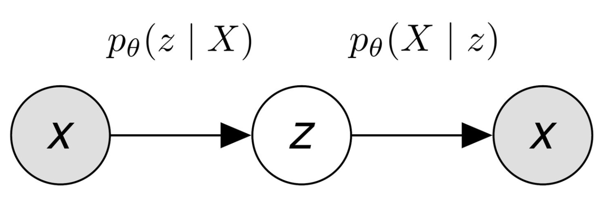

# 变分自编码器 VAE

## 1 概念

* 目的：变分自编码器 (Variational AutoEncoder，VAE)，构建一个从隐变量 $Z$ 生成目标数据 $X$ 的模型。其假设了服从某些常见的分布（比如正态分布或均匀分布），然后希望训练一个模型 $X=f(Z)$，这个模型能够将原来的概率分布映射到训练集的概率分布
* 自编码器（AutoEncoder）作为生成模型的劣势：
  * 上图是自编码器，其把输入$X\in R^{C\times H\times W}$的图片，通过编码器$Z=g(X)$编码到$Z\in R^d$，然后使用解码器$\tilde X=f(Z)$，$\tilde X\in R^{C\times H\times W}$ 。
  * 可以使用$l=\|\tilde X-X\|^2$作为损失函数，这样训练好后，$Z$就蕴含了输入数据$X$的大部分信息。
  * 对于解码器$f$，不能这个模型直接当做生成模型，在低维空间$R^d$中随机生成某些向量$Z$，再喂给解码器$f(Z)$来生成图片。
    * 这是没有显性对$Z$的分布$p(Z)$进行建模，并不知道哪些$Z$能够生成有用的图片。
    * 而用于训练的数据也是有限的，$f$只对有限的$Z$会进行响应。因为空间 $R^d$ 十分庞大，在这个空间上随机采样不一定能得到有用的$Z$。
* 变分自编码器：显性的对$Z$的分布$p(Z)$进行建模，给定$Z​$一个简单的分布，将采样的空间缩小，使得自编码器成为一个合格的生成模型。

## 2 推导

### 2.1 初步想法

* 假设：$Z\sim N(0, \mathbf{I})$, 将$Z$看作一个服从标准多元高斯分布的变量，多维随机变量

* 得到生成模型：可以认为数据集是由某个随机过程生成的，而$Z$是这个随机过程中的一个不可观测到的隐变量。则数据集的生成看成如下步骤：

  * 根据$p(Z)​$采样出样本$z_i​$
  * 然后根据$z_i$, 从条件分布$p(X|z_i)$中采样出数据点$x_i$

  因此，对上述步骤建模

### 2.2 解码器

* 架构图：

* 假设：给定$z_i$后，$p_{\theta}(X|z_i)$ 服从各向同性的多元高斯分布
  $$
  p_{\theta}(X|z_i) = N(X|\mu_i'(z_i;\theta),\sigma_i'^2(z_i;\theta)\mathbf{I})
  $$
  因此，只需要输入$z_i$, 让Decoder拟合出$\mu_i',\sigma_i'$, 就可以得到分布$p(X|z_i)$

### 2.3 目标函数

#### 2.3.1 统计视角下生成模型

* 对于生成模型，从统计视角看模板是对数据本身的分布$p(X)​$进行建模。如果成功使用$p_{\theta}(X)​$来逼近$p(X)​$, 那k可以从中进行采样，生成一些可能的数据点
* 得到$p_{\theta}(X)$后，则使得$p_{\theta}(x_i)$较大的$x_i$可能就是比较正常的生成对象

#### 2.3.2 函数推导

* 前提：假设有数据集$D=\{x_1,x_2,\dots, x_N\}​$，且有分布$p(z)=N(0, \mathbf{I}), p_{\theta}(X|z_i) = N(X|\mu_i'(z_i;\theta),\sigma_i'^2(z_i;\theta)\mathbf{I})​$。因此有：
  $$
  p_\theta(X)=\int_{z}p_{\theta}(X|z)p(z)dz
  \\ \approx \frac{1}{m}\sum_{i=1}^m p_{\theta}(X|z_i), z_i\sim N(0,\mathbf{I})\ \because 期望的采样计算方法
  $$

* 极大似然估计(MLE)：使用最大似然估计的思想，去优化参数$\theta$
  $$
  \theta^* = \arg\min_{\theta}{-\log{p_\theta(D)}}
  \\ = \arg\min_{\theta}{-\sum_{i=1}^N\log{p_\theta(x_i)}}
  \\ = \arg\min_{\theta}{-\sum_{i=1}^N\log{(\frac{1}{m}\sum_{j=1}^m p_{\theta}(x_i|z_j))}} \label{eq_1}
  $$

* 代价极大：

  * $z_j \in R^d$的维度较大，而对于$x_i$, 与其强相关的$z_j$是有限的。
  * 如果在$z_j\in N(0, \mathbf{I})​$进行采样，需要极大量的采样。

### 2.4 编码器

* 原理：在Encoder引入后验分布$p_{\theta}(Z|x_i)​$。在前向传播时，把$x_i​$传入Encoder，并得到$Z|x_i​$。从分布$Z|x_i​$中进行采样后得到$z_i​$。之后把$z_i​$喂给Decoder，得到$p_{\theta}(X|z_i)​$的分布。最后使用MLE去优化模型。

  

* 后验分布的理解：Encoder中，把先验分布$p(Z)$用后验分布$p_{\theta}(Z|x_i)$代替。

  > 去掉（理解不太对）：
  >
  > 之所以可以这么做，这是因为$\eqref{eq_1}$式中：
  > $$
  > p_{\theta}(x_i)
  > \\=\sum_{j=1}^mp_{\theta}(x_i|z_j)p(z_j)
  > \\ = \sum_{j=1}^{m_1}p(x_i)p_{\theta}(z_j|x_i)+\sum_{j=1}^{m_2}p(x_i)p(z_{j+m_1})
  > \\ = P_{m_1}(\theta)+P_{m_2}
  > $$
  > 其中$m=m_1+m_2$，是总的采样数目。$Z_1=\{z_1,z_2,\dots, z_{m_1}\}$是和$X=x_i$相关的集合，$Z_2=\{z_{m_1+1},z_{m_1+2},\dots, z_{m}\}$是不相关的集合。可以看出，如果要最小化${-\log{p_\theta(D)}}$, 只需要考虑相关的$Z_1$集合部分$P_{m_1}(\theta)=\sum_{j=1}^{m_1}\frac{p_{\theta}(z_j|x_i)p(x_i)}{p(z_j)}$的极值即可，也就是和$x_i$强相关的那部分。

  这样做的原因是为了把不同$x_i$的$Z$分布分开，使得每个$x_i$都可以从其相关性较大的$Z$中采样。

* 为了得到$p_{\theta}(Z|x_i)​$, 使用一个网络$q_{\phi}(Z|x_i)​$来拟合该分布

  * 由于先验分布$p(Z)\sim N(0,\mathbf{I}) ​$，似然分布$ p(X|Z=z_i)​$也符合高斯分布，由[贝叶斯估计](..\..\A 基础知识\4 统计概率\1 极大似然估计、最大后验估计、贝叶斯估计)中可以得到，高斯分布的共轭分布仍然是高斯分布，因此$p(Z|x_i)​$也符合高斯分布，因此可以设
    $$
    q_{\phi}(Z|x_i)=N(X|\mu_i(x_i;\phi),\sigma_i(x_i;\phi)\mathbf{I}\sigma_i^T(x_i;\phi))
    $$

  * $q_{\phi}(Z|x_i)​$通过Encoder进行拟合，其是一个拥有对角协方差矩阵的多元高斯分布

### 2.5 构架

* 构架图：

  其中$(x_i^{(1)}, x_i^{(2)})$表示$x_i$的二维特征

* VAE 流程

  * 给Encoder输入$x_i​$, 得到分布$q_{\phi}(Z|x_i)​$的均值和方差$\mu_i, \sigma_i^2​$
  * 从$q_{\phi}(Z|x_i)​$采样出$z_i​$, 该$z_i​$代表了和$x_i​$相似的一类样本
  * 把$z_i$输入到Decoder, 得到$p_{\theta}(X|z_i)$分布的均值和方向$\mu_i', \sigma_i'^2$
  * 从分布$p_{\theta}(X|z_i)​$中进行采样，来生成可能的数据点。也可以直接拿$\mu_i'​$当作数据点

  >**NOTE**: 人们一般认为$p_{\theta}(X|z_i)​$的方差$\sigma_i'^2​$是固定的，因此当作超参数，而不是被Decoder进行输出

### 2.6 重参化技巧

* 构架图：

* 重参化技巧(**Reparameterization Trick**)：

  * 前向传播的第2步，调用了一个"采样函数"，从$q_{\phi}(Z|x_i)$采样出$z_i$。这个是无法进行反向传播
  * 因此，再通过Encoder得到$\mu_i,\sigma_i^2$后，然后采样$\epsilon_i \sim N(0, \mathbf{I})$，然后令$z_i=\mu_i + \sigma_i\odot \epsilon_i$，其中$\odot$是Hadamard积，可以看出$z_i$仍然服从正态分布。
  * 这样，可以把$\epsilon_i​$看作是伴作$z_i​$一起输入到Decoder的特征

  

  ### 2.7 经验下限（变分下界）

  * 经验下限被称作 ELBO (Empirical Lower Bound)，通过变分法求得

  * 此时最大化$\eqref{eq_1}​$中的$\log{p_{\theta}(X)}​$
    $$
    \log{p_{\theta}(x_i)}
    \\ = (\int_Z q_{\phi}(Z|x_i)dZ)\log{p_{\theta}(x_i)}
    \\ = \int_Z q_{\phi}(Z|x_i)\log{p_{\theta}(x_i)}dZ
    \\ = \int_Z q_{\phi}(Z|x_i)\log{\frac{p_{\theta}(Z,x_i)}{p_{\theta}(Z|x_i)}}dZ
    \\ = \int_Z q_{\phi}(Z|x_i)\log{(\frac{p_{\theta}(Z,x_i)}{q_{\phi}(Z|x_i)}\frac{q_{\phi}(Z|x_i)}{p_{\theta}(Z|x_i)})}dZ
    \\ = \int_Z q_{\phi}(Z|x_i)\log{\frac{p_{\theta}(Z,x_i)}{q_{\phi}(Z|x_i)}}dZ+\int_Z q_{\phi}(Z|x_i)\log{\frac{q_{\phi}(Z|x_i)}{p_{\theta}(Z|x_i)}}dZ
    \\ = l_{ELBO}(p_{\theta}, q_{\phi}) + D_{KL}(q_{\phi}, p_{\theta}) \ge l_{ELBO}(p_{\theta}, q_{\phi}) \label{eq_2}
    $$

  * 其中$KL$散度$D_{KL}\ge0$, 因此$l_{ELBO}(p_{\theta}, q_{\phi})$是$\log{p_{\theta}(x_i)}$的经验下限，可以通过变分法证明了$D_{KL} \ge 0$

  * 对$\eqref{eq_2}$进行变换，转而求$l_{ELBO}(p_{\theta}, q_{\phi})$的最大值
    $$
    l_{ELBO}(p_{\theta}, q_{\phi}) =\log{p_{\theta}(x_i)}-D_{KL}(q_{\phi}, p_{\theta})
    $$

    * 只需要最大化$l_{ELBO}(p_{\theta}, q_{\phi})​$，则$\log{p_{\theta}(x_i)}​$被最大化的同时，$D_{KL}(q_{\phi}, p_{\theta})​$被最小化
    * $\log{p_{\theta}(x_i)}$最大化，相当于最大似然估计
    * 最小化$D_{KL}(q_{\phi}, p_{\theta})$, 相对于最小化近似后验$q_{\phi}(Z|x_i)$和真实后验$p_{\theta}(Z|x_i)$的差距，否则的话Encoder可能只能输出一些无意义的分布。如果没有这一项，则模型只为了使得似然概率更大，可能会使得方差为0，而加上这一项有效的避免了这种情况。

  * 对$l_{ELBO}(p_{\theta}, q_{\phi})​$展开，得到
    $$
    l_{ELBO}(p_{\theta}, q_{\phi})
    \\=\int_Z q_{\phi}(Z|x_i)\log{\frac{p_{\theta}(Z,x_i)}{q_{\phi}(Z|x_i)}}dZ
    \\=\int_Z q_{\phi}(Z|x_i)\log{\frac{p_{\theta}(x_i|Z)p(Z)}{q_{\phi}(Z|x_i)}}dZ
    \\=\int_Z q_{\phi}(Z|x_i)\log{\frac{p(Z)}{q_{\phi}(Z|x_i)}}dZ+\int_Z q_{\phi}(Z|x_i)\log{p_{\theta}(x_i|Z)}dZ
    \\ = -D_{KL}(q_{\phi},p)+E_{Z\sim q_{\phi}}(\log{p_{\theta}(x_i|Z)})
    $$

  * 其中对$D_{KL}(q_{\phi}(Z|x_i),p(Z))​$进行计算：

    * 已知：$p(Z) = N(0, \mathbf{I}), q_{\phi}(Z|x_i) = N(\mu,\Sigma=\sigma\mathbf{I}\sigma^T)$, 假设$Z\in R^d$

    * 因此，有

      >* 尝试向量运算，失败了：
      >
      >$$
      >D_{KL}(q_{\phi},p) 
      >\\ = \int_Z q_{\phi}(Z|x_i)\log{\frac{p(Z)}{q_{\phi}(Z|x_i)}}dZ
      >\\ = \int \log\left(\frac{1}{\prod_{i=1}^d\sigma_{(i)}}\exp\left(\frac{Z^TZ}{2}-\frac{(Z-\mu)^T\Sigma^{-1}(Z-\mu)}{2}\right)\right)\\\frac{1}{\sqrt{(2\pi)^d}\prod_{i=1}^d\sigma_{(i)}}\exp{\left(\frac{(Z-\mu)^T\Sigma^{-1}(Z-\mu)}{2}\right)} dZ
      >\\ = \int (-\frac{1}{2}\log\prod_{i=1}^d\sigma_{(i)}+\frac{Z^TZ}{2}-\frac{(Z-\mu)^T\Sigma^{-1}(Z-\mu)}{2})\\\frac{1}{\sqrt{(2\pi)^d}\prod_{i=1}^d\sigma_{(i)}}\exp{\left(\frac{(Z-\mu)^T\Sigma^{-1}(Z-\mu)}{2}\right)}dZ
      >$$
      >
      >

      * 由于各分量独立的多元正态分布，因此可以从一元导出，对于一元来说
        $$
        D_{KL}(N(\mu,\sigma^2),N(0,1)) 
        \\ = 
        $$
        

      

    

